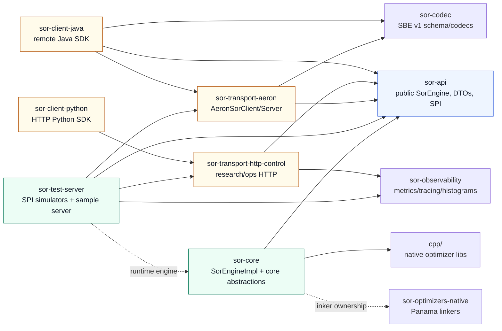
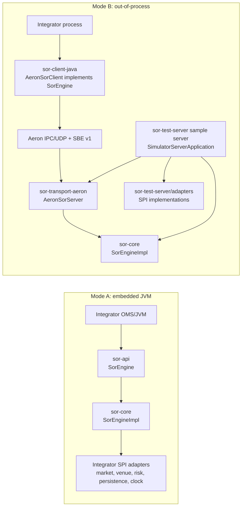
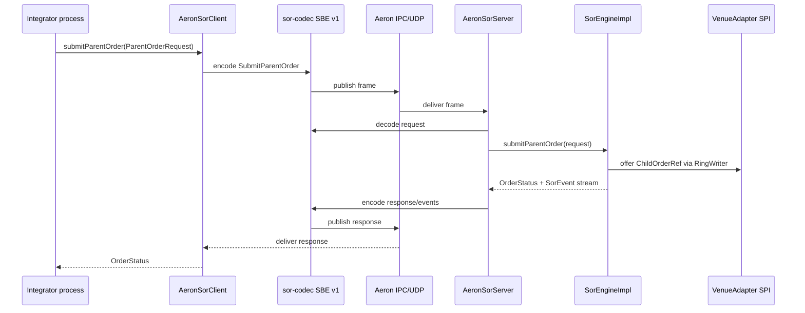

# Adaptive Quantum SOR — Phase 8 Specification: Productionization Framework

> **Integration note for the maintainer.** This document is ready to append to
> `adaptive_quantum_sor_spec_v1.md` as Phase 8. Numbering, task-card prefixes,
> acceptance-criteria IDs, package names, file targets, configuration fields,
> persistence format, and test expectations follow the conventions established
> in Phases 1–7.

---

## 8.0 Document Control

| Field | Value |
|---|---|
| Phase | 8 |
| Phase title | Productionization Framework |
| Status | IMPLEMENTED |
| Prerequisite phases | Phases 1–7 COMPLETE |
| Successor phases | Phase 9 — C++ L0 port (deferred, gated on sub-µs use case) |
| Owning layers | All layers; Phase 8 is structural |
| Hot-path impact | **Must preserve all Phase 1–7 hot-path guarantees.** Section 8.2 of `adaptive_quantum_sor_spec_v1.md` remains binding. |
| Backward compatibility | Phase 1–7 acceptance criteria must remain green after every Phase 8 sub-phase. Existing scenario YAMLs in `sor-test-server/src/main/resources/scenarios/` must continue to drive Gradle/JUnit scenario tests without edits. |
| Language pin | OpenJDK 25 LTS (currently 25.0.3, April 2026 CPU). |
| GC pin | Generational ZGC. Compact Object Headers (JEP 519) explicitly **disabled** — incompatible with ZGC in JDK 25/26. Re-evaluate when JEP 534 lands ZGC support, likely JDK 29 LTS (2027). |

### 8.0.1 Change Notes

```text
0.1 — Initial draft of the production-framework phase. Defines the sor-api SPI
seam, locks the HotRouteBook binary ABI, splits the build into multi-project
Gradle, replaces the deleted demo-coupled `SorEngineRuntime` with the
SPI-driven `SorEngineBuilder`/`SorEngineImpl` path, rewrites simulators as
integrators of the SPI, and adds embedded plus Aeron+SBE deployment shapes.
gRPC is intentionally not in scope.
```

---

## 8.1 Objective

Before Phase 8, the Adaptive Quantum SOR ran as a single Java process with
simulator-coupled state baked into `SorEngineRuntime`. That runtime was the
application, the simulator, and the engine all at once. Phase 8 has separated
these so the engine is a **framework** any OMS or trading system can integrate
against two ways:

```text
Mode A — Embedded
  Integrator's JVM links sor-core directly.
  Direct method calls. No transport, no IPC, no serialization.
  This is the primary deployment shape.

Mode B — Out-of-process
  Integrator's process speaks to the sor-test-server sample server over Aeron + SBE.
  Sub-µs IPC; single-digit µs UDP on bare metal.
  Same SorEngine API surface as embedded.
```

Phase 8 does not change *what the SOR routes*. It changes *who owns the state*.
After Phase 8 the engine owns only policy, routing decisions, and lifecycle
events. The integrator owns market data, venues, risk, and persistence — and
plugs each one in by implementing a small interface.

### 8.1.1 Why This Phase Exists

The current architecture is excellent for proving the policy-driven SOR concept
(Phases 1–7) and unsuitable for external adapters. Five concrete symptoms:

1. The deleted `SorEngineRuntime.create()` path called `baselineMarket(...)`,
   `baselineSessions(...)`, and `baselineRisk(...)` inline. The replacement is
   `SorEngineBuilder` plus integrator-supplied SPI implementations.
2. Simulators in `sim/` mutate internal state types (`MarketBookState`,
   `VenueSessionState`, `RiskLimitSnapshot`) directly. There is no interface
   layer where a real integration could attach.
3. `ChildOrderBuffer` is consumed only by tests. Real venue traffic has no
   path out of the engine.
4. `ParentOrderIntentQueue` is a 1024-slot array with no backpressure
   contract beyond a fixed capacity.
5. Policy snapshots and lifecycle events are in-memory only; a process
   crash erases the ledger.

Each symptom blocks productionization. Phase 8 resolves all five.

### 8.1.2 What Is And Is Not Provable

Phase 8's correctness claims are exactly testable:

```text
the SPI is complete (the simulator can be re-written against it without leakage)
the engine is deterministic against any SPI implementation (scenario replay)
the hot path retains Phase 1–7 zero-allocation guarantees (JMH)
embedded and Aeron modes produce identical SorEvent streams (cross-mode tests)
the HotRouteBook ABI is stable across releases (binary golden test)
```

The robustness claim — that the SPI is the *right* SPI for any future OMS — is
proved by the simulator rewrite. If the simulator cannot be expressed cleanly
against the public DTOs, the SPI is wrong. The simulator rewrite is the test.

---

## 8.2 Scope

### 8.2.1 In Scope

- New `sor-api` module containing the engine contract, immutable DTOs, and
  five SPI interfaces (`MarketDataSource`, `VenueAdapter`, `RiskProvider`,
  `Persistence`, `Clock`).
- Rename `src/main/java` package root from
  `com.nitroj.adaptive.quantum.sor.*` to `com.nitroj.sor.core.*` (shorter,
  module-aligned). Public types under `com.nitroj.sor.api.*`.
- New `sor-core` module containing the engine implementation, depending on
  `sor-api` only.
- Locked-down `HotRouteBook` binary layout published as a versioned ABI
  artifact in `sor-api`.
- New `sor-test-server` module containing every existing simulator class,
  rewritten to implement the SPI. Existing scenario YAMLs unchanged. This module
  also owns the simulator-backed sample server assembly.
- New `sor-codec` module with SBE schema (`sor-protocol-v1.xml`) and
  generated codecs.
- New `sor-transport-aeron` module with `AeronSorServer` and
  `AeronSorClient`. Both bind to the same `SorEngine` interface.
- New `sor-transport-http-control` module (renamed from current `api/`);
  marked explicitly as research/control plane, not order flow. Adds
  `/healthz`, `/ready`, `/metrics`, `/openapi.json`.
- New `sor-optimizers-native` module replacing `nativebridge/*JniBridge.java`
  with Java 25 Panama FFM bindings.
- New `sor-observability` module wiring Micrometer (Prometheus exporter),
  OpenTelemetry (warm-path spans only), and HdrHistogram (route-decision
  latency tail).
- Replaced `ParentOrderIntentQueue` with Agrona `ManyToOneRingBuffer`;
  inbound fill/reject paths use `OneToOneRingBuffer` per venue.
- JIT warmup as a framework contract: `SorEngine.warmup(int)` exercises the
  routing path with synthetic orders; `isReady()` returns false until
  warmup completes; the HTTP `/ready` probe mirrors `isReady()`.
- `sor-test-server` assembles the standalone simulator sample server:
  CLI flags, jib-built OCI image, Helm chart.
- Java client SDK (`sor-client-java`) published to Maven Central.
- Python client SDK (`sor-client-python`) published to PyPI.
- JDK 25 upgrade with explicit ZGC configuration documented and committed.

### 8.2.2 Out Of Scope

- **gRPC transport.** Disqualified by the low-latency requirement (HTTP/2 +
  protobuf floor in low milliseconds). See §8.3.4 for the explicit reasoning.
- **C++ port of L0.** Deferred to Phase 9, gated on a real sub-µs use case.
  Phase 8A locks the `HotRouteBook` ABI so Phase 9 is incremental, not a
  rewrite.
- **Project Valhalla value types for `OrderIntent` / `ChildOrder`.** Not in
  JDK 25 or 26. When Valhalla GA lands on an LTS (likely JDK 29+), revisit.
- **`-XX:+UseCompactObjectHeaders`.** Mutually exclusive with ZGC in JDK 25
  and JDK 26. Tracked as a deferred optimization; re-evaluate per quarterly
  release.
- **Multi-tenant within a single process by default.** Phase 8H adds it as an
  optional capability for integrators who need it. The recommended deployment
  pattern remains one tenant per JVM, multiplexed by k8s.
- **Real exchange connectivity beyond reference QuickFIX/J adapter.** Real
  venues integrate by writing their own `VenueAdapter`.
- **Production authentication on the HTTP control plane.** TLS termination
  and auth are integrator-supplied (sidecar, mesh, or ingress). The framework
  provides hooks, not policy.

### 8.2.3 What Phase 8 Proves

```text
the SPI seam is complete and self-consistent
the engine can be embedded in an arbitrary JVM application
the engine can be addressed out-of-process via Aeron + SBE
the simulator is just another integrator of the SPI
the hot path retains zero-allocation guarantees
the HotRouteBook layout is a stable ABI
JIT warmup is part of the framework contract, not an integrator concern
scenario YAMLs survive the refactor unchanged
the build is reproducible and deployable (jib OCI image, Helm chart)
client SDKs exist for Java and Python with semantic versioning
```

---

## 8.3 Architecture After Phase 8

### 8.3.1 Module Layout

```text
adaptive-quantum-sor/
├── settings.gradle
├── build.gradle
├── buildSrc/                                conventions + version catalog
│
├── sor-api/                                 pure interfaces + DTOs. zero deps.
│   └── com.nitroj.sor.api/
│       ├── SorEngine.java
│       ├── SorEngineBuilder.java
│       ├── ParentOrderRequest.java
│       ├── OrderStatus.java
│       ├── PolicyHandle.java
│       ├── Registration.java
│       ├── SorEventListener.java
│       ├── SorEvent.java                    sealed: RouteDecided, Filled, etc
│       ├── Side.java
│       ├── VenueStatus.java
│       └── spi/
│           ├── MarketDataSource.java
│           ├── MarketDataListener.java
│           ├── Quote.java
│           ├── VenueAdapter.java
│           ├── RingWriter.java
│           ├── ChildOrderRef.java
│           ├── FillReport.java
│           ├── RejectReport.java
│           ├── RiskProvider.java
│           ├── RiskCheckRequest.java
│           ├── RiskDecision.java
│           ├── Persistence.java
│           ├── LifecycleEvent.java
│           └── Clock.java
│
├── sor-core/                                embedded engine + legacy compatibility.
│   └── com.nitroj.sor.core/
│       ├── SorEngineImpl.java
│       ├── execution/                       PolicyDrivenSorExecutioner et al
│       ├── policy/                          publisher, compiler, lint, robust
│       ├── optimizer/                       coordinator + impls
│       ├── audit/, metrics/, lifecycle/, governance/, state/, recovery/, ml/
│       └── (other internals)
│
├── sor-codec/                               SBE wire schema + generated codecs
│   ├── src/main/resources/sbe/sor-protocol-v1.xml
│   └── (generated) com.nitroj.sor.codec.v1.*
│
├── sor-transport-aeron/
│   ├── server/AeronSorServer.java
│   └── client/AeronSorClient.java
│
├── sor-transport-http-control/              research/control plane only
│
├── sor-optimizers-native/                   Panama FFM bindings; no project deps
│
├── sor-test-server/                          SPI-based simulators + scenarios + sample server
│   └── com.nitroj.sor.sim/
│       ├── adapters/                        SPI-facing simulator adapters
│       ├── scenario/                        scenario runner/state models
│       ├── scenario/venues/                 deterministic venue behavior
│       └── server/                          SimulatorServerApplication, run.sh, helm/
│
├── sor-observability/                       Micrometer + OTel + HdrHistogram
│
├── sor-client-java/                         Maven Central
├── sor-client-python/                       PyPI
│
├── cpp/                                     unchanged
├── notebooks/                                notebook workflows
├── tools/notebook-helpers/                 notebook-only helpers
├── tools/python-research/                  non-shipped research helpers
└── docs/, scripts/
```

### 8.3.2 Dependency Graph

```text
sor-api                          (no implementation deps)
    ▲
    │
sor-core ───────► sor-api + Agrona
    │             (`com.nitroj.sor.core` remains the embedded engine boundary;
    │              scenario/test-server replay stays outside this module)
    │
    ├────────────► cpp/native libs through `com.nitroj.sor.optnative`
    │              (`sor-optimizers-native` owns Panama linkers and has no project deps)
    │
sor-test-server ─► sor-api + sor-core + sor-transport-aeron +
                  sor-transport-http-control + sor-observability

sor-transport-aeron ─────────────► sor-api + sor-codec
                                    (tests use sor-core + sor-test-server)

sor-transport-http-control ──────► sor-api + sor-observability

sor-client-java ─────────────────► sor-api + sor-codec + sor-transport-aeron
                                    (tests use sor-core + sor-test-server)
sor-client-python ───────────────► HTTP control plane (`requests` + `httpx`)
```

### 8.3.2.1 Phase 8 Module Dependency Diagram



The critical property: `sor-api` is the zero-dependency public contract, and
`com.nitroj.sor.core` is the embedded engine boundary constructed through
`SorEngineBuilder`. The `sor-core` Gradle module still carries transitional
Phase 1-7 scenario/control-plane compatibility and therefore has a broader
module dependency graph than the pure engine package. That compatibility code
must not leak into `sor-api` or into the public embedded-engine API.

Boundary governance is executable: Gradle project edges are guarded by
`ModuleDependencyGraphTest`, `sor-api` implementation leakage is guarded by
`SorApiZeroDependencyTest`, and package-level engine/simulator separation is
guarded by ArchUnit architecture tests. ArchUnit must stay on a version that
supports the configured JDK class-file level.

### 8.3.3 Two Deployment Shapes Recap

**Embedded.** Integrator's JVM links `sor-core`. Direct method calls on
`SorEngineImpl`. No transport, no serialization, no IPC. This is the primary
shape and the one Phase 8 leads with in documentation and reference code.

**Out-of-process.** Integrator's process links `sor-client-java` (depends on
`sor-api` and `sor-codec`). `AeronSorClient` implements `SorEngine`,
SBE-encodes calls, sends them over Aeron IPC or UDP. On the other end,
the simulator-backed sample server in `sor-test-server` runs `AeronSorServer`
which decodes, calls the local `SorEngineImpl`, and returns. Same `SorEngine`
interface visible to the integrator either way.

### 8.3.3.1 Deployment Shape Diagrams





### 8.3.4 Why No gRPC

Under a low-latency requirement, gRPC's floor is HTTP/2 framing plus protobuf
encode/decode plus a TLS handshake amortized across a connection — low
milliseconds at best, high tens of milliseconds at P99 on a cloud network.
Protobuf allocates a message object per call. SBE is zero-copy.
Aeron transport latency is two-to-three orders of magnitude lower than gRPC's.
There is no scenario where adding gRPC alongside Aeron benefits a low-latency
integrator. It only doubles the schema, codec, and client maintenance surface
for capability that is not actually needed. The HTTP control plane covers the
non-latency-sensitive cases (research, ops, notebooks).

If a future use case introduces a non-latency-sensitive integrator that
specifically wants gRPC, add `sor-transport-grpc` as a new module then. Do
not pre-build it.

### 8.3.5 The SPI Seam — What Lives Where

```text
sor-api owns:
  the engine contract (SorEngine)
  the public DTOs (ParentOrderRequest, OrderStatus, Quote, FillReport, ...)
  the SPI interfaces (MarketDataSource, VenueAdapter, RiskProvider, ...)
  the HotRouteBook binary ABI specification
  the opaque PolicyHandle

sor-core owns:
  the executioner, publisher, compiler, optimizer coordinator
  the internal SorPolicy and HotRouteBook (private; never exposed)
  the policy ledger, audit, lifecycle event store
  the engine's threading model, ring buffers, JIT warmup loop
  transitional Phase 1-7 compatibility code that remains outside `sor-api`

integrators (including sor-test-server) own:
  market data production (their feed)
  venue connectivity (their FIX/OUCH/proprietary protocol)
  risk evaluation (their pre-computed cache)
  durable storage (their WAL or DB)
  the wall-clock or simulated clock
```

The seam is enforced by the build: only `sor-api` types may appear in the
public method signatures of `sor-core`. Phase 8A includes an ArchUnit test
that fails the build if `sor-core` leaks an internal type through the SPI.

---

## 8.4 The sor-api Module — Complete Interface Specification

This section is the contract. Every signature here is normative. Method-level
comments are part of the contract: an integrator who violates a "must not
allocate" annotation has produced a non-conforming implementation regardless
of whether their code compiles.

### 8.4.1 Hot-Path Contract — Applies To Every Hot-Path Method

```text
must not allocate after warmup
must not block on locks
must not throw exceptions for expected outcomes
must not call System.currentTimeMillis() or System.nanoTime() directly;
    use the injected Clock
must not call any logging that formats Strings
must not call JSON, XML, or any other text-based serialization
must not call REST, HTTP, gRPC, or any other RPC
must not call a database, filesystem, or socket directly
must not call CUDA, CUDA-Q, or Python
must return within the documented microsecond budget
```

Methods that violate this contract are not on the hot path even if they live
on a hot-path interface. Such methods are explicitly labeled in JavaDoc as
*"control-plane method, not hot-path"*. Integrators may allocate, block, and
log freely in those.

### 8.4.2 SorEngine — The Engine Contract

```java
package com.nitroj.sor.api;

/**
 * Responsibility: the public engine contract. The single artifact embedders
 * and out-of-process clients code against.
 *
 * <p>Role in system: SorEngine is implemented by sor-core's SorEngineImpl
 * for the embedded case and by sor-transport-aeron's AeronSorClient for the
 * out-of-process case. Integrators do not distinguish between the two.</p>
 *
 * <p>Lifecycle: created via SorEngineBuilder. warmup(int) must be called and
 * complete before submitParentOrder(...). close() drains in-flight orders
 * up to the configured timeout and releases ring buffers.</p>
 *
 * <p>Threading: submit, cancel, status, listener registration, and close are
 * safe to call concurrently. The engine internally fans work onto its own
 * dedicated routing thread; integrator threads never enter the hot path.</p>
 *
 * <p>Design intent: small surface, explicit warmup, no Future-style
 * asynchronicity in the hot path. Order acknowledgement is via the
 * SorEventListener stream, not a returned Future.</p>
 */
public interface SorEngine extends AutoCloseable {

    /**
     * Runs N synthetic parent orders through the routing path to drive JIT
     * compilation to steady-state code shape. Synchronous. Must be called
     * before any production submitParentOrder(...) call.
     *
     * <p>Control-plane method, not hot-path. Implementations may allocate
     * and block during warmup.</p>
     *
     * @param syntheticOrderCount typically 10_000 to 100_000
     */
    void warmup(int syntheticOrderCount);

    /**
     * @return true after warmup(...) has completed; false otherwise.
     * Mirrored by the /ready HTTP probe.
     */
    boolean isReady();

    /**
     * Submits a parent order. Returns the generated parent order ID
     * immediately. Acknowledgement, routing decision, and fills arrive
     * asynchronously via registered SorEventListeners.
     *
     * <p>Hot-path method. Must not allocate. Budget: &lt; 1µs on the
     * integrator thread, dominated by ring-buffer offer.</p>
     *
     * @throws BackpressureException if the parent order ring is full;
     *         the integrator must retry, drop, or queue at the OMS layer
     */
    long submitParentOrder(ParentOrderRequest request);

    /**
     * Idempotent cancellation by parentOrderId. If the order is already
     * complete or unknown, returns silently.
     *
     * <p>Hot-path method. Must not allocate.</p>
     */
    void cancelParentOrder(long parentOrderId);

    /**
     * Reads the latest known status of a parent order.
     *
     * <p>Control-plane method, not hot-path. May briefly contend on a
     * read lock; not suitable for per-route polling.</p>
     */
    java.util.Optional<OrderStatus> getOrderStatus(long parentOrderId);

    /**
     * Registers a listener for engine-emitted events: route decisions,
     * fills, policy publications, session changes, backpressure rejects.
     * Returns a Registration handle; close it to unregister.
     *
     * <p>The listener is invoked on the engine's event-fanout thread,
     * never on the hot routing thread. Listeners may allocate and block.</p>
     */
    Registration registerListener(SorEventListener listener);

    /**
     * Returns an opaque handle identifying the currently active policy.
     * Integrators may compare handles for equality and read identity
     * fields (version, hash) but cannot reach the underlying SorPolicy.
     *
     * <p>Control-plane method.</p>
     */
    PolicyHandle activePolicy();

    /**
     * Initiates graceful shutdown. Drains in-flight orders up to the
     * configured timeout, flushes persistence, stops threads, releases
     * native resources.
     */
    @Override
    void close();
}
```

### 8.4.3 SorEngineBuilder — The Wiring Surface

```java
package com.nitroj.sor.api;

import com.nitroj.sor.api.spi.*;

/**
 * Responsibility: assemble a SorEngine from SPI implementations.
 *
 * <p>Role in system: the only supported way to construct a SorEngine.
 * Replaces the demo-coupled SorEngineRuntime.create(...) factory.</p>
 *
 * <p>Lifecycle: created once, configured, then build() returns a SorEngine.
 * The builder is discarded after build().</p>
 *
 * <p>Design intent: every SPI is required; there is no "default to a fake".
 * If an integrator does not want to supply (say) a real venue adapter,
 * they explicitly pass NoOpVenueAdapter from sor-api. This forces the
 * decision to be visible in the code, not implicit in a missing call.</p>
 */
public final class SorEngineBuilder {

    public static SorEngineBuilder create() { /* ... */ }

    public SorEngineBuilder config(SorConfig config);
    public SorEngineBuilder marketData(MarketDataSource source);
    public SorEngineBuilder venueAdapter(VenueAdapter adapter);
    public SorEngineBuilder riskProvider(RiskProvider provider);
    public SorEngineBuilder persistence(Persistence persistence);
    public SorEngineBuilder clock(Clock clock);
    public SorEngineBuilder observability(Observability observability);

    /** Optional. Defaults to engine-supplied LifecycleSink that writes to Persistence. */
    public SorEngineBuilder lifecycleSink(LifecycleSink sink);

    /**
     * Builds and returns an engine that has NOT yet been warmed up.
     * Caller must invoke engine.warmup(N) before submitting production
     * orders.
     *
     * @throws IllegalStateException if any required SPI is missing
     */
    public SorEngine build();
}
```

### 8.4.4 ParentOrderRequest — The Public Order Intent

Note: `ParentOrderRequest` is the *public* DTO. The internal `OrderIntent`
class used by the executioner remains in `sor-core` and is never exposed.

```java
package com.nitroj.sor.api;

/**
 * Responsibility: an immutable parent-order submission from the integrator.
 *
 * <p>Role in system: this is what an integrator hands to
 * SorEngine.submitParentOrder(...). The engine internally translates it to
 * the routing-friendly OrderIntent in sor-core.</p>
 *
 * <p>Design intent: builder-only construction with primitive validation,
 * so an integrator who tries to submit nonsense gets a clear exception at
 * the API boundary, not deep inside the executioner.</p>
 */
public final class ParentOrderRequest {

    public final int instrumentId;
    public final int side;
    public final long quantity;
    public final int urgencyId;
    public final long clientOrderId;        // integrator-supplied; for their own correlation
    public final long arrivalEpochNanos;    // 0 = engine uses Clock.epochNanos()

    public static Builder builder() { /* ... */ }

    public static final class Builder {
        public Builder instrumentId(int id);
        public Builder side(int side);
        public Builder quantity(long qty);
        public Builder urgency(int urgencyId);
        public Builder clientOrderId(long id);
        public Builder arrivalEpochNanos(long nanos);

        public ParentOrderRequest build();
    }
}
```

### 8.4.5 SPI: MarketDataSource + MarketDataListener + Quote

```java
package com.nitroj.sor.api.spi;

/**
 * Responsibility: integrator-provided source of top-of-book updates per
 * instrument.
 *
 * <p>Role in system: the engine subscribes per instrument and receives
 * push-based callbacks. The MarketDataSource implementation owns its
 * threading model and quote generation; the engine merely consumes.</p>
 *
 * <p>Hot-path contract on the listener side: MarketDataListener.onQuote
 * must not allocate and must return in &lt; 200ns. The implementation
 * typically buffers into an internal ring and copies the latest quote
 * into the active policy snapshot read-side.</p>
 */
public interface MarketDataSource {

    /**
     * Begins delivering quotes for the given instrument to the listener.
     * Idempotent for the same (instrumentId, listener) pair.
     *
     * <p>Control-plane method. Called during engine startup.</p>
     */
    void subscribe(int instrumentId, MarketDataListener listener);

    /**
     * Stops delivering quotes for the given instrument to the listener.
     */
    void unsubscribe(int instrumentId, MarketDataListener listener);
}

/**
 * Responsibility: the engine-side receiver of quotes. Implemented by
 * sor-core, never by integrators.
 *
 * <p>Hot-path contract: must not allocate, must return &lt; 200ns.</p>
 */
public interface MarketDataListener {

    /**
     * Called by the MarketDataSource when a new top-of-book arrives.
     *
     * <p>The Quote argument is owned by the MarketDataSource and may be
     * reused after this call returns. The listener must copy any fields
     * it needs to retain.</p>
     */
    void onQuote(Quote quote);
}

/**
 * Responsibility: a single top-of-book snapshot for one venue.
 *
 * <p>Design intent: mutable primitive fields, set by the MarketDataSource
 * before each onQuote callback and reused. The reuse pattern keeps the
 * source allocation-free even at high tick rates.</p>
 */
public final class Quote {

    public int instrumentId;
    public int venueId;
    public long bidPrice;     // fixed-point, scale defined by SorConfig
    public long askPrice;
    public long bidQuantity;
    public long askQuantity;
    public long sequenceNumber;
    public long sourceEpochNanos;
    public int statusBits;    // OK, STALE, CROSSED, HALTED, ...

    public void set(int instrumentId, int venueId,
                    long bidPrice, long askPrice,
                    long bidQty, long askQty,
                    long sequenceNumber, long sourceEpochNanos,
                    int statusBits) { /* validate + assign */ }

    public void clear() { /* zero all fields */ }
}
```

### 8.4.6 SPI: VenueAdapter + RingWriter

The VenueAdapter is the most performance-sensitive SPI. It uses the
**ring-writer pattern** rather than direct method calls — the engine writes
child-order records into a venue-keyed off-heap ring buffer, and the adapter
thread polls its own ring. This decouples the routing thread from the
adapter's I/O thread; FIX session jitter cannot back-pressure routing.

```java
package com.nitroj.sor.api.spi;

/**
 * Responsibility: integrator-provided sink for child orders and source of
 * fills/rejects.
 *
 * <p>Role in system: the engine writes child orders into the per-venue ring
 * exposed by childOrderRingWriter(venueId). The integrator's adapter thread
 * polls the ring and dispatches to the venue. Fills, rejects, and session
 * status changes flow back via the onFill/onReject/onSessionStatusChange
 * callbacks; the integrator calls these from any thread they own.</p>
 *
 * <p>Hot-path contract: childOrderRingWriter must return a RingWriter that
 * supports a non-allocating, non-blocking offer(...) in &lt; 200ns.</p>
 */
public interface VenueAdapter {

    /**
     * Returns the writer for the given venue's child-order ring. Called
     * once per venue at engine startup; the engine retains the writer
     * and uses it from the routing thread.
     *
     * <p>Control-plane method.</p>
     */
    RingWriter childOrderRingWriter(int venueId);

    /**
     * Called by the integrator on any thread when a fill arrives from
     * the venue. The engine queues the fill onto its inbound ring and
     * processes it on the lifecycle thread.
     *
     * <p>Hot-path on the engine side; the integrator may allocate as
     * needed to construct the FillReport.</p>
     */
    void onFill(FillReport fill);

    /**
     * Called by the integrator when the venue rejects a child order.
     */
    void onReject(RejectReport reject);

    /**
     * Called by the integrator when the session status changes
     * (connected, disconnected, halted, etc).
     *
     * <p>Control-plane method.</p>
     */
    void onSessionStatusChange(int venueId, com.nitroj.sor.api.VenueStatus status);
}

/**
 * Responsibility: lock-free, off-heap writer to the engine's child-order
 * ring for one venue.
 *
 * <p>Hot-path contract: offer(...) must not allocate, must not block,
 * must return in &lt; 200ns including the producer-side memory barrier.
 * If the ring is full, offer returns false; the caller (engine) records
 * a backpressure rejection and emits a SorEvent.BackpressureRejected.</p>
 *
 * <p>Design intent: the writer is implemented by sor-core wrapping an
 * Agrona OneToOneRingBuffer. The VenueAdapter receives an opaque
 * RingWriter — it does not depend on Agrona types directly. This keeps
 * Agrona out of the public ABI even though it underlies the impl.</p>
 */
public interface RingWriter {

    /**
     * Offers a ChildOrderRef. Returns true on success, false if the ring
     * is full.
     *
     * <p>The ChildOrderRef is owned by the writer's ring and must not be
     * retained by the adapter after the corresponding read on the
     * polling side. The adapter copies fields it needs to keep.</p>
     */
    boolean offer(ChildOrderRef ref);

    /** Returns approximate ring capacity. Control-plane method. */
    int capacity();

    /** Returns approximate slots in use. Control-plane method. */
    int approximateBacklog();
}

/**
 * Responsibility: an immutable record of one routed child order.
 *
 * <p>Design intent: the integrator's adapter receives a ChildOrderRef
 * from the ring read; it MUST copy the fields it needs before the next
 * read (the ring slot is reused). All fields are primitives.</p>
 */
public final class ChildOrderRef {
    public final long childOrderId;
    public final long parentOrderId;
    public final int instrumentId;
    public final int venueId;
    public final int side;
    public final long quantity;
    public final long policyVersion;
    public final long policyHash64;
    public final long createdEpochNanos;

    public ChildOrderRef(/* all fields */) { /* validate + assign */ }
}

public final class FillReport {
    public final long childOrderId;
    public final long parentOrderId;
    public final int venueId;
    public final long filledQuantity;
    public final long fillPrice;
    public final long venueExecutionId;
    public final long venueEpochNanos;
    /* ... constructor + validation ... */
}

public final class RejectReport {
    public final long childOrderId;
    public final long parentOrderId;
    public final int venueId;
    public final int rejectReasonCode;
    public final long venueEpochNanos;
    /* ... */
}
```

### 8.4.7 SPI: RiskProvider

```java
package com.nitroj.sor.api.spi;

/**
 * Responsibility: pre-trade risk evaluation on the hot path.
 *
 * <p>Role in system: the engine consults the RiskProvider once per parent
 * order and once per child slice. The provider must return synchronously
 * within a hard nanosecond budget — typically &lt; 500ns.</p>
 *
 * <p>Implementation pattern: the integrator's real risk system runs as a
 * separate process and periodically pushes a pre-computed snapshot
 * (per-instrument and per-venue limits) into shared memory or an
 * off-heap buffer. The RiskProvider implementation reads from that
 * snapshot lock-free. External RPC calls from the hot path are
 * incompatible with the latency budget and are explicitly disallowed.</p>
 *
 * <p>Hot-path contract: must not allocate, must not block, must return in
 * &lt; 500ns.</p>
 */
public interface RiskProvider {

    /**
     * Evaluates a risk check. The request is populated by the engine
     * before the call; the decision is filled in by the provider and
     * inspected by the engine after return. Both objects are caller-owned
     * and reused per call.
     */
    void check(RiskCheckRequest request, RiskDecision decision);
}

public final class RiskCheckRequest {
    public int instrumentId;
    public int venueId;
    public int side;
    public long parentOrderQty;
    public long proposedChildQty;
    public long policyVersion;

    public void set(/* all fields */) { /* validate */ }
    public void clear();
}

public final class RiskDecision {
    public static final int APPROVED = 0;
    public static final int REDUCED   = 1;
    public static final int REJECTED  = 2;

    public int outcome;
    public long allowedQuantity;
    public int reasonCode;

    public void approved(long allowedQty);
    public void reduced(long allowedQty, int reasonCode);
    public void rejected(int reasonCode);
    public void clear();
}
```

### 8.4.8 SPI: Persistence

```java
package com.nitroj.sor.api.spi;

/**
 * Responsibility: durable, append-only storage of lifecycle events and
 * write-once-per-version policy snapshots.
 *
 * <p>Role in system: the engine writes lifecycle events as they occur
 * (route decisions, fills, policy publications, session changes) and
 * persists policy snapshots when the publication gate approves them.
 * On restart the engine calls replay(sinceSequence) to rebuild lifecycle
 * state up to the last persisted sequence number.</p>
 *
 * <p>Hot-path contract: appendLifecycleEvent must complete in &lt; 1µs.
 * Implementations that cannot meet this must compose downstream of a fast
 * integrator-owned WAL implementation, tailing that WAL asynchronously rather
 * than synchronously writing on the engine thread.</p>
 */
public interface Persistence {

    /**
     * Appends a lifecycle event with monotonic sequence numbering managed
     * by the implementation. Hot-path method.
     */
    void appendLifecycleEvent(LifecycleEvent event);

    /**
     * Writes a policy snapshot durably. Must be a write-once operation
     * for each (policyVersion). If the same policyVersion is written
     * twice, the implementation must reject the second write.
     *
     * <p>Warm-path method; called from the publication gate, not from
     * routing. May block up to ~ms on flush.</p>
     */
    void persistPolicySnapshot(com.nitroj.sor.api.PolicyHandle handle, byte[] serializedSnapshot);

    /**
     * Replays lifecycle events from the given sequence number onward.
     * Used on restart to rebuild in-memory lifecycle state.
     *
     * <p>Control-plane method, called at startup only.</p>
     */
    java.util.Iterator<LifecycleEvent> replay(long sinceSequence);

    /**
     * Returns the highest persisted policyVersion, or 0 if none.
     */
    long lastPersistedPolicyVersion();

    /**
     * Reads the serialized snapshot for the given policy version, or
     * empty if absent.
     */
    java.util.Optional<byte[]> readPolicySnapshot(long policyVersion);
}

public final class LifecycleEvent {
    public long sequenceNumber;   // assigned by Persistence on append
    public long epochNanos;
    public int eventType;          // ROUTE_DECIDED, FILLED, REJECTED, POLICY_PUBLISHED, ...
    public long parentOrderId;     // 0 if not order-related
    public long childOrderId;      // 0 if not child-related
    public long policyVersion;
    public long primaryValue;      // event-specific
    public long secondaryValue;    // event-specific
    public int reasonCode;
    /* ... constructor + validation ... */
}
```

### 8.4.9 SPI: Clock

```java
package com.nitroj.sor.api.spi;

/**
 * Responsibility: source of time for the engine.
 *
 * <p>Role in system: the engine never calls System.currentTimeMillis() or
 * System.nanoTime() directly. Every time read goes through Clock so tests
 * can inject ManualClock (sor-test-server) and replay scenarios
 * deterministically.</p>
 *
 * <p>Hot-path contract: both methods must not allocate and must return
 * in &lt; 50ns.</p>
 */
public interface Clock {

    /**
     * Monotonic nanos suitable for measuring intervals. Not wall-clock.
     */
    long nanoTime();

    /**
     * Wall-clock epoch nanos. Used for event timestamping.
     */
    long epochNanos();

    /**
     * Real-system clock backed by System.nanoTime() and
     * System.currentTimeMillis() (scaled to nanos). The default
     * production clock.
     */
    static Clock systemNano() { /* return SystemClock instance */ }
}
```

### 8.4.10 SorEvent and SorEventListener

```java
package com.nitroj.sor.api;

/**
 * Responsibility: typed events the engine emits to registered listeners.
 *
 * <p>Design intent: sealed interface so integrators get an exhaustive
 * switch and the compiler enforces that new event types are explicitly
 * handled.</p>
 */
public sealed interface SorEvent {

    record RouteDecided(
        long parentOrderId,
        long policyVersion,
        long policyHash64,
        int childCount,
        long routedQuantity,
        long residualQuantity,
        long decidedEpochNanos
    ) implements SorEvent {}

    record ChildOrderEmitted(
        long childOrderId,
        long parentOrderId,
        int venueId,
        int side,
        long quantity,
        long emittedEpochNanos
    ) implements SorEvent {}

    record Filled(
        long childOrderId,
        long parentOrderId,
        int venueId,
        long filledQuantity,
        long fillPrice,
        long filledEpochNanos
    ) implements SorEvent {}

    record Rejected(
        long childOrderId,
        long parentOrderId,
        int venueId,
        int reasonCode,
        long rejectedEpochNanos
    ) implements SorEvent {}

    record PolicyPublished(
        long policyVersion,
        long policyHash64,
        long publishedEpochNanos
    ) implements SorEvent {}

    record SessionStatusChanged(
        int venueId,
        VenueStatus oldStatus,
        VenueStatus newStatus,
        long changedEpochNanos
    ) implements SorEvent {}

    record BackpressureRejected(
        long parentOrderId,
        int reasonCode,
        long rejectedEpochNanos
    ) implements SorEvent {}
}

@FunctionalInterface
public interface SorEventListener {

    /**
     * Called on the engine's event-fanout thread, never on the hot
     * routing thread. Listeners may allocate and block.
     */
    void onEvent(SorEvent event);
}

public interface Registration extends AutoCloseable {
    @Override void close();
}
```

### 8.4.11 PolicyHandle — Opaque Pointer

```java
package com.nitroj.sor.api;

/**
 * Responsibility: opaque handle to the currently active policy.
 *
 * <p>Role in system: integrators may compare handles for equality, read
 * identity fields (version, hash), and pass handles to Persistence for
 * snapshot retrieval. They cannot reach into the internal SorPolicy.</p>
 *
 * <p>Design intent: this is the firewall that lets sor-core change the
 * HotRouteBook and FullPolicyMatrix internals without breaking
 * integrators.</p>
 */
public interface PolicyHandle {
    long version();
    long hash64();
    byte[] hashSha256();
    long createdEpochNanos();
    long effectiveFromEpochNanos();
}
```

---

## 8.5 The HotRouteBook ABI Lockdown

Phase 8 freezes the binary layout of `HotRouteBook` as a versioned ABI. This
is the artifact that makes the future C++ L0 port (Phase 9) tractable: a C++
consumer maps the same memory and reads it without serialization.

### 8.5.1 Memory Layout

`HotRouteBook` is a struct-of-arrays. Field-by-field layout, version 1:

```text
offset  size   field                        notes
------  -----  ---------------------------  ------------------------------------
0       8      magic                        ASCII "QSORHRB1" (0x5152534f48524231)
8       4      version                       layout version; this spec defines 1
12      4      headerFlags                   reserved; must be 0
16      4      instrumentCount               from SorConfig
20      4      venueCount
24      4      regimeCount
28      4      urgencyCount
32      8      policyVersion
40      8      policyHash64
48      8      effectiveFromEpochNanos
56      8      routeEntryCount               total entries in routeVenueId[]
64      ...    (padding to 128-byte boundary)
128     N×4    routeStart[]                  size = instr * regime * urgency
N×4+128 N×4    routeEnd[]                    size = instr * regime * urgency
...     M×4    routeVenueId[]                size = routeEntryCount
...     M×8    maxChildQty[]                 size = routeEntryCount
...     M×4    venueWeightBps[]              size = routeEntryCount
...     M×4    participationCapBps[]         size = routeEntryCount
...     end    CRC-32C of bytes [0, end-4)   little-endian
```

All multibyte fields are little-endian. The `routeKey` derivation matches the
existing
`routeKey = ((instrumentId * regimeCount) + regimeId) * urgencyCount + urgencyId`
formula in `docs/architecture/ARCHITECTURE.md`.

### 8.5.2 Versioning Rules

```text
the magic and version fields are immutable for ABI version 1
new fields may be appended in version 2 by:
  - bumping the version field
  - appending fields after participationCapBps[] and before the CRC
  - updating headerFlags to indicate which optional fields are present
existing fields must NOT change offset, size, or semantics in version 1
violating these rules requires a new module artifact name (e.g. sor-api-2)
```

### 8.5.3 Why This Matters For C++ L0

A C++ port of L0 (Phase 9, deferred) reads the `HotRouteBook` snapshot from
shared memory written by the Java engine. With a locked-down ABI:

```text
the C++ side has a stable struct definition it can mmap and dereference
schema evolution is explicit (version bump + headerFlags)
the engine and the C++ consumer can ship on independent cadences
test fixtures (golden binary files) survive across releases
```

Without ABI lockdown, every refactor of `HotRouteBook` breaks the C++ port and
forces an in-step release. Phase 8A pays this cost up front so Phase 9 can
ship without coordination.

### 8.5.4 Golden-Binary Test Contract

Phase 8A introduces `HotRouteBookAbiV1GoldenTest`:

```text
constructs a known SorPolicy
serializes its HotRouteBook to /tmp via the ABI v1 writer
loads tests/resources/abi/hot_route_book_v1_golden.bin
compares byte-for-byte
verifies the CRC
fails the build on any divergence
```

Any code change that alters the on-wire layout fails this test. Re-generating
the golden file is an explicit, reviewed action that bumps the ABI version.

---

## 8.6 Sample Simulator Implementations

This section is normative for `sor-test-server`. The complete implementations
below replace the existing classes in
`src/main/java/com/nitroj/adaptive/quantum/sor/sim/`. They demonstrate the
correct SPI usage patterns for any future integrator.

### 8.6.1 SimulatedMarketDataSource

```java
package com.nitroj.sor.sim;

import com.nitroj.sor.api.spi.Clock;
import com.nitroj.sor.api.spi.MarketDataListener;
import com.nitroj.sor.api.spi.MarketDataSource;
import com.nitroj.sor.api.spi.Quote;

import java.util.ArrayList;
import java.util.List;
import java.util.Random;
import java.util.concurrent.ConcurrentHashMap;
import java.util.concurrent.CopyOnWriteArrayList;
import java.util.concurrent.Executors;
import java.util.concurrent.ScheduledExecutorService;
import java.util.concurrent.TimeUnit;

/**
 * Responsibility: deterministic top-of-book generator implementing
 * MarketDataSource. Replaces the existing MarketDataSimulator.
 *
 * <p>Role in system: this is what an integrator's real market-data
 * feed implementation should look like — except this one generates
 * synthetic data instead of reading a venue feed.</p>
 *
 * <p>Threading: a single background thread emits ticks at the
 * configured cadence. Listeners are invoked from this thread; the
 * engine's MarketDataListener implementation is non-allocating and
 * sub-200ns, so the cadence can be sub-millisecond.</p>
 *
 * <p>Design intent: demonstrate the Quote-reuse pattern. The same
 * Quote instance is mutated and re-handed to onQuote on every tick.
 * Listeners that need to retain a quote MUST copy it.</p>
 */
public final class SimulatedMarketDataSource implements MarketDataSource {

    private final int instrumentCount;
    private final int venueCount;
    private final Clock clock;
    private final Random random;
    private final long tickIntervalMicros;

    // Reusable Quote — single instance, mutated per tick. Allocation-free.
    private final Quote scratchQuote = new Quote();

    // Per-instrument listeners.
    private final ConcurrentHashMap<Integer, CopyOnWriteArrayList<MarketDataListener>> listeners
        = new ConcurrentHashMap<>();

    // Per (instrument, venue) state — mid prices in fixed-point.
    private final long[] midByInstrumentVenue;
    private final long[] sequenceByInstrumentVenue;

    private ScheduledExecutorService ticker;
    private volatile boolean running;

    public SimulatedMarketDataSource(int instrumentCount, int venueCount,
                                      Clock clock, long seed,
                                      long tickIntervalMicros) {
        if (instrumentCount <= 0 || venueCount <= 0) {
            throw new IllegalArgumentException("instrumentCount and venueCount must be positive");
        }
        this.instrumentCount = instrumentCount;
        this.venueCount = venueCount;
        this.clock = clock;
        this.random = new Random(seed);
        this.tickIntervalMicros = tickIntervalMicros;

        int cells = instrumentCount * venueCount;
        this.midByInstrumentVenue = new long[cells];
        this.sequenceByInstrumentVenue = new long[cells];

        initializeMids();
    }

    private void initializeMids() {
        for (int i = 0; i < instrumentCount; i++) {
            long instrumentBaseMid = 100_0000L + i * 10_0000L;  // 4-decimal fixed-point
            for (int v = 0; v < venueCount; v++) {
                midByInstrumentVenue[i * venueCount + v] = instrumentBaseMid + v;
            }
        }
    }

    public void start() {
        if (running) return;
        running = true;
        ticker = Executors.newSingleThreadScheduledExecutor(r -> {
            Thread t = new Thread(r, "sim-market-data");
            t.setDaemon(true);
            return t;
        });
        ticker.scheduleAtFixedRate(this::tick,
            tickIntervalMicros, tickIntervalMicros, TimeUnit.MICROSECONDS);
    }

    public void stop() {
        running = false;
        if (ticker != null) {
            ticker.shutdown();
            try { ticker.awaitTermination(5, TimeUnit.SECONDS); }
            catch (InterruptedException ignored) { Thread.currentThread().interrupt(); }
        }
    }

    @Override
    public void subscribe(int instrumentId, MarketDataListener listener) {
        listeners.computeIfAbsent(instrumentId, k -> new CopyOnWriteArrayList<>()).add(listener);
    }

    @Override
    public void unsubscribe(int instrumentId, MarketDataListener listener) {
        CopyOnWriteArrayList<MarketDataListener> list = listeners.get(instrumentId);
        if (list != null) list.remove(listener);
    }

    /**
     * Emits one tick per (instrument, venue) pair. Allocation-free in the
     * inner loop: the scratchQuote is mutated and reused.
     */
    private void tick() {
        if (!running) return;
        long epochNanos = clock.epochNanos();

        for (int i = 0; i < instrumentCount; i++) {
            CopyOnWriteArrayList<MarketDataListener> instrumentListeners = listeners.get(i);
            if (instrumentListeners == null || instrumentListeners.isEmpty()) continue;

            for (int v = 0; v < venueCount; v++) {
                int cell = i * venueCount + v;
                long mid = midByInstrumentVenue[cell];

                // Random walk: small drift bounded by ±5 ticks.
                int drift = random.nextInt(11) - 5;
                mid += drift;
                if (mid < 1_0000L) mid = 1_0000L;
                midByInstrumentVenue[cell] = mid;

                long seq = ++sequenceByInstrumentVenue[cell];

                scratchQuote.set(
                    /* instrumentId */ i,
                    /* venueId */ v,
                    /* bidPrice */ mid - 1,
                    /* askPrice */ mid + 1,
                    /* bidQty */ 1000L + random.nextInt(5000),
                    /* askQty */ 1000L + random.nextInt(5000),
                    /* sequence */ seq,
                    /* sourceEpoch */ epochNanos,
                    /* status */ 0
                );

                for (MarketDataListener listener : instrumentListeners) {
                    listener.onQuote(scratchQuote);
                }
            }
        }
    }
}
```

### 8.6.2 SimulatedVenueAdapter

This is the most important sample because it demonstrates the
ring-writer-based hot-path contract. Replaces the existing
`VenueBehaviorSimulator`.

```java
package com.nitroj.sor.sim;

import com.nitroj.sor.api.VenueStatus;
import com.nitroj.sor.api.spi.ChildOrderRef;
import com.nitroj.sor.api.spi.Clock;
import com.nitroj.sor.api.spi.FillReport;
import com.nitroj.sor.api.spi.RejectReport;
import com.nitroj.sor.api.spi.RingWriter;
import com.nitroj.sor.api.spi.VenueAdapter;

import java.util.Random;
import java.util.concurrent.ConcurrentHashMap;
import java.util.concurrent.Executors;
import java.util.concurrent.ScheduledExecutorService;
import java.util.concurrent.TimeUnit;

/**
 * Responsibility: simulate a venue's child-order intake and fill behavior
 * by polling the engine-supplied RingWriter's read side.
 *
 * <p>Threading: one polling thread per venue (or one pool-shared thread).
 * The polling thread reads ChildOrderRefs from the ring (copying the
 * fields it needs), simulates a fill latency and probability, then
 * invokes onFill(...) on the engine via the SPI.</p>
 *
 * <p>Note: the engine, not the adapter, owns the RingWriter's read side.
 * The adapter sees only the writer interface for outbound and calls
 * onFill/onReject for inbound. In sor-core, AdapterPollLoop runs the
 * read side; this class registers that loop's notifier via the per-venue
 * configuration callback that sor-core invokes during startup.</p>
 *
 * <p>Design intent: this is the simulator. A real integrator's adapter
 * would replace the simulated fill logic with a QuickFIX/J session or
 * a native OUCH client. The threading and ring-write semantics stay
 * the same.</p>
 */
public final class SimulatedVenueAdapter implements VenueAdapter {

    private final int venueCount;
    private final Clock clock;
    private final Random random;
    private final ConcurrentHashMap<Integer, VenueState> venues = new ConcurrentHashMap<>();
    private final VenueAdapterCallback engineCallback;     // engine-supplied
    private ScheduledExecutorService fillScheduler;
    private volatile boolean running;

    public SimulatedVenueAdapter(int venueCount, Clock clock, long seed,
                                  VenueAdapterCallback engineCallback) {
        this.venueCount = venueCount;
        this.clock = clock;
        this.random = new Random(seed);
        this.engineCallback = engineCallback;
    }

    @Override
    public RingWriter childOrderRingWriter(int venueId) {
        // The engine supplies the ring writer; the adapter merely caches it
        // for later observability (capacity / backlog reporting). The
        // engine separately starts the read-side polling loop and invokes
        // SimulatedVenueAdapter.onChildOrderRead(...) per popped slot.
        VenueState state = venues.computeIfAbsent(venueId, VenueState::new);
        state.writer = engineCallback.allocateChildOrderRing(venueId);
        return state.writer;
    }

    /**
     * Called by sor-core's per-venue poll loop for each ChildOrderRef
     * popped off the writer's read side. This is where the simulator
     * decides what to do with each child order.
     *
     * <p>The ChildOrderRef belongs to the ring slot and will be reused
     * after this method returns. The simulator copies the fields it
     * needs into the VenueState's pending list.</p>
     */
    public void onChildOrderRead(int venueId, ChildOrderRef ref) {
        VenueState state = venues.get(venueId);
        if (state == null || state.status != VenueStatus.OPEN) {
            // Reject: venue not open. Emit a reject report.
            engineCallback.deliverReject(new RejectReport(
                ref.childOrderId, ref.parentOrderId, venueId,
                /* reasonCode */ 1, clock.epochNanos()));
            return;
        }

        // Decide fill probability and latency.
        boolean willFill = random.nextDouble() < state.fillProbability;
        long fillLatencyMicros = 50 + random.nextInt(450);  // 50–500 µs

        // Copy ref into a local pending record (allocation OK on the poll
        // thread; this is NOT the engine's hot path).
        PendingFill pending = new PendingFill();
        pending.childOrderId = ref.childOrderId;
        pending.parentOrderId = ref.parentOrderId;
        pending.venueId = venueId;
        pending.quantity = ref.quantity;
        pending.fillPrice = computeFillPrice(ref);
        pending.willFill = willFill;

        fillScheduler.schedule(() -> deliverOutcome(pending),
            fillLatencyMicros, TimeUnit.MICROSECONDS);
    }

    private long computeFillPrice(ChildOrderRef ref) {
        // Toy price model: derive from policy hash + small noise.
        return 100_0000L + (ref.policyHash64 & 0xFF);
    }

    private void deliverOutcome(PendingFill pending) {
        if (pending.willFill) {
            engineCallback.deliverFill(new FillReport(
                pending.childOrderId, pending.parentOrderId, pending.venueId,
                pending.quantity, pending.fillPrice,
                /* venueExecutionId */ random.nextLong(),
                /* venueEpochNanos */ clock.epochNanos()));
        } else {
            engineCallback.deliverReject(new RejectReport(
                pending.childOrderId, pending.parentOrderId, pending.venueId,
                /* reasonCode */ 2, clock.epochNanos()));
        }
    }

    @Override
    public void onFill(FillReport fill) {
        // Pass-through to engine. For the simulator, this is the path back
        // from deliverOutcome. A real adapter would call this from its
        // FIX session-handler thread.
        engineCallback.deliverFill(fill);
    }

    @Override
    public void onReject(RejectReport reject) {
        engineCallback.deliverReject(reject);
    }

    @Override
    public void onSessionStatusChange(int venueId, VenueStatus status) {
        VenueState state = venues.computeIfAbsent(venueId, VenueState::new);
        state.status = status;
        engineCallback.deliverSessionStatusChange(venueId, status);
    }

    public void start() {
        if (running) return;
        running = true;
        fillScheduler = Executors.newScheduledThreadPool(
            Math.min(8, venueCount),
            r -> { Thread t = new Thread(r, "sim-venue-fill"); t.setDaemon(true); return t; }
        );
        // Open all venues at startup.
        for (int v = 0; v < venueCount; v++) {
            onSessionStatusChange(v, VenueStatus.OPEN);
            // Default fill probability per venue is configurable in a real run;
            // here we use a fixed value for determinism.
            venues.get(v).fillProbability = 0.9;
        }
    }

    public void stop() {
        running = false;
        if (fillScheduler != null) {
            fillScheduler.shutdown();
            try { fillScheduler.awaitTermination(5, TimeUnit.SECONDS); }
            catch (InterruptedException ignored) { Thread.currentThread().interrupt(); }
        }
    }

    private static final class VenueState {
        final int venueId;
        volatile VenueStatus status = VenueStatus.CLOSED;
        volatile double fillProbability = 0.9;
        RingWriter writer;
        VenueState(int venueId) { this.venueId = venueId; }
    }

    private static final class PendingFill {
        long childOrderId, parentOrderId;
        int venueId;
        long quantity, fillPrice;
        boolean willFill;
    }

    /**
     * Engine-supplied callbacks. Implemented by sor-core; the simulator
     * (and any other VenueAdapter) holds a reference and uses it to push
     * fills/rejects/status changes back into the engine.
     */
    public interface VenueAdapterCallback {
        RingWriter allocateChildOrderRing(int venueId);
        void deliverFill(FillReport fill);
        void deliverReject(RejectReport reject);
        void deliverSessionStatusChange(int venueId, VenueStatus status);
    }
}
```

### 8.6.3 SimulatedRiskProvider

```java
package com.nitroj.sor.sim;

import com.nitroj.sor.api.spi.RiskCheckRequest;
import com.nitroj.sor.api.spi.RiskDecision;
import com.nitroj.sor.api.spi.RiskProvider;

import java.util.concurrent.atomic.AtomicReferenceArray;

/**
 * Responsibility: deterministic, in-memory risk snapshot consumed on the
 * hot path.
 *
 * <p>Role in system: demonstrates the recommended risk pattern — a
 * pre-computed snapshot read lock-free per check. Real integrators
 * back this with off-heap shared memory updated by their external
 * risk system at a slower cadence.</p>
 *
 * <p>Hot-path contract: check(...) does not allocate, does not block,
 * and runs in &lt; 200ns on commodity x86.</p>
 */
public final class SimulatedRiskProvider implements RiskProvider {

    private final int instrumentCount;
    private final int venueCount;

    // Pre-computed snapshot, indexed by (instrument, venue).
    // AtomicReferenceArray allows the external updater thread to swap in
    // a new snapshot without locking the hot-path reader.
    private final AtomicReferenceArray<long[]> maxChildQtyByInstrument;
    private final AtomicReferenceArray<long[]> maxNotionalByInstrumentVenue;

    public SimulatedRiskProvider(int instrumentCount, int venueCount) {
        this.instrumentCount = instrumentCount;
        this.venueCount = venueCount;

        long[] childQtyDefault = new long[instrumentCount];
        for (int i = 0; i < instrumentCount; i++) childQtyDefault[i] = 1_000L;
        this.maxChildQtyByInstrument = new AtomicReferenceArray<>(new long[][]{childQtyDefault});

        long[] notionalDefault = new long[instrumentCount * venueCount];
        for (int i = 0; i < notionalDefault.length; i++) notionalDefault[i] = 10_000_000L;
        this.maxNotionalByInstrumentVenue = new AtomicReferenceArray<>(new long[][]{notionalDefault});
    }

    @Override
    public void check(RiskCheckRequest request, RiskDecision decision) {
        long[] childQty = maxChildQtyByInstrument.get(0);
        long maxAllowed = childQty[request.instrumentId];

        if (request.proposedChildQty <= 0) {
            decision.rejected(/* invalid */ 10);
            return;
        }
        if (request.proposedChildQty <= maxAllowed) {
            decision.approved(request.proposedChildQty);
            return;
        }
        // Over the limit: reduce.
        decision.reduced(maxAllowed, /* reason: child_qty_cap */ 20);
    }

    /**
     * Updater path. Called by a separate thread (e.g. a risk-cache
     * refresher) — never from the engine. Atomically swaps the snapshot.
     */
    public void updateChildQtyLimits(long[] newLimits) {
        if (newLimits.length != instrumentCount) {
            throw new IllegalArgumentException("limits length mismatch");
        }
        maxChildQtyByInstrument.set(0, newLimits.clone());
    }
}
```

### 8.6.4 InMemoryPersistence

```java
package com.nitroj.sor.sim;

import com.nitroj.sor.api.PolicyHandle;
import com.nitroj.sor.api.spi.LifecycleEvent;
import com.nitroj.sor.api.spi.Persistence;

import java.util.Iterator;
import java.util.Optional;
import java.util.concurrent.ConcurrentHashMap;
import java.util.concurrent.atomic.AtomicLong;
import java.util.concurrent.atomic.AtomicReferenceArray;

/**
 * Responsibility: non-durable in-memory Persistence for tests and demos.
 *
 * is not required (unit tests, scenario tests, notebook demos).</p>
 *
 * <p>Design intent: lock-free append for the hot-path path; a bounded
 * ring of recent events for fast replay during tests.</p>
 */
public final class InMemoryPersistence implements Persistence {

    private static final int RING_CAPACITY = 65_536;

    private final AtomicReferenceArray<LifecycleEvent> ring = new AtomicReferenceArray<>(RING_CAPACITY);
    private final AtomicLong nextSequence = new AtomicLong(1L);
    private final ConcurrentHashMap<Long, byte[]> snapshots = new ConcurrentHashMap<>();
    private volatile long highestPersistedPolicyVersion = 0L;

    @Override
    public void appendLifecycleEvent(LifecycleEvent event) {
        long seq = nextSequence.getAndIncrement();
        event.sequenceNumber = seq;
        ring.set((int) (seq & (RING_CAPACITY - 1)), event);
    }

    @Override
    public void persistPolicySnapshot(PolicyHandle handle, byte[] serializedSnapshot) {
        byte[] previous = snapshots.putIfAbsent(handle.version(), serializedSnapshot.clone());
        if (previous != null) {
            throw new IllegalStateException("policy version " + handle.version() + " already persisted");
        }
        // Atomic max — only advance, never go backwards.
        long current;
        do { current = highestPersistedPolicyVersion; }
        while (handle.version() > current && !casPolicyVersion(current, handle.version()));
    }

    private synchronized boolean casPolicyVersion(long expected, long update) {
        if (highestPersistedPolicyVersion != expected) return false;
        highestPersistedPolicyVersion = update;
        return true;
    }

    @Override
    public Iterator<LifecycleEvent> replay(long sinceSequence) {
        // For tests we walk the ring; in a real WAL adapter this is a
        // forward iteration over the on-disk log.
        long end = nextSequence.get();
        long startSeq = Math.max(sinceSequence, end - RING_CAPACITY);
        return new Iterator<>() {
            long cursor = startSeq;
            @Override public boolean hasNext() { return cursor < end; }
            @Override public LifecycleEvent next() {
                LifecycleEvent ev = ring.get((int) (cursor & (RING_CAPACITY - 1)));
                cursor++;
                return ev;
            }
        };
    }

    @Override
    public long lastPersistedPolicyVersion() {
        return highestPersistedPolicyVersion;
    }

    @Override
    public Optional<byte[]> readPolicySnapshot(long policyVersion) {
        byte[] bytes = snapshots.get(policyVersion);
        return bytes == null ? Optional.empty() : Optional.of(bytes.clone());
    }
}
```

### 8.6.5 ManualClock

```java
package com.nitroj.sor.sim;

import com.nitroj.sor.api.spi.Clock;

import java.util.concurrent.atomic.AtomicLong;

/**
 * Responsibility: a clock that advances only when explicitly asked.
 *
 * <p>Role in system: the canonical Clock for deterministic scenario
 * tests. Combined with seeded RNG in the simulators, ManualClock makes
 * scenario replay byte-identical across runs.</p>
 *
 * <p>Hot-path contract: both reads are atomic loads; no allocation.</p>
 */
public final class ManualClock implements Clock {

    private final AtomicLong nanoTime;
    private final AtomicLong epochNanos;

    public ManualClock(long initialEpochNanos) {
        this.nanoTime = new AtomicLong(0L);
        this.epochNanos = new AtomicLong(initialEpochNanos);
    }

    @Override public long nanoTime() { return nanoTime.get(); }
    @Override public long epochNanos() { return epochNanos.get(); }

    public void advanceNanos(long delta) {
        nanoTime.addAndGet(delta);
        epochNanos.addAndGet(delta);
    }

    public void setEpochNanos(long epoch) { epochNanos.set(epoch); }
}
```

### 8.6.6 Sample Wiring — Embedded With Simulators

```java
package com.nitroj.sor.sim.examples;

import com.nitroj.sor.api.ParentOrderRequest;
import com.nitroj.sor.api.Side;
import com.nitroj.sor.api.SorEngine;
import com.nitroj.sor.api.SorEngineBuilder;
import com.nitroj.sor.sim.*;

public final class EmbeddedSimulatedDemo {

    public static void main(String[] args) {
        int instrumentCount = 20;
        int venueCount = 100;

        ManualClock clock = new ManualClock(System.currentTimeMillis() * 1_000_000L);

        SimulatedMarketDataSource md = new SimulatedMarketDataSource(
            instrumentCount, venueCount, clock, /* seed */ 42L, /* tick µs */ 100);
        SimulatedRiskProvider risk = new SimulatedRiskProvider(instrumentCount, venueCount);
        InMemoryPersistence persistence = new InMemoryPersistence();

        // SimulatedVenueAdapter receives its engineCallback during build();
        // SorEngineBuilder wires it transparently. The integrator does not
        // construct the callback themselves.
        SorEngine engine = SorEngineBuilder.create()
            .config(SorConfig.defaults(instrumentCount, venueCount, /* regimes */ 5, /* urgencies */ 4))
            .marketData(md)
            .venueAdapter(new SimulatedVenueAdapter(venueCount, clock, /* seed */ 7L, /* callback wired by builder */ null))
            .riskProvider(risk)
            .persistence(persistence)
            .clock(clock)
            .build();

        md.start();

        // Engine listener — print every event.
        engine.registerListener(event -> System.out.println("EVENT: " + event));

        // JIT warmup before production traffic.
        engine.warmup(50_000);

        // Submit one parent order.
        long parentId = engine.submitParentOrder(
            ParentOrderRequest.builder()
                .instrumentId(7)
                .side(Side.BUY)
                .quantity(50_000)
                .urgency(2)
                .clientOrderId(1234567L)
                .build()
        );
        System.out.println("Submitted parent " + parentId);

        // Let the simulator run for a few hundred ms; in tests, advance
        // ManualClock and pump scheduler manually instead.
        try { Thread.sleep(500); } catch (InterruptedException ignored) {}

        engine.close();
        md.stop();
    }
}
```

### 8.6.7 End-To-End Embedded Integration Test

```java
package com.nitroj.sor.sim.tests;

import com.nitroj.sor.api.ParentOrderRequest;
import com.nitroj.sor.api.Side;
import com.nitroj.sor.api.SorEngine;
import com.nitroj.sor.api.SorEngineBuilder;
import com.nitroj.sor.api.SorEvent;
import com.nitroj.sor.sim.*;
import org.junit.jupiter.api.Test;

import java.util.concurrent.CountDownLatch;
import java.util.concurrent.TimeUnit;
import java.util.concurrent.atomic.AtomicInteger;

import static org.junit.jupiter.api.Assertions.*;

/**
 * Acceptance test for P8-AC-001 through P8-AC-004:
 *   engine builds from SPI implementations only
 *   warmup completes within budget
 *   submitted parent order produces RouteDecided then ChildOrderEmitted events
 *   close drains in-flight orders and releases resources
 */
final class EmbeddedSimulatedIntegrationTest {

    @Test
    void parentOrderRoutesAndFillsViaSpi() throws Exception {
        int instruments = 4, venues = 8;
        ManualClock clock = new ManualClock(1_700_000_000_000_000_000L);

        SimulatedMarketDataSource md = new SimulatedMarketDataSource(
            instruments, venues, clock, 42L, 1000L);
        SimulatedRiskProvider risk = new SimulatedRiskProvider(instruments, venues);
        InMemoryPersistence persistence = new InMemoryPersistence();
        SimulatedVenueAdapter venue = new SimulatedVenueAdapter(venues, clock, 7L, /* set by builder */ null);

        SorEngine engine = SorEngineBuilder.create()
            .config(SorConfig.defaults(instruments, venues, 2, 2))
            .marketData(md).venueAdapter(venue).riskProvider(risk)
            .persistence(persistence).clock(clock)
            .build();

        AtomicInteger routeDecidedCount = new AtomicInteger();
        AtomicInteger childEmittedCount = new AtomicInteger();
        CountDownLatch routed = new CountDownLatch(1);

        engine.registerListener(event -> {
            if (event instanceof SorEvent.RouteDecided rd) {
                routeDecidedCount.incrementAndGet();
                routed.countDown();
            } else if (event instanceof SorEvent.ChildOrderEmitted) {
                childEmittedCount.incrementAndGet();
            }
        });

        md.start();
        venue.start();
        engine.warmup(1_000);
        assertTrue(engine.isReady(), "engine must be ready after warmup");

        long parentId = engine.submitParentOrder(
            ParentOrderRequest.builder()
                .instrumentId(2).side(Side.BUY).quantity(5_000).urgency(1).build()
        );
        assertTrue(parentId > 0, "submitParentOrder must return positive parent ID");

        assertTrue(routed.await(2, TimeUnit.SECONDS),
            "RouteDecided event must be emitted within 2 seconds");

        assertEquals(1, routeDecidedCount.get(),
            "exactly one RouteDecided event per submitted parent order");
        assertTrue(childEmittedCount.get() >= 1,
            "at least one ChildOrderEmitted event must follow");

        engine.close();
        md.stop();
        venue.stop();
    }
}
```

---

## 8.7 Phase 8 Plan — Sub-phase Breakdown

Eight sub-phases, each independently shippable. None requires suspending the
optimizer/policy roadmap.

### 8.7.1 Phase 8A — JDK 25 Upgrade and sor-api Extraction

**Goal:** the JDK toolchain is upgraded and committed; the public contract
exists as a separate module that compiles; the engine implements it; every
Phase 1–7 test still passes.

**Scope:**

- Bump Gradle toolchain to JDK 25 LTS (currently 25.0.3). Update
  `build.gradle` `sourceCompatibility`/`targetCompatibility` and the
  toolchain block.
- Update CI runners to JDK 25.
- Commit the JVM flags from §3.1 to `scripts/run_engine.sh` and document
  them.
- Re-run all JMH benchmarks and record the new baseline in
  `docs/testing/PHASE_8_JMH_BASELINE.md`.
- Restructure `settings.gradle` into a multi-project build. Initial
  subprojects: `sor-api`, `sor-core`, `sor-test-server` (everything else
  is added in later sub-phases).
- Extract `sor-api` from current `src/main/java`. Move public types,
  define new SPI interfaces, immutable DTOs, `PolicyHandle`,
  `SorEvent`, `SorEventListener`, `SorEngineBuilder`.
- Rename internal types: `OrderIntent` → kept internal under
  `com.nitroj.sor.core.execution`; `MarketBookState`, `VenueSessionState`,
  `RiskLimitSnapshot`, `ChildOrderBuffer` all stay internal to
  `sor-core` but lose their package-private accessibility — they will
  be deleted from the engine and replaced by SPI reads in Phase 8B.
- The old `SorEngineRuntime` wrapper is removed; `SorEngineImpl implements
  SorEngine` in `sor-core`.
- Add `SorEngineBuilder` to `sor-api`. Wire defaults to legacy simulator
  instances during this phase to keep tests passing; replace with the
  SPI-rewritten simulators in Phase 8B.
- Add `engine.warmup(int)` to `SorEngineImpl`: run N synthetic
  `OrderIntent`s through `PolicyDrivenSorExecutioner` to drive JIT.
  `/ready` returns false until warmup completes.
- Lock down `HotRouteBook` binary ABI v1. Write the spec section into
  `docs/integration/HOT_ROUTE_BOOK_ABI_V1.md`. Generate the golden binary at
  `src/test/resources/abi/hot_route_book_v1_golden.bin`. Add
  `HotRouteBookAbiV1GoldenTest`.
- Add ArchUnit test enforcing: `sor-core` types do not appear in any
  public method signature of `sor-api`; `sor-api` does not depend on
  any class outside `sor-api`.

**Acceptance:** P8-AC-001 through P8-AC-010. Existing JUnit, scenario,
native, JMH tests all green. JMH baseline captured.

**Out of scope:** Simulator rewrite (8B), persistence (8D), transport (8E),
adapters (8G).

**Estimated effort:** 3–4 engineer-weeks.

---

### 8.7.2 Phase 8B — Simulators Rewritten Against The SPI

**Goal:** prove the SPI is complete by writing every simulator as just
another integrator of `sor-api`. No simulator code references internal
engine types.

**Status note, May 21 2026:** the current repository has completed the
Phase 8B simulator migration closure: `sor-test-server` exists, owns scenario
replay and the sample server, and its simulator classes implement public SPI contracts directly,
scenario-only helpers are split under `sim.scenario`/`sim.scenario.venues`, the
legacy `com.nitroj.adaptive.quantum.sor.sim` package has been deleted, and
`ScenarioRunner` no longer imports the old simulator package.

**Scope:**

- New `sor-test-server` module depends on `sor-api`, `sor-core`, observability,
  and transport modules because it owns scenario replay, notebook compatibility,
  and the launchable sample server. The `com.nitroj.sor.sim` simulator adapter
  package itself remains bounded to public SPI surfaces.
- Simulator source is split by responsibility:

  ```text
  com.nitroj.sor.sim.adapters  deterministic implementations of public SOR SPI contracts
  com.nitroj.sor.sim.scenario     scenario generators, scenario state, and evidence DTOs
  com.nitroj.sor.sim.scenario.venues venue metadata, profiles, sessions, throttles, and outcomes
  ```

  The adapters package contains classes a real production system would
  replace with real adapters/providers. The scenario package contains only the
  deterministic scaffolding needed to replay Phase 1-7 scenarios.
- Rewrite each existing simulator class to implement an SPI interface:

  ```text
  MarketDataSimulator      → adapters.SimulatedMarketDataSource implements MarketDataSource
  VenueBehaviorSimulator   → adapters.SimulatedVenueAdapter implements VenueAdapter
  RiskLimitSimulator       → adapters.SimulatedRiskProvider implements RiskProvider
  ParentOrderIntentSimulator → SimulatedOrderInjector (test utility)
  InstrumentMetadataSimulator → SimulatedInstrumentCatalog (config helper)
  VenueMetadataSimulator   → SimulatedVenueCatalog (config helper)
  VenueSessionSimulator    → scenario state produced by adapters.SimulatedVenueAdapter
  VenueThrottleSimulator   → scenario state produced by adapters.SimulatedVenueAdapter
  FeeScheduleSimulator     → SimulatedFeeSchedule (read-only catalog)
  MarketSessionSimulator   → scenario state produced by adapters.SimulatedMarketDataSource
  SimulatorSupervisor      → scenario.SimulatedClusterController
  SimulatorPublicationGuard → scenario.SimulatedClusterController health gate
  ```

- New `adapters.InMemoryPersistence` and `adapters.ManualClock` per
  §8.6.4 and §8.6.5.
- `SorEngineImpl` no longer constructs `MarketBookState`,
  `VenueSessionState`, or `RiskLimitSnapshot`. Internal copies of those
  structures remain in `sor-core` but are populated **only** via SPI
  callbacks, not via direct construction.
- All scenario YAMLs in `sor-test-server/src/main/resources/scenarios/` continue to drive
  `ScenarioRunner` from `sor-test-server`. The runner composes deterministic
  simulator state through the `sor-test-server` packages instead of importing
  the deleted legacy simulator package.
- 109 existing test files updated to wire `sor-test-server` through the
  builder. The test fixtures that previously called
  `new MarketBookState(...)` directly are rewritten to call
  `SorEngineBuilder.create().marketData(new SimulatedMarketDataSource(...))`.
- New `SimulatedVenueAdapter.VenueAdapterCallback` interface in
  `sor-api`, implemented internally by `sor-core`. The simulator does
  not instantiate it; the builder injects it.

**Acceptance:** P8-AC-011 through P8-AC-020 for the SPI skeleton and
P8-SIM-012 through P8-SIM-025 for full Phase 1-7 simulator parity,
interface-based integration, and legacy mapping removal.
Every existing scenario test must pass with deterministic seeded behavior
through the new simulator path. The legacy `com.nitroj.adaptive.quantum.sor.sim`
package has been deleted and is guarded by tests.

**Estimated effort:** 4–6 engineer-weeks for the original SPI extraction
plus 2–3 engineer-weeks for the parity/migration closure.
The SPI design either works or it doesn't, and the simulator rewrite is
the test.

---

### 8.7.3 Phase 8C — Backpressure And Observability

**Goal:** real backpressure and operator visibility.

**Scope:**

- Replace `ParentOrderIntentQueue` (1024-slot array) with Agrona
  `ManyToOneRingBuffer`. Configurable capacity via `SorConfig`.
- Inbound fill ring per venue: Agrona `OneToOneRingBuffer`.
- Producer-side rejection on full ring: `submitParentOrder` throws
  `BackpressureException`; engine emits `SorEvent.BackpressureRejected`.
- New JMH benchmark `RingBufferOfferLatencyBenchmark`: P99 offer
  latency at saturation must be < 1µs.
- New `sor-observability` module with:

  ```text
  Micrometer registry wired with PrometheusMeterRegistry
  HdrHistogram for route-decision latency (P50/P99/P999)
  OpenTelemetry SDK for warm-path spans (policy compile, publish)
  HotPathMetrics: queue depth gauges, reject reason counters
  ```

- `sor-transport-http-control` adds:

  ```text
  GET /healthz       → 200 OK if engine is alive
  GET /ready         → 200 OK iff engine.isReady()
  GET /metrics       → Prometheus exposition
  GET /openapi.json  → OpenAPI 3 spec
  ```

- Document module renamed: `api/` → `sor-transport-http-control/` for
  research/ops endpoints. Legacy notebook scenario endpoints remain in
  `sor-core` behind `NotebookScenarioApiLauncher`, and notebook report
  shaping moves into `tools/notebook-helpers/adaptive_quantum_sor_notebooks/scenario_report.py` so
  notebooks stay readable.

**Acceptance:** P8-AC-021 through P8-AC-027.

**Estimated effort:** 2–3 engineer-weeks.

---

### 8.7.4 Phase 8D — Persistence Ownership

**Goal:** keep persistence as an integrator-supplied `sor-api` SPI contract.

**Scope:** Phase 8 keeps `Persistence` in `sor-api` and provides simulator-owned
`InMemoryPersistence` for tests, demos, and the sample server. Durable WAL,
Postgres tailing, exchange, market-data, and risk adapters are intentionally
out of this repository and belong in integrator-owned modules.

**Acceptance:** no Gradle project dependency points at a reference adapter module;
`SorEngineBuilder.persistence(...)` remains the integration point.

---

### 8.7.5 Phase 8E — SBE Codec And Aeron Transport

**Goal:** out-of-process deployment shape.

**Scope:**

- New `sor-codec` module.
  - `sor-protocol-v1.xml` SBE schema. Messages: `SubmitParentOrder`,
    `CancelParentOrder`, `RouteDecidedEvent`, `ChildOrderEmittedEvent`,
    `FilledEvent`, `RejectedEvent`, `PolicyPublishedEvent`,
    `SessionStatusChangedEvent`, `BackpressureRejectedEvent`,
    `WarmupRequest`, `WarmupComplete`, `IsReadyRequest`, `IsReadyReply`,
    `GetOrderStatusRequest`, `OrderStatusReply`, `ActivePolicyRequest`,
    `ActivePolicyReply`.
  - SBE-tool generated codecs into `build/generated/sbe/`.
  - Schema version 1 frozen at module first release.

- New `sor-transport-aeron` module.
  - `AeronSorServer`: binds Aeron `Subscription` for inbound, `Publication`
    for outbound. Decodes SBE, invokes local `SorEngineImpl`, encodes
    replies/events, publishes them.
  - `AeronSorClient implements SorEngine`. Encodes calls, sends via
    Aeron, receives replies and events via Aeron, dispatches to
    integrator's registered `SorEventListener`s.
  - Supports both `aeron:ipc` and `aeron:udp?endpoint=...` channel URIs.
  - Backpressure: client-side `submitParentOrder` blocks the integrator
    thread on the publication offer up to a configurable timeout; on
    timeout throws `BackpressureException` (matches embedded semantics).

- New JMH benchmark `AeronSubmitLatencyBenchmark`: end-to-end IPC
  submit-to-ack P99 must be < 10µs.
- Cross-mode test: existing integration tests in
  `src/test/com/nitroj/sor/core/it/*` are parameterized to run against
  both `SorEngineImpl` (embedded) and `AeronSorClient`
  (out-of-process). Same SorEvent stream, modulo transport latency.

**Acceptance:** P8-AC-034 through P8-AC-040.

**Estimated effort:** 4–5 engineer-weeks.

---

### 8.7.6 Phase 8F — Panama FFM Migration

**Goal:** replace JNI bridges with stable Panama FFM API.

**Scope:**

- New `sor-optimizers-native` module.
- Migrate `JniTacticalOptimizerNativeBridge`, `BatchAllocatorNativeBridge`,
  `StrategicOptimizerNativeBridge`, `TacticalOptimizerNativeBridge` to
  Panama:

  ```text
  Replace System.loadLibrary + native method declarations with
    SymbolLookup + Linker.nativeLinker().downcallHandle(...)
  Replace ByteBuffer.allocateDirect + GetDirectBufferAddress with
    Arena.ofShared().allocate(...) and MemorySegment.address()
  Replace JNI .h files with FunctionDescriptor declarations
  ```

- No change required in `cpp/`. The native artifacts continue to be
  built by Gradle `nativeBuild`. The Panama side calls the same
  exported symbols (`tactical_optimizer_optimize`, etc.) that
  the JNI side called.
- CTest unchanged.
- Existing native integration tests pass via Panama.
- Delete the JNI .h files and `tactical_optimizer_jni.cpp`. The
  Panama caller does not need a Java-specific bridge file.

**Acceptance:** P8-AC-041 through P8-AC-044.

**Estimated effort:** 2–3 engineer-weeks.

---

### 8.7.7 Phase 8G — SDKs And Deployment

**Goal:** anyone can pick this up and ship it.

**Scope:**

- `sor-client-java` — Maven Central artifact. Depends on `sor-api` and
  `sor-codec`. Includes the Aeron client. Semantic versioning starts
  at 1.0.0.
- `sor-client-python` — PyPI package
  `adaptive-quantum-sor-client`. Wraps the HTTP control plane for notebook
  research where latency is irrelevant. Maps SorEvents into typed dataclasses.

- `sor-test-server` sample server assembly:
  - `SimulatorServerApplication` with CLI flags: `--config`,
    `--transport`, `--aeron-channel`, `--http-control-port`,
    `--warmup-orders`.
  - `run.sh` with the JVM flags from §3.1.
  - jib Gradle plugin produces a reproducible OCI image, tag
    `adaptive-quantum-sor/sor-test-server:<version>`.
  - `helm/` Helm chart under `sor-test-server/helm/` with: Deployment,
    Service, ServiceMonitor for Prometheus, NetworkPolicy,
    liveness/readiness probes mapped to `/healthz` and `/ready`, sized
    resource requests based on the 8GB ZGC heap default.
- New `docs/integration/INTEGRATING_AS_EMBEDDED.md` — written for an integrator
  picking up the framework for the first time. Covers: dependency
  declaration, SPI implementation walk-through, warmup,
  observability wiring, troubleshooting.
- New `docs/integration/INTEGRATING_OVER_AERON.md` — same for the out-of-process
  shape.

**Acceptance:** P8-AC-045 through P8-AC-051.

**Estimated effort:** 6–8 engineer-weeks.

---

### 8.7.8 Phase 8H — Multi-Tenant (Optional)

**Goal:** N policy spaces per process for integrators who specifically
need it.

**Scope:**

- New `SorEngineHost` interface in `sor-api`:

  ```java
  public interface SorEngineHost extends AutoCloseable {
      SorEngine createTenant(String tenantId, SorConfig config);
      SorEngine tenant(String tenantId);
      Collection<String> tenants();
  }
  ```

- Per-tenant policy publisher, dimensions, audit, ledger. Cross-tenant
  isolation: tenant A cannot read tenant B's policies, fills, or
  lifecycle events.
- Per-tenant resource accounting: ring buffer capacity, observability
  tags, persistence prefix.
- Multi-tenant scenario test: tenant A's policy publication does not
  affect tenant B's routing decisions.

**Acceptance:** P8-AC-052 through P8-AC-055.

**Status:** Optional. Skip unless an integrator with a concrete
multi-strategy/multi-desk requirement signs up. The recommended default
remains one tenant per JVM, multiplexed by k8s.

**Estimated effort:** 4–6 engineer-weeks.

---

## 8.8 Task Cards

Numbered cards, prefixed `P8-TC-`. One per atomic deliverable. Each card
maps to one or more acceptance criteria.

### Phase 8A

```text
P8-TC-001  Bump Gradle toolchain to JDK 25 LTS; update CI runners.
P8-TC-002  Commit ZGC + warmup-related JVM flags to scripts/run_engine.sh.
P8-TC-003  Re-run JMH; capture new baseline in docs/testing/PHASE_8_JMH_BASELINE.md.
P8-TC-004  Restructure settings.gradle into multi-project layout.
P8-TC-005  Create sor-api module; define SorEngine, SorEngineBuilder, DTOs.
P8-TC-006  Define five SPI interfaces in sor-api/spi.
P8-TC-007  Move engine impl to sor-core; delete the obsolete SorEngineRuntime wrapper.
P8-TC-008  Implement SorEngine.warmup(int); /ready returns false until done.
P8-TC-009  Write HOT_ROUTE_BOOK_ABI_V1.md spec.
P8-TC-010  Implement HotRouteBookAbiV1Writer + Reader; generate golden binary.
P8-TC-011  Write HotRouteBookAbiV1GoldenTest.
P8-TC-012  Write ArchUnit test enforcing sor-core ↛ sor-api type leakage.
P8-TC-013  Update all 109 test files to compile against the new module split.
P8-TC-014  Verify Phase 1–7 tests green; publish PHASE_8A_COMPLETION_REPORT.md.
```

### Phase 8B

```text
P8-TC-015  Create sor-test-server module; depend on sor-api only.
P8-TC-016  adapters.SimulatedMarketDataSource per §8.6.1.
P8-TC-017  adapters.SimulatedVenueAdapter per §8.6.2 + VenueAdapterCallback in sor-api.
P8-TC-018  adapters.SimulatedRiskProvider per §8.6.3.
P8-TC-019  adapters.InMemoryPersistence per §8.6.4.
P8-TC-020  adapters.ManualClock per §8.6.5.
P8-TC-021  Map each existing simulator class to its SPI-based replacement.
P8-TC-022  Delete inline baselineMarket/Sessions/Risk from SorEngineImpl.
P8-TC-023  Reroute MarketBookState/VenueSessionState/RiskLimitSnapshot writes
            to come exclusively from SPI callbacks.
P8-TC-024  ScenarioRunner refactor: compose the new sor-test-server scenario path.
P8-TC-025  Update 109 test files to wire simulators via the builder.
P8-TC-026  Determinism test: same seed + ManualClock → byte-identical fill stream.
P8-TC-027  Publish PHASE_8B_COMPLETION_REPORT.md.
P8-TC-076  Split sor-test-server into sim.adapters, sim.scenario, and sim.scenario.venues packages.
```

### Phase 8C

```text
P8-TC-028  Replace ParentOrderIntentQueue with Agrona ManyToOneRingBuffer.
P8-TC-029  Inbound fill ring per venue: Agrona OneToOneRingBuffer.
P8-TC-030  BackpressureException + SorEvent.BackpressureRejected wiring.
P8-TC-031  RingBufferOfferLatencyBenchmark JMH; assert P99 < 1µs.
P8-TC-032  Create sor-observability module.
P8-TC-033  HdrHistogram on route-decision latency; P50/P99/P999 metrics.
P8-TC-034  Micrometer PrometheusMeterRegistry; queue/reject/policy metrics.
P8-TC-035  OpenTelemetry SDK on policy compile/publish path (warm only).
P8-TC-036  Rename api/ → sor-transport-http-control/.
P8-TC-037  /healthz, /ready, /metrics, /openapi.json endpoints.
P8-TC-038  Publish PHASE_8C_COMPLETION_REPORT.md.
```

### Phase 8D

```text
P8-TC-041  Per-version policy snapshot serialization via HotRouteBook ABI v1.
P8-TC-042  RecoveryCoordinator in sor-core.
P8-TC-043  Recovery integration test: kill -9 mid-scenario → identical state.
P8-TC-045  Publish PHASE_8D_COMPLETION_REPORT.md.
```

### Phase 8E

```text
P8-TC-046  Create sor-codec module; sor-protocol-v1.xml SBE schema.
P8-TC-047  Generate SBE codecs into build/generated/sbe.
P8-TC-048  Create sor-transport-aeron module; depend on aeron-client 1.51+.
P8-TC-049  AeronSorServer wraps SorEngineImpl.
P8-TC-050  AeronSorClient implements SorEngine.
P8-TC-051  IPC channel "aeron:ipc"; UDP channel "aeron:udp?endpoint=...".
P8-TC-052  AeronSubmitLatencyBenchmark; assert P99 IPC < 10µs.
P8-TC-053  Cross-mode parameterized integration tests (embedded + Aeron).
P8-TC-054  Publish PHASE_8E_COMPLETION_REPORT.md.
```

### Phase 8F

```text
P8-TC-055  Create sor-optimizers-native module.
P8-TC-056  Panama FFM bindings for tactical optimizer.
P8-TC-057  Panama FFM bindings for batch allocator + strategic optimizer.
P8-TC-058  Delete JNI .h files and tactical_optimizer_jni.cpp.
P8-TC-059  Existing native CTest passes via Panama path.
P8-TC-060  Publish PHASE_8F_COMPLETION_REPORT.md.
```

### Phase 8G

```text
P8-TC-065  sor-client-java published to Maven Central, version 1.0.0.
P8-TC-066  sor-client-python published to PyPI, version 1.0.0.
P8-TC-067  sor-test-server sample server: CLI, run.sh, jib OCI image.
P8-TC-068  Helm chart: Deployment, Service, ServiceMonitor, NetworkPolicy.
P8-TC-069  docs/integration/INTEGRATING_AS_EMBEDDED.md.
P8-TC-070  docs/integration/INTEGRATING_OVER_AERON.md.
P8-TC-071  Publish PHASE_8G_COMPLETION_REPORT.md.
```

### Phase 8H (Optional)

```text
P8-TC-072  SorEngineHost interface in sor-api.
P8-TC-073  Multi-tenant SorEngineImpl wrapper.
P8-TC-074  Per-tenant isolation tests.
P8-TC-075  Publish PHASE_8H_COMPLETION_REPORT.md.
```

---

## 8.9 Acceptance Criteria

Prefixed `P8-AC-`. Each AC is verifiable by a specific test or
reproduction command.

### Phase 8A

```text
P8-AC-001  Build compiles on JDK 25 LTS (currently 25.0.3).
P8-AC-002  All Phase 1–7 JUnit tests pass on JDK 25 + ZGC.
P8-AC-003  Existing JMH benchmarks complete with a recorded baseline.
P8-AC-004  sor-api module compiles with zero implementation dependencies.
P8-AC-005  Module boundaries match the declared graph and are verified by tests.
P8-AC-006  No sor-core types appear in sor-api public method signatures.
P8-AC-007  SorEngineBuilder is the only way to construct a SorEngine.
P8-AC-008  SorEngine.warmup(N) blocks until N synthetic orders have routed.
P8-AC-009  SorEngine.isReady() returns false before warmup, true after.
P8-AC-010  HotRouteBookAbiV1GoldenTest passes byte-for-byte; CRC verified.
```

### Phase 8B

```text
P8-AC-011  low-level simulator adapters depend only on public SPI surfaces.
P8-AC-012  No simulator class references any sor-core internal type.
P8-AC-013  MarketDataSimulator → SimulatedMarketDataSource with identical
            quote stream for the same seed (deterministic).
P8-AC-014  SimulatedVenueAdapter routes child orders via ring writer; no
            direct method call from the engine to the adapter on the hot
            path.
P8-AC-015  SimulatedRiskProvider.check completes in < 500ns at JMH bench.
P8-AC-016  InMemoryPersistence supports append, replay, and snapshot
            write-once semantics.
P8-AC-017  ManualClock + seeded simulators produce byte-identical
            lifecycle event streams across runs.
P8-AC-018  Every existing scenario YAML in sor-test-server/src/main/resources/scenarios/ runs unchanged.
P8-AC-019  No call to SorEngineRuntime in any test or production code.
P8-AC-020  SorEngineBuilder rejects an incomplete configuration with
            IllegalStateException naming the missing SPI.
```

### Phase 8C

```text
P8-AC-021  ParentOrderIntentQueue removed; ManyToOneRingBuffer wired.
P8-AC-022  submitParentOrder throws BackpressureException at saturation;
            engine emits SorEvent.BackpressureRejected.
P8-AC-023  RingBufferOfferLatencyBenchmark: P99 < 1µs at 1M req/sec.
P8-AC-024  /metrics returns Prometheus exposition with route-decision
            latency histogram, queue depth, reject counters.
P8-AC-025  /healthz returns 200; /ready returns 503 until warmup, 200 after.
P8-AC-026  OpenTelemetry spans appear on policy compile + publish only,
            never on routing.
P8-AC-027  /openapi.json validates against OpenAPI 3.1 schema.
```

### Phase 8D

```text
P8-AC-029  persistPolicySnapshot is write-once per policyVersion; double
            write throws.
P8-AC-030  Recovery test: kill -9 mid-scenario → restart → state matches
            pre-crash byte-for-byte.
P8-AC-031  HotRouteBook ABI v1 round-trips through Chronicle and the
            golden test still passes after recovery.
P8-AC-032  Postgres adapter never writes on the engine thread; verified
            by stack-sampling profiler.
P8-AC-033  Disk full → Persistence raises a SorEvent.PersistenceFailure
            and the engine stops accepting new orders without crashing.
```

### Phase 8E

```text
P8-AC-034  sor-codec generated SBE codecs compile and round-trip all
            messages with sample fixtures.
P8-AC-035  AeronSorServer accepts SubmitParentOrder and emits
            RouteDecidedEvent + ChildOrderEmittedEvent over Aeron.
P8-AC-036  AeronSorClient implements every SorEngine method and produces
            identical SorEvent streams to the embedded engine for the
            same scenario.
P8-AC-037  AeronSubmitLatencyBenchmark: P99 IPC end-to-end < 10µs.
P8-AC-038  UDP channel passes the same integration suite at higher
            latency budget (configurable).
P8-AC-039  Cross-mode parameterized tests pass for both embedded and
            Aeron transports.
P8-AC-040  sor-protocol-v1.xml schema is frozen; a backward-incompatible
            change requires a new file (sor-protocol-v2.xml).
```

### Phase 8F

```text
P8-AC-041  Panama FFM bindings replace JNI; no .h files remain.
P8-AC-042  All native CTest cases pass.
P8-AC-043  Optimizer integration tests pass through Panama bridge.
P8-AC-044  Panama bench latency within 5% of prior JNI bench.
```

### Phase 8G

```text
            ExecutionReport → SorEvent.Filled.
            valid Quote stream.
P8-AC-047  sor-client-java available on Maven Central; sample integrator
            project compiles against it.
P8-AC-048  sor-client-python available on PyPI; notebook examples run.
P8-AC-049  jib OCI image builds; container starts and passes /healthz.
P8-AC-050  Helm chart installs cleanly; ServiceMonitor scraped by
            Prometheus; smoke test order submitted via Aeron.
P8-AC-051  Fresh-developer onboarding: `helm install …` → first order
            submitted in under 30 minutes per docs/integration/INTEGRATING_*.md.
```

### Phase 8H

```text
P8-AC-052  SorEngineHost.createTenant returns isolated SorEngine instances.
P8-AC-053  Cross-tenant read of policy/audit/lifecycle is forbidden;
            attempts throw IllegalAccessException.
P8-AC-054  Per-tenant resource accounting visible in /metrics with
            tenant=<id> labels.
P8-AC-055  Multi-tenant determinism test: per-tenant scenarios with the
            same seeds produce byte-identical streams.
```

---

## 8.10 File Move List

This is the migration map. Files on the left exist today; files on the
right are where they live after Phase 8A–8B. The package rename
(`com.nitroj.adaptive.quantum.sor.*` → `com.nitroj.sor.*`) applies
uniformly.

### Public types → sor-api

```text
api/OrderRequest.java               → sor-api: ParentOrderRequest.java
api/OrderStatusView.java            → sor-api: OrderStatus.java
api/PolicySnapshotView.java         → sor-api: PolicyHandle.java (opaque wrapper)
model/Side.java                     → sor-api: Side.java
model/VenueStatus.java              → sor-api: VenueStatus.java
model/OrderStatus.java              → sor-api: OrderStatusCode.java
(NEW)                               → sor-api: SorEngine.java
(NEW)                               → sor-api: SorEngineBuilder.java
(NEW)                               → sor-api: SorEvent.java (sealed)
(NEW)                               → sor-api: SorEventListener.java
(NEW)                               → sor-api: Registration.java
(NEW)                               → sor-api: spi/MarketDataSource.java
(NEW)                               → sor-api: spi/MarketDataListener.java
(NEW)                               → sor-api: spi/Quote.java
(NEW)                               → sor-api: spi/VenueAdapter.java
(NEW)                               → sor-api: spi/RingWriter.java
(NEW)                               → sor-api: spi/ChildOrderRef.java
(NEW)                               → sor-api: spi/FillReport.java
(NEW)                               → sor-api: spi/RejectReport.java
(NEW)                               → sor-api: spi/RiskProvider.java
(NEW)                               → sor-api: spi/RiskCheckRequest.java
(NEW)                               → sor-api: spi/RiskDecision.java
(NEW)                               → sor-api: spi/Persistence.java
(NEW)                               → sor-api: spi/LifecycleEvent.java
(NEW)                               → sor-api: spi/Clock.java
```

### Engine internals → sor-core (renamed and pruned)

```text
AdaptiveQuantumSorApplication.java  → deleted; sor-test-server owns SimulatorServerApplication.java
SorEngineRuntime.java               → deleted; sor-core owns SorEngineImpl.java
execution/*                         → sor-core/execution/* (unchanged shape)
policy/*                            → sor-core/policy/* (unchanged shape)
optimizer/*                         → sor-core/optimizer/*
audit/*                             → sor-core/audit/*
metrics/*                           → sor-core/metrics/*
governance/*                        → sor-core/governance/*
lifecycle/*                         → sor-core/lifecycle/*
recovery/*                          → sor-core/recovery/*
state/*                             → sor-core/state/* (private to sor-core)
risk/*                              → sor-core/risk/* (private to sor-core)
config/*                            → sor-core/config/*
metadata/*                          → sor-core/metadata/*
stats/*                             → sor-core/stats/*
feature/*                           → sor-core/feature/*
util/*                              → sor-core/util/*
ml/*                                → sor-core/ml/*
benchmark/*                         → sor-core/benchmark/*
model/OrderIntent.java              → sor-core/model/OrderIntent.java (legacy internal)
model/ChildOrder.java               → sor-core/model/ChildOrder.java (legacy internal)
model/ChildOrderBuffer.java         → sor-core/model/ChildOrderBuffer.java (legacy internal)
model/ParentOrderIntentQueue.java   → sor-core/model/ParentOrderIntentQueue.java (legacy HTTP/scenario support)
nativebridge/*                      → com.nitroj.sor.optnative/* (native optimizer boundary namespace)
```

### Simulators → sor-test-server (rewritten against SPI in 8B)

```text
sim/MarketDataSimulator.java        → sor-test-server: adapters/SimulatedMarketDataSource.java
sim/VenueBehaviorSimulator.java     → sor-test-server: adapters/SimulatedVenueAdapter.java
sim/RiskLimitSimulator.java         → sor-test-server: adapters/SimulatedRiskProvider.java
sim/ParentOrderIntentSimulator.java → sor-test-server: scenario/SimulatedOrderInjector.java
sim/InstrumentMetadataSimulator.java→ sor-test-server: scenario/SimulatedInstrumentCatalog.java
sim/VenueMetadataSimulator.java     → sor-test-server: scenario/SimulatedVenueCatalog.java
sim/VenueSessionSimulator.java      → sor-test-server: scenario/venues/SimVenueSessionSnapshot.java
sim/VenueThrottleSimulator.java     → sor-test-server: scenario/venues/SimVenueThrottleSnapshot.java
sim/FeeScheduleSimulator.java       → sor-test-server: scenario/SimulatedFeeSchedule.java
sim/MarketSessionSimulator.java     → sor-test-server: scenario/SimMarketSessionSnapshot.java
sim/SimulatorSupervisor.java        → sor-test-server: scenario/SimulatedClusterController.java
sim/SimulatorPublicationGuard.java  → sor-test-server: scenario/SimulatedClusterController health gate
sim/SimulatorHealthState.java       → sor-test-server: scenario/SimulatorHealthState.java
sim/SyntheticScenarioGenerator.java → deleted after scenario runner migration
(NEW)                               → sor-test-server: adapters/InMemoryPersistence.java
(NEW)                               → sor-test-server: adapters/ManualClock.java
```

### Transport → split

```text
api/SorHttpApiServer.java           → sor-test-server legacy scenario/notebook API coverage
api/EventStreamHandler.java         → sor-test-server legacy scenario/notebook API coverage
api/NotebookDemoApiLauncher.java    → deleted; replaced by NotebookScenarioApiLauncher for Jupyter scenario workflows
api/StatsSnapshotView.java          → sor-test-server legacy scenario/notebook API coverage
(NEW) HttpControlPlaneServer.java   → sor-transport-http-control/
tools/notebook-helpers/adaptive_quantum_sor_notebooks/scenario_report.py → notebook widget/report templates for scenario_runner.ipynb
```

### Tests

```text
src/test/java/.../*                 → split into:
                                       sor-api/src/test/...      (DTO + ABI tests)
                                       sor-core/src/test/...     (engine internals)
                                       sor-test-server/src/test/... (scenario + sim tests)
                                       sor-transport-aeron/src/test/... (cross-mode tests, 8E)
                                       sor-transport-http-control/src/test/... (HTTP tests)
```

### Unchanged

```text
cpp/*                               → unchanged
sor-test-server/src/main/resources/scenarios/*                         → unchanged
notebooks/*                         → simplified to workflow cells that call helper modules
tools/notebook-helpers/*            → notebook widgets/report templates
tools/python-research/*             → research helpers, datasets, scenario catalog
docs/architecture/SEQUENCE_DIAGRAMS.md           → updated to reflect new module names
docs/testing/CI_TEST_PROFILES.md            → updated for multi-project profiles
docs/reports/phase-*/PHASE_*_COMPLETION_REPORT.md   → unchanged
```

---

## 8.11 Build Configuration

### 8.11.1 settings.gradle

```groovy
rootProject.name = 'adaptive-quantum-sor'

include 'sor-api'
include 'sor-core'
include 'sor-codec'
include 'sor-transport-aeron'
include 'sor-transport-http-control'
include 'sor-optimizers-native'
include 'sor-observability'
include 'sor-test-server'
include 'sor-client-java'

```

### 8.11.2 Root build.gradle

```groovy
plugins {
    id 'java-library' apply false
    id 'com.google.cloud.tools.jib' version '3.4.4' apply false
}

allprojects {
    group = 'com.nitroj.sor'
    version = '0.8.0-SNAPSHOT'  // version 0.8 = Phase 8

    repositories { mavenCentral() }
}

subprojects {
    apply plugin: 'java-library'

    java {
        toolchain {
            languageVersion = JavaLanguageVersion.of(25)
        }
        sourceCompatibility = JavaVersion.VERSION_25
        targetCompatibility = JavaVersion.VERSION_25
    }

    tasks.withType(JavaCompile).configureEach {
        options.encoding = 'UTF-8'
        options.compilerArgs += ['--enable-preview']  // remove when Panama features all GA
    }

    tasks.withType(Test).configureEach {
        useJUnitPlatform()
        jvmArgs '-XX:+UseZGC',
                '-XX:+AlwaysPreTouch',
                '-Xms2g', '-Xmx2g',
                '--enable-native-access=ALL-UNNAMED'  // for Panama
    }

    dependencies {
        testImplementation 'org.junit.jupiter:junit-jupiter:5.11.4'
        testRuntimeOnly 'org.junit.platform:junit-platform-launcher'
    }
}
```

### 8.11.3 Sample submodule — sor-api/build.gradle

```groovy
plugins { id 'java-library' }

dependencies {
    // sor-api has ZERO production dependencies. This is the contract.
    testImplementation 'com.tngtech.archunit:archunit-junit5:1.4.2'
}

tasks.named('jar') {
    manifest {
        attributes(
            'Implementation-Title': 'Adaptive Quantum SOR API',
            'Implementation-Version': project.version,
            'Sealed': 'true'
        )
    }
}
```

### 8.11.4 Sample submodule — sor-core/build.gradle

```groovy
plugins { id 'java-library' }

dependencies {
    implementation project(':sor-api')
    implementation 'org.agrona:agrona:1.23.1'

    testImplementation 'com.tngtech.archunit:archunit-junit5:1.4.2'
    testImplementation gradleTestKit()
}
```

Native optimizer bridge wrappers currently live in `sor-core` under
`com.nitroj.sor.optnative` because they consume core optimizer DTOs. The
`sor-optimizers-native` module owns the Panama linker side and stays free of
project dependencies until the optimizer DTO boundary is split cleanly enough
to avoid a circular dependency.

### 8.11.5 sor-test-server/build.gradle (sample server + jib OCI image)

```groovy
plugins {
    id 'application'
    id 'com.google.cloud.tools.jib'
}

application {
    mainClass = 'com.nitroj.sor.sim.server.SimulatorServerApplication'
}

dependencies {
    implementation project(':sor-api')
    implementation project(':sor-observability')
    implementation project(':sor-transport-aeron')
    implementation project(':sor-transport-http-control')
    runtimeOnly project(':sor-core')
}

jib {
    from { image = 'eclipse-temurin:25-jre' }
    to   { image = "adaptive-quantum-sor/sor-test-server:${project.version}" }
    container {
        mainClass = application.mainClass.get()
        jvmFlags = ['-XX:+UseZGC', '-XX:+AlwaysPreTouch', '-Xms2g', '-Xmx2g']
        ports = ['9090', '40123/udp']
    }
}
```

---

## 8.12 Risk Register

| ID | Risk | Impact | Mitigation |
|---|---|---|---|
| R-8-01 | The SPI design omits a capability a real integrator needs. | Forces a breaking change in `sor-api` post-1.0. | Phase 8B (simulator rewrite) is the primary forcing function. Additionally, run the SPI design past one external reviewer experienced in OMS integration *before* Phase 8A starts. |
| R-8-02 | The 4-byte JDK 25 + ZGC config interacts badly with native libraries used by integrators (Netty's epoll, Tomcat's APR, etc). | Crashes on some integrator deployments. | Document the supported JDK 25 patch level minimum (currently 25.0.3); run a Testcontainers matrix against common-conflict native libs in CI. |
| R-8-03 | Aeron media driver tuning is fragile; integrators hit jitter without dedicated cores. | Out-of-process P99 misses the 10µs target on customer hardware. | Ship `docs/integration/INTEGRATING_OVER_AERON.md` with the canonical `taskset`/`numactl`/CPU-isolation recipe; default to Aeron IPC (less tuning required) before recommending UDP. |
| R-8-04 | Chronicle Queue file format changes between major versions; migration burden for integrators. | Forced downtime to migrate WAL on upgrades. | Pin the Chronicle major version in the BOM; document the file format in `docs/PERSISTENCE_FORMAT.md`. |
| R-8-05 | The HotRouteBook ABI v1 includes a field that needs to change. | Either a v2 ABI breaks every C++ consumer (Phase 9 path), or v1 ossifies suboptimal layout. | Spend longer on §8.5.1 review before locking v1; include 16 bytes of reserved padding in the header so v2 can add fields without changing offsets. |
| R-8-06 | The simulator rewrite (Phase 8B) discovers the SPI cannot represent something the existing simulator depends on. | Phase 8B slips; SPI redesign. | Time-box Phase 8B at 6 engineer-weeks; if blocked, halt and revise §8.4 before continuing. |
| R-8-07 | Panama FFM has a subtle behavior change vs JNI under a corner case (signal handling, fork+exec). | Existing native CTest passes but real CUDA crashes. | Run the existing CUDA integration tests with the Panama bridge before deleting the JNI bridge; keep both compilable for one release. |
| R-8-08 | gRPC turns out to be needed for a specific integrator after all. | Replan. | Document the explicit reasoning in §8.3.4 so the team has a clean record of when the assumption no longer holds; revisit only if signed-up integrator requirement appears. |
| R-8-09 | Multi-tenant (8H) creep into earlier phases. | Phases 8A–8G slip. | Keep 8H formally out of scope through 8G's completion report. Reject mid-phase requests for "could we make this multi-tenant now?" |
| R-8-10 | Notebook users break when control-plane HTTP API is restructured. | Research team blocked. | Keep the existing HTTP endpoints byte-for-byte unchanged in `sor-transport-http-control`; rename the module, not the wire surface. |
| R-8-11 | JEP 519 ZGC support ships on a JDK 25 update; team forgets to enable it. | 5–10% CPU win left on the table. | Track JEP 534 status in `docs/testing/PHASE_8_JMH_BASELINE.md`; re-baseline at each quarterly CPU. |
| R-8-12 | Maven Central / PyPI publishing setup blocks Phase 8G. | Adapter pack ships without published SDKs. | Pre-stage publishing credentials and a dry-run release on a separate org/group ID during Phase 8E. |

---

## 8.13 Validation Commands

Reproduction commands for each phase. These run locally and in CI.

### Phase 8A

```bash
# Toolchain + build
./gradlew --version                                   # Gradle 9.x reports JDK 25
./gradlew :sor-api:build :sor-core:build
./gradlew check                                        # all subprojects

# Module integrity
./gradlew :sor-api:archTest                            # no leakage check
./gradlew :sor-core:test --tests '*HotRouteBookAbiV1GoldenTest'

# Baseline
./gradlew :sor-core:jmh -PjmhInclude='.*HotPath.*'
```

### Phase 8B

```bash
./gradlew :sor-test-server:build
./gradlew :sor-core:test --tests 'com.nitroj.sor.core.scenario.*'
./gradlew :sor-test-server:test --tests '*DeterminismTest'

# Existing scenario catalog still works
PYTHONPATH=tools/python-research python3 -m adaptive_quantum_sor_research.scenario_catalog list
./gradlew :sor-test-server:test --tests '*ScenarioCatalogTest'
```

### Phase 8C

```bash
./gradlew :sor-observability:test
./gradlew :sor-core:jmh -PjmhInclude='.*RingBufferOffer.*'

# Smoke
./gradlew :sor-test-server:run --args='--transport=embedded-only --warmup-orders=10000' &
SERVER_PID=$!
sleep 5
curl -s http://localhost:9090/healthz
curl -s http://localhost:9090/ready
curl -s http://localhost:9090/metrics | grep sor_route_decision_latency
kill $SERVER_PID
```

### Phase 8D

```bash
./gradlew :sor-core:test --tests '*RecoveryIntegrationTest'

# Crash-restart scenario
SERVER_PID=$!
sleep 5
# … inject orders via the HTTP control plane …
kill -9 $SERVER_PID
# Verify lifecycle state recovered
```

### Phase 8E

```bash
./gradlew :sor-codec:build      # SBE codec generation
./gradlew :sor-transport-aeron:test
./gradlew :sor-core:jmh -PjmhInclude='.*AeronSubmitLatency.*'

# Cross-mode
./gradlew :sor-transport-aeron:test --tests '*CrossModeIntegrationTest'
```

### Phase 8F

```bash
./gradlew :sor-optimizers-native:test
./gradlew :sor-optimizers-native:check
ctest --test-dir build/native --output-on-failure
```

### Phase 8G

```bash
./gradlew :sor-test-server:jib                          # builds OCI image locally
./gradlew :sor-client-java:publishToMavenLocal
cd sor-client-python && python -m build && pip install dist/*.whl

# Helm
helm lint sor-test-server/helm/adaptive-quantum-sor/
helm install aqs sor-test-server/helm/adaptive-quantum-sor/ --dry-run

# Adapter smoke
```

### Phase 8H (Optional)

```bash
./gradlew :sor-core:test --tests '*MultiTenantTest'
```

---

## 8.14 Phase 8 Glossary

```text
ABI            Application Binary Interface. The HotRouteBook layout in
               §8.5 is an ABI: a stable binary format consumers can rely on.
Adapter        An implementation of one of the five SPI interfaces. May be
Aeron          Real-Logic/Adaptive Financial messaging library. Sub-µs IPC,
               single-digit µs UDP. The sole out-of-process transport.
Agrona         Off-heap data-structure library by the Aeron authors. Used
               for ring buffers and atomic counters in sor-core.
Embedded       Deployment mode in which the integrator's JVM links sor-core
               directly. No transport, no serialization. The primary mode.
Hot path       The route-decision call path. Allocation-free, no logging,
               no blocking. See spec §2.2 and §8.2 of the v1 spec.
HotRouteBook   The struct-of-arrays the executioner walks per route. Its
               binary layout is locked as an ABI in Phase 8A (§8.5).
JEP 519        OpenJDK Compact Object Headers. Product feature in JDK 25.
               Incompatible with ZGC in JDK 25 and 26.
JEP 534        Draft "Compact Object Headers by Default". No target version
               assigned as of this writing.
Out-of-process Deployment mode in which the integrator's process speaks to
               the sor-test-server sample server over Aeron + SBE.
Panama         Java Foreign Function & Memory API. Non-preview since JDK 22.
               Replaces JNI in sor-optimizers-native.
Ring writer    The opaque RingWriter interface in sor-api.spi. The engine
               writes child orders into a venue-keyed ring; the
               VenueAdapter polls on its own thread.
SBE            Simple Binary Encoding. Zero-copy trading codec. Wire
               format in sor-codec.
SPI            Service Provider Interface. The five interfaces in
               sor-api/spi that integrators implement.
Warm path      Non-hot but production-critical: policy compile, publish,
               optimizer coordination. May allocate; bounded latency, not
               microsecond-scale.
ZGC            Z Garbage Collector. Generational since JDK 23; default
               low-pause GC for sor-core.
```

---

## 8.15 Summary

Phase 8 turns the Adaptive Quantum SOR from a single-process research-grade
SOR into a production framework integrators can deploy in two shapes — embedded
or out-of-process via Aeron + SBE — while preserving every Phase 1–7
acceptance criterion.

The mechanism is:

1. A clean SPI seam (`sor-api`) — five interfaces, immutable DTOs,
   hot-path contracts on every method, opaque PolicyHandle.
2. The engine (`sor-core`) reduced to what it must own: policy, routing,
   lifecycle. Market data, venues, risk, persistence, and clock all
   become integrator concerns.
3. The simulator rewritten as just another integrator of the SPI —
   the test that proves the SPI is real.
4. A versioned binary ABI for `HotRouteBook` so a future C++ port of L0
   is incremental, not a rewrite.
5. JDK 25 LTS + generational ZGC + JIT warmup as part of the framework
   contract. `-XX:+UseCompactObjectHeaders` explicitly off.
6. Eight independently-shippable sub-phases (8A–8H), the last one
   optional.

The Phase 8 deliverables are:

```text
sor-api jar published with 1.0.0 semantic versioning
sor-core jar consumed embedded or wrapped by the sor-test-server sample server
sor-codec SBE schema frozen
sor-transport-aeron client + server
sor-transport-http-control for research and ops
sor-test-server as the reference SPI consumer
sor-test-server OCI image + Helm chart from sor-test-server
sor-client-java on Maven Central, sor-client-python on PyPI
Updated docs: ARCHITECTURE.md, INTEGRATING_AS_EMBEDDED.md,
              INTEGRATING_OVER_AERON.md, HOT_ROUTE_BOOK_ABI_V1.md,
              PHASE_8*_COMPLETION_REPORT.md
```

When Phase 8 is complete, the Adaptive Quantum SOR is a framework. An
integrator can build their own OMS against `sor-api`, supply their own feed,
venue, risk, and persistence implementations, and ship — without forking
the engine. That is the productization outcome this phase exists to deliver.

---

## 8.16 Phase 9 Roadmap

Phase 9 is the placeholder for capabilities deferred from Phase 8. Each
entry is gated on a concrete customer requirement; pre-building any of
them costs design and maintenance time for no current benefit. They are
recorded here so the team has a forward trail without committing to
work.

**Multi-tenant hosting.** A `SorEngineHost` interface above `SorEngine`
that runs N isolated tenants in one JVM with per-tenant policy, audit,
and lifecycle streams. Cross-tenant reads forbidden. The Phase 8 SPI
is forward-compatible with this addition — `SorEngineHost` would slot
above `SorEngine` without breaking either the API or the wire protocol.
Gated on: a concrete integrator with a multi-strategy or multi-desk
requirement that cannot be met by one-tenant-per-JVM multiplexed by
k8s.

**C++ port of L0.** The executioner reads the same `HotRouteBook`
snapshot the Java engine writes, via shared memory. Java retains
ownership of policy, compile, publish, audit, optimizer coordination,
and the entire SPI surface — only the routing-decision call moves to
C++. The Phase 8A ABI lockdown (§8.5) is the enabler: a C++ consumer
maps the binary layout directly without a serialization step. Estimated
12+ engineer-month project when triggered. Gated on: a sub-2µs P99
route-decision requirement, typically a co-located deployment at a
real HFT venue.

**Compact Object Headers on ZGC.** Flip `-XX:+UseCompactObjectHeaders`
once OpenJDK ships ZGC support. Expected gain on the warm path: 5–10%
CPU, 10–20% heap reduction on audit/lifecycle/scenario objects. Re-run
the full JMH suite and update the baseline at the time of flip. Gated
on: JEP 534 (or equivalent) landing in a JDK 25 update or on a future
LTS — likely JDK 29 LTS in late 2027.

**gRPC transport.** Only if a non-latency-sensitive integrator
specifically requires it. The Phase 8 architecture supports adding a
new transport (`sor-transport-grpc`) without touching `sor-core` or
the SPI. Gated on: a signed-up integrator who cannot use either the
embedded mode or Aeron.

---


---

## 8.17 Phase 8 Deliverables — Expanded Cards With Acceptance Criteria

Phase 8 acceptance criteria are organized by **functional area**, matching the
convention of `adaptive_quantum_sor_spec_v1.md` §11.3 through §11.9. Each AC is
expressed in Given-When-Then form. The 22 cards in §8.17.2 each list the ACs
they deliver and the test-class roster that proves them. JUnit implementation
lives in `src/test/java/` under the relevant module — referenced from each
card and cross-checked at exit via the `docs/reports/phase-8/PHASE_8_<CARD_ID>_REPORT.md`
completion reports.

### 8.17.1 Acceptance Criteria Catalog

Sixteen functional areas. ~150 ACs total. Naming follows the Phase 1–7 pattern:
`P8-<AREA>-<NNN>` where `<AREA>` is the functional category and `<NNN>` is
a three-digit ordinal.

```text
P8-BOOT      Toolchain, JVM, GC, build, multi-project layout
P8-API       sor-api engine contract (SorEngine, Builder, DTOs, events)
P8-SPI       sor-api SPI interfaces (MD, Venue, Risk, Persistence, Clock)
P8-ABI       HotRouteBook binary ABI v1
P8-ENGINE    SorEngineImpl + JIT warmup
P8-SIM       Simulator rewrite against the SPI
P8-RING      Agrona ring-buffer order intake + backpressure
P8-OBSERV    Observability (Micrometer + HdrHistogram + OpenTelemetry)
P8-HTTP      HTTP control plane modernization
P8-PERSIST   Chronicle Queue WAL persistence
P8-CODEC     SBE wire protocol (sor-codec)
P8-AERON     Aeron transport server and client
P8-PANAMA    Panama FFM migration of native bridges
P8-CLIENT    Java + Python client SDKs
P8-DEPLOY    sor-test-server sample server, OCI image, Helm chart, integrator guides
```

---

#### P8-BOOT — Toolchain, JVM, GC, Build

##### P8-BOOT-001 Positive: build compiles on JDK 25 LTS

Given the Gradle toolchain is pinned to JDK 25 LTS (currently 25.0.3),
when `./gradlew build` runs from a clean checkout,
then every submodule compiles and the build exits zero.

##### P8-BOOT-002 Positive: generational ZGC is the test-runtime GC

Given the root `build.gradle` configures test JVM args with `-XX:+UseZGC`,
when any subproject's `test` task runs,
then the test JVM uses ZGC and the GC log records `Using The Z Garbage Collector`.

##### P8-BOOT-003 Negative: compact object headers flag is rejected

Given the engine runs under ZGC,
when `-XX:+UseCompactObjectHeaders` is added to the run script,
then JVM startup fails with a clear diagnostic, and `docs/testing/PHASE_8_JMH_BASELINE.md`
documents the incompatibility for the team.

##### P8-BOOT-004 Positive: production JVM flags are committed

Given the production run path,
when `scripts/run_engine.sh` is read,
then it contains `-XX:+UseZGC`, `-XX:+AlwaysPreTouch`, `-Xms<heap>` equal to `-Xmx<heap>`,
`-XX:+UseTransparentHugePages`, `-XX:+UseNUMA`, GC logging configured to a file.

##### P8-BOOT-005 Positive: JMH baseline is captured

Given the JMH hot-path suite,
when the baseline run executes,
then `docs/testing/PHASE_8_JMH_BASELINE.md` records the numbers with environment metadata
(JDK build, kernel, hardware, GC, heap).

##### P8-BOOT-006 Failure: JMH regression gate

Given a recorded baseline,
when a PR's JMH run regresses the hot-path allocation benchmark by more than 10%,
then the CI build fails and the PR is blocked until the regression is resolved or
the baseline is explicitly updated.

##### P8-BOOT-007 Positive: multi-project Gradle layout resolves

Given the new `settings.gradle`,
when `./gradlew projects` runs,
then every submodule listed in §8.3.1 appears in the project tree and is independently buildable.

##### P8-BOOT-008 Negative: cyclic module dependencies are forbidden

Given the module dependency graph in §8.3.2,
when an engineer adds an edge that would create a cycle (e.g. `sor-api` depending on `sor-core`),
then ArchUnit + Gradle's dependency analysis fail the build.

##### P8-BOOT-009 Edge: empty submodule jars build

Given a submodule that is structurally created but functionally empty (early in Phase 8),
when `./gradlew :<submodule>:build` runs,
then it produces an empty jar without error.

---

#### P8-API — Engine Contract

##### P8-API-001 Positive: SorEngine is the only public engine surface

Given `sor-api`,
when an integrator inspects the public types,
then `SorEngine`, `SorEngineBuilder`, `ParentOrderRequest`, `OrderStatus`,
`PolicyHandle`, `SorEvent` (sealed), `SorEventListener`, `Registration`,
`Side`, `VenueStatus` are present, and no internal `sor-core` type is reachable.

##### P8-API-002 Positive: SorEngineBuilder rejects incomplete configuration

Given a builder with one or more required SPIs unset,
when `build()` is called,
then `IllegalStateException` is thrown, naming the missing SPI in the message.

##### P8-API-003 Positive: warmup is mandatory before submission

Given a freshly built `SorEngine` that has not been warmed up,
when `submitParentOrder(...)` is called,
then `IllegalStateException` is thrown.

##### P8-API-004 Positive: warmup transitions isReady

Given a freshly built engine,
when `warmup(N)` returns,
then `isReady()` returns true, and a `SorEvent.PolicyPublished` for the initial policy
has been emitted to registered listeners.

##### P8-API-005 Positive: submitParentOrder returns a positive ID

Given a warmed-up engine and a valid `ParentOrderRequest`,
when `submitParentOrder(request)` is called,
then it returns a strictly positive `long` and the ID is unique within the process.

##### P8-API-006 Negative: invalid ParentOrderRequest is rejected at the boundary

Given a request with `quantity <= 0`, `instrumentId < 0`, or an invalid `side`,
when `ParentOrderRequest.builder()...build()` is called,
then `IllegalArgumentException` is thrown before the request reaches the engine.

##### P8-API-007 Positive: listener fan-out is on the engine event-fanout thread

Given a registered `SorEventListener`,
when the engine emits an event,
then the listener is invoked on the engine's event-fanout thread, never on the routing thread.

##### P8-API-008 Positive: SorEvent is a sealed hierarchy

Given `SorEvent`,
when a consumer writes an exhaustive `switch`,
then the compiler enforces every subtype is handled, and adding a new subtype
without updating the consumer fails compilation.

##### P8-API-009 Positive: PolicyHandle is opaque

Given a `PolicyHandle` returned from `SorEngine.activePolicy()`,
when an integrator inspects it,
then only `version()`, `hash64()`, `hashSha256()`, `createdEpochNanos()`,
and `effectiveFromEpochNanos()` are accessible — no `HotRouteBook` or
`SorPolicy` reference is reachable.

##### P8-API-010 Positive: every hot-path method documents its budget

Given every public method on `SorEngine`, `SorEventListener`, and the SPI interfaces,
when JavaDoc is parsed,
then each hot-path method's JavaDoc contains either "must not allocate" /
"must not block" / "must return within Nµs" *or* "control-plane method, not hot-path".

##### P8-API-011 Failure: close drains in-flight orders within timeout

Given a warmed-up engine with K in-flight parent orders and `closeDrainTimeoutMillis=T`,
when `close()` is called,
then the engine drains in-flight orders up to T ms, emits final lifecycle events,
and stops accepting new submissions.

##### P8-API-012 Negative: post-close submission fails

Given a closed engine,
when `submitParentOrder(...)` is called,
then `IllegalStateException` is thrown.

##### P8-API-013 Edge: registration close is idempotent

Given a `Registration` returned from `registerListener(...)`,
when `close()` is called multiple times,
then no exception is thrown and the listener is deregistered exactly once.

---

#### P8-SPI — SPI Interfaces

##### P8-SPI-001 Positive: MarketDataSource subscribe and unsubscribe

Given a `MarketDataSource`,
when the engine calls `subscribe(instrumentId, listener)` and later `unsubscribe(instrumentId, listener)`,
then the listener receives `Quote` callbacks for the instrument between the two calls and not after.

##### P8-SPI-002 Positive: Quote is reusable

Given a `MarketDataSource` that mutates a single `Quote` instance per tick,
when the listener is called,
then the listener may copy fields it needs and the source may safely mutate the
same instance for the next tick without affecting prior callbacks.

##### P8-SPI-003 Negative: stale Quote retention is the listener's bug

Given a listener that retains the `Quote` reference past the callback return,
when the source mutates the instance for the next tick,
then the retained reference reflects the new values — documented as a listener
error, not a contract violation by the source.

##### P8-SPI-004 Positive: VenueAdapter exposes a RingWriter per venue

Given a `VenueAdapter` and a venue ID,
when the engine calls `childOrderRingWriter(venueId)`,
then a `RingWriter` is returned whose `offer(ChildOrderRef)` is non-allocating and lock-free.

##### P8-SPI-005 Positive: RingWriter offer returns false on full

Given a full ring,
when `offer(...)` is called,
then it returns `false` without blocking or allocating; the engine emits
`SorEvent.BackpressureRejected` for the affected parent order.

##### P8-SPI-006 Positive: VenueAdapter delivers fills via callback

Given a `VenueAdapter` with the engine's `VenueAdapterCallback` injected,
when the integrator's adapter thread receives a venue fill,
then it calls `callback.deliverFill(FillReport)` and the engine emits `SorEvent.Filled`.

##### P8-SPI-007 Positive: RiskProvider check is synchronous

Given a `RiskProvider`,
when the engine calls `check(request, decision)` on the hot path,
then the call returns synchronously with a populated `RiskDecision` within the
documented nanosecond budget.

##### P8-SPI-008 Negative: RiskProvider must not RPC

Given a `RiskProvider` implementation that calls an external service over the network,
when the JMH hot-path benchmark runs,
then the benchmark fails the latency target — documented in the SPI as a
forbidden implementation pattern.

##### P8-SPI-009 Positive: Persistence appendLifecycleEvent assigns sequence

Given a `Persistence`,
when `appendLifecycleEvent(ev)` is called,
then `ev.sequenceNumber` is assigned a strictly-monotonic value that is greater
than any previously-assigned sequence.

##### P8-SPI-010 Positive: Persistence policy snapshot is write-once

Given a `Persistence` and a `PolicyHandle` for version V,
when `persistPolicySnapshot(handle, bytes)` is called twice for the same V,
then the second call throws `IllegalStateException`.

##### P8-SPI-011 Positive: Persistence replay is from a sequence

Given a `Persistence` with N appended events,
when `replay(sinceSequence)` is called,
then it returns an iterator over events with sequence number strictly greater
than `sinceSequence`, in ascending order.

##### P8-SPI-012 Positive: Clock.systemNano returns a working implementation

Given `Clock.systemNano()`,
when `nanoTime()` and `epochNanos()` are called,
then they return monotonically non-decreasing values consistent with
`System.nanoTime()` and `System.currentTimeMillis() * 1_000_000` respectively.

##### P8-SPI-013 Positive: Clock injection is universal

Given the engine,
when any internal code path requires current time,
then it routes through the injected `Clock`, not `System.nanoTime()` or
`System.currentTimeMillis()` directly — verified by ArchUnit.

---

#### P8-ABI — HotRouteBook Binary ABI v1

##### P8-ABI-001 Positive: ABI v1 layout matches the specification

Given the field-by-field layout in §8.5.1,
when `HotRouteBookAbiV1.java` is inspected,
then every offset and size constant matches the spec exactly.

##### P8-ABI-002 Positive: round-trip preserves bytes

Given a deterministic `HotRouteBook` constructed with known dimensions and values,
when serialized to bytes and re-read,
then the re-read structure produces byte-identical output on a second serialization.

##### P8-ABI-003 Positive: golden binary is committed and verified

Given `src/test/resources/abi/hot_route_book_v1_golden.bin`,
when `HotRouteBookAbiV1GoldenTest` runs,
then the file is read, re-serialized, and asserted byte-identical to the committed bytes.

##### P8-ABI-004 Positive: CRC-32C protects the buffer

Given a serialized ABI v1 buffer,
when one byte (anywhere outside the CRC) is corrupted,
then the reader detects the corruption via CRC mismatch and throws `AbiException`.

##### P8-ABI-005 Negative: magic mismatch is rejected

Given a buffer with magic ≠ `0x5152534f48524231` ("QSORHRB1"),
when the reader is invoked,
then `AbiException` is thrown naming "magic mismatch" before any field is read.

##### P8-ABI-006 Negative: version mismatch is rejected

Given a buffer with version ≠ 1,
when the v1 reader is invoked,
then `AbiException` is thrown naming "unsupported ABI version" with the
encountered value.

##### P8-ABI-007 Negative: truncated buffer is rejected

Given a buffer truncated mid-record,
when the reader is invoked,
then `AbiException` is thrown rather than `ArrayIndexOutOfBoundsException`.

##### P8-ABI-008 Positive: endianness is little-endian regardless of host

Given a host CPU of any endianness (verified on x86-64; AArch64 may follow),
when the writer serializes,
then all multibyte fields are little-endian on disk; readers assume the same.

##### P8-ABI-009 Failure: silent layout change is blocked

Given the layout constants in `HotRouteBookAbiV1.java`,
when an engineer modifies any offset, size, or magic value,
then `HotRouteBookAbiV1NoSilentChangesTest` fails the build and surfaces the
diff; the only way to pass is to explicitly bump to ABI v2.

##### P8-ABI-010 Positive: reserved header padding for v2

Given the ABI v1 header definition,
when v2 is eventually defined,
then it can append fields without changing v1 offsets — verified by
`HotRouteBookAbiHeaderReserveTest` asserting reserved bytes are present.

---

#### P8-ENGINE — Engine Implementation and Warmup

##### P8-ENGINE-001 Positive: SorEngineImpl implements SorEngine

Given the engine,
when integrators reference `SorEngine`,
then `SorEngineImpl` (in `sor-core`) is the only production implementation, and the
type is package-private — never exposed via `sor-api`.

##### P8-ENGINE-002 Positive: warmup drives JIT compilation

Given a freshly built engine and `warmup(N)` where N ≥ 5000,
when steady-state route latency is measured before and after,
then post-warmup P99 is at most 1/10 of pre-warmup P99 (typically much less).

##### P8-ENGINE-003 Positive: warmup is synchronous

Given `warmup(N)`,
when the call returns,
then exactly N synthetic orders have completed routing internally, and
`isReady()` returns true on the next call.

##### P8-ENGINE-004 Failure: warmup honors timeouts

Given `warmup(N)` and a configured timeout,
when synthetic orders cannot complete due to an injected SPI failure,
then the call throws `WarmupTimeoutException` and `isReady()` remains false.

##### P8-ENGINE-005 Positive: cancelParentOrder is idempotent

Given a known `parentOrderId`,
when `cancelParentOrder(id)` is called twice,
then the second call returns silently and no double-cancel event is emitted.

##### P8-ENGINE-006 Positive: getOrderStatus is consistent with events

Given a parent order in flight,
when `getOrderStatus(id)` is called,
then the returned status agrees with the most-recently-emitted lifecycle event
for that order (modulo a sub-millisecond race window).

##### P8-ENGINE-007 Positive: activePolicy reflects publication

Given a published policy with version V,
when `activePolicy()` is called,
then the returned `PolicyHandle.version()` equals V.

##### P8-ENGINE-008 Positive: Phase 1–7 behavior is preserved

Given every Phase 1–7 acceptance criterion (§11.3 through §11.9 of v1),
when each is exercised through the new `SorEngine` API instead of the old
`SorEngineRuntime`,
then every AC passes unchanged.

---

#### P8-SIM — Simulator Rewrite

##### P8-SIM-001 Positive: SimulatedMarketDataSource implements MarketDataSource

Given `SimulatedMarketDataSource`,
when it is wired via `SorEngineBuilder.marketData(...)`,
then quotes flow to the engine identically to the legacy `MarketDataSimulator`
for the same seed.

##### P8-SIM-002 Positive: SimulatedVenueAdapter uses the ring-writer pattern

Given `SimulatedVenueAdapter`,
when child orders flow to the venue,
then they pass through the engine-supplied `RingWriter` and are polled on the
simulator's own thread — never via direct method call from the routing thread.

##### P8-SIM-003 Positive: SimulatedRiskProvider check is hot-path-compliant

Given `SimulatedRiskProvider`,
when JMH measures `check(...)`,
then P99 < 500ns and the call allocates 0 B/op after warmup.

##### P8-SIM-004 Positive: InMemoryPersistence supports replay

Given `InMemoryPersistence` populated with K events,
when `replay(sinceSequence)` is iterated,
then exactly the expected event subsequence is returned.

##### P8-SIM-005 Positive: ManualClock is byte-deterministic

Given a `ManualClock` initialized with seed time T and the simulator suite
seeded with R,
when a scenario YAML is executed twice in separate JVM processes,
then the lifecycle event streams are byte-identical.

##### P8-SIM-006 Positive: simulator adapters stay behind public SPI surfaces

Given the `com.nitroj.sor.sim` adapter package,
when ArchUnit/source-boundary tests inspect its references,
then adapter code stays behind `sor-api` SPI contracts and does not reach
legacy internal state classes.

##### P8-SIM-007 Positive: every existing simulator is mapped

Given the 14 existing classes in `sim/`,
when the §8.10 mapping is consulted,
then each has an SPI-based replacement or is documented as folded into another.

##### P8-SIM-008 Positive: existing scenario YAMLs run unchanged

Given every YAML under `sor-test-server/src/main/resources/scenarios/`,
when the new `ScenarioRunner` (wired via `SorEngineBuilder`) executes it,
then the run completes successfully and the resulting `ScenarioRunResult` matches
the pre-Phase-8 baseline (modulo allowed nondeterministic timing fields).

##### P8-SIM-009 Negative: simulator may not reach internal state

Given a simulator implementation,
when it attempts to read or write `MarketBookState`, `VenueSessionState`, or
`RiskLimitSnapshot` directly,
then the build fails — those types are no longer accessible from `sor-test-server`.

##### P8-SIM-010 Positive: SimulatorSupervisor folds into SimulatedClusterController

Given the existing `SimulatorSupervisor`,
when scenarios that exercised supervisor behavior are replayed,
then `SimulatedClusterController` reproduces the same coordination semantics.

##### P8-SIM-011 Edge: zero-tick scenario

Given a scenario YAML that subscribes but emits no market ticks,
when run,
then no `SorEvent.RouteDecided` is emitted, the engine remains idle, and `close()`
completes within the drain timeout.

---

#### P8-RING — Order Intake and Backpressure

##### P8-RING-001 Positive: order ring is an Agrona ManyToOneRingBuffer

Given the engine,
when the parent order queue is inspected,
then it is an `org.agrona.concurrent.ManyToOneRingBuffer`.

##### P8-RING-002 Positive: ring capacity is power-of-two

Given the `SorConfig.orderQueueCapacity`,
when not a power of two,
then `SorEngineBuilder.build()` throws `IllegalArgumentException` per Agrona's requirement.

##### P8-RING-003 Positive: BackpressureException on full ring

Given a saturated ring,
when `submitParentOrder(...)` is called,
then `BackpressureException` is thrown and `SorEvent.BackpressureRejected` is emitted.

##### P8-RING-004 Positive: ring drains as consumers run

Given a backpressured engine,
when consumer threads make progress,
then subsequent `submitParentOrder` calls succeed.

##### P8-RING-005 Positive: offer latency at saturation

Given a ring at near-capacity under 1M ops/sec sustained,
when JMH measures `submitParentOrder` latency,
then P99 < 1µs and 0 B/op after warmup.

##### P8-RING-006 Positive: concurrent producers do not lose messages

Given 8 producer threads × 100K submissions each,
when all submissions complete,
then 800K unique parent IDs are observed in the engine, no duplicates and no drops.

##### P8-RING-007 Positive: inbound fill ring is SPSC per venue

Given a `VenueAdapter` connected to N venues,
when fill traffic is concurrent across venues,
then each venue has its own `OneToOneRingBuffer` and cross-venue traffic does
not contend.

##### P8-RING-008 Failure: ring shutdown drains gracefully

Given a ring with K in-flight items,
when `engine.close()` is called,
then in-flight items are drained up to the timeout and post-timeout items are
reported as `SorEvent.BackpressureRejected` (engine-shutdown reason).

---

#### P8-OBSERV — Observability

##### P8-OBSERV-001 Positive: Micrometer registry exposes the documented meter set

Given the wired `MeterRegistry`,
when `/metrics` is queried,
then `sor_route_decision_latency_seconds`, `sor_parent_order_ring_depth`,
`sor_child_order_ring_depth{venue="..."}`, `sor_backpressure_rejected_total{reason="..."}`,
`sor_policy_publications_total`, `sor_policy_publish_duration_seconds`, and
`sor_optimizer_cycle_duration_seconds` are present.

##### P8-OBSERV-002 Positive: HdrHistogram captures route-decision latency

Given a stream of route decisions,
when the histogram is queried for P50/P99/P999,
then the values match a reference calculation over the same input within
HdrHistogram's documented precision.

##### P8-OBSERV-003 Positive: OpenTelemetry spans on policy publish path

Given a mock OTel exporter,
when one policy publication completes,
then exactly one root span named `policy.publish` is exported with attributes
`policy.version`, `policy.hash64`, and a span event for each lint/validate phase.

##### P8-OBSERV-004 Negative: OTel spans do not appear on the hot path

Given a parent order routing,
when the OTel exporter is inspected,
then no span is emitted from `PolicyDrivenSorExecutioner.route(...)`.

##### P8-OBSERV-005 Positive: zero-allocation under observability

Given the engine with observability fully wired,
when JMH `-prof gc` measures the route path,
then 0 B/op after warmup is preserved.

##### P8-OBSERV-006 Positive: integrator-supplied MeterRegistry is honored

Given an integrator that passes its own `MeterRegistry` via `SorEngineBuilder.observability(...)`,
when metrics are recorded,
then they appear in the integrator's registry, not a default global registry.

##### P8-OBSERV-007 Edge: metrics survive policy version bumps

Given an active policy V1 with associated metric tags,
when V2 is published,
then metric series transition cleanly (new tags appear, old series are not deleted
mid-scrape) and Prometheus rate calculations remain monotonic where expected.

---

#### P8-HTTP — Control Plane

##### P8-HTTP-001 Positive: HTTP endpoint ownership is explicit

Given every endpoint shipped in Phase 1–7's `SorHttpApiServer`,
when Phase 8 starts HTTP surfaces,
then research/ops endpoints live in `sor-transport-http-control`, while legacy
notebook scenario endpoints (`/scenario/reset`, `/scenario/run`,
`/scenario/summary`, `/scenario/events`) remain available through
`NotebookScenarioApiLauncher` in `sor-core`.

##### P8-HTTP-002 Positive: /healthz returns 200 when alive

Given the engine is started,
when `GET /healthz` is called,
then `200 OK` is returned with content-type `application/json` and body
`{"status":"ok"}`.

##### P8-HTTP-003 Positive: /ready mirrors isReady()

Given the engine is started but pre-warmup,
when `GET /ready` is called,
then `503 Service Unavailable` is returned.
Given warmup has completed,
when `GET /ready` is called again,
then `200 OK` is returned.

##### P8-HTTP-004 Positive: /metrics returns Prometheus exposition

Given the engine,
when `GET /metrics` is called,
then content-type is `text/plain; version=0.0.4` and the body parses cleanly as
Prometheus exposition.

##### P8-HTTP-005 Positive: /openapi.json validates against OpenAPI 3.1

Given the spec served at `/openapi.json`,
when validated with `swagger-parser`,
then validation reports zero errors and the spec describes every endpoint.

##### P8-HTTP-006 Negative: control plane is not the order-flow path

Given the module documentation,
when an integrator reads the README and `INTEGRATING_OVER_AERON.md`,
then both clearly state that the HTTP control plane is research/ops only and
is not the production order intake path.

##### P8-HTTP-007 Edge: notebooks continue to work

Given each notebook under `notebooks/`,
when `scripts/start-jupyter-lab.sh` starts the notebook API,
then the notebooks complete their cell sequences against
`NotebookScenarioApiLauncher`.

##### P8-HTTP-008 Positive: scenario notebook report templates live in Python library

Given `notebooks/scenario_runner.ipynb`,
when inspected as an artifact,
then widget setup, report CSS, DataFrame shaping, and rendering live in
`tools/notebook-helpers/adaptive_quantum_sor_notebooks/scenario_report.py`, leaving the notebook as a
short configure/preview/run workflow.

---

#### P8-PERSIST — Chronicle Queue Persistence

##### P8-PERSIST-001 Positive: append latency

when JMH measures `appendLifecycleEvent`,
then P99 < 1µs at sustained 100K events/sec.

##### P8-PERSIST-002 Positive: policy snapshot persisted via ABI v1

Given a published policy,
when `persistPolicySnapshot(handle, bytes)` is called,
then `bytes` are exactly the output of `HotRouteBookAbiV1Writer` for the same
policy, and `readPolicySnapshot(handle.version())` round-trips byte-identically.

##### P8-PERSIST-003 Positive: kill -9 recovery is byte-identical

Given a running engine that has published K policies and emitted M lifecycle events,
when the process is `kill -9`-ed and restarted with the same WAL directory,
then `RecoveryCoordinator` reconstructs the same active policy version and replays
events with identical sequence numbers; subsequent state matches pre-crash byte-for-byte.

##### P8-PERSIST-004 Negative: duplicate snapshot write fails

Given a policy version V already persisted,
when `persistPolicySnapshot(handle_for_V, bytes)` is called again,
then `IllegalStateException` is thrown without modifying the underlying queue.

##### P8-PERSIST-005 Positive: replay from arbitrary sequence

Given M persisted lifecycle events,
when `replay(K)` is iterated for K < M,
then events with sequence (K+1, K+2, …, M) are returned in order.

##### P8-PERSIST-006 Failure: disk-full handling

Given a tmpfs sized to 1 MiB,
when the WAL fills,
then `SorEvent.PersistenceFailure` is emitted, `submitParentOrder(...)` rejects
new orders with a clear reason, the engine remains running, and `close()`
completes cleanly.

##### P8-PERSIST-007 Positive: Postgres tail does not enter the hot path

when a 1-hour scenario runs with JFR CPU sampling,
then no engine thread stack contains a Postgres call.

##### P8-PERSIST-008 Edge: empty WAL on first start

Given an empty WAL directory,
when the engine starts,
then `RecoveryCoordinator` reports "no prior state", the engine runs the
configured `InitialPolicyBootstrap`, and recovery does not fail.

---

#### P8-CODEC — SBE Wire Protocol

##### P8-CODEC-001 Positive: every message round-trips byte-perfect

Given each message defined in `sor-protocol-v1.xml`,
when constructed, encoded, decoded, and compared field-by-field,
then equality holds for every field.

##### P8-CODEC-002 Positive: golden binary per message

Given a committed golden binary for each message type,
when re-decoded on every build,
then field values match the committed reference values byte-for-byte.

##### P8-CODEC-003 Positive: forward-compatible minor revisions

Given a v1.1 schema that adds an optional field,
when a v1.0 decoder reads v1.1-encoded bytes,
then the v1.0-known fields are decoded correctly and the v1.1-only field is
ignored — verified by `SorProtocolV1ExtensionTest`.

##### P8-CODEC-004 Negative: incompatible change requires v2

Given the v1 schema,
when an engineer changes a `template_id` or removes a field,
then the build fails — only additive optional fields are allowed within v1.

##### P8-CODEC-005 Positive: code generation is reproducible

Given the same schema file,
when SBE codegen runs twice,
then the generated Java sources are byte-identical.

##### P8-CODEC-006 Edge: variable-length string fields bound

Given a message with a variable-length string field at the documented max length,
when encoded and decoded,
then the round-trip succeeds with no truncation.

---

#### P8-AERON — Aeron Transport

##### P8-AERON-001 Positive: AeronSorServer accepts SubmitParentOrder over IPC

Given `AeronSorServer` bound to `aeron:ipc`,
when a SubmitParentOrder message is offered to the request stream,
then the server decodes it, invokes `SorEngineImpl.submitParentOrder`, encodes
the reply, and publishes it on the reply stream.

##### P8-AERON-002 Positive: AeronSorClient implements SorEngine

Given a running `AeronSorServer`,
when `AeronSorClient.connect(...)` returns a `SorEngine`,
then every `SorEngine` method works with the same semantics as embedded mode.

##### P8-AERON-003 Positive: SorEvent stream parity with embedded

Given the same scenario YAML,
when executed against embedded `SorEngineImpl` and against `AeronSorClient`,
then the `SorEvent` sequences are identical modulo:
- timestamps (Aeron path is later by transport latency),
- a single `SorEvent.SessionStatusChanged` for the Aeron client connect.

##### P8-AERON-004 Positive: IPC submit-to-ack latency

Given a server and client on the same machine via `aeron:ipc`,
when JMH measures end-to-end submit-to-ack,
then P99 < 10µs sustained at 50K ops/sec.

##### P8-AERON-005 Positive: UDP submit-to-ack latency

Given a server and client on the same machine via `aeron:udp?endpoint=localhost:40456`,
when JMH measures end-to-end submit-to-ack,
then P99 < 100µs sustained (the configurable cross-machine budget).

##### P8-AERON-006 Positive: client-side backpressure

Given a saturated publication,
when the client calls `submitParentOrder(...)`,
then it throws `BackpressureException` after the configured offer timeout —
matching embedded semantics.

##### P8-AERON-007 Failure: session reconnect

Given a client connected to a server,
when the server is stopped, then restarted,
then the client emits `SorEvent.SessionStatusChanged` (DOWN then UP) and
resumes accepting submissions after reconnect.

##### P8-AERON-008 Positive: cross-mode parameterized integration

Given every existing scenario integration test,
when parameterized over `[embedded, aeron-ipc, aeron-udp-localhost]`,
then each scenario passes in all three modes.

##### P8-AERON-009 Edge: media driver lifecycle

Given an embedded MediaDriver in the server,
when the server starts, runs, and shuts down,
then the MediaDriver is created, owns its own directory, and is released cleanly
on shutdown (no leaked `aeron-*` directories under `/dev/shm`).

##### P8-AERON-010 Edge: external MediaDriver via flag

Given `--aeron-driver-dir=<path>`,
when the server is started,
then it uses the external MediaDriver and does not start its own.

---

#### P8-PANAMA — FFM Native Migration

##### P8-PANAMA-001 Positive: every JNI bridge has a Panama replacement

Given the four pre-Phase-8 JNI bridges,
when `sor-optimizers-native` is inspected,
then each has a Panama-based replacement that calls the same C symbol.

##### P8-PANAMA-002 Positive: no .h files remain

Given the `cpp/` tree post-migration,
when scanned,
then no `*.h` JNI header files and no `tactical_optimizer_jni.cpp` remain.

##### P8-PANAMA-003 Positive: optimizer equivalence

Given the same input fixture,
when run through the legacy JNI bridge (preserved on a comparison branch) and
the new Panama bridge,
then optimizer output is bit-identical.

##### P8-PANAMA-004 Positive: optimizer latency within 5% of JNI

Given the JMH optimizer benchmark,
when run on the Panama path,
then P99 is within 5% of the recorded JNI baseline (lower is acceptable;
higher fails the gate).

##### P8-PANAMA-005 Positive: symbol resolution

Given the Linux x86-64 build,
when each linker resolves its expected symbols at JVM startup,
then no `NoSuchSymbolException` is thrown.

##### P8-PANAMA-006 Failure: missing library is reported clearly

Given a misconfigured `sor.native.lib.dir`,
when the engine starts,
then it fails fast with a diagnostic identifying the missing library and the
attempted path.

---

#### P8-CLIENT — Client SDKs

##### P8-CLIENT-JAVA-001 Positive: published to Maven Central

Given the release process,
when `sor-client-java:1.0.0` is published,
then it resolves from Maven Central in a fresh Gradle build with no additional
repositories configured.

##### P8-CLIENT-JAVA-002 Positive: sample project works end-to-end

Given `sor-client-java/examples/quickstart`,
when built against the published artifact and run against a local
`sor-test-server`,
then one parent order is submitted and one `SorEvent.Filled` is observed.

##### P8-CLIENT-JAVA-003 Positive: every public type has Javadoc

Given the jar,
when Javadoc is generated,
then no `missing comment` warning is emitted for any public type or method.

##### P8-CLIENT-PY-001 Positive: published to PyPI

Given the release process,
when `adaptive-quantum-sor-client==1.0.0` is published,
then `pip install adaptive-quantum-sor-client` succeeds against the public index.

##### P8-CLIENT-PY-002 Positive: notebook compatibility

Given the three demo notebooks,
when re-run after migration to the SDK,
then each completes its cell sequence without errors and produces equivalent
output.

##### P8-CLIENT-PY-003 Positive: type stubs and mypy

Given the SDK with `.pyi` files,
when mypy runs against the SDK and its test suite,
then no type errors are reported.

##### P8-CLIENT-PY-004 Positive: retry semantics

Given a transient HTTP 503,
when `SorClient.submit_parent_order(...)` is called,
then the client retries with exponential backoff up to the configured limit, then
raises a typed exception.

---

#### P8-DEPLOY — sor-test-server, OCI Image, Helm

##### P8-DEPLOY-001 Positive: OCI image builds

Given the `sor-test-server` jib config,
when `./gradlew :sor-test-server:jib` runs,
then a reproducible OCI image is produced and tagged.

##### P8-DEPLOY-002 Positive: container starts and passes probes

Given the OCI image,
when run under `docker`,
then the container starts, completes warmup, and `/healthz` and `/ready` return 200.

##### P8-DEPLOY-003 Positive: Helm chart installs

Given the Helm chart,
when `helm install aqs sor-test-server/helm/adaptive-quantum-sor/` runs against a
test cluster,
then the Deployment, Service, ServiceMonitor, and NetworkPolicy resources are
created and reach a Ready state.

##### P8-DEPLOY-004 Positive: Prometheus scrape works

Given the chart with `ServiceMonitor` enabled,
when a Prometheus operator scrapes the pod,
then `sor_route_decision_latency_seconds` and the other documented metrics
appear in Prometheus within one scrape interval.

##### P8-DEPLOY-005 Positive: NetworkPolicy restricts ingress

Given the chart's `NetworkPolicy`,
when a request from outside the OMS namespace attempts to reach the Aeron port,
then it is denied by the policy.

##### P8-DEPLOY-006 Positive: integrator can reach an order in 30 minutes

Given a developer outside the core team,
when they follow `docs/integration/INTEGRATING_AS_EMBEDDED.md` from a clean machine,
then they submit a paper-traded order in under 30 minutes (recorded as
`docs/reports/phase-8/PHASE_8_ONBOARDING_REPORT.md`).

##### P8-DEPLOY-007 Positive: CLI flags work

Given `SimulatorServerApplication`,
when each documented flag is exercised,
then the configured behavior is observed (e.g. `--warmup-orders=10000` produces
a warmup loop of 10000 orders before `/ready` flips).

---

### 8.17.2 Cards With AC and Test-Class Rosters

Each card lists:

```text
What it delivers
Why it's its own card
Implementation outline
Acceptance criteria delivered (named, organized by area)
Test-class roster (FQN + one-line description + AC mapping + CI profile)
JMH benchmark roster (where applicable)
Validation commands
Dependencies / blocks
Effort
```

JUnit implementation lives under `src/test/java/` in the relevant module.
Each card produces a completion report
`docs/reports/phase-8/PHASE_8_<CARD_ID>_REPORT.md` that cross-references the AC IDs to
the test-class methods that satisfied them — the convention established
by `docs/reports/phase-1-7/PHASE_1_COMPLETION_REPORT.md` through
`docs/reports/phase-1-7/PHASE_7_COMPLETION_REPORT.md`.

---

#### P8-01 — JDK 25 Toolchain and ZGC Baseline

**What it delivers.** Gradle toolchain pinned to JDK 25 LTS (currently
25.0.3). Generational ZGC selected for the engine JVM. Production JVM flags
committed to `scripts/run_engine.sh`. JMH baseline captured as the new
hot-path floor against which Phase 8 regressions are measured. CI gate
that fails any PR regressing the hot-path allocation benchmark by more
than 10%.

**Why it's its own card.** Every subsequent card runs on this toolchain.
If the JDK or GC choice is wrong, every benchmark after this card
references an obsolete baseline. Land it first, in isolation, with no
behavior changes elsewhere.

**Implementation outline.**
- Update `build.gradle` toolchain block: `JavaLanguageVersion.of(25)`,
  `sourceCompatibility = VERSION_25`, `targetCompatibility = VERSION_25`.
- Update CI runner images to Temurin 25.0.3.
- Create `scripts/run_engine.sh` with the JVM flags from §3.1 of
  `PRODUCTION_FRAMEWORK_RECOMMENDATION.md` (UseZGC, AlwaysPreTouch,
  Xms=Xmx, UseTransparentHugePages, UseNUMA, GC logging).
- Document the ZGC + compact-headers incompatibility in
  `docs/testing/PHASE_8_JMH_BASELINE.md` so future engineers don't enable
  `-XX:+UseCompactObjectHeaders` and silently break ZGC.
- Run the full existing JMH suite. Capture: hot-path allocation,
  hot-path latency, optimizer cycle latency. Record environment metadata
  (kernel, hardware, JDK build, GC) alongside numbers.
- Add a Gradle task `jmhRegressionCheck` that parses the JMH JSON output
  and fails the build if hot-path allocation regresses > 10% vs the
  baseline file.
- Wire `jmhRegressionCheck` into the `check` task in CI.

**Acceptance criteria delivered.**

```text
P8-BOOT-001  build compiles on JDK 25 LTS
P8-BOOT-002  generational ZGC is the test-runtime GC
P8-BOOT-003  compact object headers flag is rejected (under ZGC)
P8-BOOT-004  production JVM flags are committed
P8-BOOT-005  JMH baseline is captured
P8-BOOT-006  JMH regression gate
```

**Test-class roster.**

```text
com.nitroj.sor.core.boot.BuildToolchainVerificationTest
  → P8-BOOT-001
  Asserts System.getProperty("java.specification.version") == "25" inside
  any test JVM. CI profile: unit.

com.nitroj.sor.core.boot.GcConfigurationTest
  → P8-BOOT-002
  Reads the running JVM's GC name via java.lang.management.GarbageCollectorMXBean
  and asserts a ZGC collector is present. CI profile: unit.

com.nitroj.sor.core.boot.ZgcCompactHeadersIncompatibilityTest
  → P8-BOOT-003
  Asserts that launching a forked JVM with -XX:+UseZGC -XX:+UseCompactObjectHeaders
  exits non-zero and the stderr contains the documented diagnostic string.
  CI profile: integration (forks a JVM).

com.nitroj.sor.core.boot.RunScriptFlagPresenceTest
  → P8-BOOT-004
  Parses scripts/run_engine.sh and asserts the presence of each required
  -XX flag exactly once. CI profile: unit.

com.nitroj.sor.core.boot.JmhBaselineFileFormatTest
  → P8-BOOT-005
  Parses docs/testing/PHASE_8_JMH_BASELINE.md and asserts the required headings,
  the per-benchmark sections, and that the environment-metadata block is
  populated. CI profile: unit.

com.nitroj.sor.core.boot.JmhRegressionGateTest
  → P8-BOOT-006
  Drives the jmhRegressionCheck Gradle task against (a) a synthetic JMH
  result file identical to baseline (must pass), (b) one with a 5% slowdown
  (must pass), (c) one with a 15% slowdown (must fail). CI profile: adapters.
```

**JMH benchmark roster.**

```text
com.nitroj.sor.core.benchmark.HotPathAllocationBenchmark (existing)
  → P8-BOOT-005, P8-BOOT-006
  Existing benchmark, re-run as the Phase 8 baseline. -prof gc.

com.nitroj.sor.core.benchmark.HotPathLatencyBenchmark (existing)
  → P8-BOOT-005
  Existing benchmark; rebaseline.
```

**Validation.**
```bash
./gradlew --version    # JDK 25 reported
./gradlew :sor-core:check
./gradlew :sor-core:jmh -PjmhInclude='.*HotPath.*'
./gradlew jmhRegressionCheck
cat docs/testing/PHASE_8_JMH_BASELINE.md
```

**Dependencies.** None.
**Blocks.** Every subsequent card.
**Effort.** 1 engineer-day. The work is largely mechanical; the JMH baseline
run is the longest single step (~30 min on typical hardware).

---

#### P8-02 — Multi-project Gradle Layout

**What it delivers.** `settings.gradle` restructured into multi-project.
Empty submodule directories with minimal `build.gradle` for `sor-api`,
`sor-core`, `sor-codec`, `sor-transport-aeron`, `sor-transport-http-control`,
`sor-optimizers-native`, `sor-observability`, `sor-test-server`,
carries shared conventions. Existing `src/main/java/...` and `src/test/java/...`
migrated as-is into `sor-core/src/main/java/...` and
`sor-core/src/test/java/...` — no package renames yet.

**Why it's its own card.** The directory restructure is mechanical but
disruptive — every Gradle target path changes. Land it before any code
moves so subsequent diffs are about code, not paths.

**Implementation outline.**
- Replace `settings.gradle` with the multi-project version from §8.11.1.
- Replace root `build.gradle` with §8.11.2 (subprojects toolchain block,
  test JVM args, JUnit 5).
- Create `buildSrc/` with the version catalog (Agrona, Aeron, Chronicle,
  Micrometer, OpenTelemetry, HdrHistogram, jib).
- Create empty submodule directories with placeholder `build.gradle`.
- Move `src/main/java/com/nitroj/adaptive/quantum/sor/...` → `sor-core/src/main/java/com/nitroj/adaptive/quantum/sor/...`
  unchanged (no rename yet).
- Move `src/test/java/...` → `sor-core/src/test/java/...`.
- Move `src/jmh/java/...` → `sor-core/src/jmh/java/...`.
- Move `cpp/` to root level (unchanged); `sor-core/build.gradle` references it.
- Verify `./gradlew :sor-core:check` runs the full pre-Phase-8 test suite.
- Update `scripts/run_tests.sh` profile invocations to use the
  `:sor-core:` prefix.

**Acceptance criteria delivered.**

```text
P8-BOOT-007  multi-project Gradle layout resolves
P8-BOOT-008  cyclic module dependencies are forbidden
P8-BOOT-009  empty submodule jars build
```

**Test-class roster.**

```text
com.nitroj.sor.core.boot.MultiProjectLayoutTest
  → P8-BOOT-007
  Reads settings.gradle, parses included projects, asserts every module
  named in §8.3.1 is present. CI profile: unit.

com.nitroj.sor.core.boot.ModuleDependencyGraphTest (ArchUnit)
  → P8-BOOT-008
  Asserts no cyclic dependency between modules at the package-import level.
  CI profile: unit.

com.nitroj.sor.core.boot.EmptySubmoduleBuildSmokeTest
  → P8-BOOT-009
  Invokes ./gradlew :<module>:build for each currently-empty submodule
  via the Gradle Tooling API, asserts each produces an empty jar.
  CI profile: adapters.

com.nitroj.sor.core.boot.LegacyTestSuitePassesPostLayoutTest
  → P8-ENGINE-008 (forward reference; partial coverage here)
  A Gradle build-info-based smoke: confirms ./gradlew :sor-core:check passes
  the Phase 1–7 test suite from the new location. CI profile: adapters.
```

**Validation.**
```bash
./gradlew projects
./gradlew :sor-core:check
./gradlew build
```

**Dependencies.** P8-01.
**Blocks.** Every card after this one.
**Effort.** 3 engineer-days.

---

#### P8-03 — sor-api: Engine Contract

**What it delivers.** The `sor-api` module's public engine contract:
`SorEngine`, `SorEngineBuilder`, `ParentOrderRequest` with builder,
`OrderStatus`, `PolicyHandle` (opaque), `SorEvent` sealed hierarchy
with all its record subtypes, `SorEventListener`, `Registration`,
`Side`, `VenueStatus`. Zero implementation dependencies on the module.
ArchUnit governance test enforces the boundary.

**Why it's its own card.** The engine contract is the single most
important design decision in Phase 8. Reviewed independently from the
SPI (P8-04) so the embedder-facing surface is considered separately
from the integrator-facing surface.

**Implementation outline.**
- `sor-api/build.gradle` declares zero production dependencies; only
  `archunit-junit5` and `junit-jupiter` as `testImplementation`.
- Write the public types per §8.4.2 through §8.4.4 and §8.4.10 through §8.4.11.
- Use records for immutable DTOs (ParentOrderRequest is a record with a
  static builder); use a sealed interface for SorEvent with `permits`
  enumerating every event subtype.
- Hot-path contract paragraphs on every method's JavaDoc — verbatim from §8.4.1.
- `package-info.java` for `com.nitroj.sor.api` documenting the zero-dependency
  invariant.

**Acceptance criteria delivered.**

```text
P8-API-001  SorEngine is the only public engine surface
P8-API-002  SorEngineBuilder rejects incomplete configuration (skeleton; full impl in P8-06)
P8-API-008  SorEvent is a sealed hierarchy
P8-API-009  PolicyHandle is opaque
P8-API-010  every hot-path method documents its budget
P8-API-013  registration close is idempotent
```

**Test-class roster.**

```text
com.nitroj.sor.api.SorApiZeroDependencyTest (ArchUnit)
  → P8-API-001
  Asserts sor-api compiled classes reference only java.* and other
  com.nitroj.sor.api.* types. CI profile: unit.

com.nitroj.sor.api.SorEventSealedHierarchyTest
  → P8-API-008
  Asserts SorEvent is sealed with the documented permits clause; an
  exhaustive switch in a test fixture compiles only when every subtype
  is matched. CI profile: unit.

com.nitroj.sor.api.PolicyHandleOpacityTest (ArchUnit)
  → P8-API-009
  Asserts PolicyHandle's accessor method count matches the spec (5 methods)
  and no sor-core internal type is reachable through the interface.
  CI profile: unit.

com.nitroj.sor.api.HotPathContractDocumentationTest
  → P8-API-010
  Reflection-based: scans every public method on SorEngine and all SPI
  interfaces; parses the JavaDoc (via the javadoc tool's @return/@param
  output committed at build time, or via Spoon AST parsing); asserts each
  method's JavaDoc contains either "must not allocate" / "must not block" /
  "must return within Nµs" or "control-plane method, not hot-path".
  CI profile: unit.

com.nitroj.sor.api.RegistrationIdempotentCloseTest
  → P8-API-013
  Uses a no-op fake Registration; calls close() three times; asserts no
  exception and that the underlying listener-list state is consistent.
  CI profile: unit.

com.nitroj.sor.api.ParentOrderRequestBuilderValidationTest
  → (supports P8-API-006, full coverage with P8-06)
  Builder-side validation: negative quantity, zero quantity, invalid side,
  negative instrumentId — each throws IllegalArgumentException. CI: unit.
```

**Validation.**
```bash
./gradlew :sor-api:build
./gradlew :sor-api:test
```

**Dependencies.** P8-02.
**Blocks.** P8-04, P8-06, P8-07, P8-13, P8-14, P8-20.
**Effort.** 4 engineer-days. Code volume is small; review iteration is the
dominant cost.

---

#### P8-04 — sor-api: SPI Interfaces

**What it delivers.** The five SPI interfaces under `sor-api/spi/`:
`MarketDataSource` and `MarketDataListener` and `Quote`; `VenueAdapter`
and `RingWriter` and `ChildOrderRef` and `FillReport` and `RejectReport`;
`RiskProvider` and `RiskCheckRequest` and `RiskDecision`; `Persistence`
and `LifecycleEvent`; `Clock`. Plus `VenueAdapter.VenueAdapterCallback`
that the engine implements internally and the builder injects.

**Why it's its own card.** Focused review of the integrator-facing surface,
separated from the engine contract. Reviewers validate hot-path semantics
of `RingWriter` and `RiskProvider.check` in isolation.

**Implementation outline.**
- Add all SPI types per §8.4.5–§8.4.9.
- `RingWriter.offer(...)` returns `boolean` (false = backpressure); never void.
- `Clock.systemNano()` static factory returns a `SystemClock` package-private
  implementation.
- `Quote`, `ChildOrderRef`, `FillReport`, `RejectReport`, `RiskCheckRequest`,
  `RiskDecision`, `LifecycleEvent` are mutable primitive-field carriers
  (set/clear methods) — not records, because the hot-path-reuse pattern
  requires mutability.
- `MarketDataListener` and `VenueAdapterCallback` are framework-implemented
  interfaces; document this clearly to deter integrators from implementing them.

**Acceptance criteria delivered.**

```text
P8-API-010 (extended to SPI methods)
P8-SPI-001  MarketDataSource subscribe and unsubscribe
P8-SPI-002  Quote is reusable
P8-SPI-003  stale Quote retention is the listener's bug
P8-SPI-004  VenueAdapter exposes a RingWriter per venue
P8-SPI-005  RingWriter offer returns false on full
P8-SPI-007  RiskProvider check is synchronous
P8-SPI-009  Persistence appendLifecycleEvent assigns sequence
P8-SPI-010  Persistence policy snapshot is write-once
P8-SPI-011  Persistence replay is from a sequence
P8-SPI-012  Clock.systemNano returns a working implementation
P8-SPI-013  Clock injection is universal (skeleton; full coverage in P8-06)
```

**Test-class roster.**

```text
com.nitroj.sor.api.spi.MarketDataSourceContractTest
  → P8-SPI-001, P8-SPI-002, P8-SPI-003
  Uses a small in-test fake source that mutates one Quote per tick.
  Subscribes, asserts callback count, unsubscribes, asserts no further
  callbacks. Verifies Quote-reuse by checking the listener can copy
  fields safely. Stale-retention case: copy-and-retain works; retain-
  reference-and-read-later sees mutated values (documented behavior).
  CI profile: unit.

com.nitroj.sor.api.spi.VenueAdapterRingWriterContractTest
  → P8-SPI-004, P8-SPI-005
  Tiny in-memory RingWriter fake. offer() returns true while capacity > 0;
  false at saturation. ChildOrderRef field copy semantics verified.
  CI profile: unit.

com.nitroj.sor.api.spi.RiskProviderSynchronousTest
  → P8-SPI-007
  Asserts that a trivial RiskProvider implementation completes synchronously
  via a deadline check. CI profile: unit.

com.nitroj.sor.api.spi.PersistenceContractTest
  → P8-SPI-009, P8-SPI-010, P8-SPI-011
  Uses an in-test fake Persistence: appends 100 events, asserts strict
  monotonic sequence; writes a snapshot for version 1, attempts again,
  asserts IllegalStateException; replays from sequence 50, asserts events
  51..100 returned in order. CI profile: unit.

com.nitroj.sor.api.spi.ClockSystemNanoTest
  → P8-SPI-012
  Asserts nanoTime() is monotonically non-decreasing across 1M calls;
  epochNanos() is within 1s of System.currentTimeMillis() * 1_000_000.
  CI profile: unit.

com.nitroj.sor.api.spi.SpiHotPathDocumentationTest
  → P8-API-010 (SPI extension)
  Same reflection-based JavaDoc audit as in P8-03, extended to SPI
  interfaces. CI profile: unit.
```

**JMH benchmark roster.**

```text
com.nitroj.sor.api.spi.benchmark.ClockSystemNanoBenchmark
  → (supports P8-SPI-012)
  Asserts nanoTime() and epochNanos() each complete in < 100ns at P99.
  -prof gc to confirm zero allocation. 3 warmup × 5 measurement, 1 fork.
```

**Validation.**
```bash
./gradlew :sor-api:test
./gradlew :sor-api:jmh -PjmhInclude='ClockSystemNanoBenchmark'
```

**Dependencies.** P8-03.
**Blocks.** P8-06, P8-07, P8-11, P8-14, P8-16, P8-17, P8-18, P8-19.
**Effort.** 5 engineer-days. The `VenueAdapter` and `RingWriter` design
deserves at least one round of review with someone who has run a
production ring-buffer-based gateway.

---

#### P8-05 — HotRouteBook ABI v1

**What it delivers.** The binary layout of `HotRouteBook` locked as a
versioned ABI per §8.5. `HotRouteBookAbiV1.java` (layout constants),
`HotRouteBookAbiV1Writer`, `HotRouteBookAbiV1Reader`, golden binary
fixture, ArchUnit governance test preventing silent layout changes.

**Why it's its own card.** The ABI is the artifact with the longest
forward shadow — enables the future C++ L0 port and any out-of-process
consumer of policy snapshots over shared memory. Land it once, freeze
it, never touch the layout again without a version bump.

**Implementation outline.**
- `docs/integration/HOT_ROUTE_BOOK_ABI_V1.md` containing the field-by-field layout
  table from §8.5.1, versioning rules from §8.5.2, golden-binary contract
  from §8.5.4.
- `HotRouteBookAbiV1.java` with `public static final` offsets and sizes.
  Constants only — no methods that compute offsets at runtime.
- `HotRouteBookAbiV1Writer.write(HotRouteBook, ByteBuffer)`: serializes
  little-endian, computes and appends CRC-32C.
- `HotRouteBookAbiV1Reader.read(ByteBuffer)`: validates magic, version,
  dimensions, CRC; returns a `HotRouteBookSnapshot` immutable view.
- 16 bytes of reserved padding in the header for v2 forward-compatibility.
- Golden binary generated by constructing a deterministic
  `HotRouteBook` (2 instruments × 3 venues × 1 regime × 1 urgency;
  predictable values), serializing, committing the output at
  `sor-core/src/test/resources/abi/hot_route_book_v1_golden.bin`.

**Acceptance criteria delivered.**

```text
P8-ABI-001  ABI v1 layout matches the specification
P8-ABI-002  round-trip preserves bytes
P8-ABI-003  golden binary is committed and verified
P8-ABI-004  CRC-32C protects the buffer
P8-ABI-005  magic mismatch is rejected
P8-ABI-006  version mismatch is rejected
P8-ABI-007  truncated buffer is rejected
P8-ABI-008  endianness is little-endian regardless of host
P8-ABI-009  silent layout change is blocked
P8-ABI-010  reserved header padding for v2
```

**Test-class roster.**

```text
com.nitroj.sor.core.abi.HotRouteBookAbiV1LayoutTest
  → P8-ABI-001
  Asserts every public static final offset and size in HotRouteBookAbiV1.java
  matches a hardcoded reference table copied from the spec. CI: unit.

com.nitroj.sor.core.abi.HotRouteBookAbiV1RoundTripTest
  → P8-ABI-002
  Constructs a sample HotRouteBook; serializes; deserializes; re-serializes;
  asserts byte-identity between first and second serializations. CI: unit.

com.nitroj.sor.core.abi.HotRouteBookAbiV1GoldenTest
  → P8-ABI-003
  Reads the committed golden file; re-serializes; asserts byte-identity.
  Verifies the CRC field. CI profile: unit, plus a new "abi" profile.

com.nitroj.sor.core.abi.HotRouteBookAbiV1CrcTest
  → P8-ABI-004
  Reads the golden file, corrupts byte at offset N (parameterized over N),
  attempts to read, asserts AbiException with reason="CRC_MISMATCH". CI: unit.

com.nitroj.sor.core.abi.HotRouteBookAbiV1MagicMismatchTest
  → P8-ABI-005
  Mutates the magic field; reader throws AbiException with reason="MAGIC_MISMATCH".
  CI profile: unit.

com.nitroj.sor.core.abi.HotRouteBookAbiV1VersionMismatchTest
  → P8-ABI-006
  Sets version=2; v1 reader throws AbiException with reason="UNSUPPORTED_VERSION"
  carrying the encountered value. CI profile: unit.

com.nitroj.sor.core.abi.HotRouteBookAbiV1TruncationTest
  → P8-ABI-007
  Parameterized over truncation length; asserts AbiException with reason="TRUNCATED"
  rather than ArrayIndexOutOfBoundsException. CI profile: unit.

com.nitroj.sor.core.abi.HotRouteBookAbiV1EndiannessTest
  → P8-ABI-008
  Constructs a HotRouteBook with a known dimension value; serializes; reads
  byte 16 (instrumentCount LSB) and byte 19 (instrumentCount MSB); asserts
  little-endian byte order regardless of host endianness. CI profile: unit.

com.nitroj.sor.core.abi.HotRouteBookAbiV1NoSilentChangesTest (ArchUnit)
  → P8-ABI-009
  Reflection-based: snapshots all public static final fields of
  HotRouteBookAbiV1 against a hardcoded JSON manifest. Any change to a
  field's value fails the build, requiring an explicit manifest update
  reviewed alongside the code change. CI profile: unit, "abi" profile.

com.nitroj.sor.core.abi.HotRouteBookAbiV1ReservedPaddingTest
  → P8-ABI-010
  Asserts the header contains the documented reserved bytes; serializes
  with reserved bytes = 0xFF; deserializes; asserts the reserved bytes
  did not affect any active field. CI profile: unit.
```

**Validation.**
```bash
./gradlew :sor-core:test --tests '*HotRouteBookAbi*'
ls -l sor-core/src/test/resources/abi/hot_route_book_v1_golden.bin
```

**Dependencies.** P8-02.
**Blocks.** P8-11 (Chronicle Persistence serializes via this ABI). Future
Phase 9 C++ L0 port consumes this.
**Effort.** 6 engineer-days.

---

#### P8-06 — SorEngineImpl and JIT Warmup Contract

**What it delivers.** `SorEngineImpl` (in `sor-core`) implements
`sor-api`'s `SorEngine`, and the obsolete `SorEngineRuntime` wrapper is gone.
Full `SorEngineBuilder` implementation. `engine.warmup(int)` drives N
synthetic orders through the routing path. `isReady()` returns false until
warmup completes.

**Why it's its own card.** This is where `sor-api` stops being a header
and starts being something that runs. Combining with the simulator rewrite
(P8-07) would conflate "engine implements the API" with "simulator implements
the SPI" — two separate review concerns.

**Implementation outline.**
- Ensure `com.nitroj.sor.core.SorEngineImpl` is the only engine implementation
  path and remove references to `com.nitroj.adaptive.quantum.sor.SorEngineRuntime`.
- `SorEngineImpl implements SorEngine`. Map each method to the existing
  internal calls or new ring-based equivalents.
- `submitParentOrder(...)`: translates `ParentOrderRequest` to internal
  `OrderIntent`; offers to the ring (which becomes Agrona in P8-08;
  in P8-06 it remains the legacy queue).
- `warmup(N)`: tight loop, N synthetic `OrderIntent`s through
  `PolicyDrivenSorExecutioner.route`. Block until done; set `readyFlag`.
- `SorEngineBuilder` per §8.4.3: rejects missing SPIs with
  `IllegalStateException` naming each one.
- During P8-06, simulators are still wired the legacy way via adapter
  shims constructed inside the builder; P8-07 replaces them with proper
  SPI implementations.
- `AdaptiveQuantumSorApplication` is removed from `sor-core`; standalone
  simulator launch is owned by `sor-test-server` via
  `SimulatorServerApplication`.

**Acceptance criteria delivered.**

```text
P8-API-002  SorEngineBuilder rejects incomplete configuration
P8-API-003  warmup is mandatory before submission
P8-API-004  warmup transitions isReady
P8-API-005  submitParentOrder returns a positive ID
P8-API-006  invalid ParentOrderRequest is rejected at the boundary
P8-API-007  listener fan-out is on the engine event-fanout thread
P8-API-011  close drains in-flight orders within timeout
P8-API-012  post-close submission fails
P8-ENGINE-001  SorEngineImpl implements SorEngine
P8-ENGINE-002  warmup drives JIT compilation
P8-ENGINE-003  warmup is synchronous
P8-ENGINE-004  warmup honors timeouts
P8-ENGINE-005  cancelParentOrder is idempotent
P8-ENGINE-006  getOrderStatus is consistent with events
P8-ENGINE-007  activePolicy reflects publication
P8-ENGINE-008  Phase 1–7 behavior is preserved
P8-SPI-013  Clock injection is universal
```

**Test-class roster.**

```text
com.nitroj.sor.core.SorEngineImplLifecycleTest
  → P8-ENGINE-001, P8-API-003, P8-API-004, P8-API-005, P8-API-011, P8-API-012
  Constructs via builder with in-memory fake SPIs. Asserts:
    submit before warmup → IllegalStateException
    warmup(1000) blocks; on return isReady() == true
    submit returns positive long; IDs are unique
    close() drains; second submit after close → IllegalStateException
  CI profile: unit.

com.nitroj.sor.core.SorEngineBuilderRejectionTest
  → P8-API-002
  Parameterized over missing-SPI combinations. Each build() call throws
  IllegalStateException with the missing-SPI name in the message.
  CI profile: unit.

com.nitroj.sor.core.SorEngineBuilderValidConfigurationTest
  → P8-API-005
  Builds with a complete fake-SPI set; asserts build() returns a non-null
  SorEngine. CI profile: unit.

com.nitroj.sor.core.WarmupJitEffectTest
  → P8-ENGINE-002
  Measures cold-start P99 route latency (no warmup) vs warm-start P99
  (5000-order warmup). Asserts warm P99 ≤ 0.1 × cold P99. CI: adapters.

com.nitroj.sor.core.WarmupTimeoutTest
  → P8-ENGINE-004
  Injects a slow MarketDataSource that delays past the warmup timeout.
  Asserts warmup(...) throws WarmupTimeoutException and isReady() remains
  false. CI profile: adapters.

com.nitroj.sor.core.CancelIdempotencyTest
  → P8-ENGINE-005
  submit → cancel → cancel; assert exactly one cancel event observed.
  CI profile: unit.

com.nitroj.sor.core.OrderStatusConsistencyTest
  → P8-ENGINE-006
  Submits 1000 orders, queries status concurrently, asserts each returned
  status matches at least one observed lifecycle event for the same parent
  ID. CI profile: adapters.

com.nitroj.sor.core.ActivePolicyReflectsPublicationTest
  → P8-ENGINE-007
  Publishes a policy with known version V; asserts activePolicy().version()
  == V. CI profile: unit.

com.nitroj.sor.core.EventFanoutThreadingTest
  → P8-API-007
  Registers a listener that captures Thread.currentThread().getName();
  submits orders; asserts every event is delivered on the event-fanout
  thread, not the routing thread. CI profile: adapters.

com.nitroj.sor.core.PhaseOneToSevenBackwardsCompatTest
  → P8-ENGINE-008
  Parameterized over every Phase 1–7 acceptance criterion that has a
  corresponding test class; re-runs each through the new SorEngine API.
  All must pass. CI profile: integration, scenario.

com.nitroj.sor.core.boot.ClockInjectionArchitectureTest (ArchUnit)
  → P8-SPI-013
  Asserts no production class outside the System time bootstrap calls
  System.nanoTime() or System.currentTimeMillis() directly. Allowed sites:
  SystemClock implementation only. CI profile: unit.

com.nitroj.sor.api.ParentOrderRequestValidationTest
  → P8-API-006
  Parameterized over invalid inputs (negative quantity, zero quantity, etc);
  each builder.build() throws IllegalArgumentException. CI profile: unit.
```

**JMH benchmark roster.**

```text
com.nitroj.sor.core.benchmark.WarmupEffectBenchmark
  → (supports P8-ENGINE-002)
  Reports cold and warm latency separately; produces docs/WARMUP_EFFECT_REPORT.md
  for the integrator guide.
```

**Validation.**
```bash
./gradlew :sor-core:test --tests '*SorEngine*'
./gradlew :sor-core:test --tests '*WarmupJitEffectTest'
./gradlew :sor-core:test --tests '*PhaseOneToSevenBackwardsCompatTest'
./gradlew :sor-core:jmh -PjmhInclude='WarmupEffectBenchmark'
```

**Dependencies.** P8-03 (engine contract), P8-04 (SPI), P8-05 (ABI v1
for activePolicy().hashSha256()).
**Blocks.** P8-07, P8-08, P8-09, P8-10, P8-11, P8-14.
**Effort.** 5 engineer-days.

---

#### P8-07 — Simulator Rewrite Against the SPI

**What it delivers.** The SPI-compatible simulator implementations and
scenario helper packages in `sor-test-server`. Concrete deliverables:
`SimulatedMarketDataSource implements MarketDataSource`,
`SimulatedVenueAdapter implements VenueAdapter`,
`SimulatedRiskProvider implements RiskProvider`,
`InMemoryPersistence implements Persistence`,
`ManualClock implements Clock`, plus scenario/catalog/venue helpers split
under `com.nitroj.sor.sim.scenario` and
`com.nitroj.sor.sim.scenario.venues`.

**Historical limit.** P8-07 by itself was not sufficient to retire
`com.nitroj.adaptive.quantum.sor.sim`; P8-23 through P8-30 closed the parity,
runner migration, integration-contract, and package-deletion work.

**Why it's its own card.** This validates the SPI design by writing the
simulator as if it were an integrator. If the SPI is wrong, we discover
it here rather than after a real integrator hits the wall.

**Implementation outline.**
- `sor-test-server/build.gradle` depending on `sor-api`, `sor-core`,
  observability, and transport modules for the scenario/test-server assembly.
- ArchUnit governance tests enforcing that the low-level
  `com.nitroj.sor.sim` adapter package does not reach legacy internal state.
- For each existing simulator class, implement its SPI-shaped replacement
  using §8.6's sample code as the canonical pattern.
- `SimulatedVenueAdapter` uses the ring-writer pattern, with the engine
  writing `ChildOrderRef` records into a per-venue ring and the simulator
  polling on its own scheduler thread. `VenueAdapterCallback` supplied
  by the builder.
- `ScenarioRunner` migration was completed by P8-28. Scenario YAML parsing
  remains unchanged.
- Delete inline `baselineMarket/Sessions/Risk` construction from the
  engine; internal copies populated only through SPI callbacks.
- Determinism contract at this card: `(ManualClock + seeded simulators)`
  can produce byte-identical event streams for the SPI skeleton tests.
- Full migration of existing scenario tests to the new simulator path was
  completed by P8-28 and P8-29.

**Acceptance criteria delivered.**

```text
P8-SIM-001  SimulatedMarketDataSource implements MarketDataSource
P8-SIM-002  SimulatedVenueAdapter uses the ring-writer pattern
P8-SIM-003  SimulatedRiskProvider check is hot-path-compliant
P8-SIM-004  InMemoryPersistence supports replay
P8-SIM-005  ManualClock is byte-deterministic
P8-SIM-006  low-level simulator adapters depend only on public SPI surfaces
P8-SIM-007  every existing simulator capability is covered by the new packages
P8-SIM-008  existing scenario YAMLs run unchanged
P8-SIM-009  simulator may not reach internal state
P8-SIM-010  SimulatorSupervisor folds into SimulatedClusterController
P8-SIM-011  zero-tick scenario
```

**Deferred parity acceptance criteria.**

```text
P8-SIM-012  SimulatedFeeSchedule produces legacy-equivalent FeeScheduleSnapshot semantics
P8-SIM-013  SimulatedInstrumentCatalog and SimulatedVenueCatalog cover legacy metadata generation
P8-SIM-014  SimulatedMarketDataSource covers seeded ticks, regimes, stale feeds, scenario profiles, and current book state
P8-SIM-015  SimulatedVenueAdapter covers session state, throttle state, ACK/fill/reject, toxicity, slippage, and liquidity-dependent outcomes
P8-SIM-016  SimulatedOrderInjector covers legacy ParentOrderIntentSimulator modes and scenario parentOrders
P8-SIM-017  SimulatedRiskProvider covers RiskLimitSnapshot and publication-safety semantics
P8-SIM-018  SimulatedClusterController covers SimulatorSupervisor and SimulatorPublicationGuard behavior
P8-SIM-019  sor-test-server ScenarioRunner uses SorEngineBuilder plus simulator adapters and has no com.nitroj.adaptive.quantum.sor.sim production imports
P8-SIM-020  every legacy scenario YAML produces equivalent ScenarioSummary and route/fill evidence through the new simulator path
P8-SIM-021  legacy simulator parity tests compare fixed-seed old/new outputs until deletion is approved
P8-SIM-022  com.nitroj.adaptive.quantum.sor.sim is deleted after parity approval
P8-SIM-023  all transitional @SimulatorMapping legacy-name annotations are removed from production simulator classes
P8-SIM-024  every simulator component exposes a stable integration interface independent of implementation class names
P8-SIM-025  simulator SPI implementations and scenario-only classes are separated by package
```

**Test-class roster.**

```text
com.nitroj.sor.sim.SimulatorsZeroDependencyTest (ArchUnit)
  → P8-SIM-006
  Asserts low-level simulator adapter classes avoid legacy internal state and
  stay behind public SPI contracts. CI profile: unit.

com.nitroj.sor.sim.SimulatedMarketDataSourceTest
  → P8-SIM-001
  Wires the source via SorEngineBuilder; captures emitted Quotes;
  compares against a captured pre-Phase-8 baseline for the same seed.
  Asserts byte-identity. CI profile: unit.

com.nitroj.sor.sim.SimulatedVenueAdapterRingWriterTest
  → P8-SIM-002
  Threading-instrumented: asserts routing thread invokes only
  RingWriter.offer; the simulator's own scheduler thread is the consumer.
  Uses a thread name capture to verify the read side runs on the
  documented thread name. CI profile: adapters.

com.nitroj.sor.sim.SimulatedRiskProviderJmhTest
  → P8-SIM-003 (verified via JMH benchmark; this test gates the JMH run
  in CI by reading the JMH JSON and asserting P99 < 500ns and 0 B/op).
  CI profile: jmh + adapters.

com.nitroj.sor.sim.InMemoryPersistenceContractTest
  → P8-SIM-004
  Appends 1000 events; replays from various sequences; asserts iteration
  returns exactly the expected subsequences. Snapshot write-once test:
  same version twice → IllegalStateException. CI profile: unit.

com.nitroj.sor.sim.ManualClockDeterminismTest
  → P8-SIM-005
  Runs the same scenario YAML twice in separate JVM forks with the same
  ManualClock initialization and seeded simulators; collects LifecycleEvent
  byte streams; asserts byte-identity. CI profile: adapters.

com.nitroj.sor.sim.SimulatorAdapterContractCoverageTest
  → P8-SIM-007
  Asserts runtime simulator components implement the public SOR SPI contracts
  directly and no simulator-only wrapper interface replaces those contracts.
  CI: unit.

com.nitroj.adaptive.quantum.sor.scenario.ScenarioRunnerNewSimulatorPathTest
  → P8-SIM-008
  Runs scenarios through the test-server-owned ScenarioRunner while composing
  sor-test-server components; asserts legacy-compatible summary evidence.
  CI: scenario.

com.nitroj.sor.sim.SimulatorInternalStateReachabilityTest (ArchUnit)
  → P8-SIM-009
  Asserts no class in com.nitroj.sor.sim references MarketBookState,
  VenueSessionState, or RiskLimitSnapshot. CI profile: unit.

com.nitroj.sor.sim.SimulatedClusterControllerTest
  → P8-SIM-010
  Replays scenarios that previously exercised SimulatorSupervisor; asserts
  the new SimulatedClusterController produces the same coordination
  semantics. CI profile: scenario.

com.nitroj.sor.sim.ScenarioOrchestrationOwnershipTest
  → P8-SIM-011
  Asserts scenario orchestration and run-result classes are not owned by the
  low-level simulator package. Zero-tick behavior is covered by test-server
  scenario tests after P8-28 migration. CI profile: unit.
```

**JMH benchmark roster.**

```text
com.nitroj.sor.sim.benchmark.SimulatedRiskProviderHotPathBenchmark
  → P8-SIM-003
  -prof gc; assert P99 check() latency < 500ns and 0 B/op.

com.nitroj.sor.sim.benchmark.ScenarioReplayBenchmark
  → (regression detector for P8-SIM-008)
  Measures wall-clock time of a representative scenario; warns if > 20%
  slower than pre-Phase-8 baseline.
```

**Validation.**
```bash
./gradlew :sor-test-server:test
./gradlew :sor-test-server:test --tests '*ZeroDependencyTest'
./gradlew :sor-test-server:test --tests '*ManualClockDeterminismTest'
./gradlew :sor-test-server:test --tests '*ScenarioRunnerNewSimulatorPathTest'
./gradlew :sor-test-server:jmh
```

**Dependencies.** P8-06 (engine impl), P8-04 (SPI), P8-03 (engine contract).
**Blocks.** P8-11, P8-14, P8-16, P8-17, P8-18, P8-19. Real integration
adapters use the SPI patterns established here.
**Effort.** 4 engineer-weeks. The largest card by far.

---

#### P8-30 — Simulator Integration Interfaces And Legacy Mapping Removal

**What it delivers.** Remove transitional legacy-name mapping from
`sor-test-server` and make simulator components look like production
integrations: each simulator capability is consumed through a stable interface,
not through concrete class names or `@SimulatorMapping(legacy = "...")`.
Simulator code is organized so public SPI implementations live under
`com.nitroj.sor.sim.adapters`, while deterministic scenario-only helpers live
under `com.nitroj.sor.sim.scenario`; venue-specific profiles, snapshots, and
outcomes live under `com.nitroj.sor.sim.scenario.venues`.

**Why it exists.** `@SimulatorMapping(legacy = "...")` was useful while
auditing Phase 8 coverage, but it preserves a conceptual dependency on the
legacy package. The target design is that a simulator is just another adapter
or provider, equivalent to a production integration with deterministic behavior.
Once parity cards are in place, the legacy mapping metadata must disappear so
the old package can be deleted cleanly.

**Integration contract targets.**

```text
adapters.SimulatedMarketDataSource      implements com.nitroj.sor.api.spi.MarketDataSource
adapters.SimulatedVenueAdapter          implements com.nitroj.sor.api.spi.VenueAdapter
adapters.SimulatedRiskProvider          implements com.nitroj.sor.api.spi.RiskProvider
adapters.InMemoryPersistence            implements com.nitroj.sor.api.spi.Persistence
adapters.ManualClock                    implements com.nitroj.sor.api.spi.Clock
```

Production adapters implement these same SOR integration contracts. Simulator
classes must not introduce simulator-only wrapper interfaces such as
`SimVenueGateway` around the public SPI; that would make the simulator a
special integration path rather than a deterministic implementation of the real
one. Helper classes such as catalogs, fee schedules, scenario generators, and
scenario runners may expose simulator-specific APIs until the public SOR API
adds production-grade contracts for those capabilities.

**Implementation outline.**
- Make runtime simulator components implement the public `sor-api` SPI
  interfaces directly where such an integration contract exists.
- Move the SPI implementation classes into `com.nitroj.sor.sim.adapters`.
- Move scenario generators, config/regime/profile types, snapshots, and
  simulator evidence records into `com.nitroj.sor.sim.scenario`.
- Move venue-specific profiles, venue metadata, venue session/throttle
  snapshots, and venue outcomes into `com.nitroj.sor.sim.scenario.venues`.
- Do not add simulator-local interface wrappers for production SPI contracts.
- Remove `SimulatorMapping`, `SimulatorMappings`, and every
  `@SimulatorMapping(legacy = "...")` annotation from production simulator
  classes.
- Replace `SimulatorMappingCoverageTest` with an integration contract coverage
  test that asserts simulator runtime classes implement the public SOR SPI
  contracts directly and that simulator-only wrapper interfaces are absent.
- Add a source scan test that fails on the strings `SimulatorMapping`,
  `legacy =`, and `com.nitroj.adaptive.quantum.sor.sim` under
  `sor-test-server/src/main/java`.
- After deletion, parity tests must use retained golden expectations and guard
  tests rather than importing the deleted legacy classes.

**Acceptance criteria delivered.**

```text
P8-SIM-023
P8-SIM-024
P8-SIM-025
P8-SIM-021 partial
```

**Tests.**

```text
com.nitroj.sor.sim.SimulatorAdapterContractCoverageTest
com.nitroj.sor.sim.NoLegacySimulatorMappingMetadataTest
com.nitroj.sor.sim.SimulatorPackageBoundaryTest
```

**Validation.**
```bash
./gradlew :sor-test-server:test --tests '*SimulatorAdapterContract*'
./gradlew :sor-test-server:test --tests '*NoLegacySimulatorMappingMetadataTest'
```

**Dependencies.** P8-23 through P8-27 for behavioral parity; may start earlier
by adding interfaces, but removal of mapping annotations should happen after
parity tests are present.
**Blocks.** P8-29 and legacy simulator package deletion.
**Effort.** 3-5 engineer-days.

---

#### P8-23 — Simulator Parity: Catalog, Fee, Session, Throttle, Risk

**What it delivers.** Port the deterministic non-market stochastic legacy
simulators into `sor-test-server` without referencing `sor-core` internal
state classes. This card covers:

```text
FeeScheduleSimulator        -> SimulatedFeeSchedule
InstrumentMetadataSimulator -> SimulatedInstrumentCatalog
VenueMetadataSimulator      -> SimulatedVenueCatalog
MarketSessionSimulator      -> SimulatedMarketDataSource session surface
VenueSessionSimulator       -> SimulatedVenueAdapter session surface
VenueThrottleSimulator      -> SimulatedVenueAdapter throttle surface
RiskLimitSimulator          -> SimulatedRiskProvider
SimulatorHealthState        -> com.nitroj.sor.sim health state
SimulatorPublicationGuard   -> SimulatedClusterController/publication guard
```

**Implementation outline.**
- Add snapshot-style APIs in `sor-test-server` that expose fee, instrument,
  venue, market-session, venue-session, throttle, and risk data using
  `sor-api` DTOs or simulator-local immutable records.
- Preserve deterministic formulas from the legacy classes, including
  maker/taker fee layout, open-all helpers, outage patterns, throttle rates,
  risk caps, and publication blocking on simulator failure.
- Add adapter methods only where necessary to let `sor-core` consume the data
  through `SorEngineBuilder` or SPI callbacks.
- Keep legacy classes untouched in this card; they remain the oracle for parity
  tests until deletion is explicitly requested.

**Acceptance criteria delivered.**

```text
P8-SIM-012
P8-SIM-013
P8-SIM-017
P8-SIM-018
P8-SIM-021 partial
```

**Tests.**

```text
com.nitroj.sor.sim.LegacyFeeScheduleParityTest
com.nitroj.sor.sim.LegacyCatalogParityTest
com.nitroj.sor.sim.LegacySessionThrottleParityTest
com.nitroj.sor.sim.LegacyRiskProviderParityTest
com.nitroj.sor.sim.LegacyPublicationGuardParityTest
```

**Validation.**
```bash
./gradlew :sor-test-server:test --tests '*Legacy*ParityTest'
```

---

#### P8-24 — Simulator Parity: Market Data And Regime Evolution

**What it delivers.** Port `MarketDataSimulator` behavior into
`SimulatedMarketDataSource`: seeded mid evolution, venue quote generation,
displayed quantity mean reversion, regime-conditioned shocks/spreads,
scenario venue profiles, stale-feed windows, feed-health reporting, sanitized
external updates, and current mid/quantity inspection.

**Implementation outline.**
- Add a seeded constructor/config object for `SimulatedMarketDataSource`.
- Add `generateTick(...)` APIs that publish through the existing
  `MarketDataSource` listener contract rather than mutating `MarketBookState`
  directly.
- Add simulator-local scenario/profile inputs that mirror the legacy YAML
  semantics without importing `sor-core` scenario classes.
- Preserve `applySanitized`, `currentMidTicks`, bid/ask quantity inspection,
  and tick counter semantics.
- Add a temporary test-only bridge that compares old `MarketBookState`
  snapshots to new emitted quote streams for fixed seeds.

**Acceptance criteria delivered.**

```text
P8-SIM-014
P8-SIM-020 partial
P8-SIM-021 partial
```

**Tests.**

```text
com.nitroj.sor.sim.LegacyMarketDataParityTest
com.nitroj.sor.sim.SimulatedMarketDataScenarioProfileTest
com.nitroj.sor.sim.SimulatedMarketDataFeedHealthTest
```

**Validation.**
```bash
./gradlew :sor-test-server:test --tests '*MarketData*'
```

---

#### P8-25 — Simulator Parity: Venue Outcomes

**What it delivers.** Port `VenueBehaviorSimulator` behavior into
`SimulatedVenueAdapter`: ACK/fill/reject outcomes, deterministic seeded
probabilities, session and throttle rejection, visible-liquidity-bounded fills,
slippage, toxicity, latency, outstanding child-order updates, and scenario
profile influence.

**Implementation outline.**
- Extend `SimulatedVenueAdapter` with deterministic behavior profiles and
  seeded outcome generation.
- Preserve the ring-writer hot-path contract: routing writes only
  `ChildOrderRef`; simulator polling owns fills/rejects.
- Add scenario/profile inputs and market snapshot inputs using simulator-local
  records or `sor-api` DTOs.
- Add callback events for ACK/fill/reject equivalents needed by `sor-core`.
- Compare legacy `ExecutionOutcomeStore`, `OutstandingChildOrderState`, and
  `ChildOrderState` effects against new callback streams for fixed seeds.

**Acceptance criteria delivered.**

```text
P8-SIM-015
P8-SIM-020 partial
P8-SIM-021 partial
```

**Tests.**

```text
com.nitroj.sor.sim.LegacyVenueBehaviorParityTest
com.nitroj.sor.sim.SimulatedVenueAdapterSessionThrottleTest
com.nitroj.sor.sim.SimulatedVenueAdapterLiquidityOutcomeTest
```

**Validation.**
```bash
./gradlew :sor-test-server:test --tests '*Venue*'
```

---

#### P8-26 — Simulator Parity: Parent Orders And Scenario Catalog

**What it delivers.** Port `ParentOrderIntentSimulator` and scenario
parent-order defaults into `SimulatedOrderInjector`, and make every legacy
scenario YAML executable by the new simulator path without changing YAML
syntax.

**Implementation outline.**
- Add seeded parent-order generation for baseline, volatile, thin-liquidity,
  and scenario-configured modes.
- Add explicit `parentOrders[]` support with `atTick`, `submitMode`, and
  `clientOrderRef`.
- Preserve offer-for-current-tick semantics using the new engine submission API
  rather than `ParentOrderIntentQueue`.
- Add scenario catalog fixtures that are independent of `sor-core` internal
  scenario classes.

**Acceptance criteria delivered.**

```text
P8-SIM-016
P8-SIM-020 partial
P8-SIM-021 partial
```

**Tests.**

```text
com.nitroj.sor.sim.LegacyParentOrderInjectorParityTest
com.nitroj.sor.sim.SimulatedScenarioParentOrdersTest
com.nitroj.adaptive.quantum.sor.scenario.ScenarioDefinitionLoaderTest
```

**Validation.**
```bash
./gradlew :sor-test-server:test --tests '*ParentOrder*'
./gradlew :sor-test-server:test --tests '*ScenarioDefinitionLoaderTest'
```

---

#### P8-27 — Simulator Components For Test-Server Scenario Runner

**What it delivers.** Build the simulator components needed by the
test-server-owned scenario runner. Scenario orchestration classes, run-result
DTOs, and notebook scenario API live in `sor-test-server` because they are
testing/workflow concerns, not embedded-engine core.
Simulator classes are separated into `com.nitroj.sor.sim.adapters` for
public SPI implementations, `com.nitroj.sor.sim.scenario` for scenario
state/generators, and `com.nitroj.sor.sim.scenario.venues` for venue behavior
state and evidence.

**Implementation outline.**
- Do not create `com.nitroj.sor.sim.ScenarioRunner` or
  `com.nitroj.sor.sim.ScenarioRunResult`; those names belong to the
  test-server scenario orchestration package.
- Expose simulator component APIs and DTOs needed by
  `com.nitroj.adaptive.quantum.sor.scenario.ScenarioRunner` to compose
  market data, venue behavior, risk, order injection, catalogs, fees,
  persistence, and `SorEngineBuilder`.
- Keep scenario orchestration in `sor-test-server`, importing simulator SPI
  implementations from `sim.adapters` and scenario evidence/state from
  `sim.scenario`.
- `ScenarioRunner` emits the legacy-compatible `ScenarioSummary` and
  `ScenarioRunResult` shapes from the test-server module.
- Preserve deterministic `ManualClock` behavior.

**Acceptance criteria delivered.**

```text
P8-SIM-018
P8-SIM-020 partial
P8-SIM-021 partial
```

**Tests.**

```text
com.nitroj.adaptive.quantum.sor.scenario.ScenarioRunnerNewSimulatorPathTest
com.nitroj.adaptive.quantum.sor.scenario.ScenarioApiNewSimulatorPathTest
com.nitroj.sor.sim.ScenarioOrchestrationOwnershipTest
com.nitroj.sor.sim.SimulatedClusterControllerLifecycleEventParityTest
```

**Validation.**
```bash
./gradlew :sor-test-server:test --tests 'com.nitroj.adaptive.quantum.sor.scenario.*'
./gradlew :sor-test-server:test --tests '*ScenarioOrchestrationOwnershipTest'
```

---

#### P8-28 — ScenarioRunner Migration Into sor-test-server

**What it delivers.** Migrate `ScenarioRunner`, scenario-facing tests, and the
notebook scenario API out of `sor-core` and away from
`com.nitroj.adaptive.quantum.sor.sim` to the new `sor-test-server` ownership
and `com.nitroj.sor.sim` adapter path.

**Implementation outline.**
- Replace all production imports of `com.nitroj.adaptive.quantum.sor.sim.*`
  with `sor-api`/`sor-test-server` adapters.
- `ScenarioRunner` constructs an engine through `SorEngineBuilder`, wires the
  new simulators, and consumes simulator callbacks instead of mutating
  `MarketBookState`, `VenueSessionState`, `VenueThrottleState`, or
  `RiskLimitSnapshot` directly.
- Keep public `ScenarioSummary`, API, Python, and notebook response shapes
- Keep public `ScenarioSummary`, API, Python, and notebook response shapes
  stable while serving them from `sor-test-server`.
- Keep `sor-core` independent of `sor-test-server`; robust publication keeps
  only the `ScenarioSweepEvaluator` abstraction and primitive
  `ScenarioSetDescriptor` in core.
- Legacy simulator classes have been deleted; parity is now enforced through
  new-path scenario tests, golden expectations, and deletion guards.

**Acceptance criteria delivered.**

```text
P8-SIM-019
P8-SIM-020 partial
P8-SIM-021 partial
```

**Tests.**

```text
com.nitroj.adaptive.quantum.sor.scenario.ScenarioRunnerNewSimulatorPathTest
com.nitroj.adaptive.quantum.sor.scenario.ScenarioApiNewSimulatorPathTest
com.nitroj.adaptive.quantum.sor.scenario.ScenarioSummaryCompatibilityTest
com.nitroj.sor.core.boot.NoLegacySimulatorProductionImportTest
```

**Validation.**
```bash
./gradlew :sor-test-server:test --tests 'com.nitroj.adaptive.quantum.sor.scenario.*'
./gradlew :sor-core:test --tests '*NoLegacySimulatorProductionImportTest'
```

---

#### P8-29 — Legacy Simulator Retirement Gate

**What it delivers.** Establish and enforce deletion of
`com.nitroj.adaptive.quantum.sor.sim` after explicit approval.

**Implementation outline.**
- Add a build guard that no production code imports the legacy simulator
  package.
- Delete the legacy simulator package and its package-local legacy tests.
- Assert `sor-test-server/src/main/java` contains no legacy-name mapping
  annotations and no references to legacy simulator class names.
- Assert runtime simulator components implement the public SOR SPI contracts
  directly and no simulator-only interface wrapper is introduced for those
  contracts.
- Update docs and completion reports to say deletion is complete.

**Acceptance criteria delivered.**

```text
P8-SIM-021
P8-SIM-022
P8-SIM-023
P8-SIM-024
```

**Tests.**

```text
com.nitroj.sor.core.boot.NoLegacySimulatorProductionImportTest
com.nitroj.sor.sim.LegacySimulatorDeletionGateTest
com.nitroj.sor.sim.NoLegacySimulatorMappingMetadataTest
com.nitroj.sor.sim.SimulatorAdapterContractCoverageTest
```

**Validation.**
```bash
./gradlew check
```

---


#### P8-08 — Agrona Ring-buffer Order Intake

**What it delivers.** The 1024-slot `ParentOrderIntentQueue` replaced by an
`org.agrona.concurrent.ManyToOneRingBuffer`. Inbound fill paths per venue
use `OneToOneRingBuffer`. Producer-side `BackpressureException` on full ring.
New JMH benchmark proving offer latency under saturation.

**Why it's its own card.** Queue replacement is a contained behavioral change
with measurable acceptance. Combining with observability (P8-09) would
conflate two review concerns: data-structure correctness and metric exposure.

**Implementation outline.**
- Add Agrona to `sor-core/build.gradle` via the version catalog.
- Replace `ParentOrderIntentQueue` with a wrapper around `ManyToOneRingBuffer`.
  Sized via `SorConfig.orderQueueCapacity` (default 16,384; power-of-two
  required by Agrona).
- Per-venue inbound rings (`OneToOneRingBuffer`) created lazily on first
  venue interaction.
- `BackpressureException` added to `sor-api`.
- `submitParentOrder(...)` translates the request to an off-heap message
  in the ring; on full ring, throws `BackpressureException` and emits
  `SorEvent.BackpressureRejected`.
- Engine-shutdown drain path: in-flight items processed up to the configured
  timeout; post-timeout items emit `BackpressureRejected` with reason
  `ENGINE_SHUTDOWN`.

**Acceptance criteria delivered.**

```text
P8-RING-001  order ring is an Agrona ManyToOneRingBuffer
P8-RING-002  ring capacity is power-of-two
P8-RING-003  BackpressureException on full ring
P8-RING-004  ring drains as consumers run
P8-RING-005  offer latency at saturation
P8-RING-006  concurrent producers do not lose messages
P8-RING-007  inbound fill ring is SPSC per venue
P8-RING-008  ring shutdown drains gracefully
```

**Test-class roster.**

```text
com.nitroj.sor.core.intake.AgronaRingBufferIdentityTest
  → P8-RING-001
  Reflection-based: asserts the order-intake field's runtime type is
  org.agrona.concurrent.ManyToOneRingBuffer. CI profile: unit.

com.nitroj.sor.core.intake.OrderQueueCapacityValidationTest
  → P8-RING-002
  Parameterized over non-power-of-two capacities (e.g. 1000, 1023, 5000);
  SorEngineBuilder.build() throws IllegalArgumentException naming the
  invalid capacity. Power-of-two values build cleanly. CI: unit.

com.nitroj.sor.core.intake.OrderQueueBackpressureTest
  → P8-RING-003, P8-RING-004
  Saturates the ring with a non-draining consumer; next submitParentOrder
  throws BackpressureException; a SorEvent.BackpressureRejected event is
  observed. Resume consumer; subsequent submit succeeds. CI: adapters.

com.nitroj.sor.core.intake.ConcurrentSubmitNoLossTest
  → P8-RING-006
  8 producer threads × 100K submissions each. Collect all assigned parent
  IDs; assert exactly 800K unique IDs, no duplicates, no skipped sequence
  in the engine-internal ordering. CI profile: adapters.

com.nitroj.sor.core.intake.PerVenueFillRingSpscTest
  → P8-RING-007
  Inspects the inbound fill ring type per venue; asserts each is
  OneToOneRingBuffer. Concurrent fills from N venues do not contend
  (verified via a custom Agrona producer-counter test). CI: adapters.

com.nitroj.sor.core.intake.ShutdownDrainTest
  → P8-RING-008
  Submits K orders; immediately calls engine.close() with a short drain
  timeout. Asserts: pre-timeout orders complete normally; post-timeout
  orders emit BackpressureRejected with reason ENGINE_SHUTDOWN. CI:
  adapters.
```

**JMH benchmark roster.**

```text
com.nitroj.sor.core.benchmark.RingBufferOfferLatencyBenchmark
  → P8-RING-005
  Saturated ring at 1M ops/sec sustained. Asserts P99 offer latency
  < 1µs and 0 B/op after warmup. Mode: SampleTime; -prof gc;
  3 warmup × 5 measurement × 1 fork. CI integration: result JSON parsed;
  failure fails the build.
```

**Validation.**
```bash
./gradlew :sor-core:test --tests '*OrderQueue*'
./gradlew :sor-core:test --tests '*RingBuffer*'
./gradlew :sor-core:jmh -PjmhInclude='RingBufferOfferLatencyBenchmark'
```

**Dependencies.** P8-06.
**Blocks.** P8-09 (observability reads ring depth), P8-14 (Aeron client
expects backpressure semantics).
**Effort.** 5 engineer-days.

---

#### P8-09 — sor-observability Module

**What it delivers.** New `sor-observability` module integrating Micrometer
with `PrometheusMeterRegistry`, HdrHistogram for route-decision latency,
and OpenTelemetry SDK for warm-path spans only. Standard meter set:
route-decision P50/P99/P999 latency, parent order ring depth, child order
ring depth per venue, backpressure rejection counter, policy publication
counter, policy publication duration, optimizer cycle duration. OpenTelemetry
spans on policy compile/publish path. Zero allocation preserved on the
hot path.

**Why it's its own card.** Observability is the smallest independent piece
that consumes the new ring buffers and exposes them. Validating that the
right metrics exist is separated from HTTP endpoint changes (P8-10).

**Implementation outline.**
- New `sor-observability/build.gradle` with Micrometer Core, Prometheus
  exporter, HdrHistogram, OpenTelemetry API + SDK.
- Public `Observability` interface in `sor-api` (lightweight, no Micrometer
  or OTel types). One factory in `sor-observability` constructs the real
  backend.
- `RouteDecisionLatencyRecorder` wraps a thread-local HdrHistogram per
  worker; periodic merge into a shared histogram exposed via Micrometer.
- `SorMeterRegistry` registers the documented meter set; integrator-supplied
  `MeterRegistry` injected via `SorEngineBuilder.observability(...)`.
- `PolicyOptimizationSpans` wraps the publisher's `compile`/`validate`/
  `publish` calls with OTel spans.
- ArchUnit governance: no observability impl class referenced from hot-path
  code. Hot path uses only the lightweight `Observability` interface.

**Acceptance criteria delivered.**

```text
P8-OBSERV-001  Micrometer registry exposes the documented meter set
P8-OBSERV-002  HdrHistogram captures route-decision latency
P8-OBSERV-003  OpenTelemetry spans on policy publish path
P8-OBSERV-004  OTel spans do not appear on the hot path
P8-OBSERV-005  zero-allocation under observability
P8-OBSERV-006  integrator-supplied MeterRegistry is honored
P8-OBSERV-007  metrics survive policy version bumps
```

**Test-class roster.**

```text
com.nitroj.sor.obs.MeterRegistryShapeTest
  → P8-OBSERV-001
  Starts the engine with observability wired; reads MeterRegistry.getMeters();
  asserts every documented meter name exists with the expected base unit,
  type (Counter / Timer / Gauge / Histogram), and required tags.
  CI profile: unit.

com.nitroj.sor.obs.RouteLatencyHistogramAccuracyTest
  → P8-OBSERV-002
  Injects 10K synthetic route latencies through RouteDecisionLatencyRecorder;
  queries P50/P99/P999 from the histogram; compares against a reference
  HdrHistogram populated independently with the same values. Asserts
  agreement within HdrHistogram's documented precision (1.0% by default).
  CI profile: unit.

com.nitroj.sor.obs.PolicyPublicationSpanTest
  → P8-OBSERV-003
  Configures an in-memory OTel SpanExporter; triggers one policy publication;
  asserts exactly one root span named "policy.publish" with the expected
  attributes (policy.version, policy.hash64) and child span events for
  each lint/validate phase. CI profile: adapters.

com.nitroj.sor.obs.HotPathNoSpansTest (ArchUnit + runtime)
  → P8-OBSERV-004
  ArchUnit: PolicyDrivenSorExecutioner does not reference any OpenTelemetry
  type. Runtime: configures an in-memory exporter; submits 10K orders;
  asserts no span originates from "route.decision" or similar. CI: adapters.

com.nitroj.sor.obs.HotPathAllocationWithObservabilityBenchmark (JMH gate)
  → P8-OBSERV-005
  Asserts 0 B/op for the route() call with full observability wired.
  JMH JSON parsed in CI; non-zero allocation fails the build.

com.nitroj.sor.obs.IntegratorMeterRegistryHonoredTest
  → P8-OBSERV-006
  Passes a custom MeterRegistry via SorEngineBuilder.observability(...);
  submits orders; asserts metrics appear in the supplied registry, not
  in any default global registry. CI profile: adapters.

com.nitroj.sor.obs.PolicyVersionTagTransitionTest
  → P8-OBSERV-007
  Publishes policies V1 then V2; scrapes /metrics across the transition;
  asserts both series remain valid (no silent disappearance mid-scrape);
  asserts Prometheus rate() over the transition window is non-negative.
  CI profile: adapters.
```

**JMH benchmark roster.**

```text
com.nitroj.sor.obs.benchmark.HotPathAllocationWithObservabilityBenchmark
  → P8-OBSERV-005
  -prof gc; assert 0 B/op after warmup.
```

**Validation.**
```bash
./gradlew :sor-observability:test
./gradlew :sor-core:test --tests '*Observ*'
./gradlew :sor-core:jmh -PjmhInclude='HotPathAllocationWithObservability' -Pprof=gc
```

**Dependencies.** P8-08.
**Blocks.** P8-10, P8-22.
**Effort.** 4 engineer-days.

---

#### P8-10 — HTTP Control Plane Modernization

**What it delivers.** Existing `api/` responsibilities split into two explicit
surfaces. `sor-transport-http-control/` owns Phase 8 research/ops endpoints:
`/healthz`, `/ready`, `/metrics` (Prometheus exposition from
`sor-observability`), `/openapi.json`, and basic HTTP order control. Legacy
notebook scenario endpoints remain in `sor-core` and are launched by
`NotebookScenarioApiLauncher` for Jupyter workflows. The transport module is
documented as research/ops only — explicitly not the order-flow path.

**Why it's its own card.** Small, contained — renaming plus endpoint
additions. Combining with observability would mix two different deliverables.
Holding it for Aeron (P8-14) would delay observability deployment.

**Implementation outline.**
- Rename the research/ops slice of `api/` → `sor-transport-http-control/`.
  Update `settings.gradle`.
- Keep legacy scenario/notebook endpoints in `sor-core` behind
  `NotebookScenarioApiLauncher`.
- Add `/healthz`, `/ready` (mirrors `engine.isReady()`), `/metrics`
  (delegates to Micrometer `PrometheusMeterRegistry`), `/openapi.json`
  (hand-curated from the existing endpoint set).
- Add `tools/notebook-helpers/adaptive_quantum_sor_notebooks/scenario_report.py` for the
  `scenario_runner.ipynb` widget panel, HTML report templates, DataFrame
  shaping, and rendering helpers.
- Document the module in its README and in `docs/integration/INTEGRATING_*.md`:
  research/ops only.
- Add a startup banner: "HTTP control plane on :PORT — research and ops
  only; order flow uses Aeron".

**Acceptance criteria delivered.**

```text
P8-HTTP-001  HTTP endpoint ownership is explicit
P8-HTTP-002  /healthz returns 200 when alive
P8-HTTP-003  /ready mirrors isReady()
P8-HTTP-004  /metrics returns Prometheus exposition
P8-HTTP-005  /openapi.json validates against OpenAPI 3.1
P8-HTTP-006  control plane is not the order-flow path
P8-HTTP-007  notebooks continue to work
P8-HTTP-008  scenario notebook report templates live in Python library
```

**Test-class roster.**

```text
com.nitroj.sor.http.ControlPlaneMigrationTest
  → P8-HTTP-001
  Verifies the transport control-plane module owns `HttpControlPlaneServer`
  and that legacy scenario/notebook HTTP coverage remains in `sor-core` rather
  than moving into the transport module. CI profile: adapters.

com.nitroj.sor.http.HealthzReadyTest
  → P8-HTTP-002, P8-HTTP-003
  Starts the engine; immediately curls /healthz (asserts 200) and /ready
  (asserts 503 pre-warmup). Calls warmup. Curls /ready again; asserts 200.
  CI profile: adapters.

com.nitroj.sor.http.MetricsExpositionTest
  → P8-HTTP-004
  Starts the engine; submits a few orders; curls /metrics; asserts
  Content-Type "text/plain; version=0.0.4"; parses the body with the
  Prometheus textfile parser; asserts the documented meter names appear.
  CI profile: adapters.

com.nitroj.sor.http.OpenApiSpecValidityTest
  → P8-HTTP-005
  Curls /openapi.json; parses with io.swagger.parser.OpenAPIV3Parser;
  asserts zero schema validation errors. CI profile: adapters.

com.nitroj.sor.http.ModuleNamingTest
  → P8-HTTP-006
  Reads the module's README.md; asserts presence of "research and ops only"
  and "is not the production order intake path" verbatim phrases.
  CI profile: unit.

com.nitroj.sor.core.boot.JupyterLauncherScriptTest
  → P8-HTTP-007
  Verifies `scripts/start-jupyter-lab.sh` builds `:sor-test-server:classes`, starts
  `:sor-test-server:runNotebookApi` with `--http-control-port`, keeps the notebook
  Python path, and opens the three canonical notebook panels. CI profile: unit.

com.nitroj.adaptive.quantum.sor.api.JupyterNotebookArtifactTest
  → P8-HTTP-007, P8-HTTP-008
  Verifies notebook artifacts still cover order, stats, and scenario workflows,
  and verifies `scenario_runner.ipynb` delegates widget/report implementation
  to `tools/notebook-helpers/adaptive_quantum_sor_notebooks/scenario_report.py`. CI profile: unit.
```

**Validation.**
```bash
./gradlew :sor-transport-http-control:test
./gradlew :sor-test-server:run --args='--transport=embedded-only --warmup-orders=1000' &
sleep 5
curl -s http://localhost:9090/healthz
curl -s -o /dev/null -w "%{http_code}\n" http://localhost:9090/ready
curl -s http://localhost:9090/metrics | head -40
curl -s http://localhost:9090/openapi.json | jq '.openapi'
```

**Dependencies.** P8-06, P8-09.
**Blocks.** P8-21 (Python SDK consumes these endpoints), P8-22.
**Effort.** 3 engineer-days.

---

#### P8-11 — Durable Persistence Adapter (REMOVED)

Reference durable persistence adapters are removed from this repository.
`Persistence` remains a public `sor-api` SPI and durable implementations are
integrator-owned. The simulator sample server uses simulator-owned
`InMemoryPersistence`.

#### P8-12 — Postgres Downstream Tail (DEFERRED)

**Status.** Deferred / optional. Implement only when a compliance or reporting
team requires SQL access to the lifecycle event stream.

**What it delivers.** Deferred integrator-owned background tailer. It reads the
integrator's durable lifecycle stream asynchronously and writes lifecycle events
into a Postgres table shaped for compliance queries. **The engine thread never
writes to Postgres.** Disk-full or Postgres-down does not affect routing.

**Why it's its own card.** Composes downstream of an integrator-owned
persistence implementation rather than replacing it. Deferred so it doesn't
gate Phase 8 completion.

**Implementation outline (when triggered).**
- Tailer on its own thread; tails the integrator-owned lifecycle stream;
  batched inserts via prepared statement.
- DDL: `sor_lifecycle_events` table mirroring `LifecycleEvent` fields plus
  source sequence number for idempotent replay.
- Restart semantics: tailer reads `last_processed_sequence` from Postgres,
  resumes from there.
- This is **not** a `Persistence` implementation. The engine never references
  it directly.

**Acceptance criteria delivered (when triggered).**

```text
P8-PERSIST-007  Postgres tail does not enter the hot path
```

**Test-class roster (when triggered).**

```text
com.nitroj.sor.persist.postgres.HotPathNoPostgresCallsTest
  → P8-PERSIST-007
  JFR stack sampling during a 1-hour scenario; asserts no engine thread
  stack contains a Postgres class. CI profile: integration (long).

IntegratorPostgresDowntimeResumeTest
  → (supports P8-PERSIST-007 robustness)
  Stops Postgres mid-scenario; restarts after 60s; asserts the tailer
  resumes from last_processed_sequence with no duplicates and no drops
  in the destination table. Requires Testcontainers Postgres. CI: adapters.

IntegratorPostgresIdempotentReplayTest
  Replays the same Chronicle range twice through the tailer; asserts the
  Postgres table has no duplicates. CI: adapters.
```

**Validation.**
Validation is owned by the integrator module that implements the tailer.

**Dependencies.** P8-04.
**Effort.** 1 engineer-week when triggered.

---

#### P8-13 — SBE Wire Protocol

**What it delivers.** New `sor-codec` module containing `sor-protocol-v1.xml`
SBE schema and generated codecs. Messages defined for every request, reply,
and event flowing across the Aeron transport. Schema frozen at v1 on first
release; any incompatible change requires a new file (`sor-protocol-v2.xml`).

**Why it's its own card.** The schema is the wire ABI for Aeron out-of-process
adapters. Deserves the same one-shot review as the HotRouteBook ABI v1.
Combining with `AeronSorClient` (P8-14) would conflate "is the wire format
right" with "is the transport plumbing right".

**Implementation outline.**
- New `sor-codec/build.gradle` integrating the SBE Gradle plugin.
- Author `sor-codec/src/main/resources/sbe/sor-protocol-v1.xml`. Messages:
  SubmitParentOrder, CancelParentOrder, GetOrderStatusRequest,
  OrderStatusReply, WarmupRequest, WarmupComplete, IsReadyRequest,
  IsReadyReply, ActivePolicyRequest, ActivePolicyReply, RouteDecidedEvent,
  ChildOrderEmittedEvent, FilledEvent, RejectedEvent, PolicyPublishedEvent,
  SessionStatusChangedEvent, BackpressureRejectedEvent.
- Each message has a unique `template_id`. Field types primarily fixed-size
  primitives; variable-length used sparingly.
- SBE codegen into `build/generated/sbe/com/nitroj/sor/codec/v1/`.
- Schema versioning policy in `docs/integration/SBE_SCHEMA_POLICY.md`: v1 frozen at
  first release; appending optional fields allowed within v1 minor
  revisions (SBE's extension mechanism); breaking changes bump to v2.
- Golden binary per message in `src/test/resources/sbe/golden/`.

**Acceptance criteria delivered.**

```text
P8-CODEC-001  every message round-trips byte-perfect
P8-CODEC-002  golden binary per message
P8-CODEC-003  forward-compatible minor revisions
P8-CODEC-004  incompatible change requires v2
P8-CODEC-005  code generation is reproducible
P8-CODEC-006  variable-length string fields bound
```

**Test-class roster.**

```text
com.nitroj.sor.codec.v1.SorProtocolV1RoundTripTest
  → P8-CODEC-001
  Parameterized over every documented message. For each: build with
  representative fixture values; encode via the SBE encoder; decode via
  the SBE decoder; assert field-by-field equality. CI profile: unit.

com.nitroj.sor.codec.v1.SorProtocolV1GoldenTest
  → P8-CODEC-002
  Parameterized over every message. Reads the committed golden binary;
  decodes; re-encodes; asserts byte-identity. Catches any silent schema
  drift. CI profile: unit, plus a dedicated "codec-golden" profile.

com.nitroj.sor.codec.v1.SorProtocolV1ExtensionTest
  → P8-CODEC-003
  Constructs a synthetic v1.1 schema adding an optional field after the
  v1 fields; runs the v1.1 encoder; runs the v1.0 decoder against the
  v1.1 bytes; asserts v1 fields decode correctly and the v1.1-only field
  is safely ignored. CI profile: unit.

com.nitroj.sor.codec.v1.SorProtocolV1IncompatibleChangeBlockTest
  → P8-CODEC-004
  Snapshot test: hashes every template_id and field offset/size in
  sor-protocol-v1.xml against a committed manifest. Any change to a
  template_id or any removal/relocation of a field fails the build,
  requiring an explicit v2 schema file. CI profile: unit.

com.nitroj.sor.codec.v1.SorProtocolV1ReproducibleGenerationTest
  → P8-CODEC-005
  Runs sbe-tool twice in separate processes against the same schema;
  asserts byte-identical generated Java sources. CI profile: adapters.

com.nitroj.sor.codec.v1.VariableLengthStringBoundaryTest
  → P8-CODEC-006
  Encodes each message with its variable-length string fields at the
  documented maximum length; decodes; asserts no truncation. Also
  asserts that exceeding the max length throws a clear encoder
  exception. CI profile: unit.
```

**Validation.**
```bash
./gradlew :sor-codec:build       # runs sbe-tool
./gradlew :sor-codec:test
ls sor-codec/build/generated/sbe/com/nitroj/sor/codec/v1/
```

**Dependencies.** P8-02.
**Blocks.** P8-14, P8-20.
**Effort.** 4 engineer-days.

---

#### P8-14 — Aeron Transport Server and Client

**What it delivers.** New `sor-transport-aeron` module. `AeronSorServer`
wraps `SorEngineImpl`; `AeronSorClient implements SorEngine` over Aeron.
Both IPC and UDP channel URIs supported. End-to-end IPC submit-to-ack P99
< 10µs at JMH. Cross-mode parameterized integration tests prove embedded
and Aeron produce identical `SorEvent` streams.

**Why it's its own card.** Largest substantive piece of out-of-process work
with its own failure modes (media driver lifecycle, channel reconnect,
publication backpressure semantics).

**Implementation outline.**
- New `sor-transport-aeron/build.gradle` depending on `io.aeron:aeron-client`
  (1.51+) and `:sor-codec`.
- `AeronSorServer` constructs an embedded `MediaDriver` by default
  (configurable to external via `--aeron-driver-dir`); opens inbound
  `Subscription` on request stream; outbound `Publication` on
  reply/event stream; drives an `Agent` polling the subscription.
- Decodes each SBE message; dispatches to `SorEngineImpl`; encodes
  the reply or event; offers to the publication.
- `AeronSorClient` implements every `SorEngine` method by send-encoded-request +
  register-callback. Receives via a poll loop on a dedicated thread;
  dispatches to registered listeners.
- Backpressure: server publication offer returns false → client receives
  `BackpressureRejectedEvent`; matches embedded semantics.
- Channel URI parsing accepts `aeron:ipc` and
  `aeron:udp?endpoint=host:port`.
- Reconnect: client emits `SorEvent.SessionStatusChanged(DOWN)` on
  detected disconnect, attempts reconnect with configurable backoff,
  emits `SessionStatusChanged(UP)` on success.

**Acceptance criteria delivered.**

```text
P8-AERON-001  AeronSorServer accepts SubmitParentOrder over IPC
P8-AERON-002  AeronSorClient implements SorEngine
P8-AERON-003  SorEvent stream parity with embedded
P8-AERON-004  IPC submit-to-ack latency
P8-AERON-005  UDP submit-to-ack latency
P8-AERON-006  client-side backpressure
P8-AERON-007  session reconnect
P8-AERON-008  cross-mode parameterized integration
P8-AERON-009  media driver lifecycle
P8-AERON-010  external MediaDriver via flag
```

**Test-class roster.**

```text
com.nitroj.sor.transport.aeron.AeronSorServerSmokeTest
  → P8-AERON-001
  Boots server on aeron:ipc; constructs a SBE SubmitParentOrder; offers
  to the request stream; polls the reply stream; asserts a routed event
  arrives within the timeout. CI profile: adapters.

com.nitroj.sor.transport.aeron.AeronSorClientImplementsSorEngineContractTest
  → P8-AERON-002, P8-AERON-008
  Parameterized over [embedded, aeron-ipc, aeron-udp-localhost]. Runs the
  canonical SorEngine contract suite (the same suite from P8-06's
  SorEngineImplLifecycleTest) in each mode; all assertions hold. CI profile:
  crossmode (new profile).

com.nitroj.sor.transport.aeron.SorEventStreamParityTest
  → P8-AERON-003
  Runs scenario YAML S in embedded mode, captures the SorEvent stream;
  runs S in aeron-ipc, captures the stream; asserts: (a) same sequence
  of subtypes in order; (b) field-equality on every event except
  timestamps; (c) embedded timestamps + transport latency window contain
  the Aeron timestamps. CI profile: crossmode.

com.nitroj.sor.transport.aeron.AeronIpcLatencyBenchmark (JMH gate)
  → P8-AERON-004
  -prof gc; asserts P99 < 10µs sustained at 50K ops/sec. CI: jmh + adapters.

com.nitroj.sor.transport.aeron.AeronUdpLatencyBenchmark (JMH gate)
  → P8-AERON-005
  Asserts P99 < 100µs sustained on loopback UDP. CI: jmh + adapters.

com.nitroj.sor.transport.aeron.AeronBackpressureTest
  → P8-AERON-006
  Configures a tiny publication buffer; saturates with non-draining
  consumer; client's submitParentOrder throws BackpressureException
  after the configured offer timeout. CI profile: adapters.

com.nitroj.sor.transport.aeron.AeronSessionReconnectTest
  → P8-AERON-007
  Boots server + client; submits an order successfully; stops the server;
  waits 5s; restarts the server. Asserts: client emits SessionStatusChanged
  (DOWN, then UP); next submit succeeds within the configured reconnect
  window. CI profile: adapters.

com.nitroj.sor.transport.aeron.MediaDriverLifecycleTest
  → P8-AERON-009
  Starts the server (default embedded MediaDriver); reads /dev/shm
  before and after for the aeron-* directory; asserts directory exists
  while running and is removed on close. CI: adapters.

com.nitroj.sor.transport.aeron.ExternalMediaDriverTest
  → P8-AERON-010
  Pre-starts an external MediaDriver in the test fixture; boots the
  server with --aeron-driver-dir=<external path>; asserts no embedded
  driver is started; tear-down does not remove the external driver.
  CI profile: adapters.
```

**JMH benchmark roster.**

```text
com.nitroj.sor.transport.aeron.benchmark.AeronIpcLatencyBenchmark
  → P8-AERON-004
com.nitroj.sor.transport.aeron.benchmark.AeronUdpLatencyBenchmark
  → P8-AERON-005
```

**Validation.**
```bash
./gradlew :sor-transport-aeron:test
./gradlew :sor-transport-aeron:jmh -PjmhInclude='Aeron.*LatencyBenchmark'
./gradlew :sor-transport-aeron:test --tests '*CrossModeContract*'
```

**Dependencies.** P8-06, P8-08, P8-13.
**Blocks.** P8-20, P8-22.
**Effort.** 3 engineer-weeks.

---

#### P8-15 — Panama FFM Migration of Native Bridges

**What it delivers.** New `sor-optimizers-native` module replacing the JNI
bridges with Java 25 Panama FFM bindings. `tactical_optimizer_jni.cpp` and
all `.h` files deleted. CTest passes through the Panama path.

**Why it's its own card.** Pure mechanical replacement, but with subtle
regression risk (Panama vs JNI differ in signal handling, library loading).
Focused review and a full CTest pass before deleting JNI is the safety
pattern.

**Implementation outline.**
- New module with one `Linker` class per native library:
  `TacticalOptimizerLinker`, `StrategicOptimizerLinker`, `BatchAllocatorLinker`.
- Each linker resolves the library via `SymbolLookup.libraryLookup(...)`
  using the same `sor.native.lib.dir` system property as the legacy JNI.
- Declares `FunctionDescriptor`s matching existing C signatures.
- Allocates buffers via `Arena.ofShared().allocate(...)` instead of
  `ByteBuffer.allocateDirect`.
- Replace every legacy bridge call site with the Panama equivalent.
  `Optimizer` interface in `sor-core` unchanged.
- Delete `cpp/tactical_optimizer_jni.cpp` and the generated `.h` files.
- Keep the legacy JNI path on a comparison branch for one week of CI
  before deletion lands on main.

**Acceptance criteria delivered.**

```text
P8-PANAMA-001  every JNI bridge has a Panama replacement
P8-PANAMA-002  no .h files remain
P8-PANAMA-003  optimizer equivalence
P8-PANAMA-004  optimizer latency within 5% of JNI
P8-PANAMA-005  symbol resolution
P8-PANAMA-006  missing library is reported clearly
```

**Test-class roster.**

```text
com.nitroj.sor.optnative.PanamaLinkerInventoryTest
  → P8-PANAMA-001
  Parameterized over the documented set of native functions. Asserts
  each has exactly one Panama caller in sor-optimizers-native and zero
  JNI native-method declarations anywhere. CI profile: unit.

com.nitroj.sor.optnative.NoJniHeadersTest
  → P8-PANAMA-002
  Walks cpp/ and asserts no *.h JNI header file remains (filter on
  contents containing "JNIEXPORT" or "Java_"). CI profile: unit.

com.nitroj.sor.optnative.OptimizerEquivalenceTest
  → P8-PANAMA-003
  Parameterized over a captured set of optimizer input fixtures
  (committed to src/test/resources/optimizer/fixtures/). Each fixture
  runs through the JNI bridge (preserved on the comparison branch) and
  the Panama bridge; asserts bit-identical output. CI: adapters.

com.nitroj.sor.optnative.OptimizerLatencyParityBenchmark (JMH gate)
  → P8-PANAMA-004
  Asserts Panama P99 latency within 5% of the recorded JNI baseline.
  Lower is acceptable; higher fails the gate.

com.nitroj.sor.optnative.PanamaSymbolResolutionTest
  → P8-PANAMA-005
  Constructs each linker; asserts every expected symbol resolves at
  JVM startup. CI profile: adapters.

com.nitroj.sor.optnative.MissingLibraryDiagnosticTest
  → P8-PANAMA-006
  Sets sor.native.lib.dir to a directory missing the library; asserts
  engine startup fails with a clear diagnostic naming the missing
  library and the attempted path. CI profile: adapters.
```

**JMH benchmark roster.**

```text
com.nitroj.sor.optnative.benchmark.OptimizerLatencyParityBenchmark
  → P8-PANAMA-004
```

**Validation.**
```bash
./gradlew :sor-optimizers-native:test
./gradlew :sor-core:test --tests '*Optimizer*'
ctest --test-dir build/native --output-on-failure
./gradlew :sor-optimizers-native:jmh
```

**Dependencies.** P8-02.
**Blocks.** None strictly; independent maintenance.
**Effort.** 2 engineer-weeks.

---


#### P8-16 through P8-19 — Reference Adapter Modules (REMOVED)

Reference market-data, venue, and risk adapter implementations are removed from
this repository. Integrators implement `MarketDataSource`, `VenueAdapter`, and
`RiskProvider` in their own modules against `sor-api`.

#### P8-20 — sor-client-java SDK (Maven Central)

**What it delivers.** New `sor-client-java` module published to Maven
Central as `com.nitroj.sor:sor-client-java:1.0.0`. Depends on `sor-api`,
`sor-codec`, and the Aeron client side from `sor-transport-aeron`.
Exposes `AeronSorClient.connect(channelUri, config)` as entry point.
Javadoc, README quickstart, sample integrator project under
`sor-client-java/examples/quickstart/`.

**Why it's its own card.** Publishing to Maven Central has its own
infrastructure overhead (group ID claim, GPG signing keys, OSSRH
staging, release process). Best done in isolation.

**Implementation outline.**
- Reserve / confirm `com.nitroj.sor` on Maven Central.
- Set up GPG signing keys; configure `gradle-nexus-publish-plugin`.
- Module re-exports `sor-api` types and exposes `AeronSorClient`.
- Javadoc covers: connection, warmup, submit, listener registration,
  shutdown.
- README quickstart: 30-line example.
- Sample integrator project under `sor-client-java/examples/quickstart/`
  builds against the published artifact and submits one order to a
  locally-running `sor-test-server`.
- Version 1.0.0 release process documented in
  `docs/release/RELEASE_PROCESS_JAVA_CLIENT.md`.

**Acceptance criteria delivered.**

```text
P8-CLIENT-JAVA-001  published to Maven Central
P8-CLIENT-JAVA-002  sample project works end-to-end
P8-CLIENT-JAVA-003  every public type has Javadoc
```

**Test-class roster.**

```text
com.nitroj.sor.client.MavenCentralPublishDryRunTest
  → P8-CLIENT-JAVA-001
  Stages the artifact via the publish plugin's dry-run path; asserts
  POM is well-formed; asserts every required Maven metadata field is
  present (description, license, scm, developers); asserts GPG
  signatures verify. CI profile: integration; runs on release branch only.

com.nitroj.sor.client.SdkSmokeTest
  → P8-CLIENT-JAVA-002
  Resolves sor-client-java from the local Maven cache (after
  publishToMavenLocal). Builds the examples/quickstart project; runs
  it against a Testcontainers-launched sor-test-server. Asserts one order
  round-trips end-to-end. CI: adapters.

com.nitroj.sor.client.JavadocCoverageTest
  → P8-CLIENT-JAVA-003
  Runs javadoc with -Xdoclint:all; asserts zero "missing comment"
  warnings across the entire sor-client-java public surface. CI: unit.

com.nitroj.sor.client.SdkApiCompatibilityTest
  → (forward-compat guard)
  Snapshot test capturing every public method signature in the SDK
  against a committed JSON manifest. Any change to a signature fails
  the build, requiring an explicit manifest update — protects 1.0.x
  ABI stability. CI profile: unit.
```

**Validation.**
```bash
./gradlew :sor-client-java:javadoc
./gradlew :sor-client-java:publishToMavenLocal
cd sor-client-java/examples/quickstart && ./gradlew run
```

**Dependencies.** P8-03, P8-13, P8-14.
**Blocks.** None.
**Effort.** 1 engineer-week.

---

#### P8-21 — sor-client-python SDK (PyPI, HTTP-based)

**What it delivers.** New `sor-client-python` package published to PyPI
as `adaptive-quantum-sor-client==1.0.0`. Wraps the HTTP control plane
(not Aeron — see §8.16 Phase 9 roadmap note). Replaces the ad-hoc
`requests`-based calls in existing notebooks with a typed, documented
client where appropriate. The repository-local `tools/notebook-helpers/adaptive_quantum_sor_notebooks` and `tools/python-research/adaptive_quantum_sor_research` helpers
remain for repository-local notebooks, including `scenario_report.py` for the
scenario runner's widget/report templates.

**Why it's its own card.** PyPI publishing has its own infrastructure
(twine, account, 2FA). Python ergonomics review (typed dataclasses, async
support, retry semantics) is separate from any Java work.

**Implementation outline.**
- `sor-client-python/pyproject.toml` defines the package.
- `adaptive_quantum_sor_client/` package with:
  - `SorClient(base_url=...)` wrapping `requests.Session`;
  - typed `dataclasses` for every response (`OrderStatus`,
    `PolicySnapshot`, `LifecycleEvent`);
  - methods: `submit_parent_order(...)`, `cancel(...)`, `get_status(...)`,
    `subscribe_events(...)`;
  - retry with exponential backoff on transient HTTP errors;
  - `AsyncSorClient` (httpx-based) for notebook concurrency cases.
- Replace existing notebook `requests.post(...)` calls with the SDK where the
  endpoint belongs to the packaged client surface.
- Keep repository-local notebook templates and report shaping in
  `tools/notebook-helpers/adaptive_quantum_sor_notebooks/` until they are promoted into the packaged SDK
  or retired.
- Type stubs (`.pyi`) included.
- PyPI publishing via Twine; release process in
  `docs/release/RELEASE_PROCESS_PYTHON_CLIENT.md`.

**Acceptance criteria delivered.**

```text
P8-CLIENT-PY-001  published to PyPI
P8-CLIENT-PY-002  notebook compatibility
P8-CLIENT-PY-003  type stubs and mypy
P8-CLIENT-PY-004  retry semantics
```

**Test-class roster.**

```text
sor_client_python/tests/test_sor_client.py::test_submit_parent_order
  → P8-CLIENT-PY-002 (functional)
  Against a mocked HTTP endpoint (responses library), verifies
  submit_parent_order(...) sends the expected request body and parses
  the response into the typed dataclass. CI profile: python.

sor_client_python/tests/test_sor_client.py::test_get_status
  → P8-CLIENT-PY-002
  Same pattern for status retrieval. CI profile: python.

sor_client_python/tests/test_async_client.py::test_async_submit
  → P8-CLIENT-PY-002 (async path)
  Tests AsyncSorClient with httpx mock transport. CI profile: python.

sor_client_python/tests/test_retry_semantics.py::test_retries_on_503
  → P8-CLIENT-PY-004
  Mocked HTTP returns 503 twice then 200; asserts submit succeeds after
  retries with documented backoff timing. CI profile: python.

sor_client_python/tests/test_retry_semantics.py::test_gives_up_after_max_retries
  → P8-CLIENT-PY-004
  Mocked HTTP returns 503 indefinitely; asserts a typed
  SorClientRetryExhaustedException is raised after the configured
  attempt count. CI profile: python.

sor_client_python/tests/test_notebook_compat.py::test_notebook_replay
  → P8-CLIENT-PY-002
  Uses papermill to re-run each of the three demo notebooks (parameterized);
  asserts no cell raises and final outputs match committed references.
  CI profile: python.

sor_client_python/tests/test_mypy.py::test_no_mypy_errors
  → P8-CLIENT-PY-003
  Runs mypy programmatically over the package and tests; asserts zero
  errors. CI profile: python.

sor_client_python/tests/test_packaging.py::test_pypi_dry_run
  → P8-CLIENT-PY-001
  Builds the wheel with `python -m build`; runs `twine check dist/*`;
  asserts no warnings. CI profile: python (release path).
```

**Validation.**
```bash
cd sor-client-python
pip install -e .[dev]
pytest -v
mypy adaptive_quantum_sor_client
python -m build
twine check dist/*
```

**Dependencies.** P8-10.
**Blocks.** None.
**Effort.** 4 engineer-days.

---

#### P8-22 — sor-test-server Standalone Deployment

**What it delivers.** `sor-test-server` assembles the simulator-backed sample
server as a standalone process. CLI flags. jib OCI image. Helm chart with
Deployment, Service, ServiceMonitor, NetworkPolicy, liveness/readiness
probes. Two new integrator guides:
`docs/integration/INTEGRATING_AS_EMBEDDED.md` and `docs/integration/INTEGRATING_OVER_AERON.md`.

**Why it's its own card.** The deployment artifact integrates every other
Phase 8 deliverable. Land it last so it picks up finished versions of
everything else.

**Implementation outline.**
- Update `sor-test-server/build.gradle` to depend on `sor-core`,
  `sor-transport-aeron`, `sor-transport-http-control`, and
  `sor-observability`.
- `SimulatorServerApplication` flags: `--config <yaml>`, `--transport`,
  `--aeron-channel`, `--http-control-port`, `--warmup-orders`, `--heap-size`,
  `--metrics-port`.
- `run.sh` with the JVM flags from §3.1.
- jib produces `adaptive-quantum-sor/sor-test-server:<version>` from
  `eclipse-temurin:25-jre`. Layered for fast incremental rebuilds.
- Helm chart at `sor-test-server/helm/adaptive-quantum-sor/`:
  - `Deployment` (one replica, configurable resource requests; default
    8 Gi memory, 4 CPU);
  - `Service` exposing HTTP control port and Aeron port;
  - `ServiceMonitor` for Prometheus scrape;
  - `NetworkPolicy` allowing ingress from the OMS namespace only;
  - liveness probe → `/healthz`; readiness probe → `/ready`.
- `docs/integration/INTEGRATING_AS_EMBEDDED.md`: dependency declaration, SPI
  implementation walk-through, warmup, observability wiring,
  troubleshooting.
- `docs/integration/INTEGRATING_OVER_AERON.md`: out-of-process shape, including the
  `taskset`/`numactl`/CPU-isolation recipe for low-latency deployments.

**Acceptance criteria delivered.**

```text
P8-DEPLOY-001  OCI image builds
P8-DEPLOY-002  container starts and passes probes
P8-DEPLOY-003  Helm chart installs
P8-DEPLOY-004  Prometheus scrape works
P8-DEPLOY-005  NetworkPolicy restricts ingress
P8-DEPLOY-006  integrator can reach an order in 30 minutes
P8-DEPLOY-007  CLI flags work
```

**Test-class roster.**

```text
com.nitroj.sor.sim.server.JibImageBuildTest
  → P8-DEPLOY-001
  Runs ./gradlew :sor-test-server:jibDockerBuild; asserts the image tag is
  produced; verifies the image entrypoint is the expected class. CI:
  integration (requires docker).

com.nitroj.sor.sim.server.ContainerProbesSmokeTest
  → P8-DEPLOY-002
  Starts the OCI image via Testcontainers GenericContainer; waits for
  /healthz to return 200; waits for /ready to flip from 503 to 200
  within the warmup window. Submits one order via the HTTP control
  plane; asserts a routed event. CI: adapters.

com.nitroj.sor.sim.server.HelmChartLintTest
  → P8-DEPLOY-003
  Runs `helm lint sor-test-server/helm/adaptive-quantum-sor/`; asserts no
  errors. Then runs `helm template ... --validate` against a real or
  ephemeral cluster (kind / k3d in CI); asserts the rendered manifests
  apply cleanly. CI profile: deployment.

com.nitroj.sor.sim.server.PrometheusScrapeIntegrationTest
  → P8-DEPLOY-004
  Brings up sor-test-server + a minimal Prometheus on kind. Waits one scrape
  interval. Queries Prometheus HTTP API for sor_route_decision_latency
  series. Asserts the series is present and has at least one sample.
  CI profile: deployment.

com.nitroj.sor.sim.server.NetworkPolicyEnforcementTest
  → P8-DEPLOY-005
  Brings up sor-test-server with the NetworkPolicy applied. From a pod in a
  different namespace, attempts to TCP-connect to the Aeron port.
  Asserts connection is refused/dropped. From a pod in the allowed OMS
  namespace, asserts the connection succeeds. CI: deployment.

com.nitroj.sor.sim.server.IntegratorOnboardingRehearsal
  → P8-DEPLOY-006
  Not a unit test — a documented manual rehearsal. A developer outside
  the core team follows docs/integration/INTEGRATING_AS_EMBEDDED.md from a clean
  machine. Wall-clock time recorded as evidence in
  docs/reports/phase-8/PHASE_8_ONBOARDING_REPORT.md. Pass criterion: < 30 minutes to
  first paper-traded order.

com.nitroj.sor.sim.server.CliFlagsTest
  → P8-DEPLOY-007
  Parameterized over each documented flag. Spawns the server JVM with
  the flag set to a known value; queries the configured behavior via
  the HTTP control plane (e.g. /ready becomes 200 only after the
  configured --warmup-orders count completes). CI: adapters.
```

**Validation.**
```bash
./gradlew :sor-test-server:jibDockerBuild
helm lint sor-test-server/helm/adaptive-quantum-sor/
helm install aqs sor-test-server/helm/adaptive-quantum-sor/ --dry-run

./gradlew :sor-test-server:run --args='--transport=embedded-only --warmup-orders=5000' &
sleep 10
curl -s http://localhost:9090/ready
curl -s -XPOST http://localhost:9090/orders \
  -H 'Content-Type: application/json' \
  -d '{"instrumentId":7,"side":1,"quantity":1000,"urgencyId":2}'
```

**Dependencies.** P8-01 through P8-21 (except deferred P8-12).
**Blocks.** None — terminal card.
**Effort.** 2 engineer-weeks.

---

### 8.17.3 Card Execution Summary

Twenty-two cards represent the full Phase 8 work. With three engineers
working in parallel along the dependency graph, the calendar timeline:

```text
Week 1            P8-01, P8-02
Weeks 2–3         P8-03, P8-04, P8-05    (parallel)
Weeks 4–5         P8-06, P8-13            (parallel)
Weeks 6–9         P8-07                   (4 weeks; one pair)
                  P8-08, P8-09, P8-10     (parallel with P8-07)
                  P8-15                   (parallel; independent)
Weeks 10–11       P8-11                   (depends on P8-05, P8-06)
                  P8-17, P8-18, P8-19     (parallel; independent)
Weeks 12–14       P8-14                   (depends on P8-06, P8-08, P8-13)
                  P8-16                   (depends on P8-07's pattern)
Week 15           P8-20, P8-21            (parallel)
Weeks 16–17       P8-22                   (integrates everything)
```

Roughly **17 calendar weeks** with three engineers. The deferred P8-12
(Postgres tail) is not on this timeline.

Each card produces a phase-completion-report-style document at
`docs/reports/phase-8/PHASE_8_<CARD_ID>_REPORT.md` recording: implemented scope,
acceptance criteria evidence (with named test-class methods that
satisfied each AC), validation commands, known limitations. The
discipline matches `docs/reports/phase-1-7/PHASE_1_COMPLETION_REPORT.md` through
`docs/reports/phase-1-7/PHASE_7_COMPLETION_REPORT.md`.

Phase 8 is complete when all 21 non-deferred cards have shipped
completion reports and every AC named in §8.17.1 has a corresponding
green-status entry.

### 8.17.4 CI Test Profiles Update

The existing `scripts/run_tests.sh` profiles (`unit`, `integration`,
`simulator`, `scenario`, `policy`, `native`) are extended for Phase 8:

```text
unit          fast in-JVM tests; sub-second per test class
integration   slow tests requiring forked JVMs, containers, or filesystems
simulator     scenario-driven simulation tests (existing)
scenario      scenario YAML replay tests (existing)
policy        policy compile/lint/validate/publish tests (existing)
native        CTest-driven native tests (existing)
jmh           JMH benchmarks; CI gates parse JSON output for thresholds
abi           HotRouteBook ABI v1 golden + invariant tests
codec-golden  SBE round-trip + golden binary tests
crossmode     embedded vs Aeron parameterized contract suite
deployment    Helm + container + Prometheus + NetworkPolicy tests
python        pytest + mypy for sor-client-python
```

`docs/testing/CI_TEST_PROFILES.md` is updated in Phase 8A to reflect the
multi-project profile mapping. Each card's "CI profile" annotation in
its test roster names which profile(s) the test runs under.
