# Adaptive Quantum SOR Specification

## 1. Document Control

Source file: `adaptive_quantum_sor_spec_v1.md`

### 1.1 Version
0.2 Draft

### 1.2 Table Of Contents

- [1. Document Control](#1-document-control)
- [2. Objective And Scope](#2-objective-and-scope)
- [3. Architecture Overview](#3-architecture-overview)
- [4. Runtime Flow And Layer Model](#4-runtime-flow-and-layer-model)
- [5. Data Model, Configuration, And Indexing](#5-data-model-configuration-and-indexing)
- [6. External Sources And Simulators](#6-external-sources-and-simulators)
- [7. Policy Optimization, Lint, Compilation, And Publication](#7-policy-optimization-lint-compilation-and-publication)
- [8. Execution, Audit, Metrics, And Recovery](#8-execution-audit-metrics-and-recovery)
- [9. Jupyter / Python Control Plane](#9-jupyter-python-control-plane)
- [10. Scenario Simulation](#10-scenario-simulation)
- [11. Acceptance Criteria](#11-acceptance-criteria)
- [12. Implementation Plan And Task Cards](#12-implementation-plan-and-task-cards)
- [13. Required Core Class Definitions](#13-required-core-class-definitions)
- [14. Index / Glossary](#14-index-glossary)

### 1.3 Change Notes

```text
0.2 — Clarifies that Python/Jupyter talks to the Java engine through localhost
HTTP. AdaptiveQuantumSorApplication owns the engine runtime and may expose SorHttpApiServer
with --api-port. Notebook helpers must not start or own a separate engine.
```

---

## 2. Objective And Scope
### 2.1 Adaptive Quantum SOR Objective
Build a standalone Smart Order Router that demonstrates:

```text
runtime policy optimization
+ model-driven policy generation
+ immutable policy publication
+ deterministic CPU SOR execution
+ policy audit trail
+ dummy but realistic market/venue/execution data
+ static SOR vs adaptive policy SOR comparison
```

The Adaptive Quantum SOR is NOT trying to prove real HFT latency yet.

The Adaptive Quantum SOR proves:

```text
architecture
modularity
policy optimization separation
execution determinism
runtime policy adaptation
```

---
### 2.2 Core Architectural Principle
The architecture separates:

```text
optimization intelligence
from
execution mechanics
```

Meaning:

```text
Optimizers generate policy.
CPU SOR executes policy.
```

The live execution layer must never directly invoke:

```text
CUDA
CUDA-Q
Ising solver
ML training
JSON parsing
database
REST service
remote RPC
```

The live execution layer only reads:

```text
OrderIntent
MarketBookState
Active SorPolicy
Risk/venue state
```

and writes:

```text
ChildOrderBuffer
RouteAuditEvent
ExecutionOutcomeEvent
```

---
### 2.3 Adaptive Quantum SOR Scope
#### Included

```text
single process
single asset class
single-region simulated venues
single-instrument parent orders first
100–500 simulated venues
runtime policy optimization
model toggles via config
policy audit/versioning
dummy realistic data generator
static SOR comparison
```

#### Excluded From Adaptive Quantum SOR

```text
FPGA acceleration
cross-cluster coordination
cross-asset portfolio construction outside local SOR batch allocation
federated optimizer clusters
real exchange connectivity
```

#### Included in Later Adaptive Quantum SOR Phases

```text
Phase 2 — real CUDA / cuOpt tactical optimizer
Phase 3 — real CUDA-Q / Ising strategic optimizer
Phase 4 — automated ML/RL model pipeline
Phase 5 — stateful stochastic/regime simulation upgrade
Phase 6 — cross-parent batch venue allocation
Phase 7 — robust policy selection
```

CUDA/CUDA-Q/Ising are represented by clean interfaces and realistic stubs first.
The standalone Phase 7 implementation-ready specification is maintained in
`adaptive_quantum_sor_spec_phase7.md` until it is merged into this main spec.

---

## 3. Architecture Overview
### 3.1 Layered Architecture
| Layer | Name | Cadence | Purpose |
|---|---|---|---|
| L6 | Historical / Synthetic Simulation Layer | hourly / manual | Replay, scenario testing, model evaluation |
| L5 | ML / Feature Model Layer | 5–60 min / stub | Fill, toxicity, slippage, regime, queue signals |
| L4 | Ising / CUDA-Q Strategic Optimizer | 5–30 min | Venue subset selection, structural constraints |
| L3.5 | Cross-Parent Batch Allocation | warm path / event-driven | Joint parent x venue allocation under shared capacity and quadratic coupling |
| L3 | CUDA / cuOpt Tactical Optimizer | 1–5 min | Weights, penalties, child sizes, participation |
| L2 | Streaming Feature Aggregation | 1–60 sec | Rolling venue stats from live simulated data |
| L1 | Policy Compiler / Robust Publication Gate / Publisher | on candidate | Validate candidate sets, robust-select when enabled, compile, version, publish policy |
| L0 | CPU SOR Execution Layer | per order | Deterministic routing using active policy |

### 3.2 L6 — Historical / Synthetic Simulation Layer
#### Purpose

Provides replay and synthetic scenarios for optimizer evaluation.

#### Cadence

```text
Adaptive Quantum SOR: manual or every 1 hour
Production-style: hourly / overnight
```

#### Models Optimized

```text
historical replay validation
synthetic scenario validation
adversarial scenario testing
policy regression testing
execution-quality comparison
```

#### Reads

```text
ReplayDataset
SyntheticScenarioDataset
PolicySnapshotStore
ExecutionOutcomeStore
MarketBookHistory
VenueStatsHistory
```

#### Updates

```text
SimulationResult
PolicyValidationReport
ReplayScorecard
ModelTrainingDataset
```

#### Key Structures

```java
public final class ReplayDataset {
    public long[] timestamps;
    public MarketBookState[] bookSnapshots;
    public ExecutionOutcomeStore outcomeHistory;
}
```

```java
public final class SyntheticScenarioDataset {
    public int scenarioId;
    public String scenarioName;
    public int volatilityProfile;
    public int liquidityProfile;
    public int toxicityProfile;
}
```

```java
public final class SimulationResult {
    public long policyVersion;
    public int scenarioId;
    public int fillRateBps;
    public int avgSlippageBps;
    public int avgToxicityBps;
    public int rejectRateBps;
    public int completionRateBps;
    public boolean passed;
}
```

---
### 3.3 L5 — ML / Feature Model Layer
#### Purpose

Produces predictive signals used by the policy optimizer.

#### Cadence

```text
Adaptive Quantum SOR: every 5–60 minutes or manual
Production-style: hourly/daily training, faster inference
```

#### Models Optimized

```text
fill probability
toxicity / adverse selection
expected slippage
queue survival
liquidity stability
regime classification
venue health prediction
```

#### Reads

```text
ExecutionOutcomeStore
VenueStatsState
MarketBookState
VenueLatencyStats
FillQualityStats
ToxicityStats
QueueStats
SlippageStats
LiquidityStabilityStats
RegimeState
```

#### Updates

```text
ModelSignalState
FillQualityStats
ToxicityStats
SlippageStats
QueueStats
RegimeState
```

#### Key Structures

```java
public final class ModelSignalState {
    public final int instrumentCount;
    public final int venueCount;
    public final int regimeCount;

    public final int[] predictedFillProbabilityBps;
    public final int[] predictedToxicityBps;
    public final int[] predictedSlippageBps;
    public final int[] predictedQueueSurvivalBps;
    public final int[] predictedLiquidityStabilityBps;
    public final int[] predictedRejectRateBps;
}
```

---
### 3.4 L4 — Ising / CUDA-Q Strategic Optimizer
#### Purpose

Selects the structural venue universe.

This layer answers:

```text
Which venues should even be eligible for this instrument/regime/urgency?
```

#### Cadence

```text
Adaptive Quantum SOR: every 5–30 minutes
Recommended default: 5 minutes
```

#### Models Optimized

```text
venue subset selection
dark/lit balance
venue concentration constraints
anti-gaming combinations
toxicity-constrained venue universe
latency-constrained venue universe
structural eligibility
```

#### Reads

```text
PolicyOptimizationInput
VenueStatsState
ModelSignalState
RiskLimitSnapshot
VenueMetadata
InstrumentMetadata
OrderTypeCapabilityMatrix
SorModelConfig
```

#### Updates

```text
StrategicVenueSubsetResult
OptimizerRunMetadata
ModelContributionTrace
```

#### Key Structures

```java
public interface StrategicVenueSubsetOptimizer {
    StrategicVenueSubsetResult optimize(PolicyOptimizationInput input);
}
```

```java
public final class StrategicVenueSubsetResult {
    public long version;
    public long createdAtNanos;

    public int instrumentCount;
    public int regimeCount;
    public int urgencyCount;

    public int[] subsetOffset;
    public short[] selectedVenueIds;

    public long optimizerRunId;
    public int optimizerType;
}
```

---
### 3.4.5 L3.5 — Cross-Parent Batch Allocation
#### Purpose

Allocates venue usage across multiple active parent orders as one warm-path
optimization problem. This layer exists because the hard venue-selection cases
are interaction effects: two parents using the same venue can self-impact, two
correlated venues can leak information jointly, and one venue's capacity or
participation limit is shared by every parent in the batch.

#### Cadence

```text
Adaptive Quantum SOR: on material parent-order / market-state change
Production-style: warm path, periodic, or event-driven; never inside L0
```

#### Model

```text
q[p,v] = quantity from parent p allocated to venue v

minimize:
  linearCost[p,v] * q[p,v]
  + sameVenuePairCost[p,q,v] * min(q[p,v], q[q,v])
  + venueCorrelationPairCost[v,w] * min(q[p,v], q[q,w])

subject to:
  each parent quantity is allocated
  aggregate venue capacity is respected
  venue participation caps are respected
```

The pair terms are the bottleneck-bearing part of the formulation. Without
them, the model collapses to independent venue ranking. With them, batch
allocation is a constrained quadratic assignment / generalized-assignment
problem suitable for a deterministic reference solver at small size and for
future cuOpt, QUBO/Ising, CUDA-Q, or native backends at larger size.

#### Reads

```text
active parent-order snapshot
venue capacity and participation snapshots
market/feature/stat state
venue correlation and pair-penalty source
latest strategic venue subset
latest tactical policy parameters
```

#### Writes

```text
BatchVenueAllocationPlan
BatchAllocationRunMetadata
BatchAllocationConstraintReport
PolicyOptimizationInput.latestBatchAllocationPlan
BatchAllocationReport
```

#### Safety Boundary

Batch allocation publishes only validated plans. If allocation is infeasible,
times out, or a backend returns an invalid result, the latest approved batch
plan remains available and execution falls back to the existing route-level
policy. L0 execution must not call the batch optimizer directly.

---
### 3.5 L3 — CUDA / cuOpt Tactical Optimizer
#### Purpose

Tunes continuous/numeric policy parameters using the latest strategic venue subset.

#### Cadence

```text
Adaptive Quantum SOR: every 1–5 minutes
Recommended default: 1 minute
```

#### Models Optimized

```text
venue weights
latency penalties
toxicity penalties
fill-probability scores
reject penalties
child-size limits
participation caps
market-impact penalties
slippage penalties
```

#### Reads

```text
StrategicVenueSubsetResult
PolicyOptimizationInput
MarketBookState
VenueStatsState
ModelSignalState
ExecutionOutcomeStore
RiskLimitSnapshot
Current SorPolicy
```

#### Updates

```text
TacticalPolicyResult
MutablePolicyCandidate
OptimizerRunMetadata
```

#### Key Structures

```java
public interface TacticalPolicyOptimizer {
    TacticalPolicyResult optimize(
            StrategicVenueSubsetResult subset,
            PolicyOptimizationInput input
    );
}
```

```java
public final class TacticalPolicyResult {
    public long version;
    public long createdAtNanos;
    public long strategicSubsetVersion;

    public int[] venueWeightBps;
    public int[] latencyPenaltyNanos;
    public int[] toxicityPenaltyBps;
    public int[] fillProbabilityBps;
    public int[] rejectPenaltyBps;
    public int[] queueSurvivalBps;
    public int[] slippagePenaltyBps;
    public int[] marketImpactPenaltyBps;

    public long[] minChildQty;
    public long[] maxChildQty;
    public int[] maxParticipationBps;
}
```

---
### 3.6 L2 — Streaming Feature Aggregation Layer
#### Purpose

Maintains rolling real-time-ish statistics from simulated market data and simulated execution outcomes.

#### Cadence

```text
Adaptive Quantum SOR: every 1–60 seconds
Recommended default: 5 seconds
```

#### Models Updated

```text
rolling fill quality
rolling latency
rolling reject rate
rolling quote fade
rolling liquidity stability
rolling toxicity estimate
rolling venue health
```

#### Reads

```text
MarketBookState
ExecutionOutcomeStore
RouteAuditEventBuffer
ChildOrderState
VenueSessionState
```

#### Updates

```text
VenueStatsState
VenueLatencyStats
FillQualityStats
ToxicityStats
QueueStats
SlippageStats
LiquidityStabilityStats
VenueHealthStats
RegimeState
```

#### Key Structures

```java
public final class VenueStatsState {
    public final int instrumentCount;
    public final int venueCount;
    public final int regimeCount;

    public final int[] latencyNanos;
    public final int[] fillProbabilityBps;
    public final int[] toxicityBps;
    public final int[] rejectRateBps;
    public final int[] feePenaltyTicks;
    public final int[] marketImpactBps;
}
```

---
### 3.7 L1 — Policy Compiler / Publisher Layer
#### Purpose

Turns optimizer output into an immutable execution policy.

#### Cadence

```text
on candidate policy
```

#### Models Applied

```text
policy validation
policy stability gating
robust candidate selection
scenario-set adequacy gating
policy diff generation
policy versioning
policy hashing
publication control
rollback support
```

#### Reads

```text
StrategicVenueSubsetResult
TacticalPolicyResult
MutablePolicyCandidate
PolicyCandidateSet
RobustSelectionConfig
ScenarioScorecardV1
PolicyValidationReport
Current SorPolicy
SorModelConfig
RiskLimitSnapshot
```

#### Updates

```text
SorPolicy
HotRouteBook
FullPolicyMatrix
PolicyChangeLedgerEntry
PolicyDiff
PolicySnapshotStore
PolicyPublisher
```

#### Key Structures

```java
public interface PolicyCompiler {
    SorPolicy compile(
            MutablePolicyCandidate candidate,
            StrategicVenueSubsetResult strategicResult,
            TacticalPolicyResult tacticalResult
    );
}
```

```java
public interface PolicyValidator {
    PolicyValidationReport validate(SorPolicy candidate);
}
```

```java
public final class PolicyPublisher {
    private final AtomicReference<SorPolicy> activePolicy;

    public SorPolicy activePolicy() {
        return activePolicy.get();
    }

    public void publish(SorPolicy newPolicy) {
        activePolicy.set(newPolicy);
    }
}
```

---
### 3.8 L0 — CPU SOR Execution Layer
#### Purpose

Executes parent order routing using active immutable policy.

This is the only live order execution path.

#### Cadence

```text
per parent order
per reslice timer
per deterministic execution event
```

#### Models Executed

The execution layer does not run models.

It consumes compiled model outputs:

```text
eligible venue list
weights
penalties
flags
child limits
participation caps
```

#### Reads

```text
OrderIntent
MarketBookState
SorPolicy
HotRouteBook
VenueSessionState
RiskLimitSnapshot
OutstandingChildOrderState
```

#### Updates

```text
ChildOrderBuffer
RouteAuditEvent
OutstandingChildOrderState
ExecutionOutcomeStore
MetricsSnapshot
```

#### Key Structures

```java
public final class SorPolicy {
    public final long policyVersion;
    public final long createdAtEpochNanos;
    public final long effectiveFromEpochNanos;

    public final long policyHash64;
    public final byte[] policyHashSha256;

    public final long isingResultVersion;
    public final long cudaTuningVersion;

    public final int optimizerType;
    public final int policyState;

    public final HotRouteBook hotRouteBook;
    public final FullPolicyMatrix fullPolicyMatrix;
}
```

```java
public final class HotRouteBook {
    public final int instrumentCount;
    public final int regimeCount;
    public final int urgencyCount;

    public final int[] routeListOffset;

    public final short[] routeVenueId;
    public final short[] routeFlags;

    public final int[] weightBps;
    public final int[] latencyPenaltyNanos;
    public final int[] toxicityPenaltyBps;
    public final int[] fillProbabilityBps;
    public final int[] rejectPenaltyBps;
    public final int[] queueSurvivalBps;
    public final int[] feePenaltyTicks;
    public final int[] slippagePenaltyBps;
    public final int[] marketImpactPenaltyBps;

    public final long[] minChildQty;
    public final long[] maxChildQty;
    public final long[] maxVenueNotional;
    public final int[] maxParticipationBps;
}
```

---
### 3.9 Senior Engineering Corrections / Production-Reference Controls
This section tightens the Adaptive Quantum SOR into a production-reference design. The goal is to keep the Adaptive Quantum SOR buildable while preserving the architectural discipline expected in a serious HFT/fintech system.

---
### 3.10 Implementation Phases
The Adaptive Quantum SOR shall be implemented in phases to avoid scope explosion.

#### Phase 1 — Java-Only Adaptive Policy SOR Reference

Build the complete adaptive loop with deterministic Java stubs.

Includes:

```text
MarketDataSimulator
ParentOrderIntentSimulator
VenueBehaviorSimulator
FeatureAggregator
PolicyCompiler
PolicyValidator
PolicyPublisher
PolicyDrivenSorExecutioner
NarrativeLifecycleLogger
SorHttpApiServer
Jupyter notebook client
Static SOR baseline comparison
```

Optimizer implementations in Phase 1 are deterministic stubs:

```text
MlSignalModelStub
IsingCudaQStrategicOptimizerStub
CudaTacticalOptimizerStub
```

Phase 1 proves:

```text
policy-driven execution
policy publication
policy audit
simulated venue behavior
adaptive stats-driven policy updates
static SOR vs adaptive SOR comparison
Jupyter interactive control
```

#### Phase 2 — Real CUDA/cuOpt Tactical Optimizer

Add real C++/CUDA acceleration behind the tactical optimizer interface.

Used for:

```text
venue weights
penalty tuning
child-size limits
participation caps
latency/toxicity/fill-probability tuning
```

Java communicates with C++/CUDA through JNI or Panama FFI.

#### Phase 3 — Real CUDA-Q / Ising Strategic Optimizer

Add real CUDA-Q or QUBO/Ising backend behind the strategic optimizer interface.

Used only for:

```text
venue subset selection
structural constraints
anti-gaming combinations
dark/lit balance
venue concentration constraints
```

It must not be used in the execution hot path.

#### Phase 4 — ML/RL Model Pipeline

Add automated ML/RL training or inference pipeline.

Python may be used for:

```text
training
research notebooks
model diagnostics
offline/batch inference experiments
```

Python must not be required by the CPU SOR execution hot path.

---
### 3.11 Production-Reference Language Boundary
The Adaptive Quantum SOR shall use this default language split:

```text
Java:
  SOR execution
  policy structures
  policy compiler
  policy publisher
  audit
  simulators
  API server

C++/CUDA:
  future real tactical optimizer backend
  future real CUDA-Q/Ising backend

Python:
  Jupyter control plane
  ML/RL research/training
  offline analysis
```

Python must not be required by L0 CPU SOR execution.

---

## 4. Runtime Flow And Layer Model
### 4.1 Runtime Flow
```text
MarketDataSimulator
    → updates MarketBookState

VenueStatsSimulator
    → updates latency, fill, toxicity, reject, health stats

ExecutionOutcomeRecorder
    → records child fills/rejects/slippage

L2 Feature Aggregator
    → builds rolling feature stats

L5 Model Layer
    → produces model signals

L4 Ising Strategic Optimizer
    → selects eligible venue subset

L3 CUDA Tactical Optimizer
    → tunes weights, penalties, limits

L1 Policy Compiler
    → compiles immutable SorPolicy

L0 CPU SOR Executioner
    → routes parent orders using active policy
```

---
### 4.2 Complete Data Flow Table
| Layer | Reads | Updates | Main Output |
|---|---|---|---|
| L6 Simulation | replay data, policies, outcomes | validation reports, scenario scores | SimulationResult |
| L5 ML/Feature Models | outcomes, books, venue stats | model signals | ModelSignalState |
| L4 Ising/CUDA-Q | model signals, stats, risk, metadata | strategic subset result | StrategicVenueSubsetResult |
| L3 CUDA/cuOpt | strategic subset, stats, outcomes | tactical parameters | TacticalPolicyResult |
| L2 Feature Aggregation | books, child orders, fills, rejects | rolling stats | VenueStatsState |
| L1 Compiler/Publisher | optimizer results, current policy | immutable policy, audit | SorPolicy |
| L0 CPU SOR | order, book, active policy | child orders, audit | ChildOrderBuffer |

---
### 4.3 Modeling Coverage by Layer
| Modeling type | Primary layer |
|---|---|
| Venue eligibility | L4 / L1 |
| Venue subset selection | L4 |
| Venue ranking | L3 / L1 |
| Venue weights | L3 |
| Fee / rebate model | L3 / L1 |
| Latency model | L2 / L3 |
| Fill probability model | L5 / L3 |
| Toxicity model | L5 / L3 |
| Slippage model | L5 / L3 |
| Market impact model | L5 / L3 |
| Queue survival model | L5 / L3 |
| Venue health model | L2 / L3 |
| Reject-rate model | L2 / L3 |
| Child-size model | L3 |
| Participation model | L3 / L1 |
| Regime model | L2 / L5 |
| Urgency behavior | L3 / L1 |
| Anti-gaming model | L4 / L3 |
| Policy stability | L1 |
| Policy audit | L1 / L0 |
| Replay validation | L6 |
| Static SOR comparison | L6 / L0 |

---

## 5. Data Model, Configuration, And Indexing
### 5.1 Config Model
```yaml
adaptiveQuantumSor:
  instruments: 20
  venues: 100
  regimes: 5
  urgencies: 4

cadence:
  featureAggregationSeconds: 5
  cudaTacticalOptimizerSeconds: 60
  isingStrategicOptimizerSeconds: 300
  simulationOptimizerSeconds: 3600

models:
  venueEligibility: true
  venueRanking: true
  venueWeight: true
  feeRebate: true
  latency: true
  fillProbability: true


---
### 5.2 Complete Data Structure Inventory
This section defines all major data structures required by the Adaptive Quantum SOR, including ownership, read/update responsibilities, hot-path status, and required simulated external data sources.

#### Inventory Table

| Data structure | Owner / producer | Readers | Updated by | Hot path? | External source simulated by |
|---|---|---|---|---|---|
| `OrderIntent` | Parent order simulator / Jupyter API | CPU SOR executioner, audit logger | `ParentOrderIntentSimulator`, `SorHttpApiServer` | Yes | trader/strategy parent-order flow |
| `ParentOrderIntentQueue` | Order input layer | CPU SOR executioner | `ParentOrderIntentSimulator`, Jupyter API | Yes | strategy/trader order stream |
| `ChildOrder` | CPU SOR executioner | venue simulator, audit, order status API | `PolicyDrivenSorExecutioner` | Yes | generated internally |
| `ChildOrderBuffer` | CPU SOR executioner | venue simulator, audit | `PolicyDrivenSorExecutioner` | Yes | generated internally |
| `OutstandingChildOrderState` | order lifecycle layer | CPU SOR, venue simulator, stats aggregator | CPU SOR, venue simulator | Yes | simulated venue ACK/fill/cancel lifecycle |
| `ChildOrderState` | order lifecycle layer | feature aggregator, Jupyter order view | venue simulator | Near hot path | simulated venue order state |
| `MarketBookState` | market data simulator | CPU SOR, feature aggregator, optimizers | `MarketDataSimulator` | Yes | simulated L1/L2 venue market data |
| `L2DepthBook` | market data simulator | feature aggregator, simulation, optimizer | `MarketDataSimulator` | Optional hot path | simulated L2 depth feed |
| `L3OrderBook` | market data simulator | queue model, feature aggregator, optimizer | `MarketDataSimulator` | Optional / usually warm path | simulated L3 order-by-order feed |
| `VenueBehaviorState` | venue behavior simulator | feature aggregator, venue stats, lifecycle logger | `VenueBehaviorSimulator` | No | simulated venue microstructure behavior |
| `ExecutionOutcomeStore` | execution outcome recorder | feature aggregator, ML layer, optimizer, TCA | `VenueBehaviorSimulator`, `ExecutionOutcomeRecorder` | No | simulated fills, partial fills, rejects, cancels |
| `VenueStatsState` | feature aggregation layer | optimizers, policy compiler, stats API | `FeatureAggregator`, `VenueStatsSimulator` | No | derived from simulated outcomes and market data |
| `VenueLatencyStats` | feature aggregation layer | ML layer, CUDA optimizer, policy compiler | `FeatureAggregator`, `VenueBehaviorSimulator` | No | simulated ACK/fill/cancel latency |
| `FillQualityStats` | feature aggregation layer | ML layer, CUDA optimizer | `FeatureAggregator` | No | simulated fill outcomes |
| `ToxicityStats` | feature aggregation layer / ML layer | Ising optimizer, CUDA optimizer | `FeatureAggregator`, ML model | No | simulated post-fill price drift/adverse selection |
| `SlippageStats` | feature aggregation layer | ML layer, CUDA optimizer, validation | `FeatureAggregator` | No | simulated arrival price vs fill price |
| `QueueStats` | feature aggregation layer | ML layer, CUDA optimizer | `FeatureAggregator`, L3 simulator | No | simulated L3 queue behavior |
| `LiquidityStabilityStats` | feature aggregation layer | ML layer, Ising optimizer, CUDA optimizer | `FeatureAggregator` | No | simulated quote fade/replenishment |
| `VenueHealthStats` | feature aggregation layer | optimizers, policy compiler, execution guard | `FeatureAggregator`, venue simulator | Near hot path | simulated rejects, outage, throttles |
| `VenueThrottleState` | venue behavior simulator | CPU SOR, policy optimizer | `VenueBehaviorSimulator` | Yes / guard path | simulated venue rate limits |
| `VenueSessionState` | venue state simulator | CPU SOR, policy compiler, optimizer | `VenueSessionSimulator` | Yes / guard path | simulated open/closed/outage state |
| `MarketSessionState` | market session simulator | regime model, CPU SOR | `MarketSessionSimulator` | Near hot path | simulated market session schedule |
| `FeedHealthState` | market data simulator | CPU SOR, feature aggregator | `MarketDataSimulator` | Near hot path | simulated feed delay/staleness |
| `InstrumentMetadata` | static config / metadata simulator | optimizer, policy compiler, API | config loader | No | simulated instrument master data |
| `VenueMetadata` | static config / metadata simulator | optimizer, policy compiler, execution guard | config loader | No | simulated venue master data |
| `FeeScheduleSnapshot` | fee simulator / config | optimizer, policy compiler, static SOR baseline | `FeeScheduleSimulator`, config loader | No | simulated maker/taker fee schedule |
| `OrderTypeCapabilityMatrix` | venue metadata config | optimizer, policy compiler, CPU SOR flags | config loader | No | simulated venue order-type support |
| `RiskLimitSnapshot` | risk config / risk simulator | CPU SOR, policy validator, optimizer | `RiskLimitSimulator`, config loader | Yes / guard path | simulated pre-trade risk limits |
| `InventoryState` | inventory simulator | risk model, optimizer | `InventorySimulator` | No for Adaptive Quantum SOR | simulated inventory/exposure |
| `RegimeState` | regime detector | CPU SOR, optimizers, policy compiler | `RegimeDetector`, market data simulator | Yes | derived from simulated market conditions |
| `ModelSignalState` | ML / feature model layer | Ising optimizer, CUDA optimizer | ML model layer / heuristic model | No | derived from simulated stats/outcomes |
| `PolicyOptimizationInput` | optimization coordinator | all optimizer modules | optimization coordinator | No | aggregates all simulated and derived state |
| `MutablePolicyCandidate` | optimizer pipeline | policy compiler, validator | Ising/CUDA/ML model contributors | No | generated internally |
| `StrategicVenueSubsetResult` | Ising/CUDA-Q optimizer | CUDA optimizer, policy compiler, audit | strategic optimizer | No | generated from simulated stats/signals |
| `TacticalPolicyResult` | CUDA/cuOpt optimizer | policy compiler, audit | tactical optimizer | No | generated from subset + stats/signals |
| `SorPolicy` | policy compiler | CPU SOR, audit, Jupyter API | policy compiler/publisher | Yes read-only | generated internally |
| `HotRouteBook` | policy compiler | CPU SOR | policy compiler | Yes read-only | generated internally |
| `FullPolicyMatrix` | policy compiler | validator, replay, audit | policy compiler | No | generated internally |
| `PolicyPublisher` | policy publication layer | CPU SOR, API | policy compiler | Yes | generated internally |
| `PolicyValidationReport` | policy validator | publisher, lifecycle logger, API | policy validator | No | generated internally |
| `PolicyChangeLedgerEntry` | policy governance layer | audit, lifecycle logger, API | policy publisher | No | generated internally |
| `PolicyDiff` | policy governance layer | lifecycle logger, Jupyter API | policy compiler/governance | No | generated internally |
| `PolicySnapshotStore` | policy persistence layer | replay, rollback, API | policy publisher | No | generated internally |
| `OptimizerRunMetadata` | optimizer coordinator | audit, lifecycle logger, API | ML/Ising/CUDA optimizers | No | generated internally |
| `ModelContributionTrace` | model pipeline | audit, explanation API | individual policy models | No | generated internally |
| `RouteAuditEvent` | CPU SOR executioner | audit logger, replay, lifecycle logger | CPU SOR executioner | Yes compact event | generated internally |
| `LifecycleEvent` | narrative logger | Jupyter/WebSocket/console/file | all components | No | generated internally |
| `MetricsSnapshot` | metrics reporter | Jupyter stats panel, console | metrics reporter | No | generated internally |
| `StatsSnapshotView` | API layer | Jupyter panel | API server | No | view of current stats |
| `OrderStatusView` | API layer | Jupyter panel | API server | No | view of order lifecycle state |
| `SorEngineRuntime` | application runtime | API, lifecycle, notebooks, tests | `AdaptiveQuantumSorApplication` | No for hot path / owns state boundary | long-running Java engine state |
| `SorHttpApiServer` | API layer | Jupyter/Python client | Java Adaptive Quantum SOR engine | No | exposes internal state to user |
| `ReplayDataset` | simulation/replay layer | L6 simulation, ML training | replay builder | No | generated from simulated run history |
| `SyntheticScenarioDataset` | simulation layer | L6 simulation, validation | synthetic scenario generator | No | generated by scenario simulator |
| `SimulationResult` | simulation layer | policy validator, lifecycle logger | replay/simulation engine | No | generated internally |

---
### 5.3 Data Ownership Rules
1. Hot-path execution structures are read-only or preallocated during execution.
2. Optimizer outputs are never mutated after publication.
3. The active `SorPolicy` is immutable and published by atomic reference swap.
4. Simulators may mutate their owned state, but execution reads must use consistent snapshot semantics.
5. Narrative lifecycle logging is asynchronous and must not block routing.
6. Jupyter/API requests are control-plane only and must not be treated as a production hot path.


---
### 5.4 Canonical Indexing Model
All primitive array layouts must use canonical index formulas.

#### Instrument × Venue

```java
idxIV = instrumentId * venueCount + venueId;
```

#### Instrument × Venue × Regime

```java
idxIVR = ((instrumentId * venueCount) + venueId) * regimeCount + regimeId;
```

#### Instrument × Venue × Regime × Urgency

```java
idxIVRU = (((instrumentId * venueCount) + venueId) * regimeCount + regimeId)
        * urgencyCount + urgencyId;
```

#### Hot Route Key

```java
routeKey = ((instrumentId * regimeCount) + regimeId) * urgencyCount + urgencyId;
```

#### HotRouteBook Offsets

```java
start = routeListOffset[routeKey];
end   = routeListOffset[routeKey + 1];
```

`routeListOffset.length` must equal:

```text
instrumentCount * regimeCount * urgencyCount + 1
```

All specs, code, tests, and benchmarks must use these formulas consistently.

---
### 5.5 Required Additional Structures
#### FullPolicyMatrix

Used for audit, replay, diagnostics, and policy diff generation.

```java
public final class FullPolicyMatrix {
    public int instrumentCount;
    public int venueCount;
    public int regimeCount;
    public int urgencyCount;

    public boolean[] venueEligible;
    public int[] venueRankScore;
    public int[] venueWeightBps;
    public int[] latencyPenaltyNanos;
    public int[] toxicityPenaltyBps;
    public int[] fillProbabilityBps;
    public int[] rejectPenaltyBps;
    public int[] queueSurvivalBps;
    public int[] feePenaltyTicks;
    public int[] slippagePenaltyBps;
    public int[] marketImpactPenaltyBps;
    public long[] minChildQty;
    public long[] maxChildQty;
    public int[] maxParticipationBps;
    public short[] routeFlags;
}
```

#### PolicyDiff

```java
public final class PolicyDiff {
    public long previousPolicyVersion;
    public long newPolicyVersion;
    public int changedRouteListCount;
    public int changedWeightCount;
    public int changedPenaltyCount;
    public int addedVenueCount;
    public int removedVenueCount;
    public int maxWeightChangeBps;
}
```

#### OptimizerRunMetadata

```java
public final class OptimizerRunMetadata {
    public long optimizerRunId;
    public int optimizerType;
    public long startedAtNanos;
    public long completedAtNanos;
    public long inputSnapshotId;
    public long marketDataSnapshotSeq;
    public long venueStatsSnapshotSeq;
    public long modelSignalVersion;
    public long currentPolicyVersion;
    public boolean success;
}
```

#### ModelContributionTrace

```java
public final class ModelContributionTrace {
    public long policyVersion;
    public long optimizerRunId;
    public int modelId;
    public int contributionType;
    public int affectedEntryCount;
    public int estimatedImpactBps;
}
```

---

## 6. External Sources And Simulators
### 6.1 External Sources and Required Simulators
The Adaptive Quantum SOR shall not rely on real external venues, real brokers, or real market data. Every external dependency shall have a deterministic simulator.

#### External Source Mapping

| External source in real system | Adaptive Quantum SOR simulator | Data structures populated |
|---|---|---|
| Trading strategy / trader parent orders | `ParentOrderIntentSimulator` and Jupyter API | `OrderIntent`, `ParentOrderIntentQueue` |
| Exchange L1/L2 market data | `MarketDataSimulator` | `MarketBookState`, `L2DepthBook`, `FeedHealthState` |
| Exchange L3 order-by-order data | optional `L3MarketDataSimulator` | `L3OrderBook`, `QueueStats` |
| Venue matching behavior | `VenueBehaviorSimulator` | `ExecutionOutcomeStore`, `OutstandingChildOrderState`, `ChildOrderState` |
| Venue ACK/fill/reject latency | `VenueBehaviorSimulator` | `VenueLatencyStats`, `ExecutionOutcomeStore` |
| Venue rejects/cancel rejects | `VenueBehaviorSimulator` | `VenueHealthStats`, `ExecutionOutcomeStore` |
| Venue throttles/rate limits | `VenueThrottleSimulator` | `VenueThrottleState`, `VenueHealthStats` |
| Venue outage/session state | `VenueSessionSimulator` | `VenueSessionState`, `VenueHealthStats` |
| Market session/open/close state | `MarketSessionSimulator` | `MarketSessionState`, `RegimeState` |
| Instrument master data | `InstrumentMetadataSimulator` / static config | `InstrumentMetadata` |
| Venue master data | `VenueMetadataSimulator` / static config | `VenueMetadata`, `OrderTypeCapabilityMatrix` |
| Fee/rebate schedules | `FeeScheduleSimulator` / static config | `FeeScheduleSnapshot` |
| Pre-trade risk limits | `RiskLimitSimulator` / static config | `RiskLimitSnapshot` |
| Inventory/exposure | optional `InventorySimulator` | `InventoryState` |
| Historical market replay | `ReplayDatasetBuilder` | `ReplayDataset`, `MarketBookHistory`, `VenueStatsHistory` |
| Synthetic stress scenarios | `SyntheticScenarioGenerator` | `SyntheticScenarioDataset` |
| ML/RL model output | `MlSignalSimulator` or heuristic model | `ModelSignalState` |
| Ising/CUDA-Q strategic optimizer output | `IsingCudaQStrategicOptimizerStub` | `StrategicVenueSubsetResult`, `OptimizerRunMetadata` |
| CUDA/cuOpt tactical optimizer output | `CudaTacticalOptimizerStub` | `TacticalPolicyResult`, `OptimizerRunMetadata` |

---
### 6.2 Simulator Requirements
#### ParentOrderIntentSimulator

Generates parent order intents with configurable:

```text
instrument
side
quantity
urgency
arrival rate
parent order size distribution
```

Updates:

```text
OrderIntent
ParentOrderIntentQueue
LifecycleEvent
```

#### Simulator Determinism and Stochastic Realism

All Adaptive Quantum SOR simulators must remain deterministic under a fixed seed while producing
stateful stochastic behavior that is useful for SOR testing. "Stochastic" means
random shocks are applied to persistent simulator state, not that every field is
redrawn independently each tick.

The simulator family must support:

```text
seeded repeatability across full scenario runs
persistent instrument, venue, liquidity, session, and order-flow state
regime-conditioned volatility, spread, liquidity, outage, and flow behavior
venue profiles that remain stable across ticks
hard market-data and execution invariants after every generated update
observable scenario metadata for tests, logs, and dataset generation
```

The simulator family must not use NVIDIA StyleGAN, CUDA-Q, Ising, cuOpt, or
cuRAND as a required runtime dependency for market-data generation. Those
systems may be used by later research or optimizer paths, but the canonical Adaptive Quantum SOR
simulator must remain a portable Java implementation.

#### Simulator Test Taxonomy

The project must keep two test families clearly separated:

```text
deterministic simulator tests
scenario-driven simulation tests
```

Deterministic simulator tests validate individual simulator contracts. They are
small, unit-oriented, and prove that one simulator produces valid bounded output
under a fixed seed.

Scenario-driven simulation tests validate replayable multi-component scenarios.
They are scenario-script-oriented and prove that a named scenario produces the
same public summary under the same seed, tick schedule, regime schedule, and
input sequence.

Required naming separation:

```text
Deterministic unit package:
  com.nitroj.adaptive.quantum.sor.sim

Deterministic unit classes:
  SimulatorTest
  MarketDataSimulatorTest
  VenueBehaviorSimulatorTest

Scenario-driven unit package:
  com.nitroj.adaptive.quantum.sor.scenario

Scenario-driven unit classes:
  ScenarioSpecTest
  ScenarioClockTest
  ScenarioRandomsTest
  ScenarioSummaryTest
  ScenarioSimulationTest

Scenario-driven integration package:
  com.nitroj.adaptive.quantum.sor.integration

Scenario-driven integration classes:
  ScenarioFeatureIntegrationTest
  ScenarioOptimizerLineageIntegrationTest

Scenario-driven end-to-end package:
  com.nitroj.adaptive.quantum.sor.e2e

Scenario-driven end-to-end class/methods:
  SorEndToEndTest.replayableScenarioProducesEquivalentSummary()
  SorEndToEndTest.scenarioLiquidityDisappearanceRoutesSafely()
```

Required production package separation:

```text
Low-level simulators:
  com.nitroj.adaptive.quantum.sor.sim

Scenario orchestration:
  com.nitroj.adaptive.quantum.sor.scenario
```

Required scenario orchestration classes:

```text
ScenarioSpec
ScenarioWindow
ScenarioClock
ScenarioRandoms
ScenarioVenueProfile
ScenarioState
ScenarioSummary
ScenarioRunner
ScenarioAssertions
```

Required Gradle/script separation:

```text
scripts/run_tests.sh simulator
  deterministic simulator contract tests only

scripts/run_tests.sh scenario
  scenario-driven unit, integration, and E2E tests

scripts/run_tests.sh integration
  broader integration, E2E, and API workflow tests
```

`scripts/run_tests.sh simulator` must not become a catch-all for scenario
replay. Scenario replay has its own profile so deterministic simulator failures
and scenario orchestration failures are easy to diagnose.

#### Live Jupyter Scenario Testing

Scenario-driven Gradle/JUnit tests and live Jupyter scenario tests must use
different state boundaries:

```text
Gradle/JUnit scenario tests:
  isolated ScenarioEngineContext per test run
  no mutation of live application state
  context discarded after ScenarioRunner.run(spec)

Live Jupyter scenario tests:
  explicit user-requested scenario reset/purge
  visible reset summary
  lifecycle/audit event for reset and repopulation
  optional policy retention mode selected by user
```

Live Jupyter scenario testing must never silently tweak live engine internals.
If a live demo run needs a clean state, it must execute an explicit reset
operation and tell the user exactly what was cleared, kept, and repopulated.

Required live scenario API concepts:

```text
ScenarioEngineContext
ScenarioResetMode
ScenarioResetRequest
ScenarioResetSummary
ScenarioRunRequest
ScenarioRunResult
ScenarioControlService
SorHttpApiServer scenario routes, or ScenarioApiHandler if routes are split later
```

Required reset modes:

```text
ISOLATED
  run scenario in a separate context; do not mutate live app state

PURGE_AND_REPOPULATE
  clear live engine scenario state, rebuild deterministic market/session/stats state, then run

KEEP_POLICY_PURGE_STATS
  keep active policy, clear market/order/outcome/stats state, then run

APPEND
  continue from current live engine state; not deterministic replay-safe
```

Required live scenario endpoints:

```text
POST /scenario/reset
POST /scenario/run
GET /scenario/current
GET /scenario/summary
GET /scenario/events
```

Required Python/Jupyter helper methods:

```text
SorNotebookClient.reset_scenario(...)
SorNotebookClient.run_scenario(...)
SorNotebookClient.scenario_summary_dataframe()
SorNotebookClient.scenario_events_dataframe()
```

The notebook must display a reset summary before scenario results whenever
`PURGE_AND_REPOPULATE` or `KEEP_POLICY_PURGE_STATS` is used.

#### MarketDataSimulator

Generates simulated venue market books with configurable:

```text
bid/ask price
spread
visible quantity
L2 depth
quote fade
liquidity replenishment
feed staleness
instrument mid-price drift
venue-specific quote bias/noise
regime-conditioned volatility
regime-conditioned spread widening
regime-conditioned displayed depth
stale quote / missing tick probability
zero-liquidity and thin-book scenarios
```

Updates:

```text
MarketBookState
L2DepthBook
FeedHealthState
LifecycleEvent
```

The market data simulator must maintain persistent state:

```text
midByInstrument
spreadByInstrumentVenue
bidQtyByInstrumentVenue
askQtyByInstrumentVenue
lastPublishedBidAskByInstrumentVenue
feedHealthByVenue if configured
currentRegimeByInstrument or explicit regime input
```

Each generated tick must follow this conceptual flow:

```text
previous instrument mid
    -> seeded stochastic shock controlled by active regime
    -> bounded new instrument mid
    -> venue-specific quote offset and spread rule
    -> mean-reverting displayed bid/ask quantity
    -> stale/feed/outage rule
    -> sanitized valid MarketBookState update
```

The simulator must keep venue books correlated through a shared instrument
mid-price. Independent per-venue price redraws are not acceptable for the
stateful stochastic/regime simulator.

Supported regime effects must include at least:

```text
NORMAL: low volatility, tight spreads, stable displayed depth
VOLATILE: larger price shocks and wider spreads
THIN_BOOK: lower displayed depth and more zero-liquidity events
STRESSED: high volatility, wider spreads, higher stale/outage probability
AUCTION if configured: frozen or limited quote publication with explicit session state
```

If the configured regime count is smaller than the named regime universe, the
simulator must use only valid configured dense IDs and degrade extra named
profiles to the closest configured behavior.

#### L3MarketDataSimulator Optional

Generates individual order-level queue events.

Updates:

```text
L3OrderBook
QueueStats
LifecycleEvent
```

#### VenueBehaviorSimulator

Consumes child orders and simulates venue outcomes:

```text
ACK
partial fill
full fill
reject
cancel reject
latency
slippage
post-fill price drift
```

Updates:

```text
ExecutionOutcomeStore
OutstandingChildOrderState
ChildOrderState
VenueBehaviorState
VenueLatencyStats
VenueHealthStats
LifecycleEvent
```

Venue behavior must be tied to market, venue, and regime state. Fill
probability, partial-fill probability, latency, reject rate, slippage, and
post-fill drift must be functions of:

```text
displayed liquidity at the routed venue
side and order quantity
venue profile
current instrument regime
venue session/throttle status
recent feed health if available
```

Outcomes must remain deterministic under a fixed seed and scenario path.

#### MarketSessionSimulator and VenueSessionSimulator

Session simulators must support stateful open/close/outage/halt behavior.
Baseline demo scenarios may still open everything, but the stateful
stochastic/regime simulator must support:

```text
instrument open
instrument auction
instrument halt
venue open
venue closed
venue outage with deterministic duration/recovery
stress-regime outage probability
```

Session changes must be observable in state and must be respected by execution,
feature aggregation, and optimizer input snapshots.

#### ParentOrderIntentSimulator

Parent order flow must support regime-conditioned stochastic arrivals:

```text
arrival probability or cadence
side imbalance
quantity distribution
urgency distribution
instrument selection
stress/volatile bursts
thin-book caution or reduced size
```

The same seed and scenario schedule must produce the same order-intent sequence.

#### FeatureAggregator

Consumes raw execution and market data and builds rolling stats.

Updates:

```text
VenueStatsState
FillQualityStats
ToxicityStats
SlippageStats
QueueStats
LiquidityStabilityStats
VenueHealthStats
RegimeState
LifecycleEvent
```

#### MlSignalSimulator / HeuristicModelLayer

Generates ML-style predictions without requiring full ML implementation in first Adaptive Quantum SOR.

Updates:

```text
ModelSignalState
ModelContributionTrace
LifecycleEvent
```

#### IsingCudaQStrategicOptimizerStub

Simulates strategic venue subset optimization.

Reads:

```text
PolicyOptimizationInput
ModelSignalState
VenueStatsState
RiskLimitSnapshot
VenueMetadata
```

Updates:

```text
StrategicVenueSubsetResult
OptimizerRunMetadata
ModelContributionTrace
LifecycleEvent
```

#### CudaTacticalOptimizerStub

Simulates GPU tactical policy tuning.

Reads:

```text
StrategicVenueSubsetResult
PolicyOptimizationInput
VenueStatsState
ModelSignalState
ExecutionOutcomeStore
```

Updates:

```text
TacticalPolicyResult
MutablePolicyCandidate
OptimizerRunMetadata
ModelContributionTrace
LifecycleEvent
```

#### PolicyCompiler and Publisher

Compiles optimizer outputs into active immutable policy.

Updates:

```text
SorPolicy
HotRouteBook
FullPolicyMatrix
PolicyChangeLedgerEntry
PolicyDiff
PolicySnapshotStore
LifecycleEvent
```

#### SorEngineRuntime

Owns the single-process Java engine state and optional HTTP control-plane
server. It is created by `AdaptiveQuantumSorApplication` after configuration validation.

Reads:

```text
SorConfig
```

Updates / owns:

```text
ParentOrderIntentQueue
PolicyPublisher
LifecycleEventStore
ScenarioEngineContext
SorHttpApiServer
```

#### SorHttpApiServer

Provides interactive control-plane access for Python/Jupyter. It is started by
the Java engine and exposes views or commands against `SorEngineRuntime`.

Reads:

```text
SorEngineRuntime
OrderStatusView
StatsSnapshotView
SorPolicy
LifecycleEvent stream
```

Updates:

```text
OrderIntent
ParentOrderIntentQueue
```

---

## 7. Policy Optimization, Lint, Compilation, And Publication
### 7.1 Snapshot Consistency Rules
The Adaptive Quantum SOR shall define clear consistency semantics for all state reads.

#### Route Decision Consistency

One route decision must use:

```text
one policyVersion
one policyHash64
one regimeId
one urgencyId
one market-data read boundary
```

The executioner must obtain the active policy once at the beginning of a route decision and use that same policy until the decision completes.

```java
final SorPolicy policy = policyPublisher.activePolicy();
```

No mid-decision policy change is allowed.

#### Optimizer Cycle Consistency

One optimizer cycle must record:

```text
inputSnapshotId
marketDataSnapshotSeq
venueStatsSnapshotSeq
modelSignalVersion
strategicSubsetVersion
currentPolicyVersion
```

For the Adaptive Quantum SOR, optimizer reads may be eventually consistent, but each optimizer run must record the input versions it consumed.

#### Sequence Boundary Pattern

For mutable aggregate state, the Adaptive Quantum SOR may use sequence counters.

```java
long beginSeq = state.sequence();
// read arrays
long endSeq = state.sequence();

if (beginSeq != endSeq) {
    // retry, skip, or record eventually-consistent read depending on component
}
```

Strict consistency is required for execution decisions.

Eventual consistency is acceptable for warm-path optimizer inputs if recorded in `OptimizerRunMetadata`.

---
### 7.2 Policy Compiler Algorithm
The policy compiler is the boundary between optimizer intelligence and deterministic execution.

It transforms:

```text
StrategicVenueSubsetResult
+ TacticalPolicyResult
+ MutablePolicyCandidate
+ Risk / session / metadata constraints
```

into:

```text
SorPolicy
+ HotRouteBook
+ FullPolicyMatrix
+ PolicyDiff
+ PolicyChangeLedgerEntry
```

#### Compiler Steps

For every:

```text
instrumentId + regimeId + urgencyId
```

perform:

```text
1. Load candidate venue universe.
2. Apply instrument eligibility.
3. Apply venue session status.
4. Apply order-type capability constraints.
5. Apply risk constraints.
6. Apply strategic venue subset result.
7. Apply tactical optimizer scores and parameters.
8. Remove disabled or invalid venues.
9. Rank venues by compiled execution-quality score.
10. Cap route list length.
11. Normalize venue weights.
12. Validate non-empty route list.
13. Write flattened HotRouteBook entries.
14. Write FullPolicyMatrix entries for audit/replay.
15. Generate policy hash from canonical bytes.
16. Generate PolicyDiff versus previous policy.
17. Generate PolicyChangeLedgerEntry.
```

#### Adaptive Quantum SOR Compiled Score

For Adaptive Quantum SOR ranking, use a deterministic execution-quality score.

Example:

```text
score =
    priceScore
  + feeScore
  + fillProbabilityScore
  + liquidityScore
  - latencyPenalty
  - toxicityPenalty
  - rejectPenalty
  - slippagePenalty
  - marketImpactPenalty
```

Buy-side ranking should prefer lower adjusted cost.

Sell-side ranking should prefer higher adjusted proceeds.

The exact scoring constants must be configurable but deterministic.

#### Compiler Output Rule

The executioner must not recompute complex scores.

The executioner walks:

```text
pre-ranked routeVenueId[]
```

and applies only simple live checks:

```text
available liquidity
max child quantity
risk/session guard
remaining quantity
```

---
### 7.3 Native Optimizer Algorithm Requirements
This section is authoritative for the Phase 2 C++/CUDA tactical optimizer and
Phase 3 C++/CUDA-Q/Ising strategic optimizer. Task cards list the files; this
section defines the algorithms those files must implement or prove by tests.

Native code is warm-path only. It must never be called from L0 route execution.

#### 7.3.1 Native File Ownership

| Native file | Required responsibility |
|---|---|
| `cpp/tactical_optimizer_api.h` | C ABI status codes and optimizer entrypoint shared by JNI/tests |
| `cpp/tactical_optimizer_api.cpp` | CPU-safe native API validation and deterministic status behavior |
| `cpp/tactical_optimizer_layout.h` | Little-endian native input/output layout constants and structs |
| `cpp/tactical_optimizer_jni.cpp` | Minimal JNI bridge for echo/status/direct-buffer validation |
| `cpp/cuda_tactical_optimizer.h` | Tactical CUDA scoring function declarations |
| `cpp/cuda_tactical_optimizer.cu` | Deterministic tactical scoring kernel/function implementation |
| `cpp/cudaq_strategic_optimizer.h` | Strategic QUBO/Ising C ABI structs and status codes |
| `cpp/cudaq_strategic_optimizer.cpp` | Deterministic strategic QUBO solver/reference backend |
| `cpp/tests/*` | CTest-owned proof of ABI, layout, algorithm, status, and determinism |

#### 7.3.2 Common Native Determinism Rules

Native optimizers must be deterministic for identical serialized input.

Required rules:

```text
integer arithmetic preferred for Adaptive Quantum SOR scoring
no wall-clock time in scoring decisions
no random values unless an explicit seed is in the native input header
no unordered-map iteration in tie-breaking
same input bytes produce same output bytes, status, and selected venues
all tie-breaks use lower venueId first unless a task card explicitly says otherwise
all bps-like values are clamped to [0, 10000]
all quantities are clamped to configured non-negative bounds
```

#### 7.3.3 Tactical CUDA Input Model

The tactical optimizer runs per optimizer cycle and produces arrays for every
instrument/venue/regime/urgency cell.

Flattened index:

```text
idxIVRU = (((instrumentId * venueCount) + venueId) * regimeCount + regimeId) * urgencyCount + urgencyId
routeKey = ((instrumentId * regimeCount) + regimeId) * urgencyCount + urgencyId
```

The native tactical input must include, directly or through a schema-versioned
buffer:

```text
magic
schemaVersion
inputSnapshotId
modelSignalVersion
strategicSubsetVersion
instrumentCount
venueCount
regimeCount
urgencyCount
timeoutNanos
subsetOffset[routeCount + 1]
selectedVenueIds[selectedVenueCount]
modelScoreBps[IVR]
fillProbabilityBps[IVR]
toxicityBps[IVR]
rejectRateBps[IVR]
latencyNanos[IVR or venue]
queueSurvivalBps[IVR], default 5000 if absent
slippagePenaltyBps[IVR], default marketImpactBps if absent
marketImpactPenaltyBps[IVR]
feePenaltyBps[IV], default 0 if absent
maxChildQty[instrument]
maxParticipationBps[IV]
venueEnabled[IV or venue]
```

The current Adaptive Quantum SOR may serialize a smaller MVP buffer while using Java-side state
for deterministic test backends, but the native production-facing contract must
evolve toward the full field list above before claiming production readiness.

#### 7.3.4 Tactical CUDA Scoring Formula

For each IVRU cell:

```text
selected = venueId is present in selectedVenueIds for routeKey
eligible = selected && venueEnabled && maxParticipationBps > 0 && maxChildQty > 0
```

If `eligible == false`, output:

```text
venueWeightBps = 0
minChildQty = 0
maxChildQty = 0
maxParticipationBps = 0
```

If `eligible == true`, compute:

```text
modelCentered = modelScoreBps - 5000
fillCentered = fillProbabilityBps - 5000
queueCentered = queueSurvivalBps - 5000
latencyPenaltyBps = min(latencyNanos / 1000, 2000)

rawQualityBps =
    5000
  + (modelCentered * 2) / 5
  + (fillCentered * 3) / 10
  + (queueCentered * 1) / 10
  - (toxicityBps * 2) / 10
  - (rejectRateBps * 3) / 10
  - (slippagePenaltyBps * 2) / 10
  - (marketImpactPenaltyBps * 1) / 10
  - latencyPenaltyBps
  - feePenaltyBps

qualityBps = clamp(rawQualityBps, 1, 10000)
```

The native output fields for each eligible IVRU cell must be:

```text
fillProbabilityBps = clamp(input.fillProbabilityBps, 0, 10000)
toxicityPenaltyBps = clamp(input.toxicityBps, 0, 10000)
rejectPenaltyBps = clamp(input.rejectRateBps, 0, 10000)
latencyPenaltyNanos = max(input.latencyNanos, 0)
queueSurvivalBps = clamp(input.queueSurvivalBps or 5000, 0, 10000)
slippagePenaltyBps = clamp(input.slippagePenaltyBps, 0, 10000)
marketImpactPenaltyBps = clamp(input.marketImpactPenaltyBps, 0, 10000)
minChildQty = 1
maxChildQty = max(input.maxChildQty, 1)
maxParticipationBps = clamp(input.maxParticipationBps, 0, 10000)
```

#### 7.3.5 Tactical Weight Normalization

For every route key, normalize only eligible selected venues.

```text
qualitySum = sum(qualityBps for eligible selected venues)
```

If `qualitySum <= 0`, the native backend must return `OUTPUT_INVALID` or the
Java lint/compiler pipeline must reject the candidate before publication.

Otherwise:

```text
baseWeight[v] = (qualityBps[v] * 10000) / qualitySum
residual[v] = (qualityBps[v] * 10000) % qualitySum
```

Let:

```text
remainder = 10000 - sum(baseWeight[v])
```

Distribute one extra bps to the `remainder` venues ordered by:

```text
larger residual first
then lower venueId
```

The final route weight sum for eligible selected venues must equal exactly
10000 bps. Non-selected or ineligible venues must have weight 0.

#### 7.3.6 Tactical C++ MVP Function

The existing `cpp/cuda_tactical_optimizer.cu` MVP scoring helper is allowed as
a narrow Phase 2 native proof, but its behavior must be explicit:

```text
score = clamp(venueWeightBps + fillProbabilityBps - toxicityPenaltyBps, 0, 10000)
```

This helper is not sufficient by itself for a full tactical optimizer. The full
native tactical backend must implement the IVRU scoring and normalization rules
above or delegate to a tested implementation that produces identical output.

#### 7.3.7 Strategic QUBO Input Model

The strategic optimizer runs per route key and selects a venue subset.

For each candidate venue:

```text
x[v] = 1 when venue v is selected
x[v] = 0 when venue v is excluded
```

The strategic input must include:

```text
venueCount
minSubsetSize
maxSubsetSize
linearCoefficient[v]
pairPenalty[v1, v2]
selectedVenueOutputCapacity
```

Adaptive Quantum SOR limit:

```text
venueCount <= 30 for exhaustive deterministic reference solving
```

Larger production problems may use CUDA-Q, annealing, or another solver, but
they must match the reference solver on small deterministic test cases.

#### 7.3.8 Strategic Quality Score And Linear Coefficients

For each venue v in a route key, compute:

```text
strategicQualityBps =
    5000
  + (modelScoreBps - 5000) / 2
  + (fillProbabilityBps - 5000) / 4
  - toxicityBps / 4
  - rejectRateBps / 4
  - min(latencyNanos / 2000, 1000)
  - marketImpactPenaltyBps / 5
  - feePenaltyBps
  - riskPenaltyBps
```

Where:

```text
riskPenaltyBps = 10000 if venue is disabled or maxParticipationBps == 0
riskPenaltyBps = 0 otherwise
```

Then:

```text
linearCoefficient[v] = -clamp(strategicQualityBps, 0, 10000)
```

Lower QUBO energy is better.

#### 7.3.9 Strategic Energy Function

The pair penalty is part of the required production formulation, not decoration.
It encodes anti-gaming, correlated-venue concentration, and risk-coupling terms
that cannot be represented by independently ranking venues. Implementations may
derive the coefficient from a venue-correlation matrix when available. The
deterministic baseline derives it from the optimizer input snapshot by
penalizing co-selection of venues with similar toxicity/reject/market-impact/
latency/fill profiles and by adding extra penalty when both venues are toxic,
reject-prone, or market-impact-heavy.

For a mask/subset:

```text
selectedCount = sum(x[v])
energy =
    sum(linearCoefficient[v] * x[v])
  + sum(pairPenalty[v1, v2] * x[v1] * x[v2])
  + cardinalityPenalty
```

Cardinality penalty:

```text
if selectedCount < minSubsetSize:
    cardinalityPenalty = cardinalityPenaltyBps * (minSubsetSize - selectedCount)^2
else if selectedCount > maxSubsetSize:
    cardinalityPenalty = cardinalityPenaltyBps * (selectedCount - maxSubsetSize)^2
else:
    cardinalityPenalty = 0
```

The C++ reference solver may enforce cardinality by enumerating only valid
masks. If it does so, it must be documented and CTest must prove it returns the
same selected subset as the penalty form for small cases.

Tie-breaking:

```text
lowest energy wins
if equal energy, lower bitmask wins
lower bitmask means deterministic preference for lower venue IDs
```

#### 7.3.10 Native Status And Validation Rules

Native tactical and strategic backends must return stable status codes.

Required status behavior:

```text
null input/output pointer -> INVALID_INPUT
bad magic/schema version -> INVALID_INPUT
non-positive dimensions -> INVALID_INPUT
output capacity too small -> INVALID_INPUT or OUTPUT_INVALID
no feasible strategic subset -> INVALID_RESULT / OUTPUT_INVALID
GPU/backend unavailable -> GPU_UNAVAILABLE or BACKEND_UNAVAILABLE
timeout -> TIMEOUT
unexpected exception/failure -> NATIVE_FAILURE
valid deterministic output -> OK
```

Java wrappers must not publish a policy from non-OK native output unless a
configured fallback path produces a separate valid fallback result.

#### 7.3.11 Required Native Tests

Every native algorithm task must include CTest coverage for:

```text
ABI status codes match Java status enums
layout magic/schema/dimensions validated
little-endian direct-buffer fields interpreted correctly
tactical score clamps low and high values
tactical route weights normalize to exactly 10000 bps
tactical ineligible venues receive zero weights and zero participation
strategic solver selects expected subset for simple linear coefficients
strategic solver rejects impossible subset bounds
strategic tie-break chooses lower venue IDs
same input returns byte-identical output
```

---
### 7.4 Policy Publication Gate
A candidate policy may be published only if it passes all publication gates.

#### Required Gates

```text
schema validation passed
routeListOffset valid
all route lists non-empty for active instrument/regime/urgency
no unknown venue IDs
no unknown instrument IDs
no forbidden venue/instrument pair
order-type capability valid
risk limits valid
weights within bounds
child-size limits valid
participation caps valid
policy hash generated
policy diff generated
rollback snapshot stored
minimum expected improvement met
policy churn limits respected
```

#### Publication Gate Result

```java
public final class PublicationGateResult {
    public boolean publishAllowed;
    public int failedGateCount;
    public String[] failedGates;
    public int expectedImprovementBps;
    public int maxVenueChanges;
    public int maxWeightChangeBps;
}
```

---
### 7.5 Policy Thrashing Control
The optimizer may produce frequent candidate policies, but publication must be controlled.

Recommended config:

```yaml
publication:
  minPolicyPublishIntervalSeconds: 60
  minExpectedImprovementBps: 5
  maxVenueChangesPerPolicy: 5
  maxWeightChangeBpsPerVenue: 500
  requireValidation: true
  allowRollback: true
```

Policy thrashing control prevents:

```text
unstable routing behavior
oscillating venue weights
excessive venue churn
operator confusion
audit noise
anti-gaming weakness due to unstable patterns
```

Optimizer cadence is not the same as publication cadence.

---
### 7.6 PolicyLint Design
`PolicyLint` is a static checker for optimizer-generated policy candidates before compilation and publication.

It does not optimize.
It does not route.
It does not publish.

It answers:

```text
Is this policy candidate structurally sane before it is compiled into HotRouteBook?
```

Conceptually:

```text
PolicyLint = compiler warnings/errors for SOR policy candidates
```

#### Pipeline Position

```text
MutablePolicyCandidate
    ↓
PolicyLint
    ↓
PolicyValidator
    ↓
PolicyCompiler
    ↓
PublicationGate
    ↓
PolicyPublisher
```

`PolicyLint` checks the rich candidate representation.

`PolicyValidator` checks the final compiled `SorPolicy` / `HotRouteBook` artifact.

---

#### PolicyLint Responsibilities

##### Structural Checks

PolicyLint shall check:

```text
instrumentCount > 0
venueCount > 0
regimeCount > 0
urgencyCount > 0
required arrays are non-null
required arrays have expected dimensions
```

Expected candidate array length:

```java
expected = instrumentCount * venueCount * regimeCount * urgencyCount;
```

##### Venue Eligibility Checks

For every:

```text
instrumentId + regimeId + urgencyId
```

there must be at least one eligible venue.

If no venue is eligible, the candidate is invalid.

##### Weight Checks

PolicyLint shall check:

```text
weight >= 0
weight <= 10000
eligible venue weight sum > 0
```

The compiler may normalize weights later, but the candidate must have a non-zero eligible weight basis.

##### Penalty Bound Checks

PolicyLint shall check:

```text
latencyPenaltyNanos >= 0
toxicityPenaltyBps between 0 and 10000
fillProbabilityBps between 0 and 10000
rejectPenaltyBps between 0 and 10000
slippagePenaltyBps within configured bounds
marketImpactPenaltyBps within configured bounds
queueSurvivalBps between 0 and 10000
```

##### Child-Size Checks

PolicyLint shall check:

```text
minChildQty >= 0
maxChildQty > 0
minChildQty <= maxChildQty
maxChildQty <= configured maximum
maxVenueNotional >= 0
maxParticipationBps within configured maximum
```

##### Venue Metadata / Capability Checks

PolicyLint shall check candidate route flags against venue metadata and capabilities:

```text
venue supports instrument
venue supports requested order type
venue is not globally disabled
venue supports lit/dark flag
venue supports midpoint if midpoint flag is set
venue supports hidden if hidden flag is set
```

Example invalid case:

```text
routeFlags contains MIDPOINT_ALLOWED
but venue does not support midpoint orders
```

##### Risk Compatibility Checks

PolicyLint shall detect obvious risk incompatibilities:

```text
maxChildQty exceeds risk max child size
maxVenueNotional exceeds risk venue exposure
participation cap exceeds risk limit
```

##### Strategic Subset Checks

If a strategic optimizer output is present, PolicyLint shall check:

```text
selected venue ID is valid
selected venue is eligible
selected venue supports the instrument
selected venue is not disabled
selected subset is not empty
selected subset does not exceed configured maximum
```

##### Policy Stability / Churn Checks

PolicyLint may emit warnings for:

```text
too many venue changes
weight changes too large
venue concentration too high
all liquidity shifted to one venue
excessive policy churn versus current policy
```

These are normally warning-level issues, while structural invalidity is error-level.

---
### 7.7 PolicyLint Data Structures
#### PolicyLintSeverity

```java
public enum PolicyLintSeverity {
    ERROR,
    WARNING,
    INFO
}
```

#### PolicyLintCode

```java
public enum PolicyLintCode {
    NULL_ARRAY,
    ARRAY_LENGTH_MISMATCH,
    EMPTY_ROUTE_UNIVERSE,
    INVALID_VENUE_ID,
    INVALID_INSTRUMENT_ID,
    NEGATIVE_WEIGHT,
    WEIGHT_EXCEEDS_100_PERCENT,
    ZERO_WEIGHT_SUM,
    INVALID_BPS_RANGE,
    INVALID_CHILD_QTY_RANGE,
    MAX_CHILD_QTY_EXCEEDS_RISK,
    UNSUPPORTED_ORDER_TYPE,
    UNSUPPORTED_MIDPOINT,
    UNSUPPORTED_HIDDEN,
    DISABLED_VENUE_SELECTED,
    STRATEGIC_SUBSET_INVALID,
    VENUE_CONCENTRATION_TOO_HIGH,
    POLICY_CHURN_TOO_HIGH
}
```

#### PolicyLintIssue

```java
public final class PolicyLintIssue {
    public final PolicyLintSeverity severity;
    public final PolicyLintCode code;

    public final int instrumentId;
    public final int venueId;
    public final int regimeId;
    public final int urgencyId;

    public final String message;

    public PolicyLintIssue(
            PolicyLintSeverity severity,
            PolicyLintCode code,
            int instrumentId,
            int venueId,
            int regimeId,
            int urgencyId,
            String message
    ) {
        this.severity = severity;
        this.code = code;
        this.instrumentId = instrumentId;
        this.venueId = venueId;
        this.regimeId = regimeId;
        this.urgencyId = urgencyId;
        this.message = message;
    }
}
```

#### PolicyLintReport

```java
public final class PolicyLintReport {
    public final PolicyLintIssue[] issues;
    public final int issueCount;
    public final int errorCount;
    public final int warningCount;

    public boolean hasErrors() {
        return errorCount > 0;
    }
}
```

#### PolicyLintConfig

```java
public final class PolicyLintConfig {
    public int maxBps = 10_000;

    public long maxChildQty;
    public long maxVenueNotional;

    public int maxParticipationBps;

    public int minEligibleVenuesPerRoute = 1;
    public int maxEligibleVenuesPerRoute = 32;

    public int maxWeightChangeBpsPerVenue = 500;
    public int maxVenueChangesPerPolicy = 5;

    public boolean requireWeightsPositive = true;
    public boolean requireEveryRouteNonEmpty = true;
    public boolean midpointRequiresCapability = true;
    public boolean hiddenRequiresCapability = true;
}
```

---
### 7.8 PolicyLint Interface
```java
public interface PolicyLint {
    PolicyLintReport lint(
            MutablePolicyCandidate candidate,
            PolicyOptimizationInput input,
            StrategicVenueSubsetResult strategicResult,
            SorPolicy currentPolicy,
            PolicyLintConfig config
    );
}
```

---
### 7.9 DefaultPolicyLint Implementation Skeleton
```java
public final class DefaultPolicyLint implements PolicyLint {

    @Override
    public PolicyLintReport lint(
            final MutablePolicyCandidate candidate,
            final PolicyOptimizationInput input,
            final StrategicVenueSubsetResult strategicResult,
            final SorPolicy currentPolicy,
            final PolicyLintConfig config
    ) {
        final PolicyLintIssueCollector issues = new PolicyLintIssueCollector(4096);

        checkDimensions(candidate, issues);
        checkArrayLengths(candidate, issues);
        checkEligibility(candidate, input, issues, config);
        checkWeights(candidate, issues, config);
        checkPenalties(candidate, issues, config);
        checkChildSizes(candidate, input, issues, config);
        checkVenueCapabilities(candidate, input, issues, config);
        checkStrategicSubset(strategicResult, input, issues, config);
        checkPolicyChurn(candidate, currentPolicy, issues, config);

        return issues.toReport();
    }
}
```

---
### 7.10 Example Checks
#### Dimension Check

```java
private void checkDimensions(
        final MutablePolicyCandidate c,
        final PolicyLintIssueCollector issues
) {
    if (c.instrumentCount <= 0) {
        issues.error(PolicyLintCode.INVALID_INSTRUMENT_ID, -1, -1, -1, -1,
                "instrumentCount must be positive");
    }

    if (c.venueCount <= 0) {
        issues.error(PolicyLintCode.INVALID_VENUE_ID, -1, -1, -1, -1,
                "venueCount must be positive");
    }

    if (c.regimeCount <= 0 || c.urgencyCount <= 0) {
        issues.error(PolicyLintCode.ARRAY_LENGTH_MISMATCH, -1, -1, -1, -1,
                "regimeCount and urgencyCount must be positive");
    }
}
```

#### Array Length Check

```java
private void checkArrayLengths(
        final MutablePolicyCandidate c,
        final PolicyLintIssueCollector issues
) {
    final int expected =
            c.instrumentCount * c.venueCount * c.regimeCount * c.urgencyCount;

    checkLength("venueEligible", c.venueEligible.length, expected, issues);
    checkLength("venueWeightBps", c.venueWeightBps.length, expected, issues);
    checkLength("latencyPenaltyNanos", c.latencyPenaltyNanos.length, expected, issues);
    checkLength("toxicityPenaltyBps", c.toxicityPenaltyBps.length, expected, issues);
    checkLength("fillProbabilityBps", c.fillProbabilityBps.length, expected, issues);
    checkLength("maxChildQty", c.maxChildQty.length, expected, issues);
}
```

#### Eligibility Check

```java
private void checkEligibility(
        final MutablePolicyCandidate c,
        final PolicyOptimizationInput input,
        final PolicyLintIssueCollector issues,
        final PolicyLintConfig config
) {
    for (int instrumentId = 0; instrumentId < c.instrumentCount; instrumentId++) {
        for (int regimeId = 0; regimeId < c.regimeCount; regimeId++) {
            for (int urgencyId = 0; urgencyId < c.urgencyCount; urgencyId++) {

                int eligibleCount = 0;

                for (int venueId = 0; venueId < c.venueCount; venueId++) {
                    final int idx = c.idx(instrumentId, venueId, regimeId, urgencyId);

                    if (c.venueEligible[idx]) {
                        eligibleCount++;
                    }
                }

                if (eligibleCount < config.minEligibleVenuesPerRoute) {
                    issues.error(
                            PolicyLintCode.EMPTY_ROUTE_UNIVERSE,
                            instrumentId,
                            -1,
                            regimeId,
                            urgencyId,
                            "No eligible venues for instrument/regime/urgency"
                    );
                }

                if (eligibleCount > config.maxEligibleVenuesPerRoute) {
                    issues.warning(
                            PolicyLintCode.VENUE_CONCENTRATION_TOO_HIGH,
                            instrumentId,
                            -1,
                            regimeId,
                            urgencyId,
                            "Too many eligible venues; compiler will cap route list"
                    );
                }
            }
        }
    }
}
```

#### Weight Check

```java
private void checkWeights(
        final MutablePolicyCandidate c,
        final PolicyLintIssueCollector issues,
        final PolicyLintConfig config
) {
    for (int instrumentId = 0; instrumentId < c.instrumentCount; instrumentId++) {
        for (int regimeId = 0; regimeId < c.regimeCount; regimeId++) {
            for (int urgencyId = 0; urgencyId < c.urgencyCount; urgencyId++) {

                int weightSum = 0;

                for (int venueId = 0; venueId < c.venueCount; venueId++) {
                    final int idx = c.idx(instrumentId, venueId, regimeId, urgencyId);
                    final int weight = c.venueWeightBps[idx];

                    if (weight < 0) {
                        issues.error(
                                PolicyLintCode.NEGATIVE_WEIGHT,
                                instrumentId,
                                venueId,
                                regimeId,
                                urgencyId,
                                "Negative venue weight"
                        );
                    }

                    if (weight > config.maxBps) {
                        issues.error(
                                PolicyLintCode.WEIGHT_EXCEEDS_100_PERCENT,
                                instrumentId,
                                venueId,
                                regimeId,
                                urgencyId,
                                "Venue weight exceeds 10000 bps"
                        );
                    }

                    if (c.venueEligible[idx]) {
                        weightSum += Math.max(weight, 0);
                    }
                }

                if (config.requireWeightsPositive && weightSum <= 0) {
                    issues.error(
                            PolicyLintCode.ZERO_WEIGHT_SUM,
                            instrumentId,
                            -1,
                            regimeId,
                            urgencyId,
                            "Eligible venues have zero total weight"
                    );
                }
            }
        }
    }
}
```

---
### 7.11 PolicyLint vs PolicyValidator
Keep these separate.

#### PolicyLint

Checks:

```text
candidate policy inputs before compilation
```

Examples:

```text
bad weights
bad flags
empty venue universe
unsupported venue capability
bad strategic subset
```

#### PolicyValidator

Checks:

```text
compiled SorPolicy / HotRouteBook
```

Examples:

```text
routeListOffset is valid
routeVenueId only contains valid venues
all route lists are non-empty
policy hash is correct
HotRouteBook arrays align
compiled policy can be replayed
```

Summary:

```text
PolicyLint = source/candidate checker
PolicyValidator = compiled artifact checker
```

---
### 7.12 Phase 1 PolicyLint MVP
Phase 1 shall implement the following lint checks:

```text
dimensions
array lengths
empty route universe
weight bounds
penalty bounds
child-size bounds
venue capability flags
```

Later phases may add:

```text
policy churn
strategic subset consistency
risk-aware checks
metadata consistency
concentration warnings
```

---
### 7.13 Additional PolicyLint Acceptance Criteria
```text
AC-LINT-001
PolicyLint runs before PolicyCompiler.

AC-LINT-002
Policy candidates with ERROR lint issues must not be compiled or published.

AC-LINT-003
Policy candidates with WARNING lint issues may compile only if config allows warnings.

AC-LINT-004
PolicyLintReport is written to lifecycle narrative log and policy audit trail.

AC-LINT-005
Phase 1 PolicyLint implements dimension, array length, empty route universe, weight, penalty, child-size, and venue capability checks.
```


---

## 8. Execution, Audit, Metrics, And Recovery
### 8.1 Narrative Lifecycle Logging
The Adaptive Quantum SOR shall include a human-readable chronological lifecycle event stream.

Purpose:

```text
explain system behavior
observe adaptive optimization
trace routing decisions
understand policy evolution
visualize execution outcomes
```

The lifecycle stream is NOT the same as the compact binary audit stream.

The lifecycle stream is intended for:

```text
research
operator visibility
debugging
demonstration
Adaptive Quantum SOR observability
```

#### Required Lifecycle Categories

```text
SIM_MARKET_DATA
SIM_PARENT_ORDER
SIM_VENUE_BEHAVIOR
FEATURE_STATS_CHANGE
ML_SIGNAL_CHANGE
ISING_DECISION
CUDA_TUNING_DECISION
POLICY_COMPILED
POLICY_VALIDATED
POLICY_PUBLISHED
POLICY_REJECTED
SOR_DECISION
VENUE_OUTCOME
AUDIT_EVENT
METRICS_SUMMARY
```

#### Lifecycle Structures

```java
public final class LifecycleEvent {
    public long eventId;
    public long timestampNanos;
    public int componentId;
    public int eventType;
    public long correlationId;

    public long policyVersion;
    public long parentOrderId;
    public long childOrderId;

    public String message;
}
```

```java
public interface NarrativeLifecycleLogger {
    void publish(LifecycleEvent event);
}
```

---
### 8.2 Strict Hot-Path Rules
The CPU SOR execution path is the production-reference hot path.

The executioner shall not:

```text
allocate after warmup
build strings
format logs
call JSON serialization
call REST / HTTP
call database / file I/O
call CUDA / CUDA-Q / Python
call optimizer code
call ML training or inference directly
mutate active policy
block on locks
throw exceptions for expected routing outcomes
```

The executioner may:

```text
read immutable SorPolicy
read HotRouteBook arrays
read MarketBookState
read risk/session state
write ChildOrderBuffer
write compact RouteAuditEvent
write preallocated lifecycle/audit event IDs if configured
```

Narrative lifecycle logging must be asynchronous.

The hot path may emit compact primitive events. Human-readable narrative strings are generated outside the routing thread.

---
### 8.3 Static SOR vs Adaptive Policy SOR Comparison Metrics
The Adaptive Quantum SOR shall preserve static SOR as a reference implementation.

Both routers shall be run against the same simulated scenario when comparison mode is enabled.

#### Required Metrics

```text
fill rate
completion rate
average slippage
implementation shortfall
reject rate
average venue latency
venue concentration
child order count
residual quantity
average route decision latency
policy churn
expected improvement bps
realized improvement bps
```

#### Comparison Output

```java
public final class SorComparisonReport {
    public long scenarioId;
    public long staticSorRunId;
    public long adaptiveSorRunId;

    public int staticFillRateBps;
    public int adaptiveFillRateBps;

    public int staticAvgSlippageBps;
    public int adaptiveAvgSlippageBps;

    public int staticRejectRateBps;
    public int adaptiveRejectRateBps;

    public int staticCompletionRateBps;
    public int adaptiveCompletionRateBps;

    public int realizedImprovementBps;
}
```

---

## 9. Jupyter / Python Control Plane
### 9.1 Jupyter / Python Interactive Control Interface
The Adaptive Quantum SOR shall expose a Python/Jupyter interactive interface.

The Jupyter environment is a control-plane and observability interface only.

It is NOT part of the execution hot path.

The Java engine owns runtime state. Python and Jupyter must not create a
separate engine, duplicate policy state, or mutate Java internals directly. The
interactive control path is:

```text
AdaptiveQuantumSorApplication --api-port=<port>
SorEngineRuntime
SorHttpApiServer on 127.0.0.1
SorNotebookClient / Python helpers
Jupyter notebooks
```

Python sends commands and reads state through localhost HTTP endpoints exposed
by the running Java engine:

```text
POST /orders
GET /orders/{parentOrderId}
GET /stats/current
GET /policy/current
GET /events/stream
POST /scenario/reset
POST /scenario/run
GET /scenario/summary
GET /scenario/events
```

The API may use simple REST-style JSON commands and SSE/text event streaming in
the Adaptive Quantum SOR. JNI, shared memory, embedded Python, direct Java object access from
Python, and a separate notebook-only demo engine are out of scope for this
control plane.

The Python notebook helper library shall live under `python/adaptive_quantum_sor` and expose
pandas-friendly helpers for:

```text
loading exported feature datasets as DataFrames
validating feature schema and bounded labels
writing Java-importable model prediction artifacts
submitting order DataFrames to the control-plane API
fetching stats and policy snapshots as DataFrames
discovering scenario catalog metadata and suggested parent order inputs
```

#### Required Jupyter Panels

##### Panel 1 — Real-Time Narrative Log

Shows chronological lifecycle event stream.

##### Panel 2 — Parent Order Submission + Fill Results

Allows interactive parent-order submission and fill inspection through a
notebook widget control panel. The panel must let the user choose API URL,
timeout, instrument, side, quantity, and urgency without editing Python code,
then render a professional report with submission manifest, payload, result
list, order status, and child-order evidence.

##### Panel 3 — Live Statistics + Policy State

Shows:

```text
widget controls for API URL, timeout, order-summary toggle, and chart toggle
KPI cards for venue count, policy version, parent order count, and child order count
live numeric bar charts for stats/policy fields
combined stats/policy report table
optional cumulative order summary
venue weights
fill probability
latency
toxicity
reject rate
policy version
route list
optimizer cadence
```

##### Panel 4 — Scenario Runner

Allows explicit scenario reset, scenario run, summary inspection, event
inspection, and parent-order-intent testing for Jupyter/API scenario workflows.
The panel must include user-friendly widgets for scenario, reset mode, seed,
ticks, route limits, submit mode, and parent-order fields, then render a
shippable execution report that makes the run manifest, result list, venue fill
breakdown, reset evidence, and lifecycle event log clear to non-developers.

The one-command launcher shall open all four notebook panels:

```text
notebooks/adaptive_quantum_sor_dashboard.ipynb
notebooks/submit_parent_order.ipynb
notebooks/live_stats_monitor.ipynb
notebooks/scenario_runner.ipynb
```

#### Golden Sequence Diagrams

These diagrams document the golden-source Adaptive Quantum SOR flows across routing,
optimization, publication, notebooks, live scenario testing, and venue outcomes.

The editable professional diagram source is:

```text
docs/sequence_diagrams.drawio
```

Rendered PNGs:

```text
docs/sequence_parent_order_routing.png
docs/sequence_policy_optimization_cycle.png
docs/sequence_cross_parent_batch_allocation.png
docs/sequence_robust_policy_selection.png
docs/sequence_policy_publication.png
docs/sequence_jupyter_order_submission.png
docs/sequence_live_jupyter_scenario_parent_orders.png
docs/sequence_venue_behavior_outcome_loop.png
```

##### Parent Order Routing

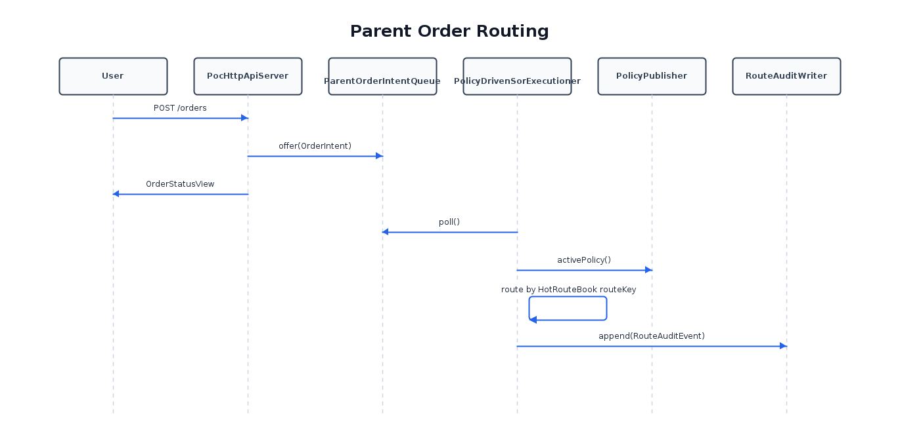

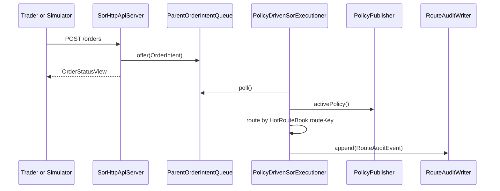

##### Policy Optimization Cycle

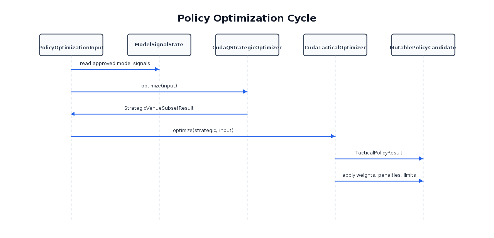

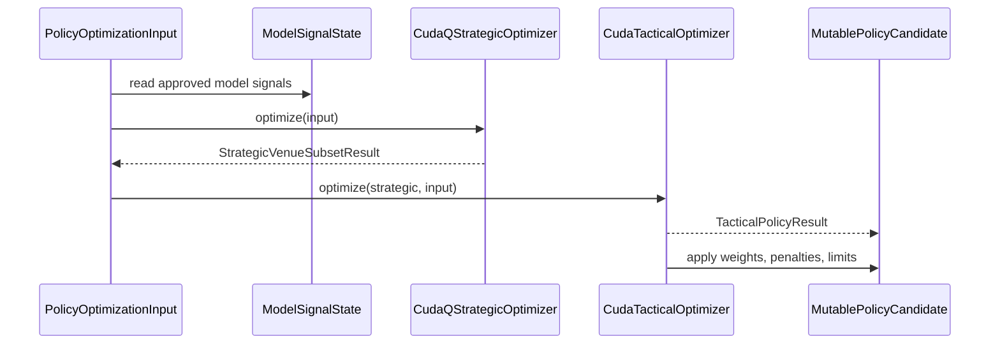

##### Cross-Parent Batch Venue Allocation

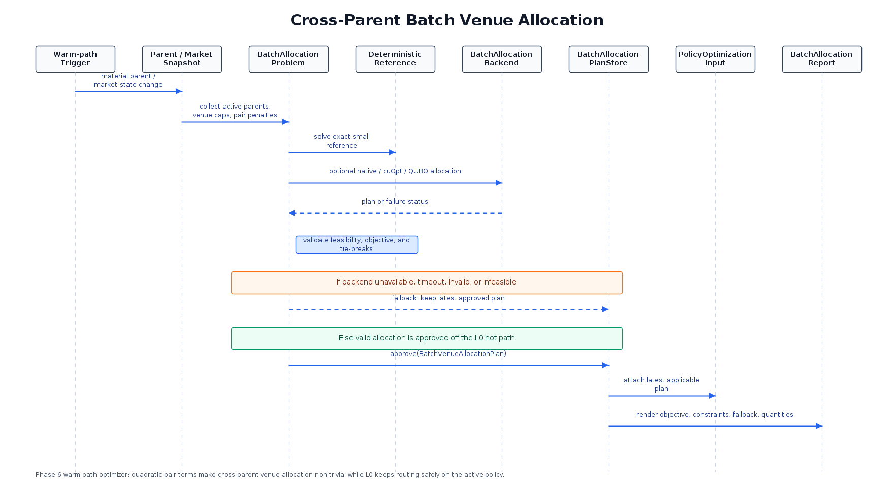

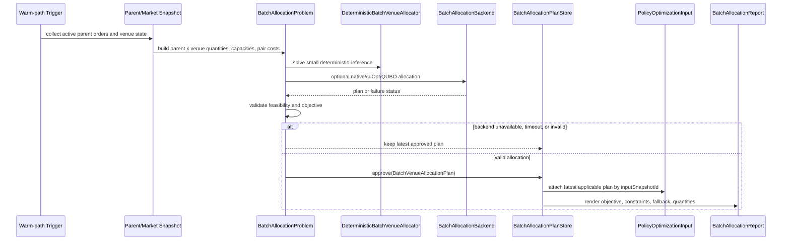

##### Robust Policy Selection

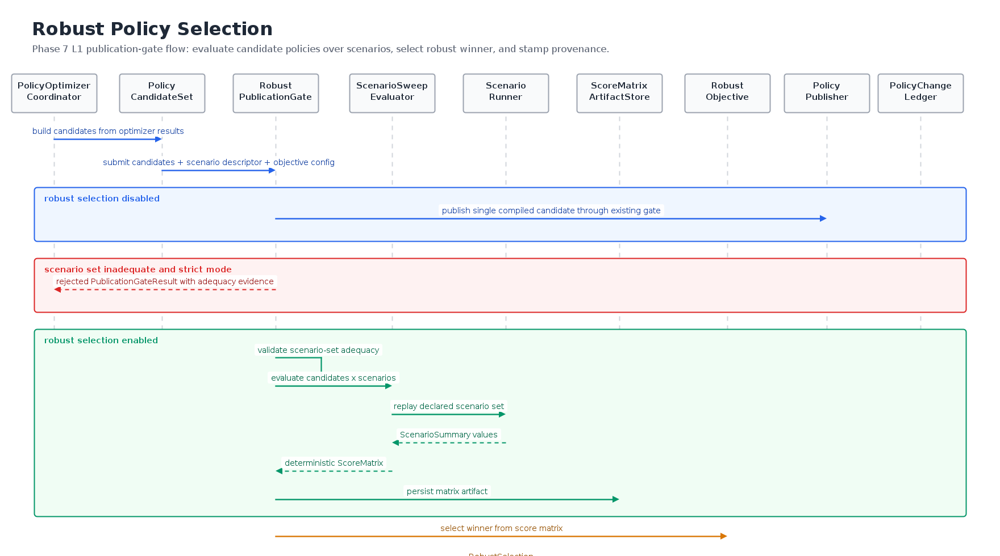

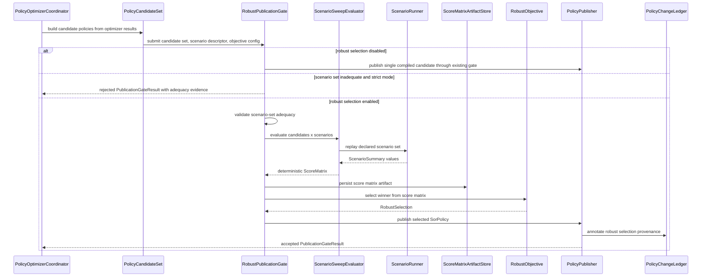

##### Policy Publication

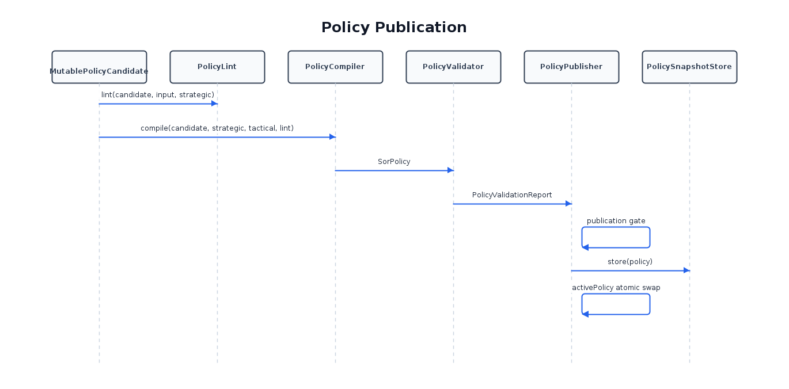

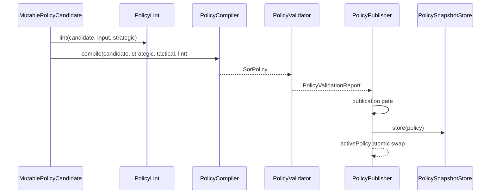

##### Jupyter Order Submission

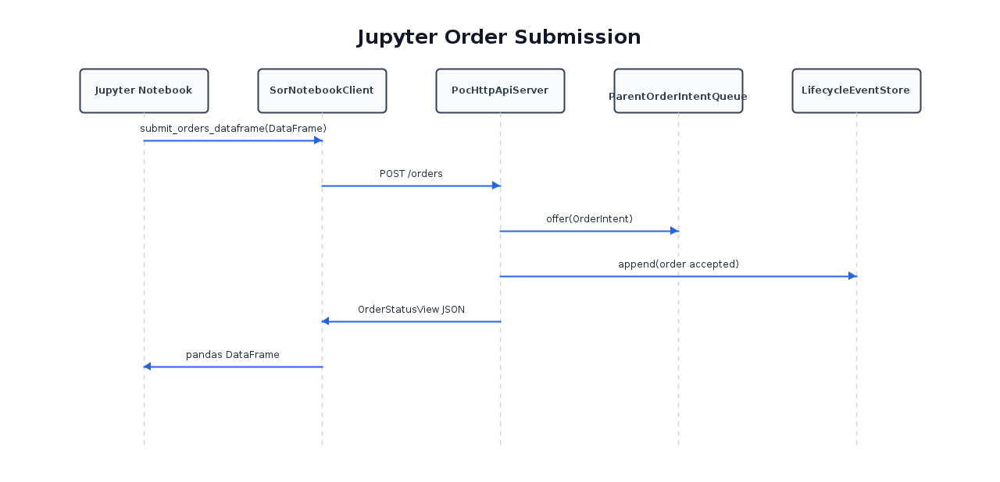

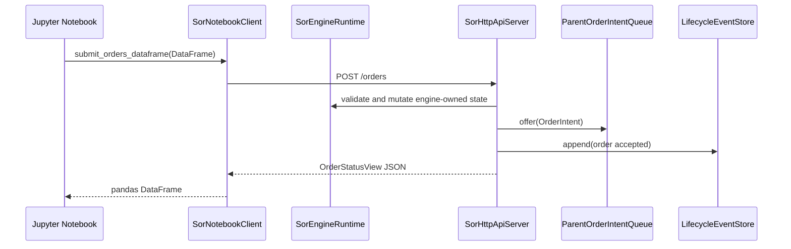

##### Live Jupyter Scenario Run With Explicit Reset And Parent Orders

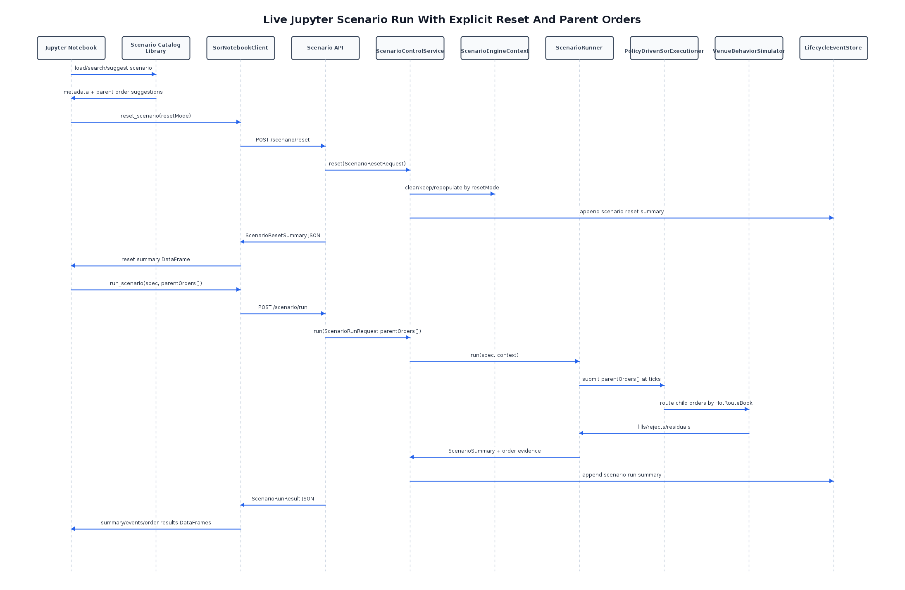

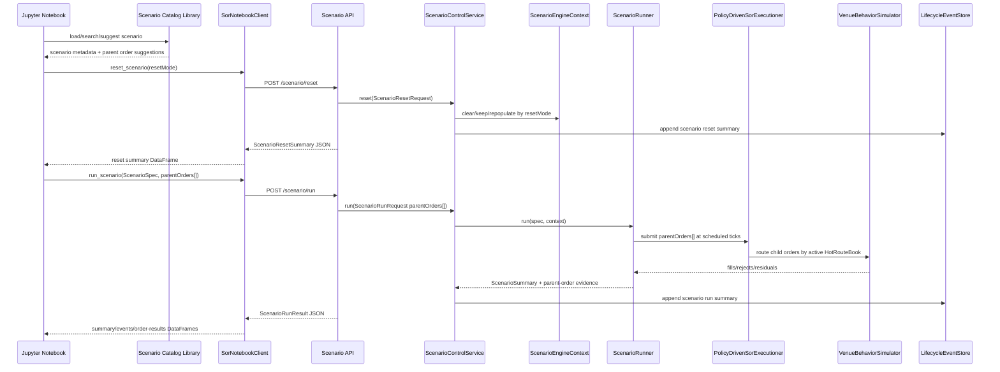

##### Venue Behavior Outcome Loop

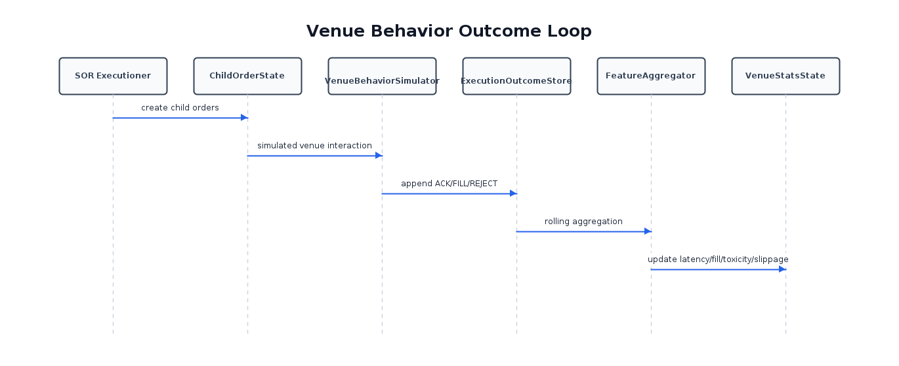

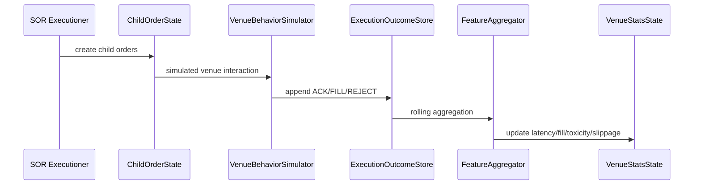

#### Required API Endpoints

```text
POST /orders
GET /orders/{parentOrderId}
GET /stats/current
GET /policy/current
GET /events/stream
```

#### Required Structures

```java
public final class OrderStatusView {
    public long parentOrderId;
    public long filledQty;
    public long remainingQty;
    public int status;

    public ChildOrder[] childOrders;
}
```

```java
public final class StatsSnapshotView {
    public long policyVersion;
    public int venueCount;

    public int[] venueWeights;
    public int[] latencyNanos;
    public int[] fillProbabilityBps;
    public int[] toxicityBps;
}
```


---

## 10. Scenario Simulation
### 10.1 Phase 5 Scenario Simulation
Phase 5 upgrades simulator realism while preserving the Adaptive Quantum SOR's deterministic,
portable Java runtime. The work is split so market data, sessions, order flow,
venue outcomes, integration snapshots, and E2E replay can be tested separately
before being exercised as one scenario.

#### Phase 5 Deliverable

A Java stateful stochastic/regime simulator family that supports:

```text
replayable fixed-seed scenarios
persistent market mid/spread/liquidity state
regime-conditioned volatility, spread, depth, stale feeds, outages, and order flow
stable venue profiles
market-state-dependent venue outcomes
scenario metadata suitable for optimizer snapshots and dataset generation
unit, integration, and end-to-end test evidence
```

#### Phase 5 Scenario Simulation Re-Evaluation

The Phase 1 `SyntheticScenarioGenerator` is a baseline deterministic scenario
composer. It owns no scenario state and performs one-shot population through:

```text
MarketDataSimulator.generateTick
VenueSessionSimulator.openAll
VenueThrottleSimulator.populate
MarketSessionSimulator.openAll
```

This is useful for deterministic wiring tests, but it is not a complete
scenario engine.

Current strengths to preserve:

```text
fixed-seed repeatability
valid top-of-book publication
bounded parent order generation
deterministic venue profile initialization
basic ACK/fill/reject outcome generation
open-all market and venue session setup
deterministic venue outage pattern for edge tests
deterministic venue throttle population
integration path into FeatureAggregator, ML signal stub, optimizer stubs, policy publication, and routing
```

Current gaps that Phase 5 must address:

```text
MarketDataSimulator redraws each instrument/venue cell independently.
There is no persistent instrument mid-price state.
Venue quotes are not correlated through a shared instrument mid.
Displayed liquidity does not mean-revert or persist across ticks.
MarketDataSimulator has no regime input or regime schedule.
RegimeState is currently produced downstream by RegimeDetector, not owned by scenario simulation.
SyntheticScenarioGenerator has no tick loop, scenario id, scenario metadata, or replay trace.
VenueBehaviorSimulator does not read MarketBookState, VenueSessionState, VenueThrottleState, or RegimeState.
ParentOrderIntentSimulator does not vary arrival, side, size, or urgency by regime.
MarketSessionSimulator only opens all instruments.
VenueSessionSimulator only opens all venues or applies a static every-fifth-venue outage pattern.
VenueThrottleSimulator is static and not stress/regime sensitive.
FeedHealthState is not wired into scenario generation.
Optimizer input snapshots do not carry simulator lineage.
E2E coverage does not yet prove full fixed-seed scenario replay.
```

The current baseline should be treated as:

```text
Phase 1 baseline deterministic scenario setup
```

It must not be treated as:

```text
realistic market simulator
multi-tick scenario replay engine
regime-aware market generator
market-state-dependent venue outcome simulator
```

The first implementation slice should introduce a compact scenario contract and
upgrade `MarketDataSimulator` first, because market data drives regime
detection, feature aggregation, optimizer inputs, and routing.

Recommended first slice:

```text
human-readable scenario metadata files under scenarios/<category>/*.yaml
ScenarioDefinitionLoader to convert user files into ScenarioSpec
ScenarioSpec / scenario config defaults
ScenarioWindow for fixed tick ranges
ScenarioClock for simulated time
ScenarioRandoms for independent random streams
ScenarioSummary for deterministic replay assertions
ScenarioRunner.run(ScenarioSpec) as the JUnit entry point
venue profile enum or deterministic profile mapping
MarketDataSimulator persistent mids and quantities
generateTick overload accepting RegimeState or explicit regime id provider
SyntheticScenarioGenerator multi-tick method for a fixed regime schedule
unit tests for seeded multi-tick replay and regime effects
integration test proving FeatureAggregator detects generated regime conditions
```

This slice must keep existing `generateTick(MarketBookState)` and
`populateBaseline(...)` behavior working so Phase 1 tests remain stable.

##### Scenario File Format

Scenarios are driven by readable metadata files, not Java constructors. The
runtime representation is `ScenarioSpec`, but users normally edit files under
`scenarios/<category>/`.

Example:

```yaml
scenarioId: normal-volatile-thin
description: Normal market, then spread/latency volatility, then thin displayed liquidity.
category: regime
tags:
  - regime
  - normal
  - volatile
  - thin-book
seed: 42
ticks: 30
venueProfilesEnabled: true

windows:
  - name: normal-open
    startTick: 0
    endTick: 9
    regime: NORMAL
  - name: volatile-spread-widening
    startTick: 10
    endTick: 19
    regime: VOLATILE
  - name: thin-book-liquidity-drop
    startTick: 20
    endTick: 29
    regime: THIN_BOOK

expected:
  replaySafe: true
  assertions:
    - same_seed_replays_equal_summary
    - volatile_window_moves_more_than_normal
    - thin_book_has_lower_displayed_qty
```

Scenario file design rules:

```text
scenarioId should be short, stable, and safe for reports.
description should explain the market story in plain English.
category should match the scenario subfolder name.
tags should be short searchable labels for filtering and notebook UX.
seed and ticks make replay deterministic.
windows use inclusive tick ranges.
regime is a readable name: NORMAL, VOLATILE, or THIN_BOOK.
expected is user-facing documentation; tests may use it later for richer checks.
```

##### Parent Order Intent Model

For Jupyter scenario testing, users provide the parent order intents that drive
the run. Scenario files may provide suggested/default parent orders, and
notebook users may override them when calling the live API.

Recommended scenario metadata shape:

```yaml
parentOrders:
  - clientOrderRef: stress-zero-liquidity-buy
    atTick: 6
    instrumentId: 0
    side: BUY
    quantity: 12000
    urgency: HIGH
    submitVia: SIMULATED
```

Recommended live API shape:

```json
{
  "scenarioId": "zero-liquidity-safe-route",
  "seed": 17171,
  "ticks": 18,
  "resetMode": "PURGE_AND_REPOPULATE",
  "parentOrders": [
    {
      "clientOrderRef": "stress-zero-liquidity-buy",
      "atTick": 6,
      "instrumentId": 0,
      "side": "BUY",
      "quantity": 12000,
      "urgency": "HIGH",
      "submitVia": "SIMULATED"
    }
  ]
}
```

The result must include parent-order route and outcome evidence:

```text
parentOrderId/clientOrderRef
route status
child order count
routed quantity
residual quantity
venue outcome counts
fill/reject/partial-fill counts
lifecycle/audit event ids
```

Live Jupyter scenario runs must not silently depend on internally generated
parent orders. If user parent orders are omitted, the API must either reject
the request with a clear error or mark the run as explicitly using
simulator-generated orders.

##### Scenario Catalog

The repository maintains at least 62 user-readable scenario files under
`scenarios/<category>/`. The catalog covers baseline replay, regime
transitions, liquidity disappearance, stale feed, venue outage, toxic venue
behavior, session halt/auction behavior, optimizer lineage, simulator failure
isolation, live reset modes, feature/ML signal shifts,
risk/throttle/capacity boundaries, multi-instrument divergence, and safe
zero-liquidity routing.

Every `scenarios/<category>/*.yaml` file is loaded and replayed by
`ScenarioDefinitionLoaderTest.allScenarioFilesLoadAndReplayDeterministically`.

Scenario discovery is available through the Python library:

```text
python/adaptive_quantum_sor/scenario_catalog.py
  load_scenarios()
  search_scenarios(...)
  find_scenario(...)
  parent_order_suggestions(...)
```

Notebook users import the library when working inside Python:

```python
from adaptive_quantum_sor import load_scenarios, search_scenarios, parent_order_suggestions
```

Shell users use the module command:

```bash
PYTHONPATH=python python3 -m adaptive_quantum_sor.scenario_catalog list
PYTHONPATH=python python3 -m adaptive_quantum_sor.scenario_catalog search --tag liquidity
PYTHONPATH=python python3 -m adaptive_quantum_sor.scenario_catalog suggest zero-liquidity-safe-route
```

##### Test Family Separation

Deterministic simulator tests and scenario-driven tests must stay separate:

```text
Deterministic simulator package:
  src/test/java/com/nitroj/adaptive/quantum/sor/sim

Scenario-driven unit package:
  src/test/java/com/nitroj/adaptive/quantum/sor/scenario

Scenario-driven integration package:
  src/test/java/com/nitroj/adaptive/quantum/sor/integration

Scenario-driven E2E package:
  src/test/java/com/nitroj/adaptive/quantum/sor/e2e
```

Recommended class names:

```text
SimulatorTest
MarketDataSimulatorTest
VenueBehaviorSimulatorTest
ScenarioSpecTest
ScenarioClockTest
ScenarioRandomsTest
ScenarioSummaryTest
ScenarioSimulationTest
ScenarioFeatureIntegrationTest
ScenarioOptimizerLineageIntegrationTest
SorEndToEndTest.replayableScenarioProducesEquivalentSummary
SorEndToEndTest.scenarioLiquidityDisappearanceRoutesSafely
SorEndToEndTest.liveScenarioWithUserParentOrderRoutesAndReportsResidual
SorEndToEndTest.liveScenarioParentOrderEvidenceIsAudited
```

Recommended script profiles:

```text
scripts/run_tests.sh simulator
  low-level deterministic simulator contract tests only

scripts/run_tests.sh scenario
  scenario-driven unit, integration, and E2E tests
```

##### Live Jupyter Scenario Boundary

Gradle/JUnit scenario tests create and discard an isolated
`ScenarioEngineContext`. Live Jupyter tests may need to show engine state reset
and repopulation before running a scenario. That reset must be explicit and
visible, not hidden state mutation.

Recommended live reset modes:

```text
ISOLATED
  run scenario in separate context; do not mutate live app state

PURGE_AND_REPOPULATE
  clear live engine scenario state, rebuild deterministic market/session/stats state, then run

KEEP_POLICY_PURGE_STATS
  keep active policy, purge market/order/outcome/stats state, then run

APPEND
  continue from current live engine state; mark run not replay-safe
```

Recommended live API and notebook surface:

```text
POST /scenario/reset
POST /scenario/run
GET /scenario/current
GET /scenario/summary
GET /scenario/events
SorNotebookClient.reset_scenario(...)
SorNotebookClient.run_scenario(..., parent_orders=[...])
SorNotebookClient.scenario_summary_dataframe()
SorNotebookClient.scenario_events_dataframe()
SorNotebookClient.scenario_order_results_dataframe()
notebooks/scenario_runner.ipynb
```

The notebook must show:

```text
selected reset mode
cleared state categories
kept state categories
repopulated state categories
policy handling decision
scenario summary
scenario lifecycle events
```

##### MarketDataSimulator Target Shape

The first stateful market-data implementation should maintain:

```text
long[] midByInstrument
long[] lastMidByInstrument if needed for test metrics
long[] bidQtyByInstrumentVenue
long[] askQtyByInstrumentVenue
long[] spreadByInstrumentVenue or computed profile spread
long tick
```

Each generated tick should:

```text
1. read active regime per instrument
2. update instrument mid using seeded bounded shock
3. derive each venue quote from shared instrument mid
4. apply venue profile spread/bias/noise
5. update displayed quantity through mean reversion plus bounded noise
6. apply thin-book / zero-liquidity / stale behavior where configured
7. publish only valid MarketBookState updates
```

##### Regime Model Recommendation

Start with three regimes because `RegimeState` currently supports:

```text
NORMAL = 0
VOLATILE = 1
THIN_BOOK = 2
```

Map future `STRESSED` and `AUCTION` behavior later after extending regime model
constants and validation. Until then, `STRESSED` is Phase 5 follow-up work
rather than forced into the current `RegimeState` shape.

Initial regime effects:

```text
NORMAL: low shock, tight spread, high/stable displayed quantity
VOLATILE: larger shock, wider spread, noisier quantity
THIN_BOOK: normal/moderate shock, wider spread, lower target quantity, zero-liquidity probability
```

##### Venue Profile Recommendation

Start with deterministic profile mapping by `venueId % 5` to preserve current
style:

```text
0: TIGHT_DEEP
1: WIDE_SLOW
2: TOXIC
3: REJECT_PRONE or STALE_FEED
4: OUTAGE_PRONE or LIQUIDITY_FADING
```

The market-data slice initially uses profiles for quote spread, quantity
target, quote noise, and stale/zero-liquidity probability. Venue outcomes can
be tied to the same profiles in a later task.

##### Initial Tests To Add

Unit tests:

```text
same seed and same regime schedule produce identical multi-tick books
different seed changes at least one book field over a bounded run
successive NORMAL mids are correlated and bounded
venue quotes for the same instrument remain close to shared instrument mid
VOLATILE produces larger absolute mid movement than NORMAL over fixed window
THIN_BOOK produces lower median displayed quantity than NORMAL over fixed window
all published books satisfy bid > 0, ask > bid, qty >= 0
legacy generateTick and populateBaseline still pass existing tests
```

Integration tests:

```text
SyntheticScenarioGenerator runs a multi-tick NORMAL -> VOLATILE -> THIN_BOOK schedule
FeatureAggregator and RegimeDetector consume generated market data without invalid stats
thin-book generated state can produce no-liquidity routing residuals
```

E2E tests:

```text
run compact fixed-seed scenario twice and compare route/outcome/audit summary
route safely through a liquidity disappearance window
confirm active policy remains valid while scenario state changes
```

##### Risks And Mitigations

Main risks:

```text
statistical tests becoming flaky
changing existing deterministic expectations
overloading RegimeState before its constants support all planned regimes
making scenario generation too broad before market data is solid
accidentally coupling tests to private random implementation details
```

Mitigations:

```text
use fixed windows and deterministic relative assertions
keep existing APIs as compatibility wrappers
start with NORMAL/VOLATILE/THIN_BOOK only
test public state outcomes rather than private random draws
implement one simulator slice before tying all simulators together
```

##### Phase 5 Decision

Proceed with `MarketDataSimulator` as the first implementation target, backed
by a small scenario/profile contract and compatibility-preserving tests.

Do not introduce CUDA, cuRAND, CUDA-Q, cuOpt, StyleGAN, historical replay, or
full L2/L3 matching as part of this slice.

## 11. Acceptance Criteria
### 11.1 Additional Acceptance Criteria
```text
AC-HOTPATH-001
Executioner obtains active SorPolicy once per route decision.

AC-HOTPATH-002
Executioner performs no string creation or narrative formatting in strict mode.

AC-HOTPATH-003
Executioner never calls optimizer code.

AC-SNAPSHOT-001
Every optimizer run records input snapshot/version metadata.

AC-POLICY-001
PolicyCompiler produces both HotRouteBook and FullPolicyMatrix.

AC-POLICY-002
PolicyCompiler emits PolicyDiff and PolicyChangeLedgerEntry.

AC-POLICY-003
PolicyPublisher publishes only if PublicationGateResult allows publication.

AC-POLICY-004
Policy thrashing limits prevent excessive venue and weight changes.

AC-INDEX-001
All array structures use the canonical indexing formulas.

AC-COMPARE-001
Static SOR and adaptive policy SOR can be compared on the same scenario.

AC-COMPARE-002
SorComparisonReport is produced for every comparison run.
```


---
### 11.2 Complete Phase Acceptance Criteria
This section defines thorough acceptance criteria for each Adaptive Quantum SOR phase. Acceptance criteria must cover positive paths, negative paths, edge cases, exception cases, and failure cases.

The Adaptive Quantum SOR is considered production-reference only if the system behavior is observable, auditable, deterministic where required, and safe under failure.

---
### 11.3 Phase 1 Acceptance Criteria — Java-Only Adaptive Policy SOR Reference
Phase 1 proves the full architecture with deterministic Java implementations and optimizer stubs.

#### Phase 1 Scope

```text
Java-only runtime
simulated parent orders
simulated market data
simulated venue execution behavior
feature aggregation
ML signal stub
Ising/CUDA-Q strategic optimizer stub
CUDA tactical optimizer stub
PolicyLint
PolicyValidator
PolicyCompiler
PolicyPublisher
PolicyDrivenSorExecutioner
Static SOR baseline
Narrative lifecycle logger
Jupyter/Python control interface
```

---

#### P1-BOOT — Startup / Initialization

##### P1-BOOT-001 Positive: system starts with default config

Given a valid Adaptive Quantum SOR config,
when the system starts,
then all required components are initialized:

```text
MarketDataSimulator
ParentOrderIntentSimulator
VenueBehaviorSimulator
FeatureAggregator
PolicyOptimizerCoordinator
PolicyCompiler
PolicyPublisher
PolicyDrivenSorExecutioner
StaticSorExecutioner
NarrativeLifecycleLogger
SorHttpApiServer
```

and an initial `SorPolicy` is published before parent orders are routed.

##### P1-BOOT-002 Negative: invalid config is rejected

Given a config with invalid dimensions such as:

```text
instruments <= 0
venues <= 0
regimes <= 0
urgencies <= 0
```

when the system starts,
then startup fails with a clear configuration error and no routing begins.

##### P1-BOOT-003 Edge: minimum valid configuration

Given:

```text
1 instrument
1 venue
1 regime
1 urgency
```

when the system starts,
then the Adaptive Quantum SOR still runs and can route a parent order if liquidity is available.

##### P1-BOOT-004 Failure: no initial policy

Given the initial policy cannot be compiled or published,
when parent orders arrive,
then the executioner rejects or queues them with reason:

```text
NO_ACTIVE_POLICY
```

and does not route child orders.

---

#### P1-CONFIG — Model Toggle and Config Behavior

##### P1-CONFIG-001 Positive: model toggles are honored

Given model toggles are configured,
when the optimizer cycle runs,
then only enabled model contributors modify `MutablePolicyCandidate`.

##### P1-CONFIG-002 Negative: unknown model config key

Given the config contains an unknown model key,
then startup should either fail fast or log a clear warning depending on strict config mode.

##### P1-CONFIG-003 Edge: all optional models disabled

Given all optional models are disabled,
then the system still builds a baseline policy using minimum required eligibility, fee, and liquidity logic.

##### P1-CONFIG-004 Failure: invalid cadence

Given a cadence is configured as zero or negative,
then config validation fails before runtime.

---

#### P1-SIM — Simulator Flow

##### P1-SIM-001 Positive: parent order simulator generates orders

Given `ParentOrderIntentSimulator` is enabled,
when the configured interval elapses,
then it emits valid `OrderIntent` records into `ParentOrderIntentQueue`.

##### P1-SIM-002 Positive: market data simulator updates books

Given `MarketDataSimulator` is running,
when a market data tick is generated,
then `MarketBookState` is updated with valid bid/ask prices and quantities.

##### P1-SIM-003 Positive: venue simulator produces outcomes

Given child orders are generated,
when `VenueBehaviorSimulator` processes them,
then it emits one or more outcomes:

```text
ACK
PARTIAL_FILL
FULL_FILL
REJECT
CANCEL_ACK
CANCEL_REJECT
```

##### P1-SIM-004 Negative: crossed or invalid market generated

Given a simulated book update would create:

```text
bid >= ask
negative price
negative quantity
```

then the simulator either corrects the value or emits a `SIM_MARKET_DATA_INVALID` lifecycle event and rejects the update.

##### P1-SIM-005 Edge: zero liquidity venue

Given all venues have zero quantity for an instrument,
when a parent order arrives,
then the SOR creates no child orders and records residual quantity.

##### P1-SIM-006 Edge: venue outage

Given a venue is marked unavailable by `VenueSessionSimulator`,
then the policy compiler excludes it or the executioner skips it, and the decision log records the reason.

##### P1-SIM-007 Failure: simulator thread failure

Given any simulator thread throws an unexpected exception,
then the P1 simulator runtime guard records a lifecycle failure event, marks
simulator health as failed, and exposes a publication guard result that
dependent optimizer cycles must check before publishing new policies.

The Phase 1 implementation may use a synchronous guarded runner instead of a
long-lived scheduler thread, but the behavior must be equivalent for tests:

```text
unexpected simulator exception is caught by the guard
failure lifecycle event is appended
health state becomes unhealthy
failure component/name/message/timestamp are observable
publication guard rejects with simulator_failed while unhealthy
the previous active policy remains untouched because no new publication is allowed
```

#### P1-FEATURE — Feature Aggregation

##### P1-FEATURE-001 Positive: execution outcomes update rolling stats

Given fills, rejects, and latency events exist,
when `FeatureAggregator` runs,
then it updates:

```text
VenueStatsState
VenueLatencyStats
FillQualityStats
ToxicityStats
SlippageStats
VenueHealthStats
```

##### P1-FEATURE-002 Negative: malformed outcome ignored

Given an outcome references an unknown child order or venue,
then the feature aggregator ignores the record, increments a bad-event counter, and emits a lifecycle warning.

##### P1-FEATURE-003 Edge: no outcomes yet

Given no fills/rejects have occurred,
when aggregation runs,
then default neutral stats are produced rather than NaN or invalid values.

##### P1-FEATURE-004 Failure: stats overflow / invalid bps

Given a computed statistic falls outside expected bounds,
then it is clamped or rejected according to config and the event is logged.

---

#### P1-LINT — PolicyLint

##### P1-LINT-001 Positive: valid candidate passes lint

Given a structurally valid `MutablePolicyCandidate`,
when `PolicyLint` runs,
then it returns a report with zero errors.

##### P1-LINT-002 Negative: array length mismatch

Given any candidate array length does not equal:

```text
instrumentCount * venueCount * regimeCount * urgencyCount
```

then `PolicyLint` returns `ARRAY_LENGTH_MISMATCH` as an error.

##### P1-LINT-003 Negative: empty route universe

Given no eligible venues exist for an instrument/regime/urgency,
then `PolicyLint` returns `EMPTY_ROUTE_UNIVERSE` and the candidate is not compiled.

##### P1-LINT-004 Negative: invalid venue flags

Given a candidate enables midpoint or hidden flags for a venue that does not support them,
then `PolicyLint` returns an unsupported capability error.

##### P1-LINT-005 Edge: warning-only candidate

Given a candidate has warnings but no errors,
then publication proceeds only if config permits warning-level lint results.

##### P1-LINT-006 Failure: lint exception

Given `PolicyLint` throws unexpectedly,
then the candidate is rejected, the prior active policy remains active, and a lifecycle failure event is emitted.

---

#### P1-OPT — Stub Optimizers

##### P1-OPT-001 Positive: ML signal stub produces signals

Given valid stats,
when the ML signal stub runs,
then it produces bounded `ModelSignalState` values between 0 and 10000 bps where applicable.

##### P1-OPT-002 Positive: strategic stub selects venues

Given venue stats and metadata,
when the strategic optimizer stub runs,
then it produces `StrategicVenueSubsetResult` with valid venue IDs.

##### P1-OPT-003 Positive: tactical stub produces parameters

Given a strategic subset,
when the tactical optimizer stub runs,
then it produces valid weights, penalties, and child-size limits.

##### P1-OPT-004 Negative: optimizer returns invalid venue

Given an optimizer returns an unknown venue ID,
then `PolicyLint` or `PolicyValidator` rejects the candidate.

##### P1-OPT-005 Edge: strategic subset unchanged

Given the strategic subset is unchanged,
then CUDA tactical tuning may still update weights and penalties.

##### P1-OPT-006 Failure: optimizer times out or fails

Given an optimizer cycle fails,
then no new policy is published, the old policy remains active, and the failure is logged with `OptimizerRunMetadata`.

---

#### P1-COMPILER — Policy Compilation

##### P1-COMPILER-001 Positive: valid candidate compiles

Given valid lint and validation input,
when `PolicyCompiler` runs,
then it produces:

```text
SorPolicy
HotRouteBook
FullPolicyMatrix
PolicyDiff
PolicyChangeLedgerEntry
```

##### P1-COMPILER-002 Positive: HotRouteBook offsets are valid

Given a compiled policy,
then:

```text
routeListOffset.length == instrumentCount * regimeCount * urgencyCount + 1
routeListOffset is monotonic
all routeVenueId entries are valid dense venue IDs
```

##### P1-COMPILER-003 Negative: compiler receives invalid lint result

Given `PolicyLintReport.hasErrors() == true`,
then the compiler must not compile the candidate.

##### P1-COMPILER-004 Edge: route list exceeds max length

Given more eligible venues exist than `maxEligibleVenuesPerRoute`,
then compiler caps the list deterministically and emits a warning.

##### P1-COMPILER-005 Failure: compiler exception

Given compilation fails,
then the candidate is rejected and the active policy remains unchanged.

---

#### P1-PUBLISH — Policy Publication

##### P1-PUBLISH-001 Positive: valid policy publishes atomically

Given a candidate passes lint, validation, and publication gates,
when published,
then `PolicyPublisher` atomically swaps the active policy reference.

##### P1-PUBLISH-002 Negative: failed publication gate

Given publication gate fails,
then the candidate is not published and the prior policy remains active.

##### P1-PUBLISH-003 Edge: candidate improves less than threshold

Given expected improvement is below configured threshold,
then candidate is rejected unless override mode is enabled.

##### P1-PUBLISH-004 Failure: policy hash mismatch

Given policy hash verification fails,
then publication is rejected and a critical lifecycle event is emitted.

##### P1-PUBLISH-005 Audit: every publication has ledger entry

Every successful publication must create:

```text
PolicyChangeLedgerEntry
PolicyDiff
OptimizerRunMetadata linkage
LifecycleEvent
```

---

#### P1-EXEC — Policy-Driven SOR Execution

##### P1-EXEC-001 Positive: parent order routes using active policy

Given a valid parent order, active policy, and available liquidity,
when execution runs,
then child orders are generated using `HotRouteBook` route lists.

##### P1-EXEC-002 Positive: child orders stamp policy identity

Every generated child order must include:

```text
policyVersion
policyHash64
parentOrderId
instrumentId
venueId
```

##### P1-EXEC-003 Negative: no active policy

Given no active policy exists,
then the parent order is rejected or queued with reason `NO_ACTIVE_POLICY`.

##### P1-EXEC-004 Negative: no liquidity

Given no eligible venue has liquidity,
then no child order is generated and residual quantity is recorded.

##### P1-EXEC-005 Edge: partial liquidity

Given available liquidity is less than parent quantity,
then child orders are generated up to available/max child quantity and residual is recorded.

##### P1-EXEC-006 Edge: max child quantity limit

Given venue liquidity exceeds `maxChildQty`,
then generated child quantity must not exceed `maxChildQty`.

##### P1-EXEC-007 Edge: policy swap during route decision

Given a policy swap happens while a route decision is executing,
then the decision must complete using the policy captured at decision start.

##### P1-EXEC-008 Failure: venue state disabled after policy compile

Given a venue becomes disabled after policy publication,
then the executioner must skip the venue if guard state marks it unavailable.

---

#### P1-RESLICE — Reslicing Semantics

##### P1-RESLICE-001 Positive: timer reslice uses one policy version

Each reslice decision must capture exactly one active policy version at the start of the reslice.

##### P1-RESLICE-002 Policy version across parent lifecycle

A single parent order may use multiple policy versions across multiple reslice events, but every child order must record the exact policy version used.

##### P1-RESLICE-003 Negative: reslice without residual quantity

If remaining quantity is zero, no reslice is performed.

##### P1-RESLICE-004 Edge: new policy removes previous venue

If a later policy removes a venue used by earlier child orders, existing child order state remains valid and only future reslices use the new policy.

---

#### P1-AUDIT — Audit and Narrative Logging

##### P1-AUDIT-001 Positive: route audit event emitted

Every route decision must emit a compact `RouteAuditEvent`.

##### P1-AUDIT-002 Positive: narrative lifecycle story is produced

Major system events must appear in a chronological human-readable narrative stream.

##### P1-AUDIT-003 Negative: narrative logger unavailable

If narrative logger fails, routing must continue and compact audit events must still be recorded.

##### P1-AUDIT-004 Edge: high event rate

If lifecycle event rate exceeds configured limit, logger may sample or drop narrative events but must not block the hot path.

##### P1-AUDIT-005 Failure: audit buffer full

If audit buffer is full, system must follow configured behavior:

```text
block in strict audit mode
or drop narrative-only events in demo mode
or fail safe in production-reference strict mode
```

---

#### P1-JUPYTER — Python/Jupyter Control Interface

##### P1-JUPYTER-001 Positive: submit parent order

Given `AdaptiveQuantumSorApplication --api-port=<port>` is running,
when Python submits `POST /orders`,
then the order is accepted and assigned a `parentOrderId`.

##### P1-JUPYTER-002 Positive: retrieve order status

Given a submitted parent order,
when Python calls `GET /orders/{parentOrderId}`,
then it receives current fill status and child-order details.

##### P1-JUPYTER-003 Positive: stream narrative logs

Given `/events/stream` is open,
then the notebook receives lifecycle events in chronological order.

##### P1-JUPYTER-004 Positive: retrieve stats

Given `/stats/current` is called,
then it returns current policy and venue stats snapshot.

##### P1-JUPYTER-005 Negative: invalid order request

Given an invalid order payload,
then API returns a clear validation error and no order enters the queue.

##### P1-JUPYTER-006 Failure: API server unavailable

If the API server fails, the core engine may continue running, but Jupyter control is unavailable and health status reflects API failure.

##### P1-JUPYTER-007 Positive: Python talks to the engine over HTTP

Given the engine API is started by `AdaptiveQuantumSorApplication --api-port=<port>`,
when `SorNotebookClient` submits orders, resets scenarios, or reads stats,
then the requests are sent to `SorHttpApiServer` on localhost HTTP and mutate or
read `SorEngineRuntime` state.

##### P1-JUPYTER-008 Negative: no notebook-only engine state

Given JupyterLab is launched,
then the launcher must not start a separate notebook-only engine with duplicate
policy, queue, lifecycle, or scenario state.

---

#### P1-COMPARE — Static SOR vs Adaptive SOR

##### P1-COMPARE-001 Positive: same scenario can run both routers

Given comparison mode is enabled,
then static SOR and adaptive SOR process the same simulated parent order and market scenario.

##### P1-COMPARE-002 Positive: comparison report generated

For every comparison run, produce `SorComparisonReport`.

##### P1-COMPARE-003 Edge: identical behavior

If both routers produce identical results, report zero realized improvement and no failure.

##### P1-COMPARE-004 Negative: adaptive underperforms

If adaptive SOR underperforms static SOR, report negative realized improvement and keep the result for analysis.

---

#### P1-BENCH — Phase 1 Benchmarking

##### P1-BENCH-001 Allocation benchmark

JMH benchmark must show the L0 route execution path allocates 0 B/op after warmup under strict mode.

##### P1-BENCH-002 Latency benchmark MVP

For MVP scale:

```text
1 instrument
20–30 venues
3 regimes
3 urgencies
```

route decision latency target should be measured and reported.

Target:

```text
< 1–2 µs typical decision path for simple single-instrument route
```

##### P1-BENCH-003 Failure: benchmark regression

If allocation or latency target regresses beyond configured threshold, benchmark gate fails.

---
### 11.4 Phase 2 Acceptance Criteria — Real CUDA / cuOpt Tactical Optimizer
Phase 2 replaces the tactical optimizer stub with a real C++/CUDA or cuOpt backend.

#### P2-CUDA-001 Positive: Java calls native CUDA tactical optimizer

Given valid `PolicyOptimizationInput` and `StrategicVenueSubsetResult`,
when tactical optimization runs,
then Java invokes the native backend and receives a valid `TacticalPolicyResult`.

#### P2-CUDA-002 Positive: CUDA output compiles into policy

Given a CUDA-generated `TacticalPolicyResult`,
then the existing Phase 1 `PolicyLint`, `PolicyValidator`, `PolicyCompiler`, and `PolicyPublisher` pipeline accepts or rejects it exactly like a stub result.

#### P2-CUDA-003 Negative: native library missing

Given CUDA native library cannot load,
then the system falls back to configured stub mode or fails startup depending on config.

#### P2-CUDA-004 Negative: CUDA output invalid

Given CUDA returns invalid weights, penalties, or child-size limits,
then `PolicyLint` rejects the candidate.

#### P2-CUDA-005 Edge: GPU unavailable

If no CUDA device is available,
then the system must emit clear health status and use fallback mode if configured.

#### P2-CUDA-006 Failure: CUDA timeout

If CUDA optimization exceeds configured timeout,
then the optimizer run is marked failed and no policy is published from that run.

#### P2-CUDA-007 Failure: JNI/native crash containment

If native backend fails, the system must record the failure. Production-grade process isolation is optional for Adaptive Quantum SOR but failure mode must be documented.

#### P2-CUDA-008 Determinism

Given identical input snapshot and deterministic CUDA mode,
then optimizer output should be reproducible within configured tolerance.

#### P2-CUDA-009 Performance

CUDA tactical optimizer runtime must be measured and reported per cycle.

Target Adaptive Quantum SOR cadence:

```text
1–5 minutes full tactical cycle
optional faster lightweight cycle
```

The following C++ algorithm-hardening ACs make the native implementation
requirements explicit. They gate a future claim that the tactical native
backend is algorithm-complete beyond the current Adaptive Quantum SOR native baseline.

#### P2-CUDA-010 Native ABI and layout

Given Java writes a tactical optimizer direct buffer,
then C++ must validate magic, schema version, dimensions, route offsets, and
selected venue IDs using the layout defined in section 7.3.

#### P2-CUDA-011 Native tactical algorithm

Given a deterministic tactical input with selected venues, model signals, venue
stats, risk limits, and fees,
then the native backend must compute the section 7.3 tactical quality score,
bounded tactical output fields, and route weights that sum to exactly 10000 bps
for eligible selected venues.

#### P2-CUDA-012 Native tactical CTest coverage

The C++ tactical tests must cover status codes, layout validation, clamp
behavior, ineligible venue zeroing, exact weight normalization, deterministic
tie-breaking, and byte-identical output for identical input.

---
### 11.5 Phase 3 Acceptance Criteria — Real CUDA-Q / Ising Strategic Optimizer
Phase 3 replaces the strategic optimizer stub with a real CUDA-Q / Ising / QUBO backend.

#### P3-ISING-001 Positive: strategic optimizer selects venue subset

Given valid model signals and venue stats,
when CUDA-Q/Ising optimizer runs,
then it returns a valid `StrategicVenueSubsetResult`.

#### P3-ISING-002 Positive: CUDA tactical optimizer consumes latest Ising result

Given a new strategic subset result is approved,
then subsequent CUDA tactical optimizer runs consume the latest approved strategic result.

#### P3-ISING-003 Negative: empty subset

If CUDA-Q/Ising returns an empty venue subset for an active route key,
then `PolicyLint` rejects the result.

#### P3-ISING-004 Negative: invalid venue selected

If CUDA-Q/Ising returns unknown or disabled venue IDs,
then the candidate is rejected.

#### P3-ISING-005 Edge: no better subset found

If strategic optimizer finds no improvement,
then current strategic subset remains active and tactical optimization may continue.

#### P3-ISING-006 Failure: CUDA-Q backend unavailable

If CUDA-Q backend is unavailable,
then system falls back to strategic stub or prior approved strategic result depending on config.

#### P3-ISING-007 Failure: optimization timeout

If strategic optimization exceeds configured timeout,
then no new strategic result is published and current policy remains active.

#### P3-ISING-008 Audit lineage

Every strategic result must record:

```text
optimizerRunId
inputSnapshotId
modelSignalVersion
riskLimitVersion
objective configuration
createdAtNanos
```

#### P3-ISING-009 Cadence

Default strategic cadence shall be configurable, with recommended Adaptive Quantum SOR default:

```text
5–30 minutes
```

The following C++ algorithm-hardening ACs make the native strategic solver
requirements explicit. They gate a future claim that the CUDA-Q/Ising backend
is algorithm-complete beyond the current Adaptive Quantum SOR native baseline.

#### P3-ISING-010 Native QUBO objective

Given venue stats, model signals, risk constraints, and metadata for one route
key,
then the strategic objective builder must compute section 7.3 strategic quality
scores, linear coefficients, cardinality constraints, and optional pair
penalties deterministically.

#### P3-ISING-011 Native strategic solver determinism

Given a small QUBO input with `venueCount <= 30`,
then the C++ strategic reference solver must select the lowest-energy valid
subset and break energy ties by lower bitmask/lower venue IDs.

#### P3-ISING-012 Native strategic CTest coverage

The C++ strategic tests must cover invalid inputs, impossible subset bounds,
simple expected subsets, cardinality constraints, deterministic tie-breaking,
pair penalties that change the selected subset, and stable objective energy
reporting.

---
### 11.6 Phase 4 Acceptance Criteria — Automated ML/RL Model Pipeline
Phase 4 introduces automated ML/RL model generation or inference as part of the optimization path.

#### P4-ML-001 Positive: ML/RL pipeline produces ModelSignalState

Given sufficient execution outcomes and market stats,
when ML/RL pipeline runs,
then it produces bounded and versioned `ModelSignalState`.

#### P4-ML-002 Positive: model signals influence optimizers

Given new model signals,
then Ising/CUDA-Q and CUDA tactical optimizers consume the latest approved signal version.

#### P4-ML-003 Negative: model output invalid

If model output contains NaN, infinite, negative bps, or out-of-bound values,
then it is rejected and previous model signals remain active.

#### P4-ML-004 Edge: insufficient training data

If insufficient data exists,
then ML/RL pipeline emits neutral/default signals and records insufficient-data status.

#### P4-ML-005 Failure: Python training job failure

If Python ML/RL job fails,
then no model signal update is published, the prior signal version remains active, and failure is recorded.

#### P4-ML-006 Failure: model artifact missing/corrupt

If model artifact cannot be loaded or checksum fails,
then model update is rejected.

#### P4-ML-007 Governance

Every model signal update must record:

```text
modelVersion
trainingDatasetId
featureSchemaVersion
createdAtNanos
validationScore
producer
```

#### P4-ML-008 Safety

ML/RL must not directly send orders, mutate active policy, or bypass policy validation.

#### P4-ML-009 Cadence

ML/RL cadence must be configurable.

Recommended Adaptive Quantum SOR defaults:

```text
inference: 30 seconds to 5 minutes
incremental training: 15–60 minutes
full retraining: manual / hourly / daily
```

---
### 11.7 Phase 5 Acceptance Criteria — Stateful Stochastic/Regime Simulation
Phase 5 upgrades the deterministic simulator family from one-shot random
generators into a replayable, stateful, regime-aware stochastic market and venue
simulation layer.

#### P5-SIM-001 Positive: stateful market-data evolution

Given `MarketDataSimulator` is initialized with a fixed seed and initial state,
when it generates multiple ticks,
then instrument mids, venue spreads, and visible quantities evolve from prior
state through bounded stochastic shocks.

Acceptance evidence must prove:

```text
successive NORMAL-regime mids are correlated
venue quotes for the same instrument are correlated through shared instrument mid
quantities mean-revert toward profile/regime targets
MarketBookState invariants always hold
```

#### P5-SIM-002 Positive: regime-conditioned generation

Given the same seed and initial market state,
when the active regime changes between NORMAL, VOLATILE, THIN_BOOK, and STRESSED,
then generated behavior changes according to documented regime multipliers.

Required observable effects:

```text
VOLATILE has higher absolute mid movement than NORMAL over a fixed window
THIN_BOOK has lower median displayed quantity than NORMAL over a fixed window
STRESSED has wider median spread than NORMAL over a fixed window
STRESSED has higher stale/outage event rate than NORMAL when feed/session effects are enabled
```

#### P5-SIM-003 Positive: venue profiles are stable and explainable

Given venue profiles are enabled,
when a fixed-seed scenario runs,
then each venue keeps a deterministic profile across ticks and the profile
explains spread, liquidity, latency, reject, toxicity, and stale/outage behavior.

At minimum the implementation must include profiles equivalent to:

```text
TIGHT_DEEP
WIDE_SLOW
TOXIC
STALE_FEED
OUTAGE_PRONE
```

#### P5-SIM-004 Positive: order flow responds to regimes

Given `ParentOrderIntentSimulator` is regime-aware,
when order flow is generated under different regimes,
then arrival cadence, side imbalance, quantity, and urgency distributions follow
documented regime rules while preserving seeded replay.

#### P5-SIM-005 Positive: venue outcomes depend on generated market state

Given child orders are routed to venues with different profiles and displayed
liquidity,
when `VenueBehaviorSimulator` processes them,
then fills, partial fills, rejects, latency, slippage, and post-fill drift depend
on current market state, venue profile, session/throttle state, and regime.

#### P5-SIM-006 Negative: invalid generated state cannot escape

If any stochastic rule produces invalid raw values such as crossed prices,
negative prices, negative quantities, invalid regime IDs, invalid venue status,
or impossible outcome quantities,
then the simulator must sanitize or reject them before publication and record
observable failure/sanitization evidence.

No downstream execution, feature, ML, optimizer, or API component may observe
invalid published simulator state.

#### P5-SIM-007 Edge: minimum and constrained configs still run

Given minimum valid dimensions such as:

```text
1 instrument
1 venue
1 regime
1 urgency
```

or a configured regime count smaller than the named regime universe,
then the simulator must run deterministically using only valid dense IDs and
documented fallback behavior.

#### P5-SIM-008 Edge: stale, outage, halt, and zero-liquidity windows

Given a scenario contains stale feeds, venue outages, instrument halts,
auctions, or zero-liquidity windows,
when routing and feature aggregation run,
then unavailable liquidity is not executed against, route decisions explain
skips/residuals, and feed/session health is reflected in stats and snapshots.

#### P5-SIM-009 Integration: generated regimes drive feature and ML signals

Given a multi-regime scenario runs through market data, execution outcomes, and
feature aggregation,
then `RegimeDetector`, `RegimeState`, `VenueStatsState`, fill, toxicity,
slippage, health stats, and ML signal stubs must reflect the generated scenario
conditions.

#### P5-SIM-010 Integration: optimizer inputs preserve scenario lineage

Given optimizer input snapshots are produced from stochastic/regime simulation,
then snapshots must include or reference enough simulator metadata to reproduce
the scenario:

```text
seed
scenario id/name
tick range
active regime schedule or generated regime state
venue profile assignment
simulator config version
input snapshot id
```

#### P5-SIM-011 End-to-end: replayable stochastic/regime scenario

Given the local Adaptive Quantum SOR is run twice with the same simulator config and seed,
when it executes the same scenario from startup through routing, outcomes,
feature aggregation, optimization, audit, lifecycle, and metrics,
then both runs must produce equivalent published state, route decisions,
outcomes, audit summaries, and reportable metrics.

#### P5-SIM-012 Failure: simulator failure is isolated

If the simulator throws, times out, or emits too many invalid raw updates,
then the system must:

```text
record lifecycle failure evidence
mark simulator health failed/degraded
avoid publishing optimizer results based on partial corrupt state
keep the last valid active policy available
recover by restarting from a known seed/state snapshot if configured
```

#### P5-SIM-013 Documentation and evidence

The implementation must update architecture docs, CI test profile docs,
completion report evidence, and any notebook/demo references that describe
simulator behavior.

Evidence must include:

```text
unit-test class names
integration-test class names
end-to-end-test method names
sample scenario config
known limitations
manual reproduction command
```

#### P5-SIM-014 Test taxonomy separation

The implementation must keep deterministic simulator tests and scenario-driven
simulation tests separate in package naming, class naming, script profiles, and
documentation.

Required evidence:

```text
deterministic simulator tests remain under com.nitroj.adaptive.quantum.sor.sim
scenario-driven unit tests live under com.nitroj.adaptive.quantum.sor.scenario
scenario-driven integration tests have Scenario*IntegrationTest names
scenario-driven E2E tests have scenario-specific method names
scripts/run_tests.sh simulator runs deterministic simulator contract tests
scripts/run_tests.sh scenario runs scenario-driven tests
docs/CI_TEST_PROFILES.md documents both profiles separately
```

#### P5-SIM-015 Scenario summaries are deterministic and assertion-friendly

Given a `ScenarioSpec` is run twice with the same config, seed, initial state,
tick count, and input sequence,
then both runs must produce identical `ScenarioSummary` values.

`ScenarioSummary` must expose deterministic public fields or accessors for:

```text
scenarioId
seed
ticksRun
bookChecksum
orderCount
childOrderCount
outcomeCount
routeCount
rejectCount
partialFillCount
fullFillCount
residualQty
normalWindowMovementTicks
volatileWindowMovementTicks
normalWindowMedianQty
thinBookWindowMedianQty
staleEventCount
outageEventCount
detectedNormalCount
detectedVolatileCount
detectedThinBookCount
```

Tests must compare public summary values and published state. They must not
assert private random-generator draw positions or wall-clock timing.

#### P5-SIM-016 Scenario scripts use simulated time only

Scenario-driven tests must use `ScenarioClock` or an equivalent simulated-time
source. They must not depend on `System.nanoTime()`, current date/time, sleeps,
thread scheduling, or network timing.

#### P5-SIM-017 Live Jupyter scenario reset is explicit and audited

Given a user runs a scenario through Jupyter/Python,
when the scenario requires live engine state reset,
then the reset must be explicit, user-requested, and represented by a
`ScenarioResetRequest`.

The system must emit a `ScenarioResetSummary` and lifecycle/audit evidence
containing:

```text
scenarioId
seed
resetMode
requestedAtNanos or simulated equivalent
cleared state categories
kept state categories
repopulated state categories
policy handling decision
preResetSummaryChecksum if available
postResetBaselineChecksum if available
```

No live scenario reset may silently mutate active state without an observable
summary.

#### P5-SIM-018 Live scenario reset modes are enforced

Given the user selects a reset mode,
then the system must enforce the exact state boundary:

```text
ISOLATED: live app state is not changed
PURGE_AND_REPOPULATE: live engine market/order/outcome/stats state is cleared and deterministic baseline state is rebuilt
KEEP_POLICY_PURGE_STATS: active policy is retained while scenario market/order/outcome/stats state is cleared and rebuilt
APPEND: current live engine state is preserved and run is marked not replay-safe
```

Invalid reset mode values must be rejected before state mutation.

#### P5-SIM-019 Live scenario API and Python client expose reset and summary

The live notebook API must expose:

```text
POST /scenario/reset
POST /scenario/run
GET /scenario/current
GET /scenario/summary
GET /scenario/events
```

The Python client must expose:

```text
reset_scenario
run_scenario
scenario_summary_dataframe
scenario_events_dataframe
```

Notebook tests must prove that reset summary and scenario summary are visible to
the user after a live scenario run.

#### P5-SIM-020 Live scenario reset does not corrupt policy safety

If a live scenario reset or run fails,
then the app must:

```text
leave active policy unchanged unless reset mode explicitly allows policy replacement
record failure lifecycle/audit evidence
return a failed ScenarioRunResult or ScenarioResetSummary
avoid exposing partially repopulated state as successful
allow a later explicit reset to recover the live engine context
```

#### P5-SIM-021 Live scenario runs accept explicit parent order intents

Given a user runs a scenario from Jupyter/Python,
when the user provides one or more parent order intents,
then the scenario run must execute those user-specified parent orders rather
than only internally generated simulator orders.

Parent order intents must be allowed in the scenario run request and, later, in
scenario metadata files:

```text
parentOrders[].atTick
parentOrders[].instrumentId
parentOrders[].side
parentOrders[].quantity
parentOrders[].urgency or urgencyId
parentOrders[].submitVia = SIMULATED | API
parentOrders[].clientOrderRef optional human label
```

The live scenario result must expose user-order evidence:

```text
accepted parent order count
rejected parent order count
per-parent order id/clientOrderRef
route decision status
child order count
routed quantity
residual quantity
venue outcome counts
fill/reject/partial-fill counts
lifecycle/audit event ids
```

If parent orders are omitted, the response must make the behavior explicit:

```text
either reject the request with a clear error for live Jupyter mode
or mark the run as simulatorGeneratedOrders=true for pure simulator replay
```

Notebook users must be able to discover suggested parent orders for a scenario
before running it, then run the scenario with those parent orders and inspect
route/outcome results.

---
### 11.8 Phase 6 Acceptance Criteria — Cross-Parent Batch Venue Allocation
Phase 6 introduces a warm-path batch optimizer that allocates venue usage across
multiple concurrent parent orders jointly. It is designed for the constrained
quadratic assignment / generalized-assignment class where independent
per-parent routing is suboptimal because parents share venue capacity,
participation caps, self-impact, and correlated information-leakage risks.

#### P6-BATCH-001 Positive: batch allocation model represents concurrent parents

Given multiple active parent orders across one or more instruments,
when the batch allocation model is built,
then it must represent parent x venue allocation variables, parent quantity
requirements, venue capacity, participation caps, and optimizer lineage.

#### P6-BATCH-002 Positive: single-parent compatibility

Given a batch contains exactly one parent order,
then the batch allocator must produce an allocation equivalent to the existing
route-level policy for the same market, venue, and risk state unless a stricter
batch constraint is configured.

#### P6-BATCH-003 Positive: quadratic self-impact changes allocation

Given two parent orders independently prefer the same venue,
when a same-venue self-impact or market-impact coupling penalty is high,
then the batch allocator must be able to diversify one parent to a lower-ranked
venue because the joint allocation has lower total objective cost.

#### P6-BATCH-004 Positive: shared venue capacity is enforced

Given a venue has finite displayed or configured batch capacity,
then aggregate child quantity assigned to that venue across all parents must not
exceed the capacity or participation limit.

#### P6-BATCH-005 Positive: correlated venue leakage is quadratic

Given venues v and w are correlated for information leakage or shared liquidity,
then assigning parent A to v and parent B to w must add a pairwise penalty that
cannot be represented by independent venue ranking alone.

#### P6-BATCH-006 Backend boundary and reference equivalence

Given a small deterministic batch allocation problem,
then any cuOpt, QUBO/Ising, or native backend must match the deterministic
reference solver on feasibility, objective cost, selected allocations, and
tie-breaks.

#### P6-BATCH-007 Off-hot-path safety

Batch optimization must not run inside the L0 execution hot path. It may run on
a warm-path cadence or on material parent-order/market-state changes and publish
only validated allocation plans.

#### P6-BATCH-008 Audit and explainability

Every approved or rejected batch allocation attempt must record:

```text
batchAllocationRunId
inputSnapshotId
parentOrderIds
venue capacity snapshot
pair penalty source/version
objective cost
constraint report
selected parent x venue quantities
fallback decision when applicable
createdAtNanos
```

#### P6-BATCH-009 Failure safety

If batch allocation is infeasible, times out, returns invalid quantities, or
violates constraints, then no unsafe plan may be published and the system must
fall back to the latest approved batch plan or existing route-level policy.

#### P6-BATCH-010 Scenario and report evidence

Phase 6 must include scenarios and user-facing reports that show at least:

```text
same-venue self-impact changes allocation versus independent routing
shared capacity forces cross-parent diversification
correlated venue leakage changes allocation versus independent routing
fallback behavior when the batch problem is infeasible
```

---
### 11.9 Cross-Phase Acceptance Criteria
#### X-DET-001 Deterministic execution

Given the same:

```text
parent order
market snapshot
policy version
router code version
```

then L0 execution must produce the same child-order sequence.

#### X-AUDIT-001 Complete lineage

Every child order must be traceable to:

```text
parentOrderId
route decision
policyVersion
policyHash64
policy diff
optimizer run metadata
model signal version
simulator state / input snapshot
```

#### X-FAILSAFE-001 Active policy safety

No failure in optimizer, simulator, ML, CUDA, CUDA-Q, Jupyter, or narrative logger may corrupt the active policy.

#### X-FAILSAFE-002 Prior policy remains active

If any candidate generation or publication path fails, the prior valid policy remains active.

#### X-OBS-001 Human-readable explanation

The narrative log must explain:

```text
why parent order was routed
which policy was used
which venues were selected
what fills/rejects occurred
which stats changed
why optimizer changed policy
why candidate policy was accepted/rejected
```

#### X-CONFIG-001 Strict mode vs demo mode

The Adaptive Quantum SOR must support config distinction between:

```text
demo mode: verbose logging allowed, lower performance strictness
strict mode: hot-path allocation/logging rules enforced
```

#### X-API-001 Jupyter is control-plane only

Jupyter/API requests must not be required for engine execution and must not be part of the production hot path.

#### X-ROLLBACK-001 Policy rollback

Given a policy is found faulty after publication,
then system must be able to restore a previous `SorPolicy` snapshot and record rollback in the policy ledger.

#### X-RECOVERY-001 Restart recovery

After process restart, the system must load or regenerate:

```text
initial policy
config
metadata
simulator state if configured
policy snapshot history if configured
```

and start in a known safe state.

#### X-SECURITY-001 API validation

All control-plane API inputs must be validated before entering engine queues.

#### X-DOC-001 Phase completion report

Each phase must produce a completion report listing:

```text
implemented ACs
failed ACs
known limitations
benchmark results
sample narrative log
sample Jupyter interaction
```

#### X-E2E-001 System end-to-end flow

Phase 1 and later phases must maintain a reusable end-to-end test harness that
exercises the system as a whole rather than only per-task integration slices.
The harness must prove the canonical flow:

```text
startup / recovery
active policy availability
market, session, and risk state
parent order routing
child order generation
audit event emission
lifecycle event emission
metrics or static/adaptive comparison output
optional HTTP/Jupyter control-plane flow when API components are present
```

The test class name and package must not be phase-specific so Phase 2, Phase 3,
and later phases can extend the same end-to-end suite.


---

## 12. Implementation Plan And Task Cards
### 12.1 Implementation Plan and Task Cards
This section breaks the Adaptive Quantum SOR into executable development task cards. Each task card defines scope, deliverables, dependencies, tests, and acceptance criteria mapping.

Every acceptance criterion listed under a task card must be associated with at least one test in that task card's `Tests` section or explicitly marked as deferred/blocked by a later dependency. When an acceptance criterion spans multiple implemented components, the task card must include an integration test in addition to unit-level coverage.

The implementation plan follows six phases:

```text
Phase 1 — Java-only adaptive policy SOR reference
Phase 2 — real CUDA / cuOpt tactical optimizer
Phase 3 — real CUDA-Q / Ising strategic optimizer
Phase 4 — automated ML/RL model pipeline
Phase 5 — stateful stochastic/regime simulation upgrade
Phase 6 — cross-parent batch venue allocation
```

---
### 12.2 Task Card Format
Each task card should follow this structure:

```text
Task ID:
Title:
Phase:
Goal:
Scope:
Primary classes / files:
Inputs:
Outputs:
Implementation notes:
Tests:
Acceptance criteria covered:
Dependencies:
Out of scope:
```

---
### 12.3 Phase 1 Implementation Plan — Java-Only Adaptive Policy SOR Reference
Phase 1 proves the complete adaptive SOR architecture with deterministic Java implementations and optimizer stubs.

#### Phase 1 Deliverable

A runnable Java Adaptive Quantum SOR that supports:

```text
simulated parent orders
simulated market data
simulated venue execution behavior
feature aggregation
stub ML signals
stub Ising strategic optimizer
stub CUDA tactical optimizer
PolicyLint
PolicyValidator
PolicyCompiler
PolicyPublisher
PolicyDrivenSorExecutioner
Static SOR comparison
Narrative lifecycle logging
Jupyter/Python control API
JMH benchmark harness
```

---

#### P1-TC-001 — Project Skeleton and Module Layout

**Phase:** 1

**Goal:** Create the base Java project structure for the SOR Adaptive Quantum SOR.

**Scope:**

```text
package layout
build configuration
main application entry point
config directory
sample config file
basic README
```

**Primary classes / files:**

```text
src/main/java/com/nitroj/adaptive/quantum/sor/AdaptiveQuantumSorApplication.java
src/main/java/com/nitroj/adaptive/quantum/sor/config/SorConfig.java
src/main/java/com/nitroj/adaptive/quantum/sor/config/ConfigLoader.java
src/main/resources/adaptive-quantum-sor.yaml
README.md
```

**Inputs:**

```text
adaptive-quantum-sor.yaml
```

**Outputs:**

```text
initialized engine context
validated config
startup lifecycle event
```

**Implementation notes:**

```text
Use Java as the core runtime.
Use AdaptiveQuantumSorApplication as the launchable application entry point.
Keep config parsing outside hot path.
Fail fast on invalid required config.
Support strict mode and demo mode.
```

**Tests:**

```text
valid config loads
missing config fails clearly
invalid dimensions fail clearly
strict/demo modes parsed correctly
application entry point is discoverable and launchable by Gradle
startup integration test loads default config through AdaptiveQuantumSorApplication
```

**Acceptance criteria covered:**

```text
P1-BOOT-001
P1-BOOT-002
P1-CONFIG-002
P1-CONFIG-004
X-CONFIG-001
```

**Dependencies:** None.

**Out of scope:** CUDA, CUDA-Q, real ML/RL.

---

#### P1-TC-002 — Core Constants, Enums, and Canonical Indexing

**Phase:** 1

**Goal:** Implement shared constants, enums, and canonical indexing utilities.

**Scope:**

```text
side constants
regime constants
urgency constants
route flags
status codes
canonical index formulas
```

**Primary classes / files:**

```text
model/Side.java
model/RegimeId.java
model/UrgencyId.java
model/RouteFlags.java
model/OrderStatus.java
model/VenueStatus.java
util/Indexing.java
```

**Inputs:**

```text
instrumentCount
venueCount
regimeCount
urgencyCount
```

**Outputs:**

```text
idxIV
idxIVR
idxIVRU
routeKey
```

**Implementation notes:**

```text
All array indexing must go through or match this utility.
Unit tests must verify formulas exactly.
Use dense IDs for Phase 1.
```

**Tests:**

```text
idx formulas are deterministic
routeKey formula matches spec
boundary IDs work
invalid IDs fail in test utilities
```

**Acceptance criteria covered:**

```text
AC-INDEX-001
P1-BOOT-003
```

**Dependencies:** P1-TC-001.

**Out of scope:** Sparse ID support.

---

#### P1-TC-003 — Core Execution Data Structures

**Phase:** 1

**Goal:** Implement the core hot-path and near-hot-path execution structures.

**Scope:**

```text
OrderIntent
ParentOrderIntentQueue
ChildOrder
ChildOrderBuffer
OutstandingChildOrderState
ChildOrderState
RouteAuditEvent
```

**Primary classes / files:**

```text
model/OrderIntent.java
model/ParentOrderIntentQueue.java
model/ChildOrder.java
model/ChildOrderBuffer.java
state/OutstandingChildOrderState.java
state/ChildOrderState.java
audit/RouteAuditEvent.java
```

**Inputs:**

```text
parent order fields
child order generation fields
policy identity fields
```

**Outputs:**

```text
preallocated order buffers
child order records
route audit records
```

**Implementation notes:**

```text
Use primitive fields where possible.
Avoid object allocation in execution path.
ChildOrderBuffer should be fixed-capacity for Phase 1.
```

**Tests:**

```text
buffer reset works
child add respects capacity
policyVersion/policyHash stamp present
invalid capacity handled
```

**Acceptance criteria covered:**

```text
P1-EXEC-001
P1-EXEC-002
P1-AUDIT-001
```

**Dependencies:** P1-TC-002.

**Out of scope:** Real exchange order IDs.

---

#### P1-TC-004 — Market and Venue State Structures

**Phase:** 1

**Goal:** Implement state containers for simulated market data and venue behavior.

**Scope:**

```text
MarketBookState
L2DepthBook optional shell
L3OrderBook optional shell
VenueBehaviorState
VenueSessionState
VenueThrottleState
FeedHealthState
MarketSessionState
```

**Primary classes / files:**

```text
state/MarketBookState.java
state/L2DepthBook.java
state/L3OrderBook.java
state/VenueBehaviorState.java
state/VenueSessionState.java
state/VenueThrottleState.java
state/FeedHealthState.java
state/MarketSessionState.java
```

**Inputs:**

```text
instrumentCount
venueCount
depthLevels
```

**Outputs:**

```text
book arrays
session status arrays
feed health arrays
venue throttle arrays
```

**Implementation notes:**

```text
Phase 1 hot routing can use top-of-book MarketBookState.
L2DepthBook/L3OrderBook may be basic shells for later extension.
```

**Tests:**

```text
book update valid
invalid price/qty rejected or corrected
venue session status readable
feed staleness readable
```

**Acceptance criteria covered:**

```text
P1-SIM-002
P1-SIM-004
P1-SIM-006
```

**Dependencies:** P1-TC-002.

**Out of scope:** Full L3 queue matching accuracy.

---

#### P1-TC-005 — Metadata and Static Configuration Structures

**Phase:** 1

**Goal:** Implement static metadata required by policy linting, compilation, and routing guards.

**Scope:**

```text
InstrumentMetadata
VenueMetadata
FeeScheduleSnapshot
OrderTypeCapabilityMatrix
RiskLimitSnapshot
```

**Primary classes / files:**

```text
metadata/InstrumentMetadata.java
metadata/VenueMetadata.java
metadata/FeeScheduleSnapshot.java
metadata/OrderTypeCapabilityMatrix.java
risk/RiskLimitSnapshot.java
```

**Inputs:**

```text
config-generated simulated instruments
config-generated simulated venues
fee config
risk config
```

**Outputs:**

```text
metadata snapshots
capability matrix
risk limit snapshot
```

**Implementation notes:**

```text
Use dense instrument IDs and venue IDs in Phase 1.
Capabilities should include IOC, post-only, hidden, midpoint, lit/dark support.
```

**Tests:**

```text
venue supports instrument lookup
capability flags verified
fee lookup works
risk limits parsed
```

**Acceptance criteria covered:**

```text
P1-LINT-004
P1-CONFIG-001
X-SECURITY-001
```

**Dependencies:** P1-TC-001, P1-TC-002.

**Out of scope:** Real venue metadata integration.

---

#### P1-TC-006 — Policy Data Structures

**Phase:** 1

**Goal:** Implement all policy-related data structures.

**Scope:**

```text
SorPolicy
HotRouteBook
FullPolicyMatrix
MutablePolicyCandidate
PolicyOptimizationInput
StrategicVenueSubsetResult
TacticalPolicyResult
PolicyDiff
PolicyChangeLedgerEntry
PolicySnapshotStore interface
```

**Primary classes / files:**

```text
policy/SorPolicy.java
policy/HotRouteBook.java
policy/FullPolicyMatrix.java
policy/MutablePolicyCandidate.java
policy/PolicyOptimizationInput.java
optimizer/StrategicVenueSubsetResult.java
optimizer/TacticalPolicyResult.java
governance/PolicyDiff.java
governance/PolicyChangeLedgerEntry.java
governance/PolicySnapshotStore.java
```

**Inputs:**

```text
optimizer results
metadata
risk limits
stats
```

**Outputs:**

```text
immutable SorPolicy
HotRouteBook
FullPolicyMatrix
```

**Implementation notes:**

```text
SorPolicy and HotRouteBook must be immutable after publication.
Arrays are final references but must be treated as frozen.
Do not mutate policy arrays after publication.
```

**Tests:**

```text
routeListOffset length formula
routeKey lookup works
HotRouteBook arrays align
policy identity fields populated
```

**Acceptance criteria covered:**

```text
AC-POLICY-001
P1-COMPILER-001
P1-COMPILER-002
```

**Dependencies:** P1-TC-002, P1-TC-005.

**Out of scope:** Binary persistence format.

---

#### P1-TC-007 — Simulated External Source Generators

**Phase:** 1

**Goal:** Implement deterministic simulators for all external data dependencies.

**Scope:**

```text
ParentOrderIntentSimulator
MarketDataSimulator
VenueBehaviorSimulator
VenueSessionSimulator
VenueThrottleSimulator
MarketSessionSimulator
FeeScheduleSimulator
RiskLimitSimulator
InstrumentMetadataSimulator
VenueMetadataSimulator
SyntheticScenarioGenerator basic shell
SimulatorHealthState
SimulatorSupervisor
SimulatorPublicationGuard
```

**Primary classes / files:**

```text
sim/ParentOrderIntentSimulator.java
sim/MarketDataSimulator.java
sim/VenueBehaviorSimulator.java
sim/VenueSessionSimulator.java
sim/VenueThrottleSimulator.java
sim/MarketSessionSimulator.java
sim/FeeScheduleSimulator.java
sim/RiskLimitSimulator.java
sim/InstrumentMetadataSimulator.java
sim/VenueMetadataSimulator.java
sim/SyntheticScenarioGenerator.java
sim/SimulatorHealthState.java
sim/SimulatorSupervisor.java
sim/SimulatorPublicationGuard.java
lifecycle/LifecycleEventType.java
```

**Inputs:**

```text
SorConfig
random seed
current child orders
current market state
```

**Outputs:**

```text
OrderIntent
MarketBookState
ExecutionOutcomeStore
VenueSessionState
VenueThrottleState
FeeScheduleSnapshot
RiskLimitSnapshot
metadata snapshots
LifecycleEvent
simulator health status
publication guard result for failed simulator state
```

**Implementation notes:**

```text
Use deterministic random seeds.
Support realistic venue behavior profiles:
fast venue, slow venue, toxic venue, reject-prone venue, liquidity-fading venue.
All generated market data must pass MarketBookState invariants before publication.
Simulator failures must be caught by SimulatorSupervisor, recorded in SimulatorHealthState, and emitted as lifecycle events.
SimulatorPublicationGuard must reject policy publication while simulator health is failed.
Phase 5 extends these baseline simulators into stateful stochastic/regime-aware generators.
```

**Tests:**

```text
simulators produce valid bounded values
same seed produces same sequence
invalid market values are handled
venue outcomes generated for child orders
integration test wires scenario generator, market/session/throttle state, child orders, and venue outcomes
guarded simulator failure records lifecycle event and failed health
publication guard rejects while simulator health is failed
healthy simulator run leaves publication guard allowed
```

**Acceptance criteria covered:**

```text
P1-SIM-001
P1-SIM-002
P1-SIM-003
P1-SIM-004
P1-SIM-005
P1-SIM-006
P1-SIM-007
```

**Dependencies:** P1-TC-003, P1-TC-004, P1-TC-005.

**Out of scope:**

```text
real exchange matching engine fidelity
real external market-data feeds
stateful stochastic/regime simulation, which is owned by Phase 5
```

---

#### P1-TC-008 — Execution Outcome Store and Feature Stats Structures

**Phase:** 1

**Goal:** Implement data structures for execution outcomes and rolling model features.

**Scope:**

```text
ExecutionOutcomeStore
VenueStatsState
VenueLatencyStats
FillQualityStats
ToxicityStats
SlippageStats
QueueStats
LiquidityStabilityStats
VenueHealthStats
RegimeState
ModelSignalState
```

**Primary classes / files:**

```text
stats/ExecutionOutcomeStore.java
stats/VenueStatsState.java
stats/VenueLatencyStats.java
stats/FillQualityStats.java
stats/ToxicityStats.java
stats/SlippageStats.java
stats/QueueStats.java
stats/LiquidityStabilityStats.java
stats/VenueHealthStats.java
stats/RegimeState.java
model/ModelSignalState.java
```

**Inputs:**

```text
venue simulator outcomes
market data updates
child order state
```

**Outputs:**

```text
rolling feature stats
model signals
```

**Implementation notes:**

```text
Use bounded bps values.
Avoid NaN/Infinity.
Use neutral defaults when insufficient data exists.
```

**Tests:**

```text
default stats are valid
fill updates affect fill quality
rejects affect venue health
bad outcome references are ignored with warning
integration test consumes simulated outcomes and market data into feature stats
```

**Acceptance criteria covered:**

```text
P1-FEATURE-001
P1-FEATURE-002
P1-FEATURE-003
P1-FEATURE-004
```

**Dependencies:** P1-TC-003, P1-TC-004.

**Out of scope:** Production ML feature store.

---

#### P1-TC-009 — FeatureAggregator and RegimeDetector

**Phase:** 1

**Goal:** Convert raw market and execution events into rolling stats and regime state.

**Scope:**

```text
FeatureAggregator
RegimeDetector
rolling window update logic
neutral default handling
stats lifecycle events
```

**Primary classes / files:**

```text
feature/FeatureAggregator.java
feature/RegimeDetector.java
feature/RollingWindowConfig.java
```

**Inputs:**

```text
MarketBookState
ExecutionOutcomeStore
VenueBehaviorState
VenueSessionState
```

**Outputs:**

```text
VenueStatsState
FillQualityStats
ToxicityStats
SlippageStats
VenueHealthStats
RegimeState
LifecycleEvent
```

**Implementation notes:**

```text
Phase 1 regime detection can be simple:
NORMAL, VOLATILE, THIN_BOOK.
Regime can be derived from spread/volatility/liquidity thresholds.
```

**Tests:**

```text
stats update from outcomes
zero data produces neutral stats
volatile scenario changes regime
thin liquidity changes regime
integration test runs ExecutionOutcomeStore + FeatureAggregator + RegimeDetector together
```

**Acceptance criteria covered:**

```text
P1-FEATURE-001
P1-FEATURE-003
P1-FEATURE-004
```

**Dependencies:** P1-TC-008.

**Out of scope:** Full ML regime classification.

---

#### P1-TC-010 — ML Signal Stub

**Phase:** 1

**Goal:** Implement deterministic ML-style signal generation without real ML training.

**Scope:**

```text
MlSignalModelStub
bounded signal generation
model versioning
signal lifecycle event
```

**Primary classes / files:**

```text
ml/MlSignalModel.java
ml/MlSignalModelStub.java
ml/ModelSignalVersion.java
```

**Inputs:**

```text
VenueStatsState
FillQualityStats
ToxicityStats
SlippageStats
RegimeState
```

**Outputs:**

```text
ModelSignalState
ModelContributionTrace
LifecycleEvent
```

**Implementation notes:**

```text
Signals should be deterministic from input stats.
No Python in Phase 1 runtime.
```

**Tests:**

```text
signals bounded 0..10000
same inputs produce same outputs
insufficient data produces neutral signals
integration test runs FeatureAggregator output into MlSignalModelStub
```

**Acceptance criteria covered:**

```text
P1-OPT-001
P4-ML-004 as stub behavior
```

**Dependencies:** P1-TC-008, P1-TC-009.

**Out of scope:** Real ML/RL training.

---

#### P1-TC-011 — Strategic and Tactical Optimizer Stubs

**Phase:** 1

**Goal:** Implement deterministic Java stubs for strategic and tactical optimization.

**Scope:**

```text
StrategicVenueSubsetOptimizer interface
IsingCudaQStrategicOptimizerStub
TacticalPolicyOptimizer interface
CudaTacticalOptimizerStub
OptimizerRunMetadata
ModelContributionTrace
```

**Primary classes / files:**

```text
optimizer/StrategicVenueSubsetOptimizer.java
optimizer/IsingCudaQStrategicOptimizerStub.java
optimizer/TacticalPolicyOptimizer.java
optimizer/CudaTacticalOptimizerStub.java
optimizer/OptimizerRunMetadata.java
optimizer/ModelContributionTrace.java
```

**Inputs:**

```text
PolicyOptimizationInput
ModelSignalState
VenueStatsState
RiskLimitSnapshot
```

**Outputs:**

```text
StrategicVenueSubsetResult
TacticalPolicyResult
MutablePolicyCandidate updates
OptimizerRunMetadata
LifecycleEvent
```

**Implementation notes:**

```text
Strategic stub chooses top N venues using deterministic composite score.
Tactical stub tunes weights/penalties/limits using deterministic formulas.
```

**Tests:**

```text
valid venue subset returned
invalid stats do not break optimizer
tactical result values bounded
failure/timeout simulated and handled
integration test runs ML signals, strategic stub, and tactical stub into MutablePolicyCandidate
```

**Acceptance criteria covered:**

```text
P1-OPT-002
P1-OPT-003
P1-OPT-004
P1-OPT-005
P1-OPT-006
```

**Dependencies:** P1-TC-006, P1-TC-008, P1-TC-010.

**Out of scope:** Real CUDA and CUDA-Q.

---

#### P1-TC-012 — PolicyLint

**Phase:** 1

**Goal:** Implement the Phase 1 MVP `PolicyLint` checks.

**Scope:**

```text
PolicyLint interface
DefaultPolicyLint
PolicyLintIssue
PolicyLintReport
PolicyLintConfig
PolicyLintIssueCollector
```

**Primary classes / files:**

```text
policy/lint/PolicyLint.java
policy/lint/DefaultPolicyLint.java
policy/lint/PolicyLintIssue.java
policy/lint/PolicyLintReport.java
policy/lint/PolicyLintConfig.java
policy/lint/PolicyLintCode.java
policy/lint/PolicyLintSeverity.java
policy/lint/PolicyLintIssueCollector.java
```

**Inputs:**

```text
MutablePolicyCandidate
PolicyOptimizationInput
StrategicVenueSubsetResult
current SorPolicy
PolicyLintConfig
```

**Outputs:**

```text
PolicyLintReport
LifecycleEvent
```

**Implementation notes:**

```text
Phase 1 checks: dimensions, array lengths, empty route universe, weight bounds, penalty bounds, child-size bounds, venue capability flags.
```

**Tests:**

```text
valid candidate passes
array length mismatch fails
empty universe fails
invalid capability flag fails
warnings optionally allowed
lint exception rejects candidate
```

**Acceptance criteria covered:**

```text
P1-LINT-001
P1-LINT-002
P1-LINT-003
P1-LINT-004
P1-LINT-005
P1-LINT-006
AC-LINT-001
AC-LINT-002
AC-LINT-003
AC-LINT-004
AC-LINT-005
```

**Dependencies:** P1-TC-006, P1-TC-005.

**Out of scope:** Full policy churn linting until later Phase 1 polish.

---

#### P1-TC-013 — PolicyValidator

**Phase:** 1

**Goal:** Validate compiled `SorPolicy` and `HotRouteBook` artifacts.

**Scope:**

```text
PolicyValidator interface
DefaultPolicyValidator
PolicyValidationReport
compiled artifact checks
```

**Primary classes / files:**

```text
policy/validation/PolicyValidator.java
policy/validation/DefaultPolicyValidator.java
policy/validation/PolicyValidationReport.java
```

**Inputs:**

```text
SorPolicy
HotRouteBook
FullPolicyMatrix
metadata snapshots
```

**Outputs:**

```text
PolicyValidationReport
LifecycleEvent
```

**Implementation notes:**

```text
Validator checks compiled routeListOffset, routeVenueId, array alignment, hash presence, non-empty active route lists.
```

**Tests:**

```text
valid policy passes
bad offsets fail
invalid venue IDs fail
empty route list fails
missing hash fails
```

**Acceptance criteria covered:**

```text
P1-PUBLISH-001
P1-PUBLISH-002
AC-POLICY-001
AC-POLICY-003
```

**Dependencies:** P1-TC-006.

**Out of scope:** Full replay validation.

---

#### P1-TC-014 — PolicyCompiler

**Phase:** 1

**Goal:** Compile optimizer outputs and candidate matrix into immutable policy artifacts.

**Scope:**

```text
PolicyCompiler interface
DefaultPolicyCompiler
compiled score calculation
route list generation
weight normalization
policy hash
PolicyDiff
PolicyChangeLedgerEntry
```

**Primary classes / files:**

```text
policy/compile/PolicyCompiler.java
policy/compile/DefaultPolicyCompiler.java
policy/compile/CompiledScoreConfig.java
policy/compile/PolicyHash.java
governance/PolicyDiff.java
governance/PolicyChangeLedgerEntry.java
```

**Inputs:**

```text
MutablePolicyCandidate
StrategicVenueSubsetResult
TacticalPolicyResult
metadata
risk/session state
current policy
```

**Outputs:**

```text
SorPolicy
HotRouteBook
FullPolicyMatrix
PolicyDiff
PolicyChangeLedgerEntry
```

**Implementation notes:**

```text
Compiler applies eligibility, session, capability, strategic subset, tactical parameters, ranking, caps, normalization, hash generation, diff generation.
```

**Tests:**

```text
valid candidate compiles
invalid lint blocks compile
route offsets monotonic
route lists capped deterministically
policy hash generated
compiler failure leaves active policy unchanged
integration test compiles strategic and tactical optimizer outputs into SorPolicy structures
```

**Acceptance criteria covered:**

```text
P1-COMPILER-001
P1-COMPILER-002
P1-COMPILER-003
P1-COMPILER-004
P1-COMPILER-005
AC-POLICY-001
AC-POLICY-002
```

**Dependencies:** P1-TC-012, P1-TC-013.

**Out of scope:** Advanced declarative policy language.

---

#### P1-TC-015 — PolicyPublisher and Publication Gate

**Phase:** 1

**Goal:** Atomically publish valid immutable policies with safe fallback.

**Scope:**

```text
PolicyPublisher
PublicationGate
PublicationGateResult
PolicySnapshotStore in-memory implementation
rollback support basic
```

**Primary classes / files:**

```text
policy/PolicyPublisher.java
policy/publication/PublicationGate.java
policy/publication/PublicationGateResult.java
governance/InMemoryPolicySnapshotStore.java
```

**Inputs:**

```text
SorPolicy candidate
PolicyValidationReport
PolicyLintReport
PolicyDiff
config
```

**Outputs:**

```text
active policy reference
snapshot store update
policy ledger event
LifecycleEvent
```

**Implementation notes:**

```text
Use AtomicReference<SorPolicy>.
Publication gate starts simple in Phase 1: valid + min publish interval + optional min improvement.
```

**Tests:**

```text
valid policy publishes
failed gate does not publish
hash mismatch rejects
ledger written on publish
rollback restores prior policy
publication cadence/thrashing limits reject excessive churn
integration test validates lint/validation/gate/publisher/snapshot-store publication flow
```

**Acceptance criteria covered:**

```text
P1-PUBLISH-001
P1-PUBLISH-002
P1-PUBLISH-003
P1-PUBLISH-004
P1-PUBLISH-005
AC-POLICY-004
X-ROLLBACK-001
X-FAILSAFE-001
X-FAILSAFE-002
```

**Dependencies:** P1-TC-014.

**Out of scope:** Durable policy persistence.

---

#### P1-TC-016 — Policy Optimizer Coordinator

**Phase:** 1

**Goal:** Orchestrate feature/model/strategic/tactical/lint/compile/publish cycles.

**Scope:**

```text
PolicyOptimizerCoordinator
cadence scheduling
snapshot version capture
optimizer failure handling
candidate rejection handling
```

**Primary classes / files:**

```text
optimizer/PolicyOptimizerCoordinator.java
optimizer/OptimizerCadenceConfig.java
optimizer/OptimizerCycleResult.java
```

**Inputs:**

```text
PolicyOptimizationInput
current policy
config cadences
```

**Outputs:**

```text
new policy candidate
optimizer metadata
policy publication attempt
LifecycleEvent
```

**Implementation notes:**

```text
Run in warm-path thread.
Never called by executioner.
Record input snapshot IDs for every run.
```

**Tests:**

```text
cycle runs on cadence
failed optimizer does not publish
snapshot metadata recorded
old policy remains active on failure
all optional models disabled still produces baseline policy through coordinator flow
integration test runs feature stats, ML stub, optimizer stubs, lint/compiler/publisher coordinator path
```

**Acceptance criteria covered:**

```text
P1-OPT-006
P1-CONFIG-003
AC-SNAPSHOT-001
X-FAILSAFE-001
X-FAILSAFE-002
```

**Dependencies:** P1-TC-010 through P1-TC-015.

**Out of scope:** Distributed scheduling.

---

#### P1-TC-017 — PolicyDrivenSorExecutioner

**Phase:** 1

**Goal:** Implement deterministic CPU SOR execution using active immutable policy.

**Scope:**

```text
PolicyDrivenSorExecutioner
single-instrument parent routing
route list walk
liquidity check
max child qty check
residual tracking
route audit event
```

**Primary classes / files:**

```text
execution/PolicyDrivenSorExecutioner.java
execution/RouteDecisionResult.java
```

**Inputs:**

```text
OrderIntent
MarketBookState
SorPolicy
HotRouteBook
VenueSessionState
RiskLimitSnapshot
```

**Outputs:**

```text
ChildOrderBuffer
RouteAuditEvent
OutstandingChildOrderState update
LifecycleEvent compact trigger
```

**Implementation notes:**

```text
Capture active policy once per decision.
Walk pre-ranked routeVenueId entries.
Do not call optimizers.
Do not allocate in strict mode.
```

**Tests:**

```text
valid parent routes
no active policy rejects
no liquidity records residual
partial liquidity routes partial
max child qty respected
policy swap during route uses captured policy
venue disabled after compile is skipped
integration test routes parent order through active published policy, market state, risk/session guards, and child buffer
```

**Acceptance criteria covered:**

```text
P1-EXEC-001
P1-EXEC-002
P1-EXEC-003
P1-EXEC-004
P1-EXEC-005
P1-EXEC-006
P1-EXEC-007
P1-EXEC-008
AC-HOTPATH-001
AC-HOTPATH-002
AC-HOTPATH-003
X-DET-001
```

**Dependencies:** P1-TC-003, P1-TC-004, P1-TC-006, P1-TC-015.

**Out of scope:** Real venue gateway integration.

---

#### P1-TC-018 — Reslicing Semantics

**Phase:** 1

**Goal:** Implement deterministic reslicing behavior for remaining parent quantity.

**Scope:**

```text
reslice timer
remaining quantity tracking
policy capture per reslice
reslice audit event
```

**Primary classes / files:**

```text
execution/ResliceScheduler.java
execution/ParentOrderState.java
execution/ResliceDecision.java
```

**Inputs:**

```text
ParentOrderState
OutstandingChildOrderState
MarketBookState
active policy
```

**Outputs:**

```text
additional child orders
reslice audit events
updated parent order state
```

**Implementation notes:**

```text
A single parent may use multiple policy versions across reslices.
Each child order records the policy used for its own route decision.
```

**Tests:**

```text
timer reslice works
no residual means no reslice
new policy applies to future reslices only
old child orders remain valid
```

**Acceptance criteria covered:**

```text
P1-RESLICE-001
P1-RESLICE-002
P1-RESLICE-003
P1-RESLICE-004
```

**Dependencies:** P1-TC-017.

**Out of scope:** Liquidity-change triggered reslice; can be later enhancement.

---

#### P1-TC-019 — Static SOR Baseline

**Phase:** 1

**Goal:** Implement a simple static SOR reference for comparison.

**Scope:**

```text
StaticSorExecutioner
fee-adjusted price ranking
same input/output shape as adaptive SOR
comparison compatible
```

**Primary classes / files:**

```text
execution/StaticSorExecutioner.java
execution/SorExecutioner.java
```

**Inputs:**

```text
OrderIntent
MarketBookState
FeeScheduleSnapshot
VenueSessionState
RiskLimitSnapshot
```

**Outputs:**

```text
ChildOrderBuffer
RouteAuditEvent
```

**Implementation notes:**

```text
Keep static SOR intentionally simple.
Do not modify it when adding adaptive features.
```

**Tests:**

```text
static SOR routes by fee-adjusted price
static SOR handles no liquidity
static SOR output comparable to adaptive output
integration test runs static SOR and adaptive SOR against identical simulated market/order inputs
```

**Acceptance criteria covered:**

```text
P1-COMPARE-001
P1-COMPARE-002
P1-COMPARE-003
P1-COMPARE-004
```

**Dependencies:** P1-TC-003, P1-TC-004, P1-TC-005.

**Out of scope:** Adaptive behavior.

---

#### P1-TC-020 — Comparison Report and Metrics

**Phase:** 1

**Goal:** Compare static SOR and adaptive policy SOR on identical scenarios.

**Scope:**

```text
SorComparisonReport
MetricsSnapshot
comparison runner
scenario result aggregation
```

**Primary classes / files:**

```text
metrics/SorComparisonReport.java
metrics/MetricsSnapshot.java
metrics/ComparisonRunner.java
metrics/MetricsReporter.java
```

**Inputs:**

```text
static SOR outcomes
adaptive SOR outcomes
execution outcomes
scenario ID
```

**Outputs:**

```text
SorComparisonReport
MetricsSnapshot
LifecycleEvent summary
```

**Implementation notes:**

```text
Report fill rate, completion rate, slippage, rejects, venue concentration, child count, residual qty, improvement bps.
```

**Tests:**

```text
identical behavior reports zero improvement
adaptive underperformance reports negative improvement
metrics bounded and valid
integration test runs comparison runner over static/adaptive scenario outputs and emits SorComparisonReport
```

**Acceptance criteria covered:**

```text
P1-COMPARE-001
P1-COMPARE-002
P1-COMPARE-003
P1-COMPARE-004
AC-COMPARE-001
AC-COMPARE-002
```

**Dependencies:** P1-TC-017, P1-TC-019.

**Out of scope:** Full TCA dashboard.

---

#### P1-TC-021 — NarrativeLifecycleLogger

**Phase:** 1

**Goal:** Implement human-readable chronological system story log.

**Scope:**

```text
LifecycleEvent
NarrativeLifecycleLogger
console writer
in-memory event buffer
rate limiting
component/event type IDs
```

**Primary classes / files:**

```text
lifecycle/LifecycleEvent.java
lifecycle/NarrativeLifecycleLogger.java
lifecycle/InMemoryLifecycleEventStore.java
lifecycle/ConsoleNarrativeLifecycleLogger.java
lifecycle/LifecycleEventType.java
```

**Inputs:**

```text
simulator events
optimizer events
policy events
execution events
venue outcome events
stats events
```

**Outputs:**

```text
human-readable lifecycle stream
/events/stream source
```

**Implementation notes:**

```text
In strict mode, executioner must not format narrative strings directly.
Async formatter can convert compact events into messages.
```

**Tests:**

```text
major events appear in chronological order
logger unavailable does not stop routing
high event rate handled
buffer full behavior follows config
```

**Acceptance criteria covered:**

```text
P1-AUDIT-002
P1-AUDIT-003
P1-AUDIT-004
P1-AUDIT-005
X-OBS-001
```

**Dependencies:** P1-TC-003.

**Out of scope:** Production log aggregation.

---

#### P1-TC-022 — Audit Writer

**Phase:** 1

**Goal:** Implement compact audit event recording independent of narrative logging.

**Scope:**

```text
RouteAuditWriter
fixed-size audit buffer
route audit event append
policy/version stamping
```

**Primary classes / files:**

```text
audit/RouteAuditWriter.java
audit/InMemoryRouteAuditWriter.java
audit/RouteAuditEventBuffer.java
```

**Inputs:**

```text
route decision metadata
child order metadata
policy identity
```

**Outputs:**

```text
RouteAuditEvent
```

**Implementation notes:**

```text
Audit is compact and primitive.
Narrative strings are separate.
```

**Tests:**

```text
every route emits audit event
audit includes policyVersion/hash
audit buffer full behavior follows config
```

**Acceptance criteria covered:**

```text
P1-AUDIT-001
P1-AUDIT-005
X-AUDIT-001
```

**Dependencies:** P1-TC-017.

**Out of scope:** Durable audit persistence.

---

#### P1-TC-023 — SorHttpApiServer

**Phase:** 1

**Goal:** Expose control-plane HTTP/SSE/WebSocket API for Jupyter.

**Scope:**

```text
POST /orders
GET /orders/{parentOrderId}
GET /stats/current
GET /policy/current
GET /events/stream
input validation
```

**Primary classes / files:**

```text
SorEngineRuntime.java
AdaptiveQuantumSorApplication.java
api/SorHttpApiServer.java
api/OrderRequest.java
api/OrderStatusView.java
api/StatsSnapshotView.java
api/PolicySnapshotView.java
api/EventStreamHandler.java
```

**Inputs:**

```text
HTTP requests
SorEngineRuntime state views
lifecycle event store
```

**Outputs:**

```text
OrderIntent
OrderStatusView
StatsSnapshotView
PolicySnapshotView
lifecycle stream
```

**Implementation notes:**

```text
API is control-plane only.
The API is started by the Java engine process, normally via AdaptiveQuantumSorApplication --api-port=<port>.
SorEngineRuntime owns the order queue, policy publisher, lifecycle store, scenario context, and API server.
Validate all order inputs before enqueue.
REST for commands, SSE or WebSocket for event stream.
Python clients must not instantiate or own Java engine state.
```

**Tests:**

```text
valid order accepted
invalid order rejected
order status returned
stats returned
event stream returns lifecycle events
API failure does not stop engine
AdaptiveQuantumSorApplication can expose an API port without replacing the engine entry point
integration test exercises HTTP order submission, status lookup, stats lookup, and event stream against running SorHttpApiServer
```

**Acceptance criteria covered:**

```text
P1-JUPYTER-001
P1-JUPYTER-002
P1-JUPYTER-003
P1-JUPYTER-004
P1-JUPYTER-005
P1-JUPYTER-006
P1-JUPYTER-007
P1-JUPYTER-008
X-API-001
X-SECURITY-001
```

**Dependencies:** P1-TC-003, P1-TC-015, P1-TC-020, P1-TC-021.

**Out of scope:** Authentication/authorization for Adaptive Quantum SOR.

---

#### P1-TC-024 — Jupyter Notebook Client

**Phase:** 1

**Goal:** Provide Jupyter notebooks for interactive Adaptive Quantum SOR demonstration.

**Scope:**

```text
notebook panel 1: real-time narrative log
notebook panel 2: widget-driven submit order report with fills
notebook panel 3: widget-driven live stats and policy report with KPI cards and lightweight charts
notebook panel 4: widget-driven scenario reset/run report with summary, fills, and events
one-command launcher that starts the Java engine API and opens all four notebook panels
```

**Primary files:**

```text
AdaptiveQuantumSorApplication --api-port=<port>
SorEngineRuntime
notebooks/adaptive_quantum_sor_dashboard.ipynb
notebooks/submit_parent_order.ipynb
notebooks/live_stats_monitor.ipynb
notebooks/scenario_runner.ipynb
notebooks/README.md
scripts/start-jupyter-lab.sh
python/adaptive_quantum_sor/client.py
python/adaptive_quantum_sor/dataframe.py
python/adaptive_quantum_sor/scenario_catalog.py
python/adaptive_quantum_sor/schema.py
python/adaptive_quantum_sor/__init__.py
```

**Inputs:**

```text
SorHttpApiServer endpoints exposed by the running Java engine
```

**Outputs:**

```text
interactive parent order submission
order status display
live event display
stats tables, KPI cards, and live numeric charts
scenario reset/run summary and event display
professional report sections for manifest, result list, evidence tables, and lifecycle logs
```

**Implementation notes:**

```text
Use Python requests for REST.
Use SSE/WebSocket client for lifecycle stream.
Use pandas for stats display.
Use ipywidgets for user-friendly dropdowns, sliders, text fields, and toggles in user-facing notebooks.
Use notebook-native HTML/CSS for lightweight live stats KPI cards and charts without adding plotting dependencies.
Expose SorNotebookClient for DataFrame-friendly notebook workflows.
Keep Python/Jupyter helpers control-plane only.
Do not start a separate notebook-only Java engine or duplicate runtime state.
The launcher may compile Java classes first, then run AdaptiveQuantumSorApplication directly with --api-port.
```

**Tests:**

```text
notebook can submit order
notebook can fetch status
notebook can stream logs
notebook can display stats
notebook artifacts include widget control panels for submit order, live stats, and scenario runner workflows
notebook artifacts include professional report sections for manifest, result list, and evidence tables
notebook artifact includes live stats KPI cards and chart panel
launcher opens dashboard, order submitter, live stats, and scenario runner notebooks
launcher starts AdaptiveQuantumSorApplication with --api-port before opening notebooks
python notebook library can submit order DataFrames
python notebook library can fetch stats/policy DataFrames
python notebook library can discover/search scenario catalog metadata
```

**Acceptance criteria covered:**

```text
P1-JUPYTER-001
P1-JUPYTER-002
P1-JUPYTER-003
P1-JUPYTER-004
```

**Dependencies:** P1-TC-023.

**Out of scope:** Production web UI.

---

#### P1-TC-025 — JMH Benchmark Harness

**Phase:** 1

**Goal:** Measure hot-path allocation and latency.

**Scope:**

```text
JMH benchmark setup
route decision benchmark
allocation benchmark
baseline static SOR benchmark
adaptive SOR benchmark
```

**Primary classes / files:**

```text
benchmark/PolicyDrivenSorBenchmark.java
benchmark/StaticSorBenchmark.java
benchmark/BenchmarkFixture.java
```

**Inputs:**

```text
fixed policy
fixed market book
fixed parent order
```

**Outputs:**

```text
latency measurement
allocation measurement
benchmark report
```

**Implementation notes:**

```text
Strict mode target: 0 B/op after warmup.
MVP latency target: measured and reported, target < 1–2 µs for simple route.
```

**Tests:**

```text
benchmark runs in CI/manual mode
allocation reported
latency reported
regression threshold supported
```

**Acceptance criteria covered:**

```text
P1-BENCH-001
P1-BENCH-002
P1-BENCH-003
```

**Dependencies:** P1-TC-017, P1-TC-019.

**Out of scope:** Hardware-specific HFT certification.

---

#### P1-TC-026 — Restart and Safe State Recovery

**Phase:** 1

**Goal:** Ensure the Adaptive Quantum SOR restarts into a known safe state.

**Scope:**

```text
initial policy regeneration
config reload
metadata reload
optional in-memory snapshot restore for demo
safe startup mode
```

**Primary classes / files:**

```text
recovery/StartupRecoveryCoordinator.java
recovery/InitialPolicyBootstrap.java
```

**Inputs:**

```text
config
metadata
optional policy snapshot
```

**Outputs:**

```text
active initial policy
safe engine state
LifecycleEvent
```

**Implementation notes:**

```text
If no durable snapshot exists, regenerate baseline initial policy.
No parent order routes before active policy is available.
```

**Tests:**

```text
restart creates active policy
missing snapshot falls back to bootstrap
bad snapshot rejected
no routing before policy active
```

**Acceptance criteria covered:**

```text
X-RECOVERY-001
P1-BOOT-004
```

**Dependencies:** P1-TC-014, P1-TC-015.

**Out of scope:** Production persistent recovery.

---

#### P1-TC-027 — System End-to-End Test Harness

**Phase:** 1

**Goal:** Add a reusable end-to-end test harness for the complete SOR Adaptive Quantum SOR flow.

**Scope:**

```text
phase-neutral e2e test package
startup/recovery into active policy
market/session/risk setup
parent order routing through adaptive SOR
child order generation
route audit event emission
lifecycle event emission
metrics or static/adaptive comparison output
HTTP API control-plane flow where practical
```

**Primary files:**

```text
src/test/java/com/nitroj/adaptive/quantum/sor/e2e/SorEndToEndTest.java
```

**Inputs:**

```text
default or minimal config
bootstrap/recovered policy
simulated market/session/risk state
parent order intent
running API server where practical
```

**Outputs:**

```text
passing reusable E2E suite
child orders
route audit event
LifecycleEvent
metrics or SorComparisonReport
API status/event/stat responses where practical
```

**Implementation notes:**

```text
Do not use a phase-specific test class name.
The test package must be e2e, not integration.
The harness must be extendable by Phase 2, Phase 3, and later phases.
Keep the test deterministic and local-only.
Do not require real CUDA, CUDA-Q, real ML/RL, external notebooks, or external services.
```

**Tests:**

```text
end-to-end startup/recovery publishes active policy
end-to-end parent order routes to child order using active policy
end-to-end route audit event is emitted and stamped with policy identity
end-to-end lifecycle event is emitted for recovery or routing story
end-to-end metrics or static/adaptive comparison output is generated
end-to-end HTTP API flow submits order, retrieves status, stats, and event stream when API components are available
```

**Acceptance criteria covered:**

```text
X-E2E-001
P1-BOOT-004
P1-EXEC-001
P1-EXEC-002
P1-AUDIT-001
P1-AUDIT-002
P1-COMPARE-001
P1-COMPARE-002
P1-JUPYTER-001
P1-JUPYTER-002
P1-JUPYTER-003
P1-JUPYTER-004
X-API-001
X-RECOVERY-001
```

**Dependencies:** P1-TC-003, P1-TC-015, P1-TC-017, P1-TC-020, P1-TC-021, P1-TC-022, P1-TC-023, P1-TC-026.

**Out of scope:** Native CUDA/CUDA-Q, external services, production authentication, benchmark certification.

---

#### P1-TC-028 — Phase 1 Completion Report

**Phase:** 1

**Goal:** Produce a completion report proving Phase 1 readiness.

**Scope:**

```text
implemented AC list
failed AC list
known limitations
benchmark results
sample narrative log
sample Jupyter interaction
static vs adaptive comparison report
```

**Primary files:**

```text
docs/PHASE_1_COMPLETION_REPORT.md
```

**Inputs:**

```text
test results
benchmark results
sample run logs
comparison report
```

**Outputs:**

```text
Phase 1 completion report
```

**Implementation notes:**

```text
This is required before moving to Phase 2.
```

**Tests:** Manual review.

**Acceptance criteria covered:**

```text
X-DOC-001
```

**Dependencies:** All Phase 1 tasks including P1-TC-027.

**Out of scope:** Phase 2 implementation.

---
### 12.4 Phase 2 Implementation Plan — Real CUDA / cuOpt Tactical Optimizer
Phase 2 replaces the Java tactical optimizer stub with a native C++/CUDA or cuOpt backend while preserving the Java policy pipeline.

---

#### P2-TC-001 — Native Boundary Design

**Phase:** 2

**Goal:** Define the Java-to-native boundary for tactical optimization.

**Scope:**

```text
JNI or Panama decision
native input/output layout
error codes
timeout semantics
fallback semantics
Gradle-owned CMake/CTest native build entrypoint
```

**Primary classes / files:**

```text
nativebridge/TacticalOptimizerNativeBridge.java
nativebridge/TacticalOptimizerNativeInput.java
nativebridge/TacticalOptimizerNativeOutput.java
cpp/tactical_optimizer_api.h
cpp/tactical_optimizer_api.cpp
cpp/tests/tactical_optimizer_api_test.cpp
build.gradle nativeConfigure/nativeBuild/nativeTest tasks
```

**Inputs:**

```text
StrategicVenueSubsetResult
PolicyOptimizationInput extracted arrays
```

**Outputs:**

```text
TacticalPolicyResult
native status code
native diagnostics
```

**Implementation notes:**

```text
Pass primitive arrays or direct buffers only.
Avoid passing Java object graphs.
Gradle `check` must build and run native tests.
```

**Tests:**

```text
native bridge loads
simple native echo call works
invalid input returns error
library missing handled
C++ API unit test compiles and runs under Gradle
```

**Acceptance criteria covered:**

```text
P2-CUDA-001
P2-CUDA-003
P2-CUDA-010
P2-CUDA-012
```

**Dependencies:** Phase 1 complete.

**Out of scope:** Real optimization logic.

---

#### P2-TC-002 — Native Input/Output Buffer Layout

**Phase:** 2

**Goal:** Define stable memory layout for CUDA tactical optimizer input/output.

**Scope:**

```text
venue stats arrays
model signal arrays
strategic subset arrays
risk arrays
output weight/penalty arrays
```

**Primary files:**

```text
nativebridge/TacticalOptimizerBufferLayout.java
cpp/tactical_optimizer_layout.h
cpp/tests/tactical_optimizer_layout_test.cpp
```

**Inputs:**

```text
Java primitive arrays/direct buffers
```

**Outputs:**

```text
native-readable contiguous buffers
```

**Implementation notes:**

```text
Document byte order, dimensions, and index formulas.
Include schema version in native input header.
```

**Tests:**

```text
Java writes layout, C++ reads expected values
C++ writes output, Java reads expected values
schema mismatch fails
C++ layout unit test compiles and runs under Gradle
```

**Acceptance criteria covered:**

```text
P2-CUDA-001
P2-CUDA-002
P2-CUDA-004
P2-CUDA-010
P2-CUDA-012
```

**Dependencies:** P2-TC-001.

**Out of scope:** CUDA kernel performance.

---

#### P2-TC-003 — CUDA Tactical Optimizer Backend MVP

**Phase:** 2

**Goal:** Implement a real native tactical optimizer backend.

**Scope:**

```text
CUDA/cuOpt or custom CUDA implementation
venue weight tuning
penalty tuning
child-size tuning
bounded output generation
```

**Primary files:**

```text
cpp/cuda_tactical_optimizer.cu
cpp/cuda_tactical_optimizer.h
cpp/CMakeLists.txt
cpp/tests/cuda_tactical_optimizer_test.cpp
```

**Inputs:**

```text
native tactical input buffer
```

**Outputs:**

```text
native tactical output buffer
TacticalPolicyResult
```

**Implementation notes:**

```text
First real backend may use deterministic CUDA scoring rather than full cuOpt.
All outputs must pass PolicyLint.
Gradle native build must compile CUDA target when CUDA compiler is available.
Gradle native test must run CUDA scoring unit test when CUDA target is built.
```

**Tests:**

```text
valid CUDA output compiles
invalid CUDA output rejected
deterministic same input same output within tolerance
C++/CUDA unit tests compile and run through Gradle/CMake/CTest
Java E2E suite remains runnable with CUDA backend/fallback modes
```

**Acceptance criteria covered:**

```text
P2-CUDA-001
P2-CUDA-002
P2-CUDA-004
P2-CUDA-008
P2-CUDA-011
P2-CUDA-012
```

**Dependencies:** P2-TC-001, P2-TC-002.

**Out of scope:** Optimal mathematical proof.

---

#### P2-TC-004 — CUDA Failure and Fallback Handling

**Phase:** 2

**Goal:** Ensure CUDA backend failures are safe.

**Scope:**

```text
GPU unavailable
library missing
CUDA timeout
native error code
fallback to Java stub
no publication on failure
```

**Primary classes / files:**

```text
nativebridge/CudaOptimizerHealth.java
nativebridge/CudaFallbackPolicy.java
optimizer/CudaTacticalOptimizer.java
```

**Inputs:**

```text
native status codes
config fallback mode
```

**Outputs:**

```text
OptimizerRunMetadata
LifecycleEvent
fallback tactical result if enabled
```

**Implementation notes:**

```text
Never corrupt active policy.
Failures must be visible in lifecycle log and metrics.
```

**Tests:**

```text
missing GPU handled
native timeout handled
fallback used when enabled
no fallback fails cycle safely
native failure handling covered by Java tests and native CTest remains green
```

**Acceptance criteria covered:**

```text
P2-CUDA-003
P2-CUDA-005
P2-CUDA-006
P2-CUDA-007
X-FAILSAFE-001
X-FAILSAFE-002
```

**Dependencies:** P2-TC-003.

**Out of scope:** Process-level native crash isolation.

---

#### P2-TC-005 — CUDA Profiling Metrics

**Phase:** 2

**Goal:** Measure CUDA optimizer cycle performance.

**Scope:**

```text
CUDA runtime measurement
cycle latency metrics
native diagnostics
```

**Primary files:**

```text
metrics/CudaOptimizerMetrics.java
build.gradle nativeTest/check integration
```

**Inputs:**

```text
optimizer run metadata
native timings
policy publication results
```

**Outputs:**

```text
CUDA performance report
```

**Tests:**

```text
optimizer runtime measured
policy output compared against Java stub
Gradle check runs Java tests and native CTest
```

**Acceptance criteria covered:**

```text
P2-CUDA-009
```

**Dependencies:** P2-TC-003, P2-TC-004.

**Out of scope:** Nsight deep analysis automation.

---

#### P2-TC-006 — Java-to-Native Shared Library Integration

**Phase:** 2

**Goal:** Prove Java can load and call the Gradle-built native tactical optimizer library.

**Scope:**

```text
JNI or Panama implementation
native shared library artifact
Java bridge implementation backed by compiled native code
runtime library path resolution from Gradle build output
native echo and status-code calls
```

**Primary classes / files:**

```text
nativebridge/JniTacticalOptimizerNativeBridge.java or nativebridge/PanamaTacticalOptimizerNativeBridge.java if added later
cpp/tactical_optimizer_jni.cpp or Panama-compatible shared library wrapper
build.gradle native shared library wiring
src/test/java/com/nitroj/adaptive/quantum/sor/nativebridge/JniTacticalOptimizerNativeBridgeTest.java
```

**Inputs:**

```text
Gradle-built native shared library
direct input/output buffers
```

**Outputs:**

```text
Java-loaded native library
native echo/status result visible to Java
clear missing-library failure
```

**Implementation notes:**

```text
Gradle must build the shared library before Java native integration tests run.
Tests may skip only when the host toolchain cannot build native code, and skip reason must be explicit.
Do not require production process isolation.
```

**Tests:**

```text
Java loads Gradle-built native shared library
Java calls native echo through real JNI/Panama path
Java receives native invalid-input status through real JNI/Panama path
missing library path fails clearly
Gradle check runs native integration test
```

**Acceptance criteria covered:**

```text
P2-CUDA-001
P2-CUDA-003
P2-CUDA-007
```

**Dependencies:** P2-TC-001, P2-TC-002, P2-TC-003.

**Out of scope:** Production native crash containment.

---

#### P2-TC-007 — CUDA Tactical Optimizer Integration Tests

**Phase:** 2

**Goal:** Add Phase 2 integration tests proving CUDA tactical output flows through the Java policy pipeline.

**Scope:**

```text
CUDA tactical optimizer wrapper
native bridge/fallback modes
MutablePolicyCandidate conversion
PolicyLint
PolicyCompiler
PolicyValidator
PolicyPublisher
snapshot store
```

**Primary files:**

```text
src/test/java/com/nitroj/adaptive/quantum/sor/integration/CudaTacticalOptimizerIntegrationTest.java
```

**Inputs:**

```text
PolicyOptimizationInput
StrategicVenueSubsetResult
CUDA tactical output
fallback tactical output
```

**Outputs:**

```text
published SorPolicy for valid CUDA output
lint rejection for invalid CUDA output
safe non-publication for failed no-fallback cycle
```

**Implementation notes:**

```text
Integration tests must be named as integration tests, not unit tests.
They may use deterministic local backend modes, but must exercise multiple production components together.
```

**Tests:**

```text
valid CUDA tactical result publishes through lint/compiler/validator/publisher
invalid CUDA tactical result is rejected before publication
fallback tactical result publishes only when fallback is enabled
no fallback leaves active policy unchanged
```

**Acceptance criteria covered:**

```text
P2-CUDA-001
P2-CUDA-002
P2-CUDA-004
P2-CUDA-005
P2-CUDA-006
X-FAILSAFE-001
X-FAILSAFE-002
```

**Dependencies:** P2-TC-003, P2-TC-004, P2-TC-006.

**Out of scope:** External CUDA performance certification.

---

#### P2-TC-008 — Phase 2 E2E Coverage Extension

**Phase:** 2

**Goal:** Extend the reusable SOR E2E suite with CUDA tactical optimizer flows.

**Scope:**

```text
SorEndToEndTest Phase 2 methods
startup/recovery
CUDA tactical optimizer publication flow
fallback-safe routing flow
audit/lifecycle/metrics evidence
```

**Primary files:**

```text
src/test/java/com/nitroj/adaptive/quantum/sor/e2e/SorEndToEndTest.java
```

**Inputs:**

```text
recovered active policy
CUDA tactical optimizer output or fallback output
market/session/risk state
parent order intent
```

**Outputs:**

```text
published CUDA-derived policy
routed parent order
audit event
lifecycle event
metrics/comparison evidence
safe fallback/no-fallback behavior
```

**Implementation notes:**

```text
Do not create a phase-specific E2E class.
Add Phase 2 methods to the existing reusable E2E suite.
The E2E test must remain local and deterministic.
```

**Tests:**

```text
E2E CUDA tactical optimizer flow publishes policy and routes order
E2E CUDA fallback flow keeps system safe and observable
E2E no-fallback failure leaves prior active policy unchanged
```

**Acceptance criteria covered:**

```text
X-E2E-001
P2-CUDA-001
P2-CUDA-002
P2-CUDA-003
P2-CUDA-005
P2-CUDA-006
X-FAILSAFE-001
X-FAILSAFE-002
```

**Dependencies:** P2-TC-007.

**Out of scope:** Real exchange connectivity or production deployment.

---

#### P2-TC-009 — Phase 2 Completion Report

**Phase:** 2

**Goal:** Produce Phase 2 completion report after unit, native, integration, and E2E coverage exists.

**Scope:**

```text
implemented AC list
failed AC list
known limitations
CUDA runtime metrics
native diagnostics
Java/native integration evidence
integration test evidence
E2E test evidence
```

**Primary files:**

```text
docs/PHASE_2_COMPLETION_REPORT.md
```

**Inputs:**

```text
Gradle check result
native CTest result
CUDA metrics
integration test result
E2E test result
```

**Outputs:**

```text
Phase 2 completion report
```

**Tests:**

```text
report generated
report lists Java unit, native unit, integration, and E2E evidence
report lists known limitations
```

**Acceptance criteria covered:**

```text
X-DOC-001
P2-CUDA-009
```

**Dependencies:** P2-TC-005, P2-TC-006, P2-TC-007, P2-TC-008.

**Out of scope:** Phase 3 implementation.

---
### 12.5 Phase 3 Implementation Plan — Real CUDA-Q / Ising Strategic Optimizer
Phase 3 replaces the strategic optimizer stub with a CUDA-Q/Ising/QUBO backend.

---

#### P3-TC-001 — QUBO / Ising Formulation Design

**Phase:** 3

**Goal:** Define the strategic venue subset optimization problem.

**Scope:**

```text
binary variable definition
objective function
constraints
penalty terms
input scaling
subset size limits
```

**Primary files:**

```text
optimizer/ising/QuboObjectiveConfig.java
```

**Inputs:**

```text
venue stats
model signals
risk constraints
venue metadata
```

**Outputs:**

```text
QUBO/Ising objective definition
```

**Implementation notes:**

```text
The QUBO formulation is defined in this spec. No separate optimizer design doc is authoritative.

For each instrument/regime/urgency route key and venue v:
  x[v] = 1 when venue v is selected
  x[v] = 0 when venue v is excluded

Lower energy is better.

Each venue receives a linear coefficient from the optimizer input snapshot:
  linear[v] = -qualityScore[v]

The quality score combines:
  model signal
  fill probability
  toxicity
  reject rate
  latency
  market impact
  fee penalty
  risk eligibility

Risk limits with zero participation apply a large negative quality adjustment,
making the venue unattractive while leaving the objective explicit and testable.

Venue pairs receive a quadratic coefficient from interaction risk:
  pair[v1,v2] > 0 penalizes co-selection of venues that are toxic together,
  reject-prone together, market-impact-heavy together, or similar enough in
  profile to represent venue concentration / anti-gaming risk.

The objective must sum both linear and pair terms:
  energy += linear[v] * x[v]
  energy += pair[v1,v2] * x[v1] * x[v2]

Subset size is enforced through cardinality penalties:
  energy += penalty * (minSubsetSize - selectedCount)^2 when selectedCount is too small
  energy += penalty * (selectedCount - maxSubsetSize)^2 when selectedCount is too large

The default route objective requires at least one selected venue and caps the
subset at the configured maximum.

The formulation handles one instrument/regime/urgency route key at a time.
```

**Tests:**

```text
objective builder creates expected coefficients for simple cases
pair penalty can change the best subset versus independent ranking
constraints penalize invalid subsets
```

**Acceptance criteria covered:**

```text
P3-ISING-001
P3-ISING-008
P3-ISING-010
```

**Dependencies:** Phase 2 not strictly required, Phase 1 complete.

**Out of scope:** Basket/cross-asset QUBO coupling.

---

#### P3-TC-002 — CUDA-Q Native Backend Bridge

**Phase:** 3

**Goal:** Integrate Java with CUDA-Q strategic optimizer backend.

**Scope:**

```text
native bridge
input/output layout
strategic result conversion
backend availability check
```

**Primary files:**

```text
nativebridge/StrategicOptimizerNativeBridge.java
cpp/cudaq_strategic_optimizer.cpp
cpp/cudaq_strategic_optimizer.h
```

**Inputs:**

```text
PolicyOptimizationInput subset
QUBO objective config
```

**Outputs:**

```text
StrategicVenueSubsetResult
native diagnostics
```

**Implementation notes:**

```text
Same Java pipeline must consume stub or real CUDA-Q result identically.
```

**Tests:**

```text
backend loads
simple small QUBO returns valid subset
pairwise QUBO returns subset selected by interaction energy
invalid native result rejected
```

**Acceptance criteria covered:**

```text
P3-ISING-001
P3-ISING-004
P3-ISING-006
P3-ISING-011
P3-ISING-012
```

**Dependencies:** P3-TC-001.

**Out of scope:** Production quantum advantage claims.

---

#### P3-TC-003 — Strategic Result Integration

**Phase:** 3

**Goal:** Integrate CUDA-Q strategic output with CUDA tactical optimizer and policy compiler.

**Scope:**

```text
latest approved strategic result store
strategic versioning
tactical consumption
policy lineage
```

**Primary files:**

```text
optimizer/strategic/StrategicResultStore.java
optimizer/strategic/CudaQStrategicOptimizer.java
```

**Inputs:**

```text
StrategicVenueSubsetResult
current policy
```

**Outputs:**

```text
latest approved strategic result
OptimizerRunMetadata
```

**Implementation notes:**

```text
CUDA tactical optimizer consumes latest approved strategic result, not necessarily latest attempted result.
```

**Tests:**

```text
new approved result consumed by tactical optimizer
failed result not consumed
unchanged subset preserves current structural policy
```

**Acceptance criteria covered:**

```text
P3-ISING-002
P3-ISING-005
```

**Dependencies:** P3-TC-002, P2-TC-003 optional.

**Out of scope:** Multi-cluster strategic coordination.

---

#### P3-TC-004 — CUDA-Q Failure, Timeout, and Fallback Handling

**Phase:** 3

**Goal:** Ensure CUDA-Q failures are safe and auditable.

**Scope:**

```text
backend unavailable
timeout
empty subset
invalid venue
fallback to previous result or stub
```

**Primary files:**

```text
optimizer/ising/CudaQFallbackPolicy.java
optimizer/ising/CudaQOptimizerHealth.java
```

**Inputs:**

```text
native CUDA-Q status
config fallback mode
```

**Outputs:**

```text
failure metadata
fallback result if configured
LifecycleEvent
```

**Tests:**

```text
empty subset rejected
invalid venue rejected
backend unavailable fallback works
timeout handled safely
```

**Acceptance criteria covered:**

```text
P3-ISING-003
P3-ISING-004
P3-ISING-006
P3-ISING-007
X-FAILSAFE-001
X-FAILSAFE-002
```

**Dependencies:** P3-TC-002.

**Out of scope:** Native crash isolation.

---

#### P3-TC-005 — Strategic Optimizer Audit and Report

**Phase:** 3

**Goal:** Produce audit lineage and completion report for CUDA-Q strategic optimization.

**Scope:**

```text
optimizer run ID
objective config capture
input snapshot capture
selected subset explanation
Phase 3 report
```

**Primary files:**

```text
governance/StrategicOptimizerAudit.java
docs/PHASE_3_COMPLETION_REPORT.md
```

**Inputs:**

```text
CUDA-Q result
optimizer metadata
policy diff
```

**Outputs:**

```text
strategic audit record
Phase 3 completion report
```

**Tests:**

```text
every strategic result has lineage
report includes accepted/rejected results
```

**Acceptance criteria covered:**

```text
P3-ISING-008
P3-ISING-009
X-DOC-001
```

**Dependencies:** P3-TC-003, P3-TC-004.

**Out of scope:** Regulatory report formatting.

---
### 12.6 Phase 4 Implementation Plan — Automated ML/RL Model Pipeline
Phase 4 introduces automated ML/RL signal generation into the optimization path.

---

#### P4-TC-001 — Feature Dataset Export

**Phase:** 4

**Goal:** Export execution and market features for Python ML/RL training.

**Scope:**

```text
feature schema
training dataset writer
labels for fill/slippage/toxicity/regime
schema versioning
pandas-friendly feature dataset loader/writer
notebook-safe feature record validation
```

**Primary files:**

```text
ml/FeatureDatasetExporter.java
ml/FeatureSchema.java
ml/TrainingLabelBuilder.java
python/README.md
python/adaptive_quantum_sor/schema.py
python/adaptive_quantum_sor/dataframe.py
python/adaptive_quantum_sor/__init__.py
```

**Inputs:**

```text
ExecutionOutcomeStore
MarketBookState history
VenueStatsState
RouteAuditEvent
```

**Outputs:**

```text
training dataset files
feature schema version
pandas DataFrame feature dataset helpers
```

**Implementation notes:**

```text
For Adaptive Quantum SOR, CSV/Parquet-like export is acceptable.
Feature schema must be versioned.
Python notebook helpers must validate the same feature schema version.
Pandas helpers may require pandas, but record-based CSV helpers must remain stdlib-compatible.
```

**Tests:**

```text
dataset exported
required columns present
labels bounded
schema version recorded
python feature records validated
python feature dataset writer emits Java-compatible CSV
```

**Acceptance criteria covered:**

```text
P4-ML-007
```

**Dependencies:** Phase 1 complete.

**Out of scope:** Production feature store.

---

#### P4-TC-002 — Python ML/RL Training Pipeline

**Phase:** 4

**Goal:** Implement automated Python training pipeline for model signals.

**Scope:**

```text
fill probability model
toxicity model
slippage model
basic regime classifier
training script
validation report
model artifact output
Python package dependencies for notebook/training path
```

**Primary files:**

```text
python/train_models.py
python/models/fill_probability.py
python/models/toxicity.py
python/models/slippage.py
python/models/regime.py
python/requirements.txt
python/adaptive_quantum_sor/schema.py
```

**Inputs:**

```text
exported feature dataset
```

**Outputs:**

```text
model artifacts
validation metrics
model metadata
```

**Implementation notes:**

```text
Python is allowed in Phase 4 research/training path.
Python is not required by L0 CPU SOR execution.
Pandas is allowed for notebook DataFrame workflows.
Training script must remain runnable with standard library only.
```

**Tests:**

```text
training job runs
model artifact produced
validation metrics produced
failure handled
requirements declare pandas for notebook users
```

**Acceptance criteria covered:**

```text
P4-ML-001
P4-ML-005
P4-ML-007
P4-ML-008
```

**Dependencies:** P4-TC-001.

**Out of scope:** Production model serving.

---

#### P4-TC-003 — Model Artifact Import and Validation

**Phase:** 4

**Goal:** Import ML/RL model outputs or artifacts into Java and validate them.

**Scope:**

```text
model artifact metadata reader
checksum validation
schema compatibility check
model signal import
fallback to previous model signal version
notebook helper for writing Java-importable prediction artifacts
```

**Primary files:**

```text
ml/ModelArtifactImporter.java
ml/ModelArtifactMetadata.java
ml/ModelSignalValidator.java
python/adaptive_quantum_sor/dataframe.py
python/adaptive_quantum_sor/schema.py
```

**Inputs:**

```text
model artifacts
model metadata
feature schema version
```

**Outputs:**

```text
ModelSignalState
model signal version
validation report
model_metadata.properties and predictions.csv from notebook helper
```

**Implementation notes:**

```text
Adaptive Quantum SOR may import generated predictions rather than run inference in Java.
Invalid outputs must not replace prior approved signals.
Notebook-generated prediction artifacts must use the same checksum and schema metadata contract as Python training artifacts.
```

**Tests:**

```text
valid artifact imports
checksum failure rejected
schema mismatch rejected
NaN/out-of-bound signal rejected
python notebook helper writes importer-compatible artifact
```

**Acceptance criteria covered:**

```text
P4-ML-001
P4-ML-003
P4-ML-006
P4-ML-007
```

**Dependencies:** P4-TC-002.

**Out of scope:** TensorRT inference.

---

#### P4-TC-004 — Model Signal Integration with Optimizers

**Phase:** 4

**Goal:** Wire approved model signals into strategic and tactical optimizers.

**Scope:**

```text
latest approved ModelSignalState from imported or generated artifacts
optimizer input update via PolicyOptimizationInput.modelSignals
model signal version lineage
neutral fallback signals
```

**Primary files:**

```text
model/ModelSignalState.java
policy/PolicyOptimizationInput.java
optimizer/PolicyOptimizerCoordinator.java
optimizer/OptimizerRunMetadata.java
optimizer/CudaTacticalOptimizerStub.java
optimizer/IsingCudaQStrategicOptimizerStub.java
optimizer/ModelContributionTrace.java
```

**Inputs:**

```text
ModelSignalState
PolicyOptimizationInput
```

**Outputs:**

```text
optimizer input with model signal version
OptimizerRunMetadata linkage
```

**Implementation notes:**

```text
If insufficient data or invalid model output, use neutral/default signals.
The current Adaptive Quantum SOR keeps approved signals in ModelSignalState and passes them
through PolicyOptimizationInput. A dedicated input builder may be added later,
but it is not required for the implemented Phase 4 acceptance criteria.
```

**Tests:**

```text
new signals consumed by optimizers
invalid signals not consumed
insufficient data produces neutral signals
lineage recorded
```

**Acceptance criteria covered:**

```text
P4-ML-002
P4-ML-004
P4-ML-007
```

**Dependencies:** P4-TC-003.

**Out of scope:** Direct ML order routing.

---

#### P4-TC-005 — ML/RL Failure Handling and Phase 4 Report

**Phase:** 4

**Goal:** Ensure ML/RL failures are safe and documented.

**Scope:**

```text
training failure handling
artifact failure handling
prior signal fallback
model lineage report
Phase 4 completion report
```

**Primary files:**

```text
ml/ModelArtifactImporter.java
ml/ModelSignalValidator.java
ml/ModelArtifactMetadata.java
python/train_models.py
docs/PHASE_4_COMPLETION_REPORT.md
src/test/java/com/nitroj/adaptive/quantum/sor/docs/Phase4CompletionReportTest.java
```

**Inputs:**

```text
training job status
artifact import status
model validation status
```

**Outputs:**

```text
health status
fallback status
Phase 4 report
```

**Tests:**

```text
training failure safe
artifact corruption safe
prior signals remain active
report generated
```

**Acceptance criteria covered:**

```text
P4-ML-005
P4-ML-006
P4-ML-008
P4-ML-009
X-DOC-001
```

**Dependencies:** P4-TC-001 through P4-TC-004.

**Out of scope:** Production MLOps platform.

---
### 12.7 Phase 5 Implementation Plan — Stateful Stochastic/Regime Simulation
#### P5-TC-001 — Simulator Configuration and Scenario Contracts

**Phase:** 5

**Goal:** Define configuration, scenario metadata, and profile contracts used by
all stateful stochastic/regime simulators.

**Scope:**

```text
simulator seed and scenario id
human-readable scenario metadata files under scenarios/<category>/*.yaml
scenario catalog with at least 62 readable scenario files
ScenarioDefinitionLoader file-to-runtime-spec bridge
regime schedule or regime source contract
venue profile assignment
market stochastic parameter defaults
order-flow stochastic parameter defaults
feed/session stochastic parameter defaults
scenario metadata / replay trace model
strict validation for config values
clear package boundary between sim/* low-level generators and scenario/* orchestration
```

**Primary classes / files:**

```text
config/SorConfig.java or simulator-specific config class
config/ConfigLoader.java
src/main/resources/adaptive-quantum-sor.yaml
sim/* low-level simulator classes
scenario/ScenarioSpec.java
scenario/ScenarioDefinition.java
scenario/ScenarioDefinitionLoader.java
scenario/ScenarioWindow.java
scenario/ScenarioClock.java
scenario/ScenarioRandoms.java
scenario/ScenarioVenueProfile.java
scenario/ScenarioSummary.java
scenario/ScenarioState.java
scenario/ScenarioRunner.java
scenario/ScenarioAssertions.java
docs and spec references
```

**Inputs:**

```text
YAML config
scenario YAML metadata file
defaults
seed
instrument/venue/regime dimensions
```

**Outputs:**

```text
validated simulator config
scenario metadata object
validated ScenarioDefinition loaded from scenarios/*.yaml
venue profile assignment
regime schedule or regime-source object
validated ScenarioSpec
deterministic ScenarioRandoms streams
```

**Implementation notes:**

```text
Keep defaults backward compatible with demo mode.
Reject negative volatility, spread, quantity, probability, and cadence values.
Represent probabilities as bounded bps or integer thresholds.
Do not require external historical data or GPU libraries.
Users should edit/read scenario files under scenarios/<category>/*.yaml; ScenarioSpec is the runtime representation loaded from those files.
ScenarioDefinitionLoader must fail invalid scenario metadata before state mutation.
ScenarioSpec must be immutable after construction.
ScenarioWindow must reject overlapping or out-of-range tick windows.
ScenarioRandoms must derive named streams from the scenario seed so market, order, venue, and session randomness cannot perturb each other accidentally.
ScenarioClock must expose simulated tick/time and must not call wall-clock APIs.
```

**Tests:**

```text
Unit: default config loads and creates deterministic simulator defaults
Unit: strict unknown keys still fail according to existing config behavior
Unit: invalid volatility/spread/quantity/probability config is rejected
Unit: minimum dimensions create valid fallback profiles and regimes
Unit: venue profile assignment is deterministic by seed/config
Unit: ScenarioSpec rejects blank scenarioId, negative seed only if disallowed by contract, negative ticks, and overlapping windows
Unit: ScenarioDefinitionLoader loads user-readable scenario files into ScenarioSpec
Unit: all checked-in scenarios/*.yaml files replay deterministically with fixed seed
Unit: scenario catalog contains at least 62 user-readable scenario files
Unit: invalid scenario metadata file fails before runtime state is created
Unit: ScenarioWindow returns the expected regime for boundary ticks
Unit: ScenarioClock advances simulated nanos deterministically
Unit: ScenarioRandoms creates independent repeatable streams for market, order, venue, and session generation
Integration: application startup exposes simulator config without breaking existing startup tests
Documentation: CI/docs tests assert Phase 5 simulator coverage is listed
```

**Acceptance criteria covered:**

```text
P5-SIM-003
P5-SIM-007
P5-SIM-010
P5-SIM-013
P5-SIM-014
P5-SIM-016
```

**Dependencies:** P1-TC-001, P1-TC-002, P1-TC-007.

**Out of scope:** Historical-data calibration and external config services.

#### P5-TC-002 — Stateful Regime-Aware MarketDataSimulator

**Phase:** 5

**Goal:** Replace independent per-cell random market updates with persistent,
correlated, regime-aware L1 market data.

**Scope:**

```text
persistent midByInstrument
persistent bid/ask quantity by instrument/venue
persistent spread or last quote by instrument/venue
regime-aware price shock model
regime-aware spread and depth model
venue quote bias/noise model
stale/missing/zero-liquidity event hooks
legacy generateTick compatibility wrapper
```

**Primary classes / files:**

```text
sim/MarketDataSimulator.java
state/MarketBookState.java
state/FeedHealthState.java if feed state is enabled
stats/RegimeState.java
scenario/ScenarioSpec.java
scenario/ScenarioState.java
scenario/ScenarioVenueProfile.java
feature/RegimeDetector.java tests as integration consumers
```

**Inputs:**

```text
SorConfig
simulator config/profile set
seed
MarketBookState
optional RegimeState or regime schedule
optional FeedHealthState
ScenarioState for scenario-driven runs
```

**Outputs:**

```text
valid MarketBookState updates
optional FeedHealthState updates
scenario tick metadata
LifecycleEvent on invalid/sanitized updates if lifecycle is wired
```

**Implementation notes:**

```text
Use previous state plus bounded stochastic shocks.
Derive all venue quotes for an instrument from the same instrument mid.
Use mean reversion for displayed quantity.
Clamp/sanitize before publishing to MarketBookState.
Keep fixed-seed replay exact.
Provide a deterministic test hook or public package-private view only if needed by tests.
Preserve generateTick(MarketBookState) for deterministic simulator tests.
Add generateTick(MarketBookState, RegimeState) or generateTick(MarketBookState, ScenarioState) for scenario-driven tests.
Do not put scenario orchestration logic into MarketDataSimulator; keep orchestration in scenario/ScenarioRunner.
```

**Tests:**

```text
Deterministic unit: MarketDataSimulatorTest.generateTickPublishesValidBook()
Deterministic unit: MarketDataSimulatorTest.sameSeedProducesSameSingleTick()
Deterministic unit: MarketDataSimulatorTest.applySanitizedRejectsOrCorrectsInvalidRawValues()
Scenario unit: ScenarioSimulationTest.sameSeedProducesIdenticalMultiTickBooks()
Scenario unit: ScenarioSimulationTest.differentSeedChangesScenarioSummary()
Scenario unit: ScenarioSimulationTest.normalWindowHasBoundedCorrelatedMidMovement()
Scenario unit: ScenarioSimulationTest.volatileWindowMovesMoreThanNormalWindow()
Scenario unit: ScenarioSimulationTest.thinBookWindowHasLowerMedianDisplayedQty()
Scenario unit: ScenarioSimulationTest.venueQuotesRemainCorrelatedThroughSharedInstrumentMid()
Scenario unit: ScenarioSimulationTest.staleFeedProfilePreservesOrMarksQuoteDeterministically()
Scenario integration: ScenarioFeatureIntegrationTest.regimeDetectorSeesGeneratedThinAndVolatileConditions()
Scenario integration: ScenarioFeatureIntegrationTest.featureAggregatorConsumesScenarioBooksWithoutInvalidStats()
```

**Acceptance criteria covered:**

```text
P5-SIM-001
P5-SIM-002
P5-SIM-006
P5-SIM-007
P5-SIM-008
P5-SIM-009
P5-SIM-014
P5-SIM-015
P5-SIM-016
```

**Dependencies:** P5-TC-001, P1-TC-004, P1-TC-009.

**Out of scope:** Full L2/L3 matching engine fidelity.

#### P5-TC-003 — Stateful Session, Feed, and Order-Flow Simulators

**Phase:** 5

**Goal:** Make market sessions, venue sessions, feed health, throttles, and
parent order flow respond to regime and scenario state.

**Scope:**

```text
instrument open/auction/halt schedule
venue open/outage/recovery windows
stale/missing feed health updates
regime-conditioned parent order arrival cadence
regime-conditioned side imbalance
regime-conditioned quantity and urgency distributions
backward-compatible openAll/populate helpers
```

**Primary classes / files:**

```text
sim/MarketSessionSimulator.java
sim/VenueSessionSimulator.java
sim/VenueThrottleSimulator.java
sim/ParentOrderIntentSimulator.java
scenario/ScenarioClock.java
scenario/ScenarioState.java
scenario/ScenarioSpec.java
scenario/ScenarioVenueProfile.java
state/MarketSessionState.java
state/VenueSessionState.java
state/FeedHealthState.java
model/OrderIntent.java
model/ParentOrderIntentQueue.java
```

**Inputs:**

```text
simulator config
seed
ScenarioClock simulated tick/time
active regime state
venue profiles
current session/feed state
```

**Outputs:**

```text
MarketSessionState
VenueSessionState
FeedHealthState
VenueThrottleState
OrderIntent
ParentOrderIntentQueue
LifecycleEvent where wired
```

**Implementation notes:**

```text
Do not make unavailable venues executable.
Keep all state transitions deterministic under seed/config.
Represent outage/recovery and halt/auction windows explicitly enough for tests.
Preserve existing openAll baseline behavior for current tests and demos.
ParentOrderIntentSimulator.next(long createdAtNanos) remains the deterministic unit-test API.
Scenario-driven order flow uses ScenarioClock-created timestamps, not System.nanoTime().
```

**Tests:**

```text
Deterministic unit: MarketSessionSimulatorTest.openAllMarksAllInstrumentsOpen()
Deterministic unit: VenueSessionSimulatorTest.openAllMarksAllVenuesOpen()
Deterministic unit: VenueSessionSimulatorTest.applyOutagePatternIsDeterministic()
Deterministic unit: ParentOrderIntentSimulatorTest.sameSeedProducesSameOrderSequence()
Scenario unit: ScenarioSimulationTest.outageProneProfileProducesDeterministicOutageWindows()
Scenario unit: ScenarioSimulationTest.haltedOrAuctionInstrumentsAreReflectedInMarketSessionState()
Scenario unit: ScenarioSimulationTest.feedStalenessUpdatesFeedHealthWithoutInvalidBooks()
Scenario unit: ScenarioSimulationTest.parentOrderFlowChangesByRegimeUsingSimulatedClock()
Scenario integration: ScenarioFeatureIntegrationTest.executionSkipsOutageOrHaltedStateAndRecordsResidual()
Scenario integration: ScenarioFeatureIntegrationTest.featureHealthStatsReflectStaleAndOutageWindows()
```

**Acceptance criteria covered:**

```text
P5-SIM-004
P5-SIM-006
P5-SIM-007
P5-SIM-008
P5-SIM-009
P5-SIM-014
P5-SIM-016
```

**Dependencies:** P5-TC-001, P5-TC-002, P1-TC-003, P1-TC-004.

**Out of scope:** Real exchange calendars and live venue status feeds.

#### P5-TC-004 — Market-State-Dependent VenueBehaviorSimulator

**Phase:** 5

**Goal:** Tie simulated ACK/fill/reject/slippage/latency outcomes to current
market state, venue profile, session/throttle state, and active regime.

**Scope:**

```text
fill probability from displayed liquidity and order size
partial-fill probability from liquidity and toxicity
reject probability from venue profile, outage, throttle, and stress regime
latency from venue profile and stress regime
slippage from spread, volatility, toxicity, and side
post-fill drift from regime/profile
outcome invariant checks
```

**Primary classes / files:**

```text
sim/VenueBehaviorSimulator.java
state/VenueBehaviorState.java
state/OutstandingChildOrderState.java
state/ChildOrderState.java
stats/ExecutionOutcomeStore.java
state/MarketBookState.java
state/VenueSessionState.java
state/VenueThrottleState.java
stats/RegimeState.java
scenario/ScenarioState.java
scenario/ScenarioVenueProfile.java
scenario/ScenarioClock.java
```

**Inputs:**

```text
ChildOrderBuffer
MarketBookState
VenueSessionState
VenueThrottleState
RegimeState
venue profiles
seed
ScenarioClock simulated timestamp source
```

**Outputs:**

```text
ExecutionOutcomeStore
OutstandingChildOrderState
ChildOrderState
VenueBehaviorState
VenueLatencyStats / VenueHealthStats where wired
```

**Implementation notes:**

```text
Keep the existing process overload if needed for compatibility.
Add a richer overload that receives market/session/regime state.
Never fill more than order quantity or available simulated liquidity rule allows.
Do not emit fill outcomes for unavailable venues unless explicitly modeling late fills from prior ACKs.
Deterministic unit tests may continue to use the current process overload.
Scenario-driven tests must use the richer overload so venue outcomes are tied to generated market and session state.
```

**Tests:**

```text
Deterministic unit: VenueBehaviorSimulatorTest.sameSeedProducesSameBaselineOutcomeSequence()
Deterministic unit: VenueBehaviorSimulatorTest.initializesDeterministicVenueProfiles()
Scenario unit: ScenarioSimulationTest.lowDisplayedLiquidityIncreasesPartialOrNoFillBehavior()
Scenario unit: ScenarioSimulationTest.toxicProfileIncreasesSlippageRelativeToTightDeepProfile()
Scenario unit: ScenarioSimulationTest.unavailableVenueRejectsOrSkipsAccordingToContract()
Scenario unit: ScenarioSimulationTest.stressedOrVolatileRegimeIncreasesLatencyRejectOrSlippage()
Scenario unit: ScenarioSimulationTest.impossibleRawOutcomeQuantitiesCannotPublish()
Scenario integration: ScenarioFeatureIntegrationTest.generatedVenueOutcomesUpdateStatsAndSignalsByRegimeProfile()
Scenario integration: ScenarioFeatureIntegrationTest.changingLiquidityProducesExplicitResidualQuantity()
```

**Acceptance criteria covered:**

```text
P5-SIM-003
P5-SIM-005
P5-SIM-006
P5-SIM-008
P5-SIM-009
P5-SIM-014
P5-SIM-015
P5-SIM-016
```

**Dependencies:** P5-TC-001, P5-TC-002, P5-TC-003, P1-TC-008.

**Out of scope:** Nanosecond-accurate exchange matching and real queue priority.

#### P5-TC-005 — Scenario Generator, Replay, and Optimizer Snapshot Lineage

**Phase:** 5

**Goal:** Coordinate stateful simulators into repeatable scenarios and preserve
enough lineage for optimizer input snapshots and dataset generation.

**Scope:**

```text
multi-tick scenario orchestration
scenario file loading from scenarios/<category>/*.yaml
scenario id and seed handling
regime schedule execution
venue profile assignment publication
ScenarioRunner API for Gradle/JUnit scenario execution
ScenarioSummary deterministic replay comparison
tick range metadata
optimizer snapshot metadata
dataset/export metadata hooks
failure isolation on partial simulator failure
```

**Primary classes / files:**

```text
scenario/ScenarioRunner.java
scenario/ScenarioDefinition.java
scenario/ScenarioDefinitionLoader.java
scenario/ScenarioSpec.java
scenario/ScenarioState.java
scenario/ScenarioSummary.java
scenario/ScenarioAssertions.java
sim/SyntheticScenarioGenerator.java
policy/PolicyOptimizationInput.java
optimizer/OptimizerRunMetadata.java
ml/FeatureDatasetExporter.java
lifecycle/* where simulator failures are logged
metrics/* where scenario comparison is reported
```

**Inputs:**

```text
simulator config
seed
scenario id/name
scenario YAML metadata file
ScenarioSpec
state containers
optimizer input builders
dataset/export paths
```

**Outputs:**

```text
populated state containers
scenario replay metadata
scenario file lineage
ScenarioSummary
optimizer input lineage
feature dataset lineage
lifecycle/audit/metrics evidence
```

**Implementation notes:**

```text
The same scenario id/config/seed/tick count must replay exactly.
The same scenario metadata file must load into the same ScenarioSpec and replay exactly.
Partial simulator failures must not publish corrupt optimizer inputs.
Snapshot lineage should be compact and primitive/string based.
ScenarioRunner.run(ScenarioSpec) must be the canonical JUnit entry point for scenario-driven tests.
ScenarioSummary must implement stable equality or expose stable accessors for exact assertions.
ScenarioAssertions may provide deterministic helpers such as assertReplayEquivalent and assertNoInvalidBooks.
SyntheticScenarioGenerator.populateBaseline remains a baseline setup helper and must not be renamed to ScenarioRunner.
```

**Tests:**

```text
Scenario unit: ScenarioSummaryTest.sameInputsProduceEqualSummaries()
Scenario unit: ScenarioSummaryTest.summaryFieldsAreStableAndPrimitiveOrStringBacked()
Scenario unit: ScenarioSpecTest.scenarioMetadataExposesSeedIdTicksProfilesAndRegimeWindows()
Scenario unit: ScenarioSpecTest.invalidScenarioConfigFailsBeforeStateMutation()
Scenario unit: ScenarioDefinitionLoaderTest.loadsFriendlyScenarioFileIntoRuntimeSpec()
Scenario unit: ScenarioDefinitionLoaderTest.allScenarioFilesLoadAndReplayDeterministically()
Scenario unit: ScenarioDefinitionLoaderTest.rejectsInvalidScenarioFileBeforeRuntimeStateExists()
Scenario unit: ScenarioRunnerTest.runReturnsDeterministicSummaryForFixedSeed()
Scenario unit: ScenarioRunnerTest.runDoesNotUseWallClockTime()
Scenario integration: ScenarioFeatureIntegrationTest.syntheticScenarioRunsNormalVolatileThinBookSchedule()
Scenario integration: ScenarioOptimizerLineageIntegrationTest.optimizerInputSnapshotReferencesScenarioLineage()
Scenario integration: ScenarioOptimizerLineageIntegrationTest.featureDatasetExportReferencesScenarioLineage()
Scenario integration: ScenarioOptimizerLineageIntegrationTest.simulatorFailurePreventsOptimizerPublicationFromPartialState()
Scenario E2E: SorEndToEndTest.replayableScenarioProducesEquivalentSummary()
Scenario E2E: SorEndToEndTest.scenarioLiquidityDisappearanceRoutesSafely()
```

**Acceptance criteria covered:**

```text
P5-SIM-009
P5-SIM-010
P5-SIM-011
P5-SIM-012
P5-SIM-014
P5-SIM-015
P5-SIM-016
```

**Dependencies:** P5-TC-002, P5-TC-003, P5-TC-004, P1-TC-011, P4-TC-001.

**Out of scope:** Distributed replay and external scenario registry.

#### P5-TC-006 — End-to-End Test Harness and Documentation Evidence

**Phase:** 5

**Goal:** Add rigorous test and documentation evidence for the stateful
stochastic/regime simulator upgrade.

**Scope:**

```text
unit test suite updates
integration test suite updates
end-to-end scenario replay tests
CI simulator profile updates
CI scenario profile addition
architecture and glossary updates
phase completion report
known limitations
manual reproduction commands
```

**Primary classes / files:**

```text
src/test/java/com/nitroj/adaptive/quantum/sor/sim/*
src/test/java/com/nitroj/adaptive/quantum/sor/scenario/*
src/test/java/com/nitroj/adaptive/quantum/sor/integration/*
src/test/java/com/nitroj/adaptive/quantum/sor/e2e/SorEndToEndTest.java
docs/CI_TEST_PROFILES.md
docs/ARCHITECTURE.md
docs/PHASE_5_COMPLETION_REPORT.md
scenarios/<category>/*.yaml
adaptive_quantum_sor_spec_v1.md
scripts/run_tests.sh
```

**Inputs:**

```text
implemented simulator behavior
test profiles
documentation templates
sample scenario config
human-readable scenario metadata files
```

**Outputs:**

```text
passing simulator/unit/integration/E2E tests
checked-in scenarios/<category>/*.yaml replay evidence
updated CI profile docs
updated scripts/run_tests.sh scenario profile
Phase 5 completion report
documented reproduction command
```

**Implementation notes:**

```text
Prefer deterministic assertions over statistical flakiness.
Use fixed windows and clear relative comparisons for regime effects.
Do not make tests depend on wall-clock timing.
Keep E2E scenario compact enough for regular CI.
Keep scripts/run_tests.sh simulator focused on deterministic simulator contract tests.
Add scripts/run_tests.sh scenario for scenario-driven unit/integration/E2E tests.
The Gradle filter for scenario unit tests must include com.nitroj.adaptive.quantum.sor.scenario.*.
```

**Tests:**

```text
Unit: doc guard confirms CI simulator and scenario profiles are documented separately
Unit: Phase 5 completion report lists implemented/failed ACs and commands
Unit: scenario metadata file loader tests prove all scenarios/<category>/*.yaml files load and replay
Integration: scripts/run_tests.sh simulator includes deterministic simulator-focused tests only
Integration: scripts/run_tests.sh scenario includes scenario unit, scenario integration, and scenario E2E filters
E2E: SorEndToEndTest.replayableScenarioProducesEquivalentSummary exists and passes
E2E: SorEndToEndTest.scenarioLiquidityDisappearanceRoutesSafely exists and passes
Manual evidence: scripts/run_tests.sh simulator
Manual evidence: scripts/run_tests.sh scenario
Manual evidence: scripts/run_tests.sh integration
Manual evidence: scripts/run_tests.sh all
```

**Acceptance criteria covered:**

```text
P5-SIM-011
P5-SIM-012
P5-SIM-013
P5-SIM-014
P5-SIM-015
P5-SIM-016
X-E2E-001
X-DOC-001
```

**Dependencies:** P5-TC-001 through P5-TC-005.

**Out of scope:** Performance benchmarking beyond existing smoke/comparison
profiles unless a later benchmark task owns it.

#### P5-TC-007 — Live Jupyter Scenario Reset and Control-Plane API

**Phase:** 5

**Goal:** Enable interactive scenario testing through the running Java engine
API while making live state reset explicit, visible, audited, and
separate from isolated Gradle/JUnit scenario execution.

**Scope:**

```text
SorEngineRuntime
ScenarioEngineContext for live demo runs
ScenarioResetMode enum or constants
ScenarioResetRequest
ScenarioResetSummary
ScenarioRunRequest
ScenarioRunResult
ScenarioControlService
ScenarioApiHandler or SorHttpApiServer scenario routes
Python client scenario helper methods
Jupyter scenario notebook/panel
lifecycle/audit evidence for reset and run
failure handling for reset/run interruption
```

**Primary classes / files:**

```text
scenario/ScenarioEngineContext.java
scenario/ScenarioResetMode.java
scenario/ScenarioResetRequest.java
scenario/ScenarioResetSummary.java
scenario/ScenarioRunRequest.java
scenario/ScenarioRunResult.java
scenario/ScenarioControlService.java
api/SorHttpApiServer.java
api/ScenarioApiHandler.java if routes are split from SorHttpApiServer
AdaptiveQuantumSorApplication.java
SorEngineRuntime.java
python/adaptive_quantum_sor/client.py
notebooks/scenario_runner.ipynb
docs/CI_TEST_PROFILES.md
python/README.md
docs/SEQUENCE_DIAGRAMS.md
```

**Inputs:**

```text
ScenarioResetRequest
ScenarioRunRequest
ScenarioSpec
resetMode
seed
tick count
current live engine context
active policy handling preference
```

**Outputs:**

```text
ScenarioResetSummary
ScenarioRunResult
ScenarioSummary
scenario lifecycle events
scenario audit events if audit writer is wired
Python DataFrame views for summary and events
notebook-visible reset/run status
```

**Implementation notes:**

```text
Gradle/JUnit scenario tests use isolated ScenarioEngineContext and do not require live purge.
Live Jupyter scenario runs may purge engine state, but only through explicit reset requests.
The reset summary must list cleared, kept, and repopulated state categories.
PURGE_AND_REPOPULATE should rebuild market/session/throttle/stat/order/outcome state before running.
KEEP_POLICY_PURGE_STATS must retain active policy and policy snapshot store.
ISOLATED must run in a separate context and must not mutate live API state.
APPEND must mark ScenarioRunResult replaySafe=false.
Failed reset/run operations must not report success or publish partial state as valid.
Python/Jupyter scenario commands must enter through SorHttpApiServer and mutate SorEngineRuntime through ScenarioControlService.
```

**Tests:**

```text
Unit: ScenarioResetMode rejects unknown values and marks APPEND as not replay-safe
Unit: ScenarioResetRequest rejects missing scenarioId, invalid ticks, and invalid resetMode
Unit: ScenarioResetSummary records cleared/kept/repopulated state categories
Unit: ScenarioControlService.isolatedRunDoesNotMutateLiveContext()
Unit: ScenarioControlService.purgeAndRepopulateClearsStatsOrdersOutcomesAndRebuildsBaseline()
Unit: ScenarioControlService.keepPolicyPurgeStatsRetainsActivePolicy()
Unit: ScenarioControlService.appendModePreservesStateAndMarksRunNotReplaySafe()
Integration: ScenarioApiIntegrationTest.postScenarioResetReturnsVisibleResetSummary()
Integration: ScenarioApiIntegrationTest.postScenarioRunWithPurgeReturnsScenarioSummary()
Integration: ScenarioApiIntegrationTest.invalidResetModeFailsBeforeStateMutation()
Integration: ScenarioApiIntegrationTest.failedScenarioRunKeepsActivePolicySafe()
Integration: PythonNotebookLibraryTest exposes reset_scenario and run_scenario helpers
Integration: JupyterNotebookArtifactTest includes notebooks/scenario_runner.ipynb and scenario endpoints
E2E: SorEndToEndTest.liveScenarioPurgeAndRepopulateIsAudited()
E2E: SorEndToEndTest.liveScenarioKeepPolicyPurgeStatsPreservesPolicyHash()
Manual evidence: start scripts/start-jupyter-lab.sh, run scenario_runner.ipynb, inspect reset summary and scenario summary
```

**Acceptance criteria covered:**

```text
P5-SIM-017
P5-SIM-018
P5-SIM-019
P5-SIM-020
X-API-001
X-FAILSAFE-001
X-OBS-001
X-DOC-001
```

**Dependencies:** P5-TC-001 through P5-TC-006, P1-TC-024 API/Jupyter controls, and existing policy publication safety.

**Out of scope:**

```text
using live Jupyter scenario runs as a replacement for Gradle/JUnit scenario tests
silent mutation of live engine state
production trading hot-path scenario control
remote multi-user scenario scheduling
```

#### P5-TC-008 — Scenario Parent Order Intent Execution

**Phase:** 5

**Goal:** Make live/Jupyter scenario testing execute user-specified parent
orders and return route/outcome evidence for those orders.

**Scope:**

```text
ScenarioParentOrderIntent
ScenarioParentOrderSubmitMode enum or constants
ScenarioRunRequest parentOrders field
ScenarioRunResult per-parent-order route/outcome evidence
ScenarioDefinitionLoader optional parentOrders parsing
scenario YAML parentOrders examples
ScenarioControlService execution path for user parent orders
SorHttpApiServer /scenario/run request parsing for parentOrders
Python client run_scenario parent_orders argument
Python scenario catalog library and simple command wrapper
notebooks/scenario_runner.ipynb parent order cells
lifecycle/audit evidence tying scenario id to user parent orders
```

**Primary classes / files:**

```text
scenario/ScenarioParentOrderIntent.java
scenario/ScenarioParentOrderSubmitMode.java
scenario/ScenarioRunRequest.java
scenario/ScenarioRunResult.java
scenario/ScenarioControlService.java
scenario/ScenarioDefinition.java
scenario/ScenarioDefinitionLoader.java
api/SorHttpApiServer.java
execution/PolicyDrivenSorExecutioner.java as the live routing consumer
model/ParentOrderIntentQueue.java
model/OrderIntent.java
model/ChildOrderBuffer.java
stats/ExecutionOutcomeStore.java
python/adaptive_quantum_sor/client.py
python/adaptive_quantum_sor/scenario_catalog.py
notebooks/scenario_runner.ipynb
scenarios/<category>/*.yaml
scenarios/README.md
```

**Inputs:**

```text
ScenarioRunRequest
ScenarioResetRequest
ScenarioParentOrderIntent list
scenario metadata file optional parentOrders block
active policy
live market/session/risk state after reset/repopulate
scenario id, seed, ticks, resetMode
```

**Outputs:**

```text
ScenarioRunResult with parent-order evidence
ScenarioSummary
route decision status per parent order
child order count and venue ids
residual quantity per parent order
execution outcomes generated from routed children
lifecycle/audit evidence for each user parent order
Python DataFrame views of parent-order route/outcome results
```

**Implementation notes:**

```text
Live Jupyter scenario mode must not silently rely only on internally generated parent orders.
If parentOrders is empty in live mode, return a clear validation error unless the request explicitly enables simulatorGeneratedOrders.
SIMULATED submit mode may bypass HTTP /orders but must still use the same routing and outcome components as live execution.
API submit mode must enqueue/submit through the control-plane order path before scenario execution.
Scenario file parentOrders are suggestions/defaults; notebook users can override them in the run request.
All parent order timestamps must come from ScenarioClock in replay mode.
Parent order result evidence must be deterministic for fixed scenario id/config/seed/ticks/orders.
Reset modes from P5-TC-007 remain authoritative.
```

**Tests:**

```text
Unit: ScenarioParentOrderIntent rejects invalid instrument, side, quantity, urgency, atTick, and submitMode
Unit: ScenarioRunRequest rejects live mode without parentOrders unless simulatorGeneratedOrders is explicit
Unit: ScenarioDefinitionLoader parses optional parentOrders from scenario YAML
Unit: ScenarioCatalogScriptTest.suggestShowsParentOrdersForSelectedScenario()
Unit: ScenarioCatalogScriptTest verifies Python library exports load/search/suggestion helpers
Unit: PythonNotebookLibraryTest.runScenarioAcceptsParentOrdersPayload()
Integration: ScenarioApiIntegrationTest.postScenarioRunWithParentOrdersReturnsRouteEvidence()
Integration: ScenarioApiIntegrationTest.postScenarioRunWithoutParentOrdersFailsClearlyForLiveMode()
Integration: ScenarioFeatureIntegrationTest.userParentOrdersDriveVenueOutcomesAndStats()
E2E: SorEndToEndTest.liveScenarioWithUserParentOrderRoutesAndReportsResidual()
E2E: SorEndToEndTest.liveScenarioParentOrderEvidenceIsAudited()
Notebook artifact: JupyterNotebookArtifactTest scenario notebook includes parent order intent cell and result table
Manual evidence: run scripts/start-jupyter-lab.sh, choose a scenario using adaptive_quantum_sor.scenario_catalog or `PYTHONPATH=python python3 -m adaptive_quantum_sor.scenario_catalog`, submit suggested parent order, inspect route/outcome result
```

**Acceptance criteria covered:**

```text
P5-SIM-017
P5-SIM-018
P5-SIM-019
P5-SIM-020
P5-SIM-021
X-API-001
X-FAILSAFE-001
X-OBS-001
X-DOC-001
```

**Dependencies:** P5-TC-001 through P5-TC-007, P1-TC-024 API/Jupyter controls,
existing policy publication safety, existing policy-driven SOR execution path.

**Out of scope:**

```text
production multi-user scheduling
external order-management-system integration
real exchange acknowledgements
using scenario parent orders as live trading input
```

#### Phase 5 Order

```text
P5-TC-001 Simulator Configuration and Scenario Contracts
P5-TC-002 Stateful Regime-Aware MarketDataSimulator
P5-TC-003 Stateful Session, Feed, and Order-Flow Simulators
P5-TC-004 Market-State-Dependent VenueBehaviorSimulator
P5-TC-005 Scenario Generator, Replay, and Optimizer Snapshot Lineage
P5-TC-006 End-to-End Test Harness and Documentation Evidence
P5-TC-007 Live Jupyter Scenario Reset and Control-Plane API
P5-TC-008 Scenario Parent Order Intent Execution
```

---
### 12.8 Phase 6 Implementation Plan — Cross-Parent Batch Venue Allocation
Phase 6 introduces a warm-path batch allocator that optimizes venue allocation
across multiple concurrent parent orders instead of routing each parent intent
independently.

This is the strongest large-scale optimization case for Adaptive Quantum SOR:

```text
Given N active parent orders across instruments,
choose child quantities by parent/order/instrument/venue,
subject to shared venue capacity, participation, risk, and information-leakage
constraints,
while penalizing pairwise coupling when two of our own orders compete on the
same venue or correlated venues.
```

This constrained quadratic assignment / generalized-assignment problem is a
natural fit for classical cuOpt-style solvers and, after discretization, a
legitimate QUBO/Ising target. It remains off the microsecond execution hot path:
the allocator publishes bounded, auditable allocation plans that execution can
consume or safely ignore.

#### P6-TC-001 — Batch Allocation Problem Model

**Phase:** 6

**Goal:** Define the cross-parent allocation model and data contracts.

**Scope:**

```text
batch parent-order snapshot
candidate parent/instrument/venue variables
venue capacity and participation constraints
aggregate child quantity conservation
pairwise self-impact and information-leakage terms
batch allocation result contract
lineage and replay fields
```

**Primary files:**

```text
optimizer/batch/*
policy/PolicyOptimizationInput.java
adaptive_quantum_sor_spec_v1.md
```

**Inputs:**

```text
active parent orders
venue stats and capacity
market books and visible liquidity
venue correlation / pair penalty matrix
risk limits
current strategic venue subset
current tactical policy parameters
```

**Outputs:**

```text
BatchVenueAllocationPlan
parent x venue child quantity targets
constraint satisfaction report
objective energy/cost
optimizer lineage
```

**Implementation notes:**

```text
Decision variable q[p,v] is the child quantity from parent p allocated to venue v.
Binary or discretized variables may be used for QUBO/Ising backends.
Continuous/integer quantities may be used for cuOpt or MILP-style reference solvers.

The objective must include:
  linear execution quality/cost for parent p using venue v
  pair cost when parent p and parent q both use venue v
  pair cost when parent p uses venue v and parent q uses correlated venue w
  penalties for venue-capacity, participation, and parent-quantity residuals

The model allocates already-arrived parent orders. It does not decide whether
the strategy should trade.
```

**Tests:**

```text
model rejects impossible capacity / quantity constraints
single-parent batch matches existing route-level behavior
two-parent same-venue self-impact changes allocation versus independent routing
correlated venue pair penalty changes allocation versus independent routing
deterministic tie-breaks and lineage are stable
```

**Acceptance criteria covered:**

```text
P6-BATCH-001
P6-BATCH-002
P6-BATCH-003
P6-BATCH-008
```

**Dependencies:** Phase 3 strategic pair penalties, Phase 5 scenario parent
order execution and lineage, existing policy publication safety.

**Out of scope:** Production OMS scheduling, portfolio construction, real
exchange capacity feeds, multi-cluster allocation.

#### P6-TC-002 — Deterministic Reference Batch Solver

**Phase:** 6

**Goal:** Implement a deterministic small-problem reference solver for batch
allocation.

**Scope:**

```text
small batch exhaustive / dynamic-programming reference
capacity feasibility checks
objective energy calculation
tie-breaks
result validation
```

**Primary files:**

```text
optimizer/batch/BatchVenueAllocator.java
optimizer/batch/BatchAllocationObjective.java
src/test/java/com/nitroj/adaptive/quantum/sor/optimizer/batch/*
```

**Tests:**

```text
reference solver finds lowest-cost feasible allocation
independent per-parent optimum loses when self-impact pair term is high
shared venue capacity forces diversification
invalid or infeasible batches fail closed without changing active policy
```

**Acceptance criteria covered:**

```text
P6-BATCH-002
P6-BATCH-003
P6-BATCH-004
P6-BATCH-009
```

**Dependencies:** P6-TC-001.

#### P6-TC-003 — cuOpt / QUBO Backend Boundary

**Phase:** 6

**Goal:** Add a swappable backend boundary for generalized assignment and
QUBO/Ising batch allocation.

**Scope:**

```text
backend interface
native/cuOpt input layout
QUBO/Ising discretization path
fallback policy
timeout behavior
small-case equivalence tests against reference solver
```

**Primary files:**

```text
optimizer/batch/BatchAllocationBackend.java
nativebridge/BatchAllocatorNativeBridge.java
cpp/batch_allocator*
```

**Tests:**

```text
backend unavailable falls back to deterministic reference or prior plan
backend timeout publishes no unsafe allocation
small backend result matches reference solver objective and constraints
```

**Acceptance criteria covered:**

```text
P6-BATCH-005
P6-BATCH-006
P6-BATCH-009
```

**Dependencies:** P6-TC-002, Phase 2 native build pattern, Phase 3 backend
fallback pattern.

#### P6-TC-004 — Batch Allocation Integration And Publication Gate

**Phase:** 6

**Goal:** Integrate approved batch allocation plans with policy compilation and
execution without moving optimization into the hot path.

**Scope:**

```text
BatchVenueAllocationPlan store
allocation versioning
policy/compiler consumption
execution fallback when no plan applies
publication lint/validation
audit and lifecycle evidence
```

**Primary files:**

```text
optimizer/batch/BatchAllocationPlanStore.java
policy/compile/*
policy/lint/*
execution/PolicyDrivenSorExecutioner.java
governance/*
```

**Tests:**

```text
approved batch plan is consumed by route generation
failed batch attempt does not replace latest approved plan
stale/inapplicable plan falls back to route-level policy safely
publication gate rejects plans violating capacity or risk constraints
```

**Acceptance criteria covered:**

```text
P6-BATCH-004
P6-BATCH-007
P6-BATCH-008
P6-BATCH-009
```

**Dependencies:** P6-TC-002, existing policy compiler/lint/publisher.

#### P6-TC-005 — Batch Scenario Evidence And User Reports

**Phase:** 6

**Goal:** Add scenarios and notebook/report evidence that show cross-parent
batch allocation beating independent per-parent routing when interactions are
material.

**Scope:**

```text
multi-parent scenario scripts
shared venue capacity scenarios
same-venue self-impact scenarios
correlated venue information-leakage scenarios
comparison report output
Jupyter report surfaces
```

**Primary files:**

```text
scenarios/optimizer-policy/*
notebooks/scenario_runner.ipynb
metrics/*
docs/PHASE_6_COMPLETION_REPORT.md
```

**Tests:**

```text
scenario with two parents on same venue diversifies under batch allocation
scenario with correlated venues diversifies under pair penalty
report lists batch objective, constraints, selected venues, residuals, and fallback status
```

**Acceptance criteria covered:**

```text
P6-BATCH-001
P6-BATCH-003
P6-BATCH-007
P6-BATCH-010
```

**Dependencies:** P6-TC-004, Phase 5 scenario runner.

#### Phase 6 Order

```text
P6-TC-001 Batch Allocation Problem Model
P6-TC-002 Deterministic Reference Batch Solver
P6-TC-003 cuOpt / QUBO Backend Boundary
P6-TC-004 Batch Allocation Integration And Publication Gate
P6-TC-005 Batch Scenario Evidence And User Reports
```

---
### 12.9 Cross-Phase Implementation Tasks
#### X-TC-001 — Documentation and Glossary

**Goal:** Add glossary and developer documentation.

**Scope:**

```text
HotRouteBook
FullPolicyMatrix
PolicyLint
PolicyValidator
PolicyCompiler
routeKey
StrategicVenueSubsetResult
TacticalPolicyResult
LifecycleEvent
```

**Primary files:**

```text
adaptive_quantum_sor_spec_v1.md
docs/ARCHITECTURE.md
```

**Acceptance criteria covered:**

```text
X-DOC-001
```

---

#### X-TC-002 — Mermaid Sequence Diagrams

**Goal:** Add sequence diagrams for core flows.

**Scope:**

```text
parent order routing
policy optimization cycle
policy publication
Jupyter order submission
venue behavior outcome loop
```

**Primary files:**

```text
docs/SEQUENCE_DIAGRAMS.md
```

**Acceptance criteria covered:**

```text
X-DOC-001
```

---

#### X-TC-003 — CI Test Profile

**Goal:** Add repeatable test profiles.

**Scope:**

```text
unit tests
integration tests
simulator deterministic test
policy compile test
benchmark manual profile
dataset-backed static-vs-adaptive comparison profile
realistic comparison dataset generator
Markdown comparison report output
```

**Primary files:**

```text
.github/workflows or local scripts
scripts/run_tests.sh
scripts/run_benchmarks.sh
python/generate_sor_dataset.py
python/compare_sor_dataset.py
docs/CI_TEST_PROFILES.md
```

**Outputs:**

```text
repeatable local test profiles
static-vs-adaptive comparison Markdown report
build/reports/benchmarks/sor-comparison-report.md
```

**Acceptance criteria covered:**

```text
P1-BENCH-003
X-DOC-001
```

---
### 12.10 Recommended Task Execution Order
#### Phase 1 Order

```text
P1-TC-001 Project Skeleton
P1-TC-002 Core Constants and Indexing
P1-TC-003 Core Execution Structures
P1-TC-004 Market and Venue State Structures
P1-TC-005 Metadata and Static Config Structures
P1-TC-006 Policy Data Structures
P1-TC-007 Simulated External Source Generators
P1-TC-008 Execution Outcome and Feature Stats Structures
P1-TC-009 FeatureAggregator and RegimeDetector
P1-TC-010 ML Signal Stub
P1-TC-011 Strategic/Tactical Optimizer Stubs
P1-TC-012 PolicyLint
P1-TC-013 PolicyValidator
P1-TC-014 PolicyCompiler
P1-TC-015 PolicyPublisher and Publication Gate
P1-TC-016 Policy Optimizer Coordinator
P1-TC-017 PolicyDrivenSorExecutioner
P1-TC-018 Reslicing Semantics
P1-TC-019 Static SOR Baseline
P1-TC-020 Comparison Report and Metrics
P1-TC-021 NarrativeLifecycleLogger
P1-TC-022 Audit Writer
P1-TC-023 SorHttpApiServer
P1-TC-024 Jupyter Notebook Client
P1-TC-025 JMH Benchmark Harness
P1-TC-026 Restart and Safe State Recovery
P1-TC-027 System End-to-End Test Harness
P1-TC-028 Phase 1 Completion Report
```

#### Phase 2 Order

```text
P2-TC-001 Native Boundary Design
P2-TC-002 Native Input/Output Buffer Layout
P2-TC-003 CUDA Tactical Optimizer Backend MVP
P2-TC-004 CUDA Failure and Fallback Handling
P2-TC-005 CUDA Profiling Metrics
P2-TC-006 Java-to-Native Shared Library Integration
P2-TC-007 CUDA Tactical Optimizer Integration Tests
P2-TC-008 Phase 2 E2E Coverage Extension
P2-TC-009 Phase 2 Completion Report
```

#### Phase 3 Order

```text
P3-TC-001 QUBO / Ising Formulation Design
P3-TC-002 CUDA-Q Native Backend Bridge
P3-TC-003 Strategic Result Integration
P3-TC-004 CUDA-Q Failure, Timeout, and Fallback Handling
P3-TC-005 Strategic Optimizer Audit and Report
```

#### Phase 4 Order

```text
P4-TC-001 Feature Dataset Export
P4-TC-002 Python ML/RL Training Pipeline
P4-TC-003 Model Artifact Import and Validation
P4-TC-004 Model Signal Integration with Optimizers
P4-TC-005 ML/RL Failure Handling and Phase 4 Report
```

#### Phase 5 Order

```text
P5-TC-001 Simulator Configuration and Scenario Contracts
P5-TC-002 Stateful Regime-Aware MarketDataSimulator
P5-TC-003 Stateful Session, Feed, and Order-Flow Simulators
P5-TC-004 Market-State-Dependent VenueBehaviorSimulator
P5-TC-005 Scenario Generator, Replay, and Optimizer Snapshot Lineage
P5-TC-006 End-to-End Test Harness and Documentation Evidence
P5-TC-007 Live Jupyter Scenario Reset and Control-Plane API
P5-TC-008 Scenario Parent Order Intent Execution
```

#### Phase 6 Order

```text
P6-TC-001 Batch Allocation Problem Model
P6-TC-002 Deterministic Reference Batch Solver
P6-TC-003 cuOpt / QUBO Backend Boundary
P6-TC-004 Batch Allocation Integration And Publication Gate
P6-TC-005 Batch Scenario Evidence And User Reports
```


---

## 13. Required Core Class Definitions
### 13.1 Required Core Class Definitions Before Heavy Coding
The following classes are heavily referenced throughout the architecture and must be fully specified before implementation begins.

These are contract-level structures. Other components should depend on these definitions rather than inventing local variants.

---
### 13.2 MutablePolicyCandidate
`MutablePolicyCandidate` is the mutable optimizer output surface.

All policy model contributors, ML signal contributors, strategic optimizer results, and tactical optimizer results write into this structure before linting, validation, and compilation.

It is not used directly by the execution hot path.

#### Ownership

```text
Owner: Policy optimization pipeline
Writers: ML model layer, Ising strategic optimizer, CUDA tactical optimizer, policy model contributors
Readers: PolicyLint, PolicyCompiler, PolicyValidator diagnostics
Hot path: No
```

#### Indexing

All per-entry arrays use:

```text
instrumentId × venueId × regimeId × urgencyId
```

Canonical index:

```java
idx = (((instrumentId * venueCount) + venueId) * regimeCount + regimeId)
        * urgencyCount + urgencyId;
```

#### Class Definition

```java
public final class MutablePolicyCandidate {

    public final int instrumentCount;
    public final int venueCount;
    public final int regimeCount;
    public final int urgencyCount;

    // Candidate identity / lineage.
    public long candidateId;
    public long createdAtNanos;
    public long sourceOptimizerRunId;
    public long strategicSubsetVersion;
    public long tacticalTuningVersion;
    public long modelSignalVersion;
    public long basePolicyVersion;

    // Eligibility and ranking.
    public final boolean[] venueEligible;
    public final int[] venueRankScore;
    public final int[] venueWeightBps;

    // Penalty and quality signals.
    public final int[] latencyPenaltyNanos;
    public final int[] toxicityPenaltyBps;
    public final int[] fillProbabilityBps;
    public final int[] rejectPenaltyBps;
    public final int[] queueSurvivalBps;
    public final int[] feePenaltyTicks;
    public final int[] slippagePenaltyBps;
    public final int[] marketImpactPenaltyBps;
    public final int[] liquidityStabilityBps;

    // Execution limits.
    public final long[] minChildQty;
    public final long[] maxChildQty;
    public final long[] maxVenueNotional;
    public final int[] maxParticipationBps;
    public final int[] maxOrderRatePerSecond;

    // Route behavior flags.
    public final short[] routeFlags;

    // Optional explanatory fields for warm-path diagnostics.
    // Not used by hot path.
    public final int[] primaryModelContributorId;
    public final int[] modelConfidenceBps;

    public MutablePolicyCandidate(
            final int instrumentCount,
            final int venueCount,
            final int regimeCount,
            final int urgencyCount
    ) {
        this.instrumentCount = instrumentCount;
        this.venueCount = venueCount;
        this.regimeCount = regimeCount;
        this.urgencyCount = urgencyCount;

        final int length = instrumentCount * venueCount * regimeCount * urgencyCount;

        this.venueEligible = new boolean[length];
        this.venueRankScore = new int[length];
        this.venueWeightBps = new int[length];

        this.latencyPenaltyNanos = new int[length];
        this.toxicityPenaltyBps = new int[length];
        this.fillProbabilityBps = new int[length];
        this.rejectPenaltyBps = new int[length];
        this.queueSurvivalBps = new int[length];
        this.feePenaltyTicks = new int[length];
        this.slippagePenaltyBps = new int[length];
        this.marketImpactPenaltyBps = new int[length];
        this.liquidityStabilityBps = new int[length];

        this.minChildQty = new long[length];
        this.maxChildQty = new long[length];
        this.maxVenueNotional = new long[length];
        this.maxParticipationBps = new int[length];
        this.maxOrderRatePerSecond = new int[length];

        this.routeFlags = new short[length];

        this.primaryModelContributorId = new int[length];
        this.modelConfidenceBps = new int[length];
    }

    public int idx(
            final int instrumentId,
            final int venueId,
            final int regimeId,
            final int urgencyId
    ) {
        return (((instrumentId * venueCount) + venueId) * regimeCount + regimeId)
                * urgencyCount + urgencyId;
    }

    public int length() {
        return instrumentCount * venueCount * regimeCount * urgencyCount;
    }

    public void setNeutralDefaults() {
        final int length = length();
        for (int i = 0; i < length; i++) {
            venueEligible[i] = false;
            venueRankScore[i] = 0;
            venueWeightBps[i] = 0;

            latencyPenaltyNanos[i] = 0;
            toxicityPenaltyBps[i] = 0;
            fillProbabilityBps[i] = 5_000;
            rejectPenaltyBps[i] = 0;
            queueSurvivalBps[i] = 5_000;
            feePenaltyTicks[i] = 0;
            slippagePenaltyBps[i] = 0;
            marketImpactPenaltyBps[i] = 0;
            liquidityStabilityBps[i] = 5_000;

            minChildQty[i] = 0L;
            maxChildQty[i] = 0L;
            maxVenueNotional[i] = 0L;
            maxParticipationBps[i] = 0;
            maxOrderRatePerSecond[i] = 0;

            routeFlags[i] = 0;
            primaryModelContributorId[i] = 0;
            modelConfidenceBps[i] = 0;
        }
    }
}
```

#### Notes

```text
MutablePolicyCandidate may allocate during optimization.
It must never be read by L0 CPU SOR execution.
Only compiled SorPolicy / HotRouteBook enters the hot path.
```

---
### 13.3 PolicyOptimizationInput
`PolicyOptimizationInput` is the canonical input bundle consumed by policy optimizers.

It captures all state required by ML models, strategic optimizers, tactical optimizers, linting, and compilation.

It is a warm-path structure and is not used directly by the execution hot path.

#### Ownership

```text
Owner: PolicyOptimizerCoordinator / scenario and test harness snapshot assembly
Writers: warm-path snapshot assembly code only
Readers: ML model layer, Ising strategic optimizer, CUDA tactical optimizer, PolicyLint, PolicyCompiler
Hot path: No
```

#### Class Definition

```java
public final class PolicyOptimizationInput {

    // Snapshot identity.
    public long inputSnapshotId;
    public long createdAtNanos;
    public long marketDataSnapshotSeq;
    public long venueStatsSnapshotSeq;
    public long executionOutcomeSnapshotSeq;
    public long modelSignalVersion;
    public long currentPolicyVersion;
    public String scenarioId;
    public long scenarioSeed;
    public int scenarioTicks;
    public int scenarioStartTickInclusive;
    public int scenarioEndTickInclusive;
    public boolean scenarioInputPublishable;

    // Core dimensions.
    public int instrumentCount;
    public int venueCount;
    public int regimeCount;
    public int urgencyCount;

    // Live / simulated market state.
    public MarketBookState marketBooks;
    public L2DepthBook l2DepthBook;
    public L3OrderBook l3OrderBook;
    public FeedHealthState feedHealthState;
    public MarketSessionState marketSessionState;
    public VenueBehaviorState venueBehaviorState;

    // Venue / execution state.
    public VenueStatsState venueStats;
    public VenueLatencyStats latencyStats;
    public FillQualityStats fillQualityStats;
    public ToxicityStats toxicityStats;
    public SlippageStats slippageStats;
    public QueueStats queueStats;
    public LiquidityStabilityStats liquidityStats;
    public VenueHealthStats venueHealthStats;
    public VenueThrottleState venueThrottleState;
    public VenueSessionState venueSessionState;

    // Order and outcome history.
    public ExecutionOutcomeStore executionOutcomes;
    public OutstandingChildOrderState outstandingChildOrders;
    public ChildOrderState childOrderState;

    // ML / model signals.
    public ModelSignalState modelSignals;

    // Static metadata and controls.
    public VenueMetadata venueMetadata;
    public InstrumentMetadata instrumentMetadata;
    public FeeScheduleSnapshot feeSchedule;
    public OrderTypeCapabilityMatrix orderTypeCapabilities;
    public RiskLimitSnapshot riskLimits;
    public RegimeState regimeState;

    // Policy state.
    public SorPolicy currentPolicy;
    public StrategicVenueSubsetResult latestStrategicSubset;
    public TacticalPolicyResult latestTacticalResult;

    public PolicyOptimizationInput() {
    }

    public int idxIV(final int instrumentId, final int venueId) {
        return instrumentId * venueCount + venueId;
    }

    public int idxIVR(
            final int instrumentId,
            final int venueId,
            final int regimeId
    ) {
        return ((instrumentId * venueCount) + venueId) * regimeCount + regimeId;
    }

    public int idxIVRU(
            final int instrumentId,
            final int venueId,
            final int regimeId,
            final int urgencyId
    ) {
        return (((instrumentId * venueCount) + venueId) * regimeCount + regimeId)
                * urgencyCount + urgencyId;
    }

    public int routeKey(
            final int instrumentId,
            final int regimeId,
            final int urgencyId
    ) {
        return ((instrumentId * regimeCount) + regimeId) * urgencyCount + urgencyId;
    }
}
```

#### Snapshot Requirements

Every `PolicyOptimizationInput` must record:

```text
inputSnapshotId
createdAtNanos
marketDataSnapshotSeq
venueStatsSnapshotSeq
executionOutcomeSnapshotSeq
modelSignalVersion
currentPolicyVersion
```

This allows policy lineage to answer:

```text
Which market/stat/model state produced this policy candidate?
```

#### Builder Requirement

A dedicated builder may be introduced as a production hardening step. The
current Adaptive Quantum SOR implementation constructs snapshots directly in deterministic
simulation, scenario, and optimizer tests, and the `PolicyOptimizerCoordinator`
records the lineage fields it consumes.

```java
public interface PolicyOptimizationInputBuilder {
    PolicyOptimizationInput buildSnapshot();
}
```

If added, the builder is responsible for applying snapshot consistency rules.

---
### 13.4 PolicyLintIssueCollector
`PolicyLintIssueCollector` is a utility used by `DefaultPolicyLint` to collect errors, warnings, and info messages before producing a `PolicyLintReport`.

It is not hot path.

It may use allocation in Phase 1, but its behavior must be bounded and deterministic enough for testing.

#### Ownership

```text
Owner: PolicyLint implementation
Writers: PolicyLint checks
Readers: PolicyLintReport builder
Hot path: No
```

#### Class Definition

```java
public final class PolicyLintIssueCollector {

    private final PolicyLintIssue[] issues;
    private final int capacity;

    private int issueCount;
    private int errorCount;
    private int warningCount;
    private int infoCount;
    private boolean overflow;

    public PolicyLintIssueCollector(final int capacity) {
        if (capacity <= 0) {
            throw new IllegalArgumentException("capacity must be positive");
        }

        this.capacity = capacity;
        this.issues = new PolicyLintIssue[capacity];
    }

    public void error(
            final PolicyLintCode code,
            final int instrumentId,
            final int venueId,
            final int regimeId,
            final int urgencyId,
            final String message
    ) {
        add(
                PolicyLintSeverity.ERROR,
                code,
                instrumentId,
                venueId,
                regimeId,
                urgencyId,
                message
        );
    }

    public void warning(
            final PolicyLintCode code,
            final int instrumentId,
            final int venueId,
            final int regimeId,
            final int urgencyId,
            final String message
    ) {
        add(
                PolicyLintSeverity.WARNING,
                code,
                instrumentId,
                venueId,
                regimeId,
                urgencyId,
                message
        );
    }

    public void info(
            final PolicyLintCode code,
            final int instrumentId,
            final int venueId,
            final int regimeId,
            final int urgencyId,
            final String message
    ) {
        add(
                PolicyLintSeverity.INFO,
                code,
                instrumentId,
                venueId,
                regimeId,
                urgencyId,
                message
        );
    }

    private void add(
            final PolicyLintSeverity severity,
            final PolicyLintCode code,
            final int instrumentId,
            final int venueId,
            final int regimeId,
            final int urgencyId,
            final String message
    ) {
        if (issueCount >= capacity) {
            overflow = true;
            return;
        }

        issues[issueCount++] = new PolicyLintIssue(
                severity,
                code,
                instrumentId,
                venueId,
                regimeId,
                urgencyId,
                message
        );

        if (severity == PolicyLintSeverity.ERROR) {
            errorCount++;
        } else if (severity == PolicyLintSeverity.WARNING) {
            warningCount++;
        } else {
            infoCount++;
        }
    }

    public PolicyLintReport toReport() {
        final PolicyLintIssue[] copy = new PolicyLintIssue[issueCount];
        System.arraycopy(issues, 0, copy, 0, issueCount);

        return new PolicyLintReport(
                copy,
                issueCount,
                errorCount,
                warningCount,
                infoCount,
                overflow
        );
    }

    public boolean hasErrors() {
        return errorCount > 0;
    }

    public boolean overflowed() {
        return overflow;
    }
}
```

#### Updated PolicyLintReport Definition

```java
public final class PolicyLintReport {
    public final PolicyLintIssue[] issues;
    public final int issueCount;
    public final int errorCount;
    public final int warningCount;
    public final int infoCount;
    public final boolean overflow;

    public PolicyLintReport(
            final PolicyLintIssue[] issues,
            final int issueCount,
            final int errorCount,
            final int warningCount,
            final int infoCount,
            final boolean overflow
    ) {
        this.issues = issues;
        this.issueCount = issueCount;
        this.errorCount = errorCount;
        this.warningCount = warningCount;
        this.infoCount = infoCount;
        this.overflow = overflow;
    }

    public boolean hasErrors() {
        return errorCount > 0;
    }

    public boolean hasWarnings() {
        return warningCount > 0;
    }
}
```

#### Collector Overflow Rule

If the collector overflows, the lint report must be treated as failed unless config explicitly allows truncated lint reports.

Recommended default:

```text
overflow = ERROR-equivalent
```

Rationale:

```text
A candidate with more issues than the collector can hold is not safe to publish.
```

---

## 14. Index / Glossary
This index defines the core terms used by Adaptive Quantum SOR. The spec is the
golden source for these definitions.

#### HotRouteBook

The compact per-route policy structure used by routing. A route is identified
by instrument, regime, and urgency. Each route points at an ordered list of
eligible venue IDs.

#### FullPolicyMatrix

The dense instrument x venue x regime x urgency policy matrix. It stores venue
eligibility, weights, penalties, child-size limits, and participation caps for
every configured combination.

#### PolicyLint

The pre-publication policy consistency check. Lint catches structural problems
such as empty routes, invalid strategic subsets, and candidate values that are
inconsistent with optimizer inputs.

#### PolicyValidator

The publication validation gate for compiled policies. Validation checks that
the compiled route book and full policy matrix are internally consistent before
the policy can become active.

#### PolicyCompiler

The component that converts a mutable candidate plus strategic and tactical
optimizer outputs into an immutable `SorPolicy`.

#### routeKey

The canonical dense route index:

```text
routeKey = ((instrumentId * regimeCount) + regimeId) * urgencyCount + urgencyId
```

This key indexes route-level arrays such as strategic subset offsets and hot
route lists.

#### StrategicVenueSubsetResult

The strategic optimizer output. It stores selected venue IDs per route key using
offsets plus a flattened selected-venue array. Tactical optimization and policy
compilation consume only approved strategic results.

#### TacticalPolicyResult

The tactical optimizer output. It stores numeric policy parameters such as venue
weights, latency penalties, toxicity penalties, fill scores, reject penalties,
child order limits, and participation caps.

#### LifecycleEvent

A compact event emitted by simulators, optimizers, policy publication, routing,
API handlers, and engine launchers. Notebook and event-stream views use
lifecycle events to tell the operator-facing story of an Adaptive Quantum SOR
run.

#### Stateful Stochastic Simulator

A simulator that keeps persistent internal state and applies seeded random
shocks to that state over time. The same seed, config, initial state, and input
sequence must replay exactly, while successive ticks remain correlated.

#### Scenario-Driven Simulation Test

A Gradle/JUnit test that runs a named `ScenarioSpec` through `ScenarioRunner`
and asserts deterministic public `ScenarioSummary` values. Scenario-driven
tests are separate from low-level deterministic simulator tests.

#### ScenarioSummary

The deterministic public result of a scenario run. It should contain stable
primitive or string-backed values such as scenario id, seed, ticks run, book
checksum, order/outcome counts, residual quantity, regime-window metrics, and
stale/outage counts.

#### SorEngineRuntime

The long-running Java engine runtime owned by `AdaptiveQuantumSorApplication`. It owns
runtime state such as config, parent-order queue, policy publisher, lifecycle
event store, scenario control boundary, and optional `SorHttpApiServer`.
Python/Jupyter clients may read or mutate this state only through the
control-plane API.

#### SorHttpApiServer

The local HTTP control-plane server exposed by the Java engine. It accepts
REST-style JSON commands and returns state views for Python/Jupyter workflows.
It must validate inputs before they enter engine queues and must not be part of
the L0 execution hot path.

#### SorNotebookClient

The Python client used by notebooks and scripts. It sends localhost HTTP
requests to `SorHttpApiServer` and returns notebook-friendly Python objects or
pandas DataFrames. It does not embed Java or own engine state.

#### ScenarioEngineContext

The state boundary for a scenario run. Gradle/JUnit tests create a fresh
isolated context per run. Live Jupyter/API scenario runs may create an isolated
context or explicitly reset the live engine context depending on reset mode.

#### ScenarioResetMode

The live scenario reset policy requested by the user. Supported modes are
`ISOLATED`, `PURGE_AND_REPOPULATE`, `KEEP_POLICY_PURGE_STATS`, and `APPEND`.
Only explicit reset requests may purge live engine state.

#### ScenarioResetSummary

The user-visible and auditable record of a live scenario reset. It lists what
state was cleared, kept, and repopulated before scenario execution.

#### Regime-Aware Simulation

Simulation behavior conditioned by market regime. Regime-aware market data,
sessions, order flow, and venue outcomes can change volatility, spread,
displayed depth, outage probability, order urgency, slippage, and reject rate
without changing the route-key contract.

#### Venue Profile

A stable deterministic description of venue behavior used by the simulator.
Profiles such as tight/deep, wide/slow, toxic, stale-feed, and outage-prone
venues shape generated quotes and execution outcomes.

#### python/adaptive_quantum_sor

The local Python helper package for Jupyter research. It provides DataFrame
helpers for feature datasets, Java-importable prediction artifact writers, and
`SorNotebookClient` for control-plane order submission and stats/policy reads.

#### Feature Dataset

A schema-versioned CSV used by Phase 4 training and notebook research. The
current schema is `feature-schema-v1`.

#### Model Artifact

The output of Python training or notebook research. A Java-importable artifact
contains `predictions.csv` and `model_metadata.properties`, including the
feature schema version and SHA-256 checksum.
