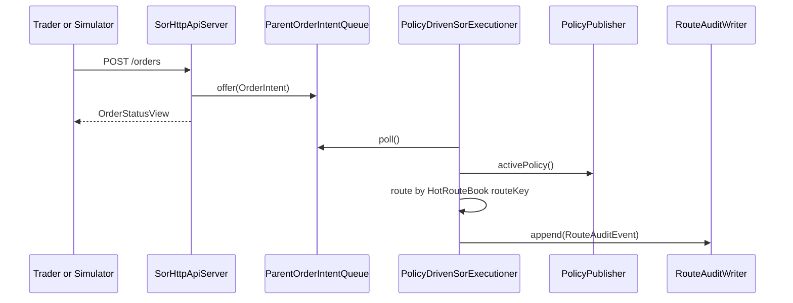
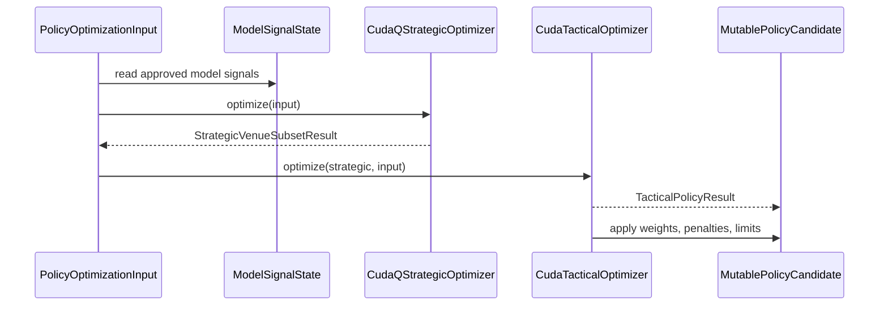
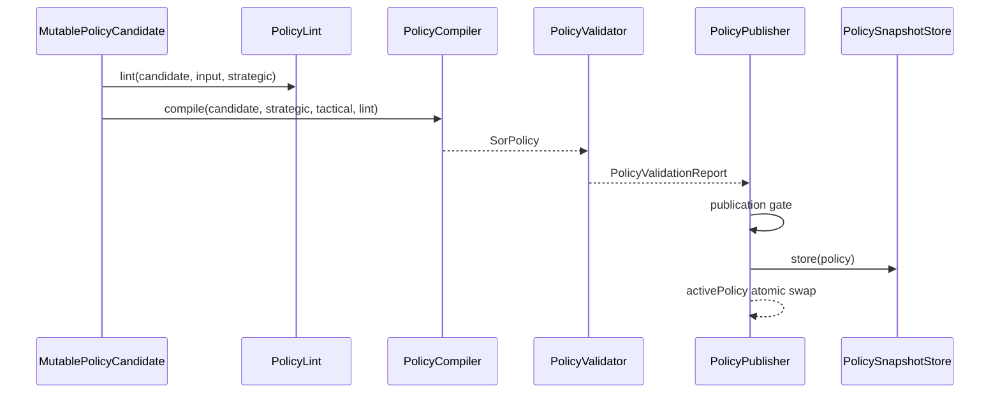
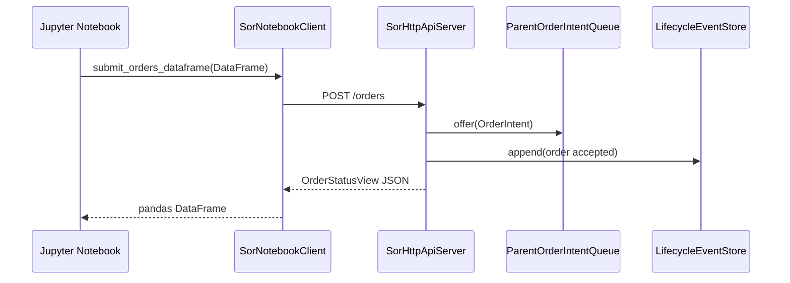
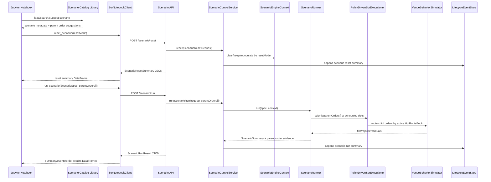
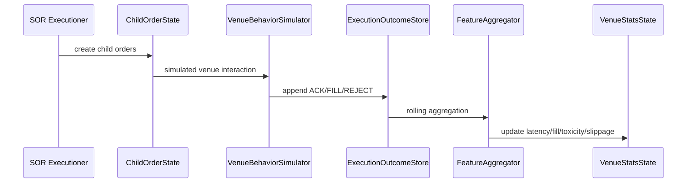

# Sequence Diagrams

These Mermaid diagrams document the core Adaptive Quantum SOR flows across routing,
optimization, publication, notebooks, and venue outcomes.

The editable professional diagram source is:

```text
docs/sequence_diagrams.drawio
```

Rendered PNGs:

```text
docs/sequence_parent_order_routing.png
docs/sequence_policy_optimization_cycle.png
docs/sequence_policy_publication.png
docs/sequence_jupyter_order_submission.png
docs/sequence_live_jupyter_scenario_parent_orders.png
docs/sequence_venue_behavior_outcome_loop.png
```

## Parent Order Routing




## Policy Optimization Cycle




## Policy Publication




## Jupyter Order Submission




## Live Jupyter Scenario Run With Explicit Reset And Parent Orders




## Venue Behavior Outcome Loop



